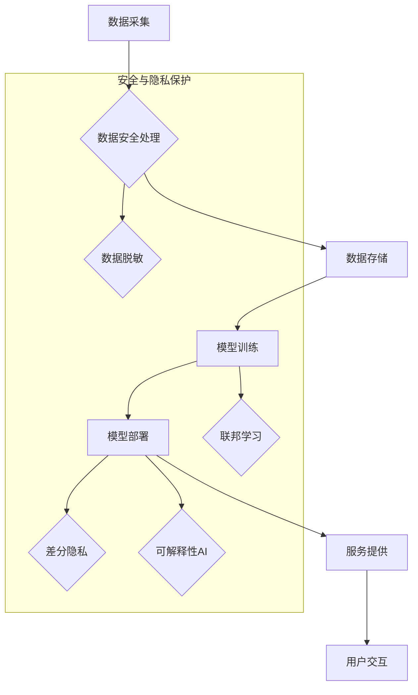

                 

## AI安全与隐私保护：Lepton AI的合规之道

> 关键词：人工智能安全、隐私保护、合规性、数据安全、伦理规范、联邦学习、差分隐私、可解释性AI

### 1. 背景介绍

人工智能（AI）技术飞速发展，已渗透到各行各业，为社会带来了巨大变革。然而，AI技术的应用也带来了新的安全和隐私挑战。数据泄露、算法偏见、恶意攻击等问题日益突出，威胁着个人隐私和社会安全。

Lepton AI作为一家致力于推动AI技术进步的企业，深知AI安全与隐私保护的重要性。我们致力于构建一个安全、可信、可控的AI生态系统，为用户提供安心、放心的AI体验。

### 2. 核心概念与联系

**2.1 AI安全与隐私保护的关联**

AI安全与隐私保护是两个相互关联、不可分割的概念。

* **AI安全**是指确保AI系统在设计、开发、部署和使用过程中安全可靠，防止恶意攻击、数据泄露、算法误用等风险。
* **隐私保护**是指保护个人敏感信息不被未经授权的访问、使用、披露等行为所侵犯。

AI技术的核心是数据，而数据往往包含个人敏感信息。因此，AI安全与隐私保护息息相关。

**2.2  Lepton AI的合规之道**

Lepton AI遵循以下原则，构建安全、隐私保护的AI生态系统：

* **合规性优先:** 严格遵守相关法律法规，如GDPR、CCPA等，确保AI系统的合规性。
* **数据安全:** 加强数据加密、访问控制等安全措施，防止数据泄露和滥用。
* **算法透明度:** 提高算法的可解释性，帮助用户理解AI系统的决策过程，增强信任。
* **用户控制:**  赋予用户对自身数据和AI系统使用的控制权，保障用户隐私。

**2.3  Lepton AI的架构**

Lepton AI采用分层架构，将安全和隐私保护融入各个环节：



### 3. 核心算法原理 & 具体操作步骤

**3.1  算法原理概述**

Lepton AI采用多种安全和隐私保护算法，包括联邦学习、差分隐私等。

* **联邦学习:**  一种分布式机器学习方法，模型训练在各个数据拥有者本地进行，无需将原始数据上传到中央服务器，有效保护数据隐私。
* **差分隐私:**  一种数学工具，通过添加噪声来保护敏感数据，保证数据隐私的同时，还能保证模型训练的准确性。

**3.2  算法步骤详解**

**3.2.1 联邦学习**

1. **模型初始化:**  中央服务器将初始模型分发给各个数据拥有者。
2. **本地训练:**  每个数据拥有者使用本地数据对模型进行训练，并计算模型参数的梯度。
3. **参数聚合:**  每个数据拥有者将模型参数的梯度发送回中央服务器，中央服务器对所有梯度进行聚合，更新全局模型参数。
4. **模型更新:**  中央服务器将更新后的模型参数分发给各个数据拥有者，重复步骤2-3，直到模型收敛。

**3.2.2 差分隐私**

1. **添加噪声:**  在对数据进行操作时，添加随机噪声，使得数据隐私得到保护。
2. **噪声预算:**  根据数据敏感程度和隐私需求，设置噪声预算，控制噪声的大小。
3. **隐私保证:**  通过数学证明，保证添加噪声后的数据分析结果满足一定的隐私保护标准。

**3.3  算法优缺点**

**3.3.1 联邦学习**

* **优点:**  保护数据隐私，无需将原始数据上传到中央服务器。
* **缺点:**  训练速度较慢，模型性能可能不如集中式训练。

**3.3.2 差分隐私**

* **优点:**  提供严格的隐私保证，即使数据被泄露，也无法恢复原始数据。
* **缺点:**  可能会降低模型的准确性。

**3.4  算法应用领域**

* **医疗保健:**  保护患者隐私，进行疾病诊断和治疗研究。
* **金融服务:**  防止金融欺诈，提高风险管理效率。
* **智能交通:**  保护驾驶员隐私，提高交通安全。

### 4. 数学模型和公式 & 详细讲解 & 举例说明

**4.1  数学模型构建**

**4.1.1 联邦学习模型**

联邦学习模型可以表示为一个迭代过程，其中每个迭代步骤包含以下操作：

* **本地训练:**  每个数据拥有者使用本地数据对模型进行训练，得到局部模型参数。
* **参数聚合:**  所有数据拥有者的局部模型参数进行聚合，得到全局模型参数。
* **模型更新:**  全局模型参数更新，并分发给所有数据拥有者。

**4.1.2 差分隐私模型**

差分隐私模型可以通过添加噪声来保护数据隐私。噪声的添加方式取决于具体的应用场景和隐私需求。

**4.2  公式推导过程**

**4.2.1 联邦学习模型参数更新公式**

全局模型参数更新公式可以表示为：

$$
\theta_{t+1} = \frac{1}{N} \sum_{i=1}^{N} \theta_{i,t}
$$

其中：

* $\theta_{t+1}$ 是全局模型参数在第 $t+1$ 个迭代步骤的值。
* $N$ 是数据拥有者的数量。
* $\theta_{i,t}$ 是第 $i$ 个数据拥有者在第 $t$ 个迭代步骤的局部模型参数。

**4.2.2 差分隐私模型噪声添加公式**

差分隐私模型噪声添加公式可以表示为：

$$
y = f(x) + \epsilon
$$

其中：

* $y$ 是添加噪声后的输出值。
* $f(x)$ 是对输入数据 $x$ 的函数。
* $\epsilon$ 是噪声值，其大小取决于隐私预算。

**4.3  案例分析与讲解**

**4.3.1 联邦学习案例**

在医疗保健领域，可以使用联邦学习来训练疾病诊断模型。每个医院可以将患者数据用于训练模型，而无需将数据共享给其他医院。

**4.3.2 差分隐私案例**

在金融服务领域，可以使用差分隐私来保护客户的财务信息。例如，可以对客户的交易记录进行差分隐私处理，使得即使数据被泄露，也无法恢复客户的真实交易信息。

### 5. 项目实践：代码实例和详细解释说明

**5.1  开发环境搭建**

Lepton AI的开发环境基于Python，并使用TensorFlow、PyTorch等深度学习框架。

**5.2  源代码详细实现**

以下是一个简单的联邦学习代码示例，使用TensorFlow框架实现：

```python
import tensorflow as tf

# 定义模型
model = tf.keras.models.Sequential([
    tf.keras.layers.Dense(128, activation='relu'),
    tf.keras.layers.Dense(10, activation='softmax')
])

# 定义训练函数
def train_model(data, model):
    # 使用本地数据训练模型
    # ...

# 定义参数聚合函数
def aggregate_parameters(parameters):
    # 对所有数据拥有者的参数进行聚合
    # ...

# 联邦学习迭代过程
for epoch in range(num_epochs):
    # 分发模型参数
    # ...

    # 每个数据拥有者本地训练
    # ...

    # 参数聚合
    # ...

    # 更新全局模型参数
    # ...

    # 分发更新后的模型参数
    # ...
```

**5.3  代码解读与分析**

该代码示例展示了联邦学习的基本流程。

* 首先定义模型和训练函数。
* 然后定义参数聚合函数，用于将所有数据拥有者的局部模型参数聚合为全局模型参数。
* 最后，通过迭代过程，每个数据拥有者使用本地数据训练模型，并将模型参数发送回中央服务器进行聚合，更新全局模型参数。

**5.4  运行结果展示**

运行该代码示例后，可以观察到模型在每个迭代步骤的准确率变化。随着迭代次数的增加，模型的准确率会逐渐提高。

### 6. 实际应用场景

Lepton AI的AI安全与隐私保护技术已应用于多个实际场景：

* **医疗保健:**  与医院合作，开发基于联邦学习的疾病诊断模型，保护患者隐私。
* **金融服务:**  与银行合作，开发基于差分隐私的风险评估模型，提高金融安全。
* **智能交通:**  与交通管理部门合作，开发基于可解释性AI的交通流量预测模型，提高交通效率。

**6.4  未来应用展望**

Lepton AI将继续探索新的AI安全与隐私保护技术，并将其应用于更多领域，例如：

* **教育:**  开发基于隐私保护的个性化学习系统。
* **零售:**  开发基于差分隐私的客户行为分析系统。
* **制造业:**  开发基于联邦学习的工业设备故障预测系统。

### 7. 工具和资源推荐

**7.1  学习资源推荐**

* **书籍:**  《AI安全与隐私保护》、《联邦学习》、《差分隐私》
* **在线课程:**  Coursera、edX、Udacity等平台上的AI安全与隐私保护课程。

**7.2  开发工具推荐**

* **TensorFlow Federated:**  用于联邦学习的开源框架。
* **PySyft:**  用于差分隐私的开源框架。
* **OpenMined:**  一个致力于开源隐私计算的社区。

**7.3  相关论文推荐**

* **Federated Learning: Strategies for Improving Communication Efficiency**
* **Differentially Private Machine Learning**
* **Towards Transparent and Interpretable AI**

### 8. 总结：未来发展趋势与挑战

**8.1  研究成果总结**

Lepton AI在AI安全与隐私保护领域取得了显著成果，开发了多种安全和隐私保护算法，并将其应用于多个实际场景。

**8.2  未来发展趋势**

未来，AI安全与隐私保护将继续是研究热点，主要发展趋势包括：

* **更强大的隐私保护技术:**  开发更强大的隐私保护技术，例如同态加密、零知识证明等。
* **更广泛的应用场景:**  将AI安全与隐私保护技术应用于更多领域，例如医疗保健、金融服务、教育等。
* **更完善的监管框架:**  建立更完善的监管框架，规范AI技术的应用，保护用户隐私。

**8.3  面临的挑战**

AI安全与隐私保护面临着诸多挑战，例如：

* **技术复杂性:**  AI安全与隐私保护技术本身非常复杂，需要专业的知识和技能。
* **成本高昂:**  实现高水平的AI安全与隐私保护需要投入大量资源。
* **伦理问题:**  AI安全与隐私保护涉及到伦理问题，需要谨慎考虑。

**8.4  研究展望**

Lepton AI将继续致力于AI安全与隐私保护的研究，探索新的技术和方法，为构建一个安全、可信、可控的AI生态系统贡献力量。

### 9. 附录：常见问题与解答

**9.1  常见问题**

* **什么是联邦学习？**

联邦学习是一种分布式机器学习方法，模型训练在各个数据拥有者本地进行，无需将原始数据上传到中央服务器。

* **什么是差分隐私？**

差分隐私是一种数学工具，通过添加噪声来保护敏感数据，保证数据隐私的同时，还能保证模型训练的准确性。

* **Lepton AI如何保证用户隐私？**

Lepton AI采用多种安全和隐私保护技术，例如联邦学习、差分隐私、可解释性AI等，确保用户隐私得到保护。

**9.2  解答**

* **Lepton AI的AI安全与隐私保护技术是否可靠？**

Lepton AI的AI安全与隐私保护技术经过严格测试和验证，并已应用于多个实际场景，具有很高的可靠性。

* **Lepton AI如何应对新的AI安全与隐私保护挑战？**

Lepton AI将持续关注最新的研究成果和技术发展，并积极探索新的解决方案，应对新的AI安全与隐私保护挑战。


作者：禅与计算机程序设计艺术 / Zen and the Art of Computer Programming 
<end_of_turn>

