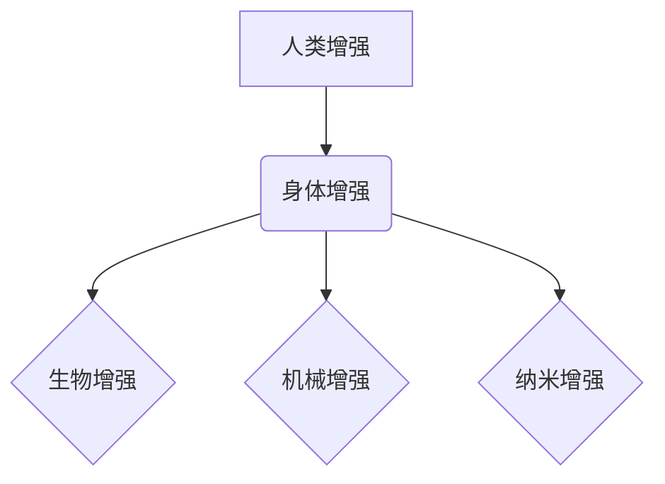

                 

## AI时代的人类增强：道德考虑与身体增强的未来挑战

> 关键词：人工智能、人类增强、身体增强、伦理学、道德困境、未来挑战、科技发展

### 1. 背景介绍

人工智能（AI）技术的飞速发展正在深刻地改变着人类社会，其影响范围从日常生活到未来发展都不可忽视。其中，AI驱动的“人类增强”概念正逐渐成为一个备受关注的话题。人类增强是指利用技术手段提升人类的认知能力、生理功能和生活质量，使其超越自然界限制的范畴。

身体增强作为人类增强的重要组成部分，旨在通过植入、改造或外接设备来提升人类的身体素质。例如，可增强肌肉力量、提高反应速度、改善视力和听力等。近年来，随着生物技术、纳米技术和材料科学的进步，身体增强技术取得了显著进展，为实现人类增强梦想提供了技术基础。

然而，身体增强技术的发展也引发了广泛的伦理和社会争议。如何平衡技术进步与人类尊严？如何避免技术带来的不平等和歧视？这些问题迫切需要我们认真思考和探讨。

### 2. 核心概念与联系

**2.1 人类增强与身体增强**

人类增强是一个广义的概念，涵盖了所有旨在提升人类能力的技术手段，包括认知增强、身体增强、情感增强等。身体增强则是人类增强的一个具体分支，专注于提升人类的生理功能。

**2.2 身体增强技术分类**

身体增强技术可以根据其作用方式和应用场景进行分类：

* **生物增强:** 利用基因编辑、细胞治疗等生物技术手段来改造人体，例如增强肌肉力量、提高免疫力、延长寿命等。
* **机械增强:** 通过外接设备来增强人类的身体功能，例如义肢、增强型护具、脑机接口等。
* **纳米增强:** 利用纳米材料和技术来改造人体，例如纳米机器人、纳米传感器等。

**2.3 核心概念关系图**



### 3. 核心算法原理 & 具体操作步骤

**3.1 算法原理概述**

身体增强技术通常依赖于多种算法和技术，例如机器学习、深度学习、控制理论、生物信息学等。这些算法和技术共同作用，实现对人体功能的精准控制和优化。

**3.2 算法步骤详解**

* **数据采集:** 收集人体生理数据，例如肌肉活动、神经信号、心率、体温等。
* **数据分析:** 利用机器学习算法对人体数据进行分析，识别人体功能的规律和模式。
* **模型训练:** 基于分析结果，训练深度学习模型，建立人体功能的数学模型。
* **控制策略设计:** 根据模型预测，设计控制策略，控制增强设备对人体功能的调节。
* **设备反馈:** 增强设备根据控制策略，对人体进行反馈，实现功能增强。

**3.3 算法优缺点**

* **优点:** 能够精准控制人体功能，实现个性化增强。
* **缺点:** 算法复杂度高，需要大量数据进行训练，存在安全性和隐私性风险。

**3.4 算法应用领域**

* **医疗保健:** 帮助残疾人恢复功能，治疗疾病，延长寿命。
* **体育竞技:** 提升运动员的运动能力，提高竞技水平。
* **军事应用:** 增强士兵的作战能力，提高战场生存率。

### 4. 数学模型和公式 & 详细讲解 & 举例说明

**4.1 数学模型构建**

身体增强技术的数学模型通常基于动力学、控制理论和生物学原理。例如，增强型义肢的控制模型可以基于人体关节的运动学和动力学方程，实现逼真的运动控制。

**4.2 公式推导过程**

假设一个增强型义肢的关节运动受以下因素影响：

* **肌肉力量:** $F_m$
* **关节阻尼:** $D$
* **关节惯性:** $I$
* **外部力:** $F_e$

根据牛顿第二定律，关节角速度的微分方程可以表示为：

$$I\ddot{\theta} + D\dot{\theta} + F_m - F_e = 0$$

其中，$\theta$为关节角度，$\dot{\theta}$为关节角速度，$\ddot{\theta}$为关节角加速度。

**4.3 案例分析与讲解**

通过对上述方程进行分析和求解，可以得到关节角度和角速度的运动轨迹。根据人体运动的实际情况，可以调整肌肉力量、关节阻尼等参数，实现对义肢运动的精准控制。

### 5. 项目实践：代码实例和详细解释说明

**5.1 开发环境搭建**

* 操作系统: Ubuntu 20.04
* 编程语言: Python 3.8
* 库依赖: NumPy, SciPy, Matplotlib

**5.2 源代码详细实现**

```python
import numpy as np
from scipy.integrate import odeint

# 参数设置
I = 0.1  # 关节惯性
D = 0.5  # 关节阻尼
F_e = 0  # 外部力
F_m = 0  # 肌肉力量

# 状态方程
def model(y, t):
    theta, omega = y
    dtheta_dt = omega
    domega_dt = (F_m - D*omega - I*theta) / I
    return [dtheta_dt, domega_dt]

# 初始条件
y0 = [0, 0]  # 初始角度和角速度

# 时间范围
t = np.linspace(0, 10, 100)

# 求解微分方程
sol = odeint(model, y0, t)

# 绘制结果
import matplotlib.pyplot as plt
plt.plot(t, sol[:, 0])
plt.xlabel('时间 (s)')
plt.ylabel('关节角度 (rad)')
plt.title('增强型义肢关节运动')
plt.show()
```

**5.3 代码解读与分析**

该代码实现了一个简单的增强型义肢关节运动模型。

* `model()` 函数定义了关节运动的微分方程。
* `odeint()` 函数用于求解微分方程。
* `plt.plot()` 函数用于绘制关节角度随时间的变化曲线。

**5.4 运行结果展示**

运行代码后，将生成一个关节角度随时间的变化曲线，展示了增强型义肢关节的运动轨迹。

### 6. 实际应用场景

**6.1 医疗保健**

* **义肢控制:** 增强型义肢可以根据用户的意图，实现更加自然、灵活的运动控制。
* **神经疾病治疗:** 通过脑机接口技术，可以帮助患者控制瘫痪肢体，恢复部分功能。
* **器官移植:** 纳米技术可以帮助提高器官移植的成功率，延长移植器官的寿命。

**6.2 体育竞技**

* **运动能力提升:** 增强型运动装备可以帮助运动员提高力量、速度、耐力等运动能力。
* **运动损伤预防:** 增强型护具可以帮助运动员预防运动损伤，提高竞技安全。
* **训练效果优化:** 增强型训练设备可以提供更加精准的训练数据，帮助运动员优化训练方案。

**6.3 军事应用**

* **士兵作战能力增强:** 增强型作战装备可以帮助士兵提高作战能力，增强战场生存率。
* **远程操控:** 增强型机器人可以帮助士兵完成危险任务，减少人员伤亡。
* **信息获取:** 增强型传感器可以帮助士兵获取战场信息，提高作战决策的准确性。

**6.4 未来应用展望**

随着科技的不断发展，身体增强技术将应用于更多领域，例如教育、娱乐、艺术等。未来，身体增强技术将更加智能化、个性化、安全可靠，为人类社会带来更多福祉。

### 7. 工具和资源推荐

**7.1 学习资源推荐**

* **书籍:**
    * 《增强人类：生物技术、纳米技术和人工智能的未来》
    * 《人机融合：未来科技的挑战与机遇》
* **在线课程:**
    * Coursera: 人工智能
    * edX: 生物技术
    * Udacity: 机器学习

**7.2 开发工具推荐**

* **编程语言:** Python, C++, Java
* **机器学习库:** TensorFlow, PyTorch, scikit-learn
* **仿真软件:** MATLAB, Simulink

**7.3 相关论文推荐**

* **Nature:** "Brain-computer interfaces: past, present and future"
* **Science:** "Engineering the human body: the promise and peril of bioengineering"
* **IEEE Transactions on Neural Systems and Rehabilitation Engineering:** "Advances in prosthetic limb control"

### 8. 总结：未来发展趋势与挑战

**8.1 研究成果总结**

近年来，身体增强技术取得了显著进展，为实现人类增强梦想提供了技术基础。

**8.2 未来发展趋势**

* **更加智能化:** 身体增强技术将更加智能化，能够根据用户的需求和环境自动调整。
* **更加个性化:** 身体增强技术将更加个性化，能够满足不同用户的需求。
* **更加安全可靠:** 身体增强技术将更加安全可靠，能够有效降低风险。

**8.3 面临的挑战**

* **伦理道德:** 身体增强技术可能带来伦理道德问题，例如公平性、隐私性、人性的本质等。
* **社会影响:** 身体增强技术可能导致社会分化，加剧贫富差距。
* **技术风险:** 身体增强技术可能存在安全风险，例如设备故障、数据泄露等。

**8.4 研究展望**

未来，我们需要加强对身体增强技术的伦理道德和社会影响的评估，制定相应的法律法规和政策，引导身体增强技术健康发展，造福人类社会。

### 9. 附录：常见问题与解答

**9.1 Q: 身体增强技术会取代人类吗？**

**A:** 身体增强技术旨在提升人类能力，而不是取代人类。人类的创造力、情感和智慧是无法被技术替代的。

**9.2 Q: 身体增强技术会造成社会不平等吗？**

**A:** 身体增强技术可能会加剧社会不平等，因为只有少数人能够负担得起昂贵的增强技术。我们需要采取措施，确保身体增强技术能够公平地惠及所有人。

**9.3 Q: 身体增强技术有哪些安全风险？**

**A:** 身体增强技术存在一些安全风险，例如设备故障、数据泄露、伦理道德问题等。我们需要加强对这些风险的评估和控制，确保身体增强技术的安全可靠。


作者：禅与计算机程序设计艺术 / Zen and the Art of Computer Programming 
<end_of_turn>

