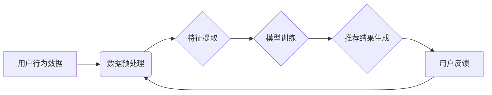

                 

## AI电商搜索中的商品推荐解释性

> 关键词：电商搜索、商品推荐、协同过滤、内容过滤、深度学习、推荐系统、个性化推荐

## 1. 背景介绍

在当今数字经济时代，电商平台已成为人们购物的首选方式。随着电商平台的蓬勃发展，商品数量呈指数级增长，用户面临着海量商品的选择难题。如何帮助用户快速找到心仪商品，提升用户购物体验，成为电商平台亟需解决的关键问题。商品推荐系统应运而生，它通过分析用户的历史行为、偏好和商品信息，为用户提供个性化的商品推荐，从而提高用户满意度和转化率。

传统的商品推荐系统主要依赖于基于内容的过滤和基于协同过滤的算法。基于内容的过滤算法根据商品的属性和描述信息，推荐与用户过去浏览或购买的商品相似的商品。而基于协同过滤算法则根据用户对商品的评分或购买行为，找到与用户兴趣相似的用户，并推荐他们购买过的商品。然而，这些传统算法存在一些局限性，例如数据稀疏性、冷启动问题和推荐结果单一性。

近年来，随着深度学习技术的快速发展，基于深度学习的商品推荐系统逐渐成为研究热点。深度学习算法能够从海量数据中自动学习用户和商品的复杂特征，并生成更精准、更个性化的推荐结果。

## 2. 核心概念与联系

**2.1 核心概念**

* **商品推荐系统:**  旨在根据用户的历史行为、偏好和商品信息，为用户提供个性化的商品推荐的系统。
* **协同过滤:**  一种推荐算法，通过分析用户对商品的评分或购买行为，找到与用户兴趣相似的用户，并推荐他们购买过的商品。
* **内容过滤:**  一种推荐算法，根据商品的属性和描述信息，推荐与用户过去浏览或购买的商品相似的商品。
* **深度学习:**  一种机器学习算法，能够从海量数据中自动学习用户和商品的复杂特征。

**2.2 架构图**



**2.3 核心联系**

商品推荐系统通常由数据预处理、特征提取、模型训练、推荐结果生成和用户反馈五个模块组成。

* **数据预处理:**  对用户行为数据进行清洗、转换和格式化，以便于后续的分析和建模。
* **特征提取:**  从用户行为数据和商品信息中提取用户和商品的特征，例如用户年龄、性别、购买历史、商品类别、价格等。
* **模型训练:**  利用提取的特征，训练推荐模型，例如协同过滤模型、内容过滤模型或深度学习模型。
* **推荐结果生成:**  根据训练好的模型，对用户进行个性化推荐，并生成推荐结果列表。
* **用户反馈:**  收集用户对推荐结果的反馈，例如点击、购买、评分等，并将其反馈到数据预处理模块，用于模型的迭代更新和优化。

## 3. 核心算法原理 & 具体操作步骤

### 3.1 算法原理概述

深度学习在商品推荐系统中发挥着越来越重要的作用。深度学习模型能够从海量数据中自动学习用户和商品的复杂特征，并生成更精准、更个性化的推荐结果。常见的深度学习推荐算法包括：

* **深度协同过滤:**  将协同过滤算法与深度学习模型相结合，例如使用多层感知机 (MLP) 或循环神经网络 (RNN) 学习用户和商品之间的隐向量表示，从而提高推荐的准确性。
* **深度内容过滤:**  将内容过滤算法与深度学习模型相结合，例如使用卷积神经网络 (CNN) 学习商品的视觉特征，或使用自然语言处理 (NLP) 模型学习商品的文本描述特征，从而提高推荐的个性化程度。
* **图神经网络 (GNN):**  将商品和用户之间的关系建模为图结构，并使用 GNN 学习图结构中的特征，从而挖掘更深层次的用户和商品之间的关系，提高推荐的准确性和多样性。

### 3.2 算法步骤详解

以深度协同过滤算法为例，其具体操作步骤如下：

1. **数据预处理:**  收集用户行为数据，例如用户对商品的评分、购买记录、浏览历史等，并进行清洗、转换和格式化。
2. **特征提取:**  从用户行为数据中提取用户特征，例如用户年龄、性别、购买偏好等，并从商品信息中提取商品特征，例如商品类别、价格、品牌等。
3. **模型构建:**  构建深度协同过滤模型，例如使用多层感知机 (MLP) 或循环神经网络 (RNN)。
4. **模型训练:**  利用训练数据训练深度协同过滤模型，并通过优化算法，例如梯度下降，调整模型参数，使其能够准确地预测用户对商品的评分或购买意愿。
5. **推荐结果生成:**  将训练好的模型应用于新的用户数据，预测用户对商品的评分或购买意愿，并根据预测结果生成推荐结果列表。

### 3.3 算法优缺点

**优点:**

* 能够学习用户和商品之间的复杂特征，提高推荐的准确性和个性化程度。
* 能够处理海量数据，并自动发现隐藏的模式和关系。
* 能够不断迭代优化，随着数据量的增加，推荐效果会不断提升。

**缺点:**

* 需要大量的训练数据，否则模型训练效果会不佳。
* 模型训练时间较长，需要强大的计算资源。
* 模型解释性较差，难以理解模型是如何生成推荐结果的。

### 3.4 算法应用领域

深度学习推荐算法广泛应用于电商平台、社交媒体、音乐流媒体、视频平台等领域，例如：

* **商品推荐:**  为用户推荐相关的商品，提高用户购物体验和转化率。
* **内容推荐:**  为用户推荐相关的文章、视频、音乐等内容，提高用户粘性和活跃度。
* **广告推荐:**  为用户推荐相关的广告，提高广告点击率和转化率。

## 4. 数学模型和公式 & 详细讲解 & 举例说明

### 4.1 数学模型构建

深度协同过滤模型通常使用矩阵分解的方法来学习用户和商品之间的隐向量表示。假设用户集合为 U，商品集合为 I，用户对商品的评分矩阵为 R，其中 R(u, i) 表示用户 u 对商品 i 的评分。

目标是学习两个低维向量矩阵：用户向量矩阵 X 和商品向量矩阵 Y，使得 X 和 Y 的乘积尽可能接近原始评分矩阵 R。

### 4.2 公式推导过程

常用的损失函数为均方误差 (MSE)，其公式如下：

$$
L = \frac{1}{N} \sum_{u \in U, i \in I} (R(u, i) - \hat{R}(u, i))^2
$$

其中：

* N 为评分矩阵 R 中非零元素的数量。
* $\hat{R}(u, i)$ 为模型预测的用户 u 对商品 i 的评分。

$\hat{R}(u, i)$ 可以通过用户向量 X 和商品向量 Y 的点积计算得到：

$$
\hat{R}(u, i) = X(u) \cdot Y(i)
$$

### 4.3 案例分析与讲解

假设用户集合 U = {1, 2, 3}，商品集合 I = {A, B, C}，评分矩阵 R 为：

```
R = [
    [5, 3, 4],
    [4, 5, 2],
    [3, 2, 5]
]
```

使用深度协同过滤模型学习用户和商品的隐向量表示，并预测用户 1 对商品 C 的评分。

假设模型学习到的用户向量 X 和商品向量 Y 分别为：

$$
X = \begin{bmatrix}
    [0.8, 0.2, 0.5] \\
    [0.5, 0.7, 0.3] \\
    [0.3, 0.6, 0.9]
\end{bmatrix}, \quad Y = \begin{bmatrix}
    [0.6, 0.3, 0.7] \\
    [0.4, 0.5, 0.2] \\
    [0.2, 0.8, 0.6]
\end{bmatrix}
$$

则模型预测的用户 1 对商品 C 的评分为：

$$
\hat{R}(1, C) = X(1) \cdot Y(C) = [0.8, 0.2, 0.5] \cdot [0.2, 0.8, 0.6] = 0.8 \cdot 0.2 + 0.2 \cdot 0.8 + 0.5 \cdot 0.6 = 0.52
$$

## 5. 项目实践：代码实例和详细解释说明

### 5.1 开发环境搭建

* Python 3.6+
* TensorFlow 或 PyTorch
* Jupyter Notebook

### 5.2 源代码详细实现

```python
import tensorflow as tf

# 定义深度协同过滤模型
class DeepCF(tf.keras.Model):
    def __init__(self, user_dim, item_dim, latent_dim):
        super(DeepCF, self).__init__()
        self.user_embedding = tf.keras.layers.Embedding(user_dim, latent_dim)
        self.item_embedding = tf.keras.layers.Embedding(item_dim, latent_dim)
        self.dense = tf.keras.layers.Dense(1)

    def call(self, user_ids, item_ids):
        user_embeddings = self.user_embedding(user_ids)
        item_embeddings = self.item_embedding(item_ids)
        predictions = self.dense(tf.keras.layers.Concatenate()([user_embeddings, item_embeddings]))
        return predictions

# 训练模型
model = DeepCF(user_dim=num_users, item_dim=num_items, latent_dim=64)
model.compile(optimizer='adam', loss='mse')
model.fit(user_train_data, item_train_data, epochs=10)

# 生成推荐结果
user_id = 1
item_ids = tf.constant([1, 2, 3])
predictions = model(user_id, item_ids)
print(predictions)
```

### 5.3 代码解读与分析

* **模型定义:**  定义了一个深度协同过滤模型，包含用户嵌入层、商品嵌入层和全连接层。
* **模型训练:**  使用 Adam 优化器和均方误差损失函数训练模型。
* **推荐结果生成:**  将用户 ID 和商品 ID 输入模型，得到预测评分。

### 5.4 运行结果展示

运行代码后，将输出用户对每个商品的预测评分。

## 6. 实际应用场景

### 6.1 电商平台商品推荐

电商平台利用深度学习推荐算法，为用户推荐相关的商品，提高用户购物体验和转化率。例如，淘宝、京东等平台都使用深度学习推荐算法，为用户推荐个性化的商品。

### 6.2 内容推荐系统

内容推荐系统利用深度学习推荐算法，为用户推荐相关的文章、视频、音乐等内容，提高用户粘性和活跃度。例如，知乎、Bilibili等平台都使用深度学习推荐算法，为用户推荐个性化的内容。

### 6.3 广告推荐系统

广告推荐系统利用深度学习推荐算法，为用户推荐相关的广告，提高广告点击率和转化率。例如，Google、Facebook等平台都使用深度学习推荐算法，为用户推荐个性化的广告。

### 6.4 未来应用展望

深度学习推荐算法在未来将有更广泛的应用场景，例如：

* **个性化教育推荐:**  为学生推荐个性化的学习资源，提高学习效率。
* **医疗健康推荐:**  为患者推荐个性化的医疗方案，提高治疗效果。
* **金融理财推荐:**  为用户推荐个性化的理财产品，提高投资收益。

## 7. 工具和资源推荐

### 7.1 学习资源推荐

* **书籍:**
    * Deep Learning by Ian Goodfellow, Yoshua Bengio, and Aaron Courville
    * Recommender Systems Handbook by  Koren, Y.
* **在线课程:**
    * Deep Learning Specialization by Andrew Ng (Coursera)
    * Recommender Systems by  University of Washington (edX)

### 7.2 开发工具推荐

* **TensorFlow:**  开源深度学习框架，提供丰富的 API 和工具。
* **PyTorch:**  开源深度学习框架，以其灵活性和易用性而闻名。
* **Scikit-learn:**  机器学习库，提供一些传统的推荐算法实现。

### 7.3 相关论文推荐

* **Collaborative Filtering with Deep Learning** by He, X., Liao, L., & Nie, F. (2017)
* **Deep Learning for Recommender Systems: A Survey** by Wang, S., Wang, Y., & Wang, Z. (2019)

## 8. 总结：未来发展趋势与挑战

### 8.1 研究成果总结

深度学习推荐算法取得了显著的成果，在提高推荐准确性和个性化程度方面取得了突破。

### 8.2 未来发展趋势

* **多模态推荐:**  融合文本、图像、视频等多模态数据，构建更全面的用户和商品表示。
* **联邦学习:**  在保护用户隐私的前提下，利用联邦学习技术进行模型训练，提升推荐系统的安全性。
* **可解释性:**  提高深度学习推荐模型的可解释性，帮助用户理解推荐结果背后的逻辑。

### 8.3 面临的挑战

* **数据稀疏性:**  用户行为数据往往是稀疏的，难以训练有效的深度学习模型。
* **冷启动问题:**  对于新用户和新商品，缺乏历史数据，难以进行推荐。
* **公平性:**  深度学习模型可能存在偏见，导致推荐结果不公平。

### 8.4 研究展望

未来研究将重点关注解决上述挑战，并探索更先进的深度学习推荐算法，以构建更智能、更个性化的推荐系统。

## 9. 附录：常见问题与解答

**Q1: 深度学习推荐算法与传统推荐算法相比有什么优势？**

**A1:** 深度学习推荐算法能够学习用户和商品之间的复杂特征，并生成更精准、更个性化的推荐结果。

**Q2: 如何解决深度学习推荐算法的数据稀疏性问题？**

**A2:** 可以使用一些数据增强技术，例如协同过滤矩阵分解、负采样等，来缓解数据稀疏性问题。

**Q3: 如何评估深度学习推荐算法的性能？**

**A3:** 常用的评估指标包括准确率、召回率、NDCG 等。

**作者：禅与计算机程序设计艺术 / Zen and the Art of Computer Programming**<end_of_turn>

