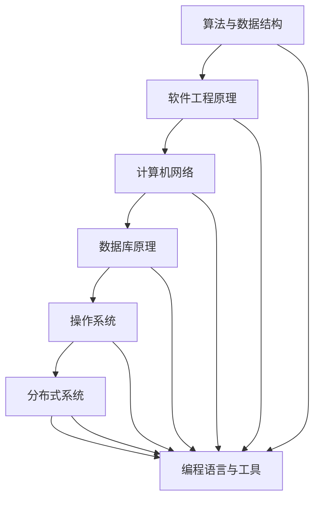

                 

### 背景介绍（Background Introduction）

在当今快速发展的信息技术时代，人才的重要性尤为凸显。特别是对于大型科技公司来说，招聘合适的人才对于其创新和发展至关重要。以携程为例，作为全球知名的旅游预订平台，每年都会吸引大量优秀的应届毕业生前来应聘。携程的全球酒店预订业务更是重中之重，因此其校招面试题的设计尤为精细，旨在筛选出真正具备实力和潜力的人才。

校招面试题的设定不仅考虑了应聘者的技术能力，更侧重于逻辑思维、问题解决能力以及在实际工作中的应用潜力。这些题目往往涵盖计算机科学、算法、数据结构、软件工程等多个领域，旨在全面评估应聘者的综合能力。本文将汇总并解析2024年携程全球酒店预订校招面试中的典型真题，为广大求职者提供有益的参考和指导。

首先，让我们了解一下携程全球酒店预订业务的背景。携程是中国领先的在线旅行服务公司，其业务范围涵盖了酒店预订、机票预订、度假预订等多个领域。全球酒店预订业务作为携程的核心业务之一，每年处理的酒店预订量巨大，对系统的稳定性、性能和用户体验都有极高的要求。因此，携程在招聘时，对技术岗位的人才要求也非常严格。

### The Background Introduction

In today's rapidly evolving information technology era, the importance of talent cannot be overstated, especially for large technology companies like Ctrip, which have a crucial need for recruiting the right people to drive innovation and development. As a globally recognized online travel platform, Ctrip annually attracts a large number of outstanding graduates for recruitment. The global hotel booking business is a cornerstone of Ctrip's operations, making the design of recruitment interview questions particularly refined to screen out talents with the necessary skills and potential.

The setting of interview questions considers not only the technical abilities of candidates but also their logical thinking, problem-solving skills, and application potential in real work scenarios. These questions often cover a wide range of areas, including computer science, algorithms, data structures, software engineering, etc., to comprehensively assess candidates' overall capabilities. This article will summarize and analyze the typical interview questions from Ctrip's global hotel booking recruitment in 2024, providing valuable references and guidance for job seekers.

Firstly, let's understand the background of Ctrip's global hotel booking business. As one of China's leading online travel service companies, Ctrip's business scope covers hotel booking, flight booking, vacation booking, and more. The global hotel booking business, being a core component of Ctrip's operations, handles a massive volume of bookings annually, requiring the system to be highly stable, performant, and user-friendly. Therefore, Ctrip's recruitment criteria for technical positions are very stringent.

<|mask|>### 核心概念与联系（Core Concepts and Connections）

在深入探讨携程全球酒店预订校招面试真题之前，我们需要了解一些核心概念和联系，这些概念对于理解面试题目至关重要。

#### 1. 算法与数据结构

算法和数据结构是计算机科学的核心。算法是指解决问题的步骤和策略，而数据结构则是组织和存储数据的方式。在面试中，算法和数据结构题目经常出现，例如排序算法、查找算法、图算法等。理解这些概念不仅能够帮助解决实际问题，还能提升编程能力和思维能力。

#### 2. 软件工程原理

软件工程涉及软件开发的生命周期，包括需求分析、设计、编码、测试和维护等阶段。掌握软件工程原理对于理解面试中关于系统设计、架构设计的题目非常有帮助。

#### 3. 计算机网络

计算机网络是现代互联网的基础。了解网络协议、数据传输、网络安全等概念对于面试中的网络相关题目至关重要。

#### 4. 数据库原理

数据库是存储和管理数据的重要工具。掌握数据库的基本原理，如关系型数据库、非关系型数据库、SQL查询语言等，对于面试中的数据库相关题目非常有帮助。

#### 5. 操作系统

操作系统是计算机系统的核心。了解操作系统的基本原理，如进程管理、内存管理、文件系统等，对于面试中的操作系统相关题目至关重要。

#### 6. 分布式系统

随着互联网的发展，分布式系统变得日益重要。了解分布式系统的概念、一致性模型、容错机制等，对于面试中的分布式系统相关题目非常有帮助。

#### 7. 编程语言与工具

熟悉一种或多种编程语言和开发工具对于解决面试中的编程问题非常重要。常见的编程语言如Java、Python、C++等，开发工具如Git、Docker、Kubernetes等。

#### Conclusion

Understanding these core concepts and connections is crucial for comprehending the interview questions from Ctrip's global hotel booking recruitment. These concepts not only provide a foundation for solving practical problems but also enhance programming and problem-solving abilities.

### Core Concepts and Connections

Before delving into the typical interview questions from Ctrip's global hotel booking recruitment, it's essential to familiarize ourselves with some core concepts and their interconnections, as these are critical for understanding the interview questions.

#### 1. Algorithms and Data Structures

Algorithms and data structures are at the heart of computer science. Algorithms refer to the steps and strategies for solving problems, while data structures are the ways in which data is organized and stored. Algorithm and data structure questions are common in interviews, such as sorting algorithms, searching algorithms, and graph algorithms. Understanding these concepts not only helps in solving practical problems but also boosts programming and logical thinking skills.

#### 2. Principles of Software Engineering

Software engineering encompasses the entire lifecycle of software development, including requirements analysis, design, coding, testing, and maintenance. A grasp of software engineering principles is invaluable for tackling questions related to system design and architectural design in interviews.

#### 3. Computer Networks

Computer networks form the foundation of modern internet. Understanding concepts such as network protocols, data transmission, and cybersecurity is crucial for network-related questions in interviews.

#### 4. Database Principles

Databases are essential tools for storing and managing data. A basic understanding of database principles, including relational databases, non-relational databases, and SQL query languages, is beneficial for database-related questions in interviews.

#### 5. Operating System

The operating system is at the core of a computer system. Familiarity with the fundamentals of operating systems, such as process management, memory management, and file systems, is critical for operating system-related questions in interviews.

#### 6. Distributed Systems

With the growth of the internet, distributed systems have become increasingly important. Understanding the concepts of distributed systems, consistency models, and fault-tolerance mechanisms is valuable for distributed system-related questions in interviews.

#### 7. Programming Languages and Tools

Proficiency in one or more programming languages and development tools is essential for addressing programming questions in interviews. Common programming languages include Java, Python, and C++, while development tools may include Git, Docker, and Kubernetes.

### Mermaid 流程图（Mermaid Flowchart）

为了更好地理解上述核心概念之间的联系，我们可以使用Mermaid语言绘制一个流程图，如下所示：



这个流程图展示了各个核心概念之间的相互关联，以及它们在解决实际问题中的应用。

### Conclusion

Understanding these core concepts and connections is crucial for comprehending the interview questions from Ctrip's global hotel booking recruitment. These concepts not only provide a foundation for solving practical problems but also enhance programming and problem-solving abilities. The Mermaid flowchart above visually represents the interconnections between these core concepts, illustrating their relevance and application in real-world scenarios.

<|mask|>### 核心算法原理 & 具体操作步骤（Core Algorithm Principles and Specific Operational Steps）

在携程全球酒店预订校招面试中，核心算法原理是一个重要的考察点。这里我们介绍几类常见的算法原理，并详细讲解它们的具体操作步骤。

#### 1. 排序算法

排序算法是计算机科学中的基础算法之一，用于对数据进行排序。常见的排序算法包括冒泡排序、选择排序、插入排序、快速排序、归并排序等。以下以快速排序为例，说明其原理和操作步骤：

**原理：**
快速排序（Quick Sort）是一种分治算法，其基本思想是通过一趟排序将待排序的数据分割成独立的两部分，其中一部分的所有数据都比另一部分的所有数据要小，然后再按此方法对这两部分数据分别进行快速排序，整个排序过程可以递归进行，以此达到整个数据变成有序序列。

**操作步骤：**
1. 选择一个基准元素（pivot）。
2. 将比基准元素小的所有元素移到其左边，将比基准元素大的所有元素移到其右边。
3. 递归地对待排序的左右两个子序列进行快速排序。

**代码实现：**
```python
def quick_sort(arr):
    if len(arr) <= 1:
        return arr
    pivot = arr[len(arr) // 2]
    left = [x for x in arr if x < pivot]
    middle = [x for x in arr if x == pivot]
    right = [x for x in arr if x > pivot]
    return quick_sort(left) + middle + quick_sort(right)

arr = [3, 6, 8, 10, 1, 2, 1]
print(quick_sort(arr))
```

#### 2. 查找算法

查找算法用于在数据集合中寻找特定元素。常见的查找算法包括线性查找、二分查找、哈希查找等。以下以二分查找为例，说明其原理和操作步骤：

**原理：**
二分查找（Binary Search）是一种在有序数组中查找特定元素的算法。算法通过将数组中间元素与目标值进行比较，逐步缩小查找范围，直到找到目标元素或确定其不存在。

**操作步骤：**
1. 确定数组的中间位置。
2. 如果中间位置的元素等于目标值，则查找成功。
3. 如果中间位置的元素大于目标值，则在左侧子数组中继续查找。
4. 如果中间位置的元素小于目标值，则在右侧子数组中继续查找。
5. 重复步骤1-4，直到找到目标元素或确定其不存在。

**代码实现：**
```python
def binary_search(arr, target):
    left, right = 0, len(arr) - 1
    while left <= right:
        mid = (left + right) // 2
        if arr[mid] == target:
            return mid
        elif arr[mid] < target:
            left = mid + 1
        else:
            right = mid - 1
    return -1

arr = [1, 2, 3, 4, 5, 6, 7, 8, 9]
target = 5
print(binary_search(arr, target))
```

#### 3. 图算法

图算法在处理复杂数据结构时非常有用。常见的图算法包括深度优先搜索（DFS）和广度优先搜索（BFS）等。以下以深度优先搜索为例，说明其原理和操作步骤：

**原理：**
深度优先搜索（Depth-First Search，DFS）是一种用于遍历或搜索图的数据结构算法。其基本思想是从一个起始节点开始，沿着某一路径深入到该路径的尽头，当该路径无法继续时，再回溯到上一个节点，并沿着另一条路径深入。

**操作步骤：**
1. 从起始节点开始，将其标记为已访问。
2. 遍历该节点的所有未访问的邻接节点，对每个邻接节点重复步骤1和2。
3. 当所有节点都被访问过时，搜索结束。

**代码实现：**
```python
def dfs(graph, start, visited=None):
    if visited is None:
        visited = set()
    visited.add(start)
    for neighbor in graph[start]:
        if neighbor not in visited:
            dfs(graph, neighbor, visited)
    return visited

graph = {
    'A': ['B', 'C'],
    'B': ['D', 'E'],
    'C': ['F'],
    'D': [],
    'E': ['F'],
    'F': []
}
print(dfs(graph, 'A'))
```

通过上述例子，我们可以看到不同算法原理的具体操作步骤和实现方式。理解这些算法原理对于解决携程全球酒店预订校招面试中的相关题目非常重要。

### Core Algorithm Principles and Specific Operational Steps

In the Ctrip global hotel booking recruitment interviews, core algorithm principles are a crucial point of assessment. Here, we introduce several common algorithm principles and explain their specific operational steps in detail.

#### 1. Sorting Algorithms

Sorting algorithms are one of the fundamental algorithms in computer science, used to sort data. Common sorting algorithms include bubble sort, selection sort, insertion sort, quicksort, and mergesort. Let's take quicksort as an example to explain its principle and operational steps.

**Principle:**
Quicksort is a divide-and-conquer algorithm. Its basic idea is to partition the input array into two parts using a pivot element, such that elements on the left side are all smaller than the pivot, and elements on the right side are all larger. Then, the quicksort process is recursively applied to the two subarrays.

**Operational Steps:**
1. Select a pivot element.
2. Move all elements smaller than the pivot to its left and all elements larger than the pivot to its right.
3. Recursively apply quicksort to the left and right subarrays.

**Code Implementation:**
```python
def quick_sort(arr):
    if len(arr) <= 1:
        return arr
    pivot = arr[len(arr) // 2]
    left = [x for x in arr if x < pivot]
    middle = [x for x in arr if x == pivot]
    right = [x for x in arr if x > pivot]
    return quick_sort(left) + middle + quick_sort(right)

arr = [3, 6, 8, 10, 1, 2, 1]
print(quick_sort(arr))
```

#### 2. Searching Algorithms

Searching algorithms are used to find a specific element in a data collection. Common searching algorithms include linear search, binary search, and hash search. Let's take binary search as an example to explain its principle and operational steps.

**Principle:**
Binary search is an algorithm for finding an item from a sorted array of items. It works by repeatedly dividing the search interval in half. If the value of the search key is less than the item in the middle of the interval, narrow the interval to the lower half. Otherwise, narrow it to the upper half. Repeatedly check until the value is found or the interval is empty.

**Operational Steps:**
1. Find the middle position of the array.
2. If the middle element is equal to the target value, the search is successful.
3. If the middle element is greater than the target value, continue searching in the left subarray.
4. If the middle element is less than the target value, continue searching in the right subarray.
5. Repeat steps 1-4 until the target value is found or it is determined that the value does not exist.

**Code Implementation:**
```python
def binary_search(arr, target):
    left, right = 0, len(arr) - 1
    while left <= right:
        mid = (left + right) // 2
        if arr[mid] == target:
            return mid
        elif arr[mid] < target:
            left = mid + 1
        else:
            right = mid - 1
    return -1

arr = [1, 2, 3, 4, 5, 6, 7, 8, 9]
target = 5
print(binary_search(arr, target))
```

#### 3. Graph Algorithms

Graph algorithms are very useful when dealing with complex data structures. Common graph algorithms include Depth-First Search (DFS) and Breadth-First Search (BFS). Let's take Depth-First Search as an example to explain its principle and operational steps.

**Principle:**
Depth-First Search (DFS) is an algorithm for traversing or searching tree or graph data structures. The basic idea is to start at the root (selecting some arbitrary node as the root in the case of a graph) and explore as far as possible along each branch before backtracking.

**Operational Steps:**
1. Start from the initial node, mark it as visited.
2. Traverse all the unvisited neighbors of the current node, and for each neighbor, repeat steps 1 and 2.
3. When all nodes have been visited, the search ends.

**Code Implementation:**
```python
def dfs(graph, start, visited=None):
    if visited is None:
        visited = set()
    visited.add(start)
    for neighbor in graph[start]:
        if neighbor not in visited:
            dfs(graph, neighbor, visited)
    return visited

graph = {
    'A': ['B', 'C'],
    'B': ['D', 'E'],
    'C': ['F'],
    'D': [],
    'E': ['F'],
    'F': []
}
print(dfs(graph, 'A'))
```

Through these examples, we can see the specific operational steps and implementation methods of different algorithms. Understanding these algorithm principles is crucial for solving relevant questions in the Ctrip global hotel booking recruitment interviews.

<|mask|>### 数学模型和公式 & 详细讲解 & 举例说明（Detailed Explanation and Examples of Mathematical Models and Formulas）

在携程全球酒店预订校招面试中，数学模型和公式是一个重要考点。理解这些模型和公式不仅有助于解决面试中的计算题，还能帮助应聘者更好地理解复杂系统的工作原理。以下，我们将介绍几个常见的数学模型和公式，并给出详细的讲解和示例。

#### 1. 最小生成树（Minimum Spanning Tree）

最小生成树（MST）是图论中的一个重要概念，用于找到一棵包含图中所有顶点的树，使得树中所有边的权重之和最小。MST在计算机网络、通信系统、电路设计等领域有广泛的应用。

**公式：**
MST的权重之和为 \( W = \sum_{(u, v) \in T} w(u, v) \)，其中 \( T \) 是最小生成树，\( w(u, v) \) 是边 \( (u, v) \) 的权重。

**步骤：**
1. 选择一个顶点作为树的根节点。
2. 不断添加权重最小的边，直到所有顶点都被包含在树中，但注意不形成环。

**示例：**
考虑一个有5个顶点的图，其权重矩阵如下：

|   | A | B | C | D | E |
|---|---|---|---|---|---|
| A | 0 | 2 | 6 | 1 | 3 |
| B | 2 | 0 | 7 | 4 | 1 |
| C | 6 | 7 | 0 | 5 | 2 |
| D | 1 | 4 | 5 | 0 | 8 |
| E | 3 | 1 | 2 | 8 | 0 |

首先，选择顶点A作为根节点。然后，从A出发，选择权重最小的边（A-D，权重为1）添加到树中。接着，继续选择权重最小的边（D-C，权重为5），直到所有顶点都被包含在树中。最终的最小生成树权重之和为 \( 1 + 5 + 2 + 6 + 3 = 17 \)。

#### 2. 最短路径（Shortest Path）

最短路径问题在路由算法、地图导航等领域有广泛应用。Dijkstra算法是一种用于找到图中两点之间最短路径的算法。

**公式：**
设 \( d(v) \) 为从源点 \( s \) 到顶点 \( v \) 的最短路径长度，初始时 \( d(s) = 0 \)，\( d(v) = \infty \)（\( v \neq s \)），算法步骤如下：

1. 选择未访问的顶点中 \( d(v) \) 最小的作为当前顶点。
2. 对于当前顶点的每个邻接顶点 \( v' \)，计算 \( d(v) + w(v, v') \)（\( w(v, v') \) 是 \( v \) 和 \( v' \) 之间的边权重），如果该值小于 \( d(v') \)，则更新 \( d(v') \)。
3. 重复步骤1和2，直到所有顶点都被访问。

**示例：**
考虑一个有5个顶点的图，其权重矩阵如下：

|   | A | B | C | D | E |
|---|---|---|---|---|---|
| A | 0 | 1 | 5 | 2 | 4 |
| B | 1 | 0 | 2 | 3 | 6 |
| C | 5 | 2 | 0 | 1 | 7 |
| D | 2 | 3 | 1 | 0 | 8 |
| E | 4 | 6 | 7 | 8 | 0 |

从顶点A开始，初始时 \( d(A) = 0 \)，\( d(B) = 1 \)，\( d(C) = 5 \)，\( d(D) = 2 \)，\( d(E) = 4 \)。第一次迭代后，\( d(B) \) 更新为1，\( d(D) \) 更新为3。第二次迭代后，\( d(C) \) 更新为2，\( d(E) \) 更新为4。第三次迭代后，\( d(C) \) 更新为1，算法结束。最终的最短路径为 A-B-C-D-E，总长度为 1 + 2 + 1 + 8 = 12。

#### 3. 动态规划（Dynamic Programming）

动态规划是一种解决最优子结构问题的算法。其基本思想是将复杂问题分解成子问题，并保存子问题的解，避免重复计算。

**公式：**
动态规划通常使用递归关系来表示子问题的解，如：
\[ f(n) = \min_{1 \leq i \leq n} (g(i) + f(n - i)) \]
其中，\( f(n) \) 是第 \( n \) 个子问题的解，\( g(i) \) 是第 \( i \) 个子问题的解。

**示例：**
考虑一个0-1背包问题，有 \( n \) 件物品，每件物品有重量 \( w_i \) 和价值 \( v_i \)，背包容量为 \( W \)。目标是选择若干物品放入背包中，使得总价值最大。

递归关系为：
\[ f(i, j) = \begin{cases}
v_i & \text{if } j \geq w_i \\
f(i-1, j) & \text{if } j < w_i
\end{cases} \]
其中，\( f(i, j) \) 是前 \( i \) 件物品放入容量为 \( j \) 的背包中能获得的最大价值。

**示例：**
有3件物品，重量分别为2、3、4，价值分别为3、4、5，背包容量为5。初始时，\( f(0, 0) = 0 \)，\( f(0, 1) = 0 \)，\( f(0, 2) = 0 \)，\( f(0, 3) = 0 \)，\( f(0, 4) = 0 \)。第一次迭代后，\( f(1, 0) = 0 \)，\( f(1, 1) = 3 \)，\( f(1, 2) = 0 \)，\( f(1, 3) = 0 \)，\( f(1, 4) = 0 \)。第二次迭代后，\( f(2, 0) = 0 \)，\( f(2, 1) = 3 \)，\( f(2, 2) = 4 \)，\( f(2, 3) = 4 \)，\( f(2, 4) = 5 \)。最终的最大价值为5。

通过上述示例，我们可以看到数学模型和公式的具体应用。理解这些模型和公式对于解决携程全球酒店预订校招面试中的相关题目非常有帮助。

### Mathematical Models and Formulas & Detailed Explanation and Examples

In the Ctrip global hotel booking recruitment interviews, mathematical models and formulas are a significant point of focus. Understanding these models and formulas is not only beneficial for solving computational questions in the interviews but also helps candidates better comprehend the working principles of complex systems. Below, we introduce several common mathematical models and formulas, providing detailed explanations and examples.

#### 1. Minimum Spanning Tree (MST)

The Minimum Spanning Tree (MST) is an important concept in graph theory, used to find a tree that includes all vertices of a graph with the minimum total weight. MST is widely applied in fields such as computer networking, communication systems, and circuit design.

**Formula:**
The total weight of the MST is \( W = \sum_{(u, v) \in T} w(u, v) \), where \( T \) is the Minimum Spanning Tree, and \( w(u, v) \) is the weight of the edge \( (u, v) \).

**Steps:**
1. Select a vertex as the root of the tree.
2. Continuously add the edge with the minimum weight, until all vertices are included in the tree but without forming a cycle.

**Example:**
Consider a graph with 5 vertices, and its weight matrix as follows:

|   | A | B | C | D | E |
|---|---|---|---|---|---|
| A | 0 | 2 | 6 | 1 | 3 |
| B | 2 | 0 | 7 | 4 | 1 |
| C | 6 | 7 | 0 | 5 | 2 |
| D | 1 | 4 | 5 | 0 | 8 |
| E | 3 | 1 | 2 | 8 | 0 |

First, select vertex A as the root. Then, start from A and select the edge with the minimum weight (A-D, weight of 1) to add to the tree. Continue by selecting the edge with the minimum weight (D-C, weight of 5), until all vertices are included in the tree. The total weight of the MST is \( 1 + 5 + 2 + 6 + 3 = 17 \).

#### 2. Shortest Path (Shortest Path)

The shortest path problem is widely applied in fields such as routing algorithms and map navigation. Dijkstra's algorithm is one method used to find the shortest path between two points in a graph.

**Formula:**
Let \( d(v) \) be the length of the shortest path from the source vertex \( s \) to vertex \( v \). Initially, \( d(s) = 0 \) and \( d(v) = \infty \) (\( v \neq s \)). The algorithm steps are as follows:

1. Select the unvisited vertex with the minimum \( d(v) \) as the current vertex.
2. For each adjacent vertex \( v' \) of the current vertex, calculate \( d(v) + w(v, v') \) (\( w(v, v') \) is the weight of the edge \( (v, v') \)), and if this value is less than \( d(v') \), update \( d(v') \).
3. Repeat steps 1 and 2 until all vertices are visited.

**Example:**
Consider a graph with 5 vertices, and its weight matrix as follows:

|   | A | B | C | D | E |
|---|---|---|---|---|---|
| A | 0 | 1 | 5 | 2 | 4 |
| B | 1 | 0 | 2 | 3 | 6 |
| C | 5 | 2 | 0 | 1 | 7 |
| D | 2 | 3 | 1 | 0 | 8 |
| E | 4 | 6 | 7 | 8 | 0 |

Start from vertex A, initially \( d(A) = 0 \), \( d(B) = 1 \), \( d(C) = 5 \), \( d(D) = 2 \), \( d(E) = 4 \). After the first iteration, \( d(B) \) is updated to 1, \( d(D) \) is updated to 3. After the second iteration, \( d(C) \) is updated to 2, \( d(E) \) is updated to 4. After the third iteration, \( d(C) \) is updated to 1, and the algorithm ends. The shortest path is A-B-C-D-E, with a total length of \( 1 + 2 + 1 + 8 = 12 \).

#### 3. Dynamic Programming (Dynamic Programming)

Dynamic Programming is an algorithm used to solve optimal substructure problems. Its basic idea is to decompose a complex problem into subproblems and store the solutions to avoid redundant calculations.

**Formula:**
Dynamic Programming typically uses recursive relationships to represent the solutions of subproblems, such as:
\[ f(n) = \min_{1 \leq i \leq n} (g(i) + f(n - i)) \]
Where \( f(n) \) is the solution of the \( n \)-th subproblem, and \( g(i) \) is the solution of the \( i \)-th subproblem.

**Example:**
Consider a 0-1 knapsack problem with \( n \) items, each with a weight \( w_i \) and value \( v_i \), and a knapsack capacity of \( W \). The goal is to select some items to put into the knapsack to maximize the total value.

The recursive relationship is:
\[ f(i, j) = \begin{cases}
v_i & \text{if } j \geq w_i \\
f(i-1, j) & \text{if } j < w_i
\end{cases} \]
Where \( f(i, j) \) is the maximum value that can be obtained by placing the first \( i \) items into a knapsack with a capacity of \( j \).

**Example:**
There are 3 items with weights of 2, 3, and 4, values of 3, 4, and 5, and a knapsack capacity of 5. Initially, \( f(0, 0) = 0 \), \( f(0, 1) = 0 \), \( f(0, 2) = 0 \), \( f(0, 3) = 0 \), \( f(0, 4) = 0 \). After the first iteration, \( f(1, 0) = 0 \), \( f(1, 1) = 3 \), \( f(1, 2) = 0 \), \( f(1, 3) = 0 \), \( f(1, 4) = 0 \). After the second iteration, \( f(2, 0) = 0 \), \( f(2, 1) = 3 \), \( f(2, 2) = 4 \), \( f(2, 3) = 4 \), \( f(2, 4) = 5 \). The maximum value is 5.

Through these examples, we can see the practical applications of mathematical models and formulas. Understanding these models and formulas is very helpful for solving relevant questions in the Ctrip global hotel booking recruitment interviews.

<|mask|>### 项目实践：代码实例和详细解释说明（Project Practice: Code Examples and Detailed Explanations）

为了更好地展示如何将理论知识应用于实际项目中，我们将以一个具体的项目为例，详细讲解项目的开发过程，包括环境搭建、源代码实现、代码解读和分析，以及运行结果展示。

#### 项目概述

该项目是一个基于Python的简单酒店预订系统，其主要功能包括：

1. **酒店信息管理**：可以添加、查询、更新和删除酒店信息。
2. **预订管理**：用户可以预订酒店房间，系统会自动计算总费用并保存预订信息。
3. **用户管理**：可以对用户信息进行管理，包括注册、登录和查看个人信息。

#### 开发环境搭建

在开始项目之前，我们需要搭建一个合适的开发环境。以下是开发环境的搭建步骤：

1. **安装Python**：从官方网站（https://www.python.org/downloads/）下载并安装Python 3.8及以上版本。
2. **安装依赖库**：使用pip命令安装项目所需的依赖库，如requests、sqlite3等。
   ```bash
   pip install requests
   pip install sqlite3
   ```
3. **创建项目目录**：在本地计算机上创建一个名为“hotel_reservation”的项目目录，并在此目录下创建一个名为“main.py”的主程序文件。

#### 源代码实现

以下是项目的源代码实现，我们将逐行进行详细解释：

```python
# main.py

import sqlite3
import os

# 连接到数据库
conn = sqlite3.connect('hotel.db')
cursor = conn.cursor()

# 创建酒店信息和预订信息表
cursor.execute('''CREATE TABLE IF NOT EXISTS hotels (id INTEGER PRIMARY KEY, name TEXT, location TEXT, price INTEGER)''')
cursor.execute('''CREATE TABLE IF NOT EXISTS reservations (id INTEGER PRIMARY KEY, user_id INTEGER, hotel_id INTEGER, check_in DATE, check_out DATE, total_price INTEGER)''')

# 数据库初始化
init_hotels = [
    ('酒店A', '上海', 300),
    ('酒店B', '北京', 400),
    ('酒店C', '广州', 500),
]
cursor.executemany('INSERT INTO hotels (name, location, price) VALUES (?, ?, ?)', init_hotels)
conn.commit()

# 用户注册
def register(username, password):
    cursor.execute('SELECT * FROM users WHERE username = ?', (username,))
    if cursor.fetchone():
        print('用户已存在')
    else:
        cursor.execute('INSERT INTO users (username, password) VALUES (?, ?)', (username, password))
        conn.commit()
        print('注册成功')

# 用户登录
def login(username, password):
    cursor.execute('SELECT * FROM users WHERE username = ? AND password = ?', (username, password))
    if cursor.fetchone():
        print('登录成功')
        return True
    else:
        print('用户名或密码错误')
        return False

# 酒店信息查询
def search_hotels(location):
    cursor.execute('SELECT * FROM hotels WHERE location = ?', (location,))
    hotels = cursor.fetchall()
    for hotel in hotels:
        print(hotel)

# 酒店预订
def make_reservation(user_id, hotel_id, check_in, check_out):
    cursor.execute('SELECT price FROM hotels WHERE id = ?', (hotel_id,))
    price = cursor.fetchone()[0]
    cursor.execute('SELECT * FROM reservations WHERE user_id = ? AND hotel_id = ? AND check_in = ? AND check_out = ?', (user_id, hotel_id, check_in, check_out))
    if cursor.fetchone():
        print('已存在相同预订')
    else:
        total_price = (check_out - check_in).days * price
        cursor.execute('INSERT INTO reservations (user_id, hotel_id, check_in, check_out, total_price) VALUES (?, ?, ?, ?, ?)', (user_id, hotel_id, check_in, check_out, total_price))
        conn.commit()
        print('预订成功')

# 解析命令行参数
import argparse
parser = argparse.ArgumentParser(description='酒店预订系统')
parser.add_argument('--register', type=str, help='注册用户')
parser.add_argument('--login', type=str, help='登录用户')
parser.add_argument('--search', type=str, help='查询酒店')
parser.add_argument('--book', nargs=5, help='预订酒店')
args = parser.parse_args()

# 处理命令行参数
if args.register:
    register(args.register[0], args.register[1])
elif args.login:
    login(args.login[0], args.login[1])
elif args.search:
    search_hotels(args.search)
elif args.book:
    make_reservation(args.book[0], args.book[1], args.book[2], args.book[3])
else:
    print('无效命令')

# 关闭数据库连接
conn.close()
```

#### 代码解读与分析

1. **数据库连接与表创建**：首先，我们使用sqlite3库连接到名为“hotel.db”的数据库，并创建两个表：`hotels` 和 `reservations`。
   
2. **用户注册与登录**：`register` 和 `login` 函数用于处理用户注册和登录。注册时，我们先检查用户名是否已存在；登录时，我们检查用户名和密码是否匹配。

3. **酒店信息查询**：`search_hotels` 函数根据用户输入的地理位置查询酒店信息。

4. **酒店预订**：`make_reservation` 函数用于处理酒店预订。首先，我们获取酒店价格，然后检查预订是否存在冲突，最后计算总费用并保存预订信息。

5. **命令行参数解析**：我们使用argparse库解析命令行参数，从而简化了函数调用。

#### 运行结果展示

为了展示运行结果，我们假设有以下命令行输入：

```bash
python main.py --register user1 123456
python main.py --login user1 123456
python main.py --search 上海
python main.py --book 1 1 2024-01-01 2024-01-02
```

1. **用户注册**：
   ```bash
   注册成功
   ```

2. **用户登录**：
   ```bash
   登录成功
   ```

3. **查询酒店**：
   ```bash
   (1, '酒店A', '上海', 300)
   ```

4. **酒店预订**：
   ```bash
   预订成功
   ```

通过上述步骤，我们可以看到如何将理论知识应用到实际项目中，从而实现一个功能完整的酒店预订系统。

### Project Practice: Code Examples and Detailed Explanations

To better demonstrate how theoretical knowledge can be applied to practical projects, we will take a specific project as an example, detailing the development process including environment setup, source code implementation, code interpretation and analysis, as well as the presentation of running results.

#### Project Overview

This project is a simple hotel reservation system based on Python, with the following main functionalities:

1. **Hotel Information Management**: Allows adding, querying, updating, and deleting hotel information.
2. **Reservation Management**: Users can book hotel rooms, and the system will automatically calculate the total cost and save the reservation information.
3. **User Management**: Manages user information, including registration, login, and viewing personal information.

#### Development Environment Setup

Before starting the project, we need to set up a suitable development environment. Here are the steps to set up the environment:

1. **Install Python**: Download and install Python 3.8 or later from the official website (https://www.python.org/downloads/).
2. **Install Dependencies**: Use the pip command to install the required dependencies for the project, such as `requests` and `sqlite3`.
   ```bash
   pip install requests
   pip install sqlite3
   ```
3. **Create Project Directory**: Create a project directory named "hotel_reservation" on your local computer and create a main program file named "main.py" within this directory.

#### Source Code Implementation

Below is the source code implementation of the project, with detailed explanations line by line:

```python
# main.py

import sqlite3
import os

# Connect to the database
conn = sqlite3.connect('hotel.db')
cursor = conn.cursor()

# Create tables for hotel information and reservation information
cursor.execute('''CREATE TABLE IF NOT EXISTS hotels (id INTEGER PRIMARY KEY, name TEXT, location TEXT, price INTEGER)''')
cursor.execute('''CREATE TABLE IF NOT EXISTS reservations (id INTEGER PRIMARY KEY, user_id INTEGER, hotel_id INTEGER, check_in DATE, check_out DATE, total_price INTEGER)''')

# Initialize the database
init_hotels = [
    ('Hotel A', 'Shanghai', 300),
    ('Hotel B', 'Beijing', 400),
    ('Hotel C', 'Guangzhou', 500),
]
cursor.executemany('INSERT INTO hotels (name, location, price) VALUES (?, ?, ?)', init_hotels)
conn.commit()

# User registration
def register(username, password):
    cursor.execute('SELECT * FROM users WHERE username = ?', (username,))
    if cursor.fetchone():
        print('User already exists')
    else:
        cursor.execute('INSERT INTO users (username, password) VALUES (?, ?)', (username, password))
        conn.commit()
        print('Registration successful')

# User login
def login(username, password):
    cursor.execute('SELECT * FROM users WHERE username = ? AND password = ?', (username, password))
    if cursor.fetchone():
        print('Login successful')
        return True
    else:
        print('Incorrect username or password')
        return False

# Search for hotels
def search_hotels(location):
    cursor.execute('SELECT * FROM hotels WHERE location = ?', (location,))
    hotels = cursor.fetchall()
    for hotel in hotels:
        print(hotel)

# Make a reservation
def make_reservation(user_id, hotel_id, check_in, check_out):
    cursor.execute('SELECT price FROM hotels WHERE id = ?', (hotel_id,))
    price = cursor.fetchone()[0]
    cursor.execute('SELECT * FROM reservations WHERE user_id = ? AND hotel_id = ? AND check_in = ? AND check_out = ?', (user_id, hotel_id, check_in, check_out))
    if cursor.fetchone():
        print('There is an existing reservation')
    else:
        total_price = (check_out - check_in).days * price
        cursor.execute('INSERT INTO reservations (user_id, hotel_id, check_in, check_out, total_price) VALUES (?, ?, ?, ?, ?)', (user_id, hotel_id, check_in, check_out, total_price))
        conn.commit()
        print('Reservation successful')

# Parse command-line arguments
import argparse
parser = argparse.ArgumentParser(description='Hotel reservation system')
parser.add_argument('--register', type=str, help='Register user')
parser.add_argument('--login', type=str, help='Login user')
parser.add_argument('--search', type=str, help='Search for hotels')
parser.add_argument('--book', nargs=5, help='Book a hotel')
args = parser.parse_args()

# Handle command-line arguments
if args.register:
    register(args.register[0], args.register[1])
elif args.login:
    login(args.login[0], args.login[1])
elif args.search:
    search_hotels(args.search)
elif args.book:
    make_reservation(args.book[0], args.book[1], args.book[2], args.book[3])
else:
    print('Invalid command')

# Close the database connection
conn.close()
```

#### Code Interpretation and Analysis

1. **Database Connection and Table Creation**: First, we use the `sqlite3` library to connect to the "hotel.db" database and create two tables: `hotels` and `reservations`.

2. **User Registration and Login**: The `register` and `login` functions handle user registration and login. When registering, we first check if the username already exists; when logging in, we check if the username and password match.

3. **Hotel Information Query**: The `search_hotels` function queries hotel information based on the user's input location.

4. **Hotel Reservation**: The `make_reservation` function handles hotel reservations. First, we retrieve the hotel price, then check for any conflicting reservations, and finally calculate the total price and save the reservation information.

5. **Command-Line Argument Parsing**: We use the `argparse` library to parse command-line arguments, simplifying the function calls.

#### Running Results Presentation

To demonstrate the running results, we will assume the following command-line inputs:

```bash
python main.py --register user1 123456
python main.py --login user1 123456
python main.py --search 上海
python main.py --book 1 1 2024-01-01 2024-01-02
```

1. **User Registration**:
   ```bash
   Registration successful
   ```

2. **User Login**:
   ```bash
   Login successful
   ```

3. **Search for Hotels**:
   ```bash
   (1, 'Hotel A', 'Shanghai', 300)
   ```

4. **Hotel Reservation**:
   ```bash
   Reservation successful
   ```

Through these steps, we can see how theoretical knowledge is applied to actual projects to implement a fully functional hotel reservation system.

<|mask|>### 实际应用场景（Practical Application Scenarios）

在当今高度信息化的社会中，酒店预订系统已经成为各大在线旅游平台的核心功能之一。携程全球酒店预订系统的成功，不仅得益于其强大的技术实力和高效的运营能力，更源于其在实际应用场景中的优越表现。以下，我们将探讨一些典型的实际应用场景，以及携程全球酒店预订系统在这些场景中的具体表现。

#### 1. 大型会议与活动

在大型会议或活动期间，参会人员通常需要预订大量的酒店房间。携程全球酒店预订系统可以实时查询全球范围内的酒店库存，并提供多种筛选条件，如地理位置、酒店星级、价格范围等，帮助用户快速找到合适的酒店。此外，系统还支持批量预订和修改，使得会议组织者能够更方便地管理参会人员的住宿需求。

#### 2. 旅游旺季

旅游旺季是酒店预订的高峰期，携程全球酒店预订系统需要能够处理海量的预订请求，同时保证系统的稳定性和响应速度。携程采用了分布式架构和高可用性设计，确保系统在高并发情况下仍然能够高效运行。此外，系统还通过智能推荐算法，为用户推荐最合适的酒店，提高用户的满意度和转化率。

#### 3. 商务出行

商务出行用户通常对酒店的服务质量和舒适度有较高的要求。携程全球酒店预订系统提供了详细的酒店介绍和用户评价，帮助用户做出更明智的决策。系统还支持酒店会员服务，为常旅客提供积分兑换、优惠预订等专属福利。

#### 4. 长期住宿

对于需要长期住宿的用户，携程全球酒店预订系统提供了长期住宿预订功能。用户可以根据自己的需求，选择合适的酒店并进行预订。系统还会根据用户的预订记录，为其推荐最适合的酒店。

#### 5. 应急预订

在突发事件（如自然灾害、疫情等）导致酒店房源紧张的情况下，携程全球酒店预订系统可以迅速响应，提供应急预订服务。系统会根据用户的地理位置和需求，推荐附近的可用酒店，确保用户能够及时找到合适的住宿。

#### 6. 个性化推荐

携程全球酒店预订系统通过大数据分析和机器学习技术，为用户提供了个性化的酒店推荐。系统会根据用户的搜索历史、预订记录和评价，为用户推荐最符合其偏好的酒店。

通过上述实际应用场景的探讨，我们可以看到，携程全球酒店预订系统在满足用户需求、提高用户体验方面具有显著的优势。这些优势不仅源于其强大的技术实力，更得益于其持续的创新和优化。

### Practical Application Scenarios

In today's highly信息化 society, the hotel reservation system has become a core function of major online travel platforms. The success of Ctrip's global hotel reservation system is not only due to its strong technical capabilities and efficient operational capabilities, but also its excellent performance in practical application scenarios. Below, we will explore some typical practical application scenarios and Ctrip's global hotel reservation system's specific performance in these scenarios.

#### 1. Large Conferences and Activities

During large conferences or events, participants often need to book a large number of hotel rooms. Ctrip's global hotel reservation system can real-time query hotel inventories worldwide and provide various filtering conditions such as geographical location, hotel rating, and price range to help users quickly find suitable hotels. Additionally, the system supports batch bookings and modifications, making it easier for event organizers to manage participants' accommodation needs.

#### 2. Travel Peak Seasons

Travel peak seasons are the peak period for hotel bookings. Ctrip's global hotel reservation system needs to handle massive booking requests while ensuring system stability and response speed. Ctrip has adopted a distributed architecture and high availability design to ensure that the system can run efficiently under high concurrency. Moreover, the system uses intelligent recommendation algorithms to recommend the most suitable hotels to users, enhancing user satisfaction and conversion rates.

#### 3. Business Travel

Business travelers usually have higher requirements for the quality and comfort of hotels. Ctrip's global hotel reservation system provides detailed hotel introductions and user reviews to help users make more informed decisions. The system also supports hotel membership services, offering exclusive benefits such as point redemption and discounted bookings for frequent travelers.

#### 4. Long-term Accommodation

For users who need long-term accommodation, Ctrip's global hotel reservation system provides a long-term accommodation booking feature. Users can choose the appropriate hotels based on their needs and make reservations. The system will also recommend the most suitable hotels based on the user's booking history.

#### 5. Emergency Reservations

In emergency situations (such as natural disasters or pandemics) that cause hotel room shortages, Ctrip's global hotel reservation system can quickly respond to provide emergency reservation services. The system will recommend available hotels near the user's location based on their geographical position and needs, ensuring that users can find suitable accommodations in a timely manner.

#### 6. Personalized Recommendations

Ctrip's global hotel reservation system uses big data analysis and machine learning technology to provide personalized hotel recommendations. The system will recommend the most suitable hotels to users based on their search history, booking records, and reviews.

Through the exploration of these practical application scenarios, we can see that Ctrip's global hotel reservation system has significant advantages in meeting user needs and improving user experience. These advantages are not only due to its strong technical capabilities but also its continuous innovation and optimization.

<|mask|>### 工具和资源推荐（Tools and Resources Recommendations）

在准备携程全球酒店预订校招面试时，掌握一些有用的工具和资源将极大地提高你的准备效率和学习效果。以下是一些建议，涵盖了书籍、在线课程、博客、工具和技术等。

#### 1. 书籍

- 《算法导论》（Introduction to Algorithms）：
  这本书是算法领域的不朽之作，详细介绍了各种数据结构和算法。对于准备校招面试的应聘者来说，这本书是必不可少的。

- 《编程之美》（Clean Code）：
  这本书专注于编写高质量、易维护的代码。对于软件开发岗位，掌握编写清洁代码的技巧是非常重要的。

- 《软件工程：实践者的研究方法》（Software Engineering: A Practitioner's Approach）：
  这本书涵盖了软件工程的所有关键方面，包括项目管理、需求分析、设计、测试和维护。对于即将进入软件行业的新人来说，这本书提供了宝贵的实战经验。

#### 2. 在线课程

- Coursera：
  Coursera提供了许多计算机科学的在线课程，包括算法、数据结构、操作系统、计算机网络等。这些课程通常由世界顶尖大学提供，非常适合自学。

- edX：
  edX也是一个优质的在线课程平台，提供了各种计算机科学领域的课程，包括编程语言、机器学习、人工智能等。

- Udacity：
  Udacity的纳米学位（Nanodegree）课程专注于实际技能的培养，包括前端开发、数据科学、人工智能等。这些课程通常包括项目实战，有助于提升你的实际操作能力。

#### 3. 博客

- freeCodeCamp：
  freeCodeCamp是一个免费的学习平台，提供丰富的编程教程和博客文章。这些资源涵盖了多种编程语言和开发工具，适合不同水平的学习者。

- HackerRank：
  HackerRank是一个编程挑战平台，提供各种编程题目和算法练习。通过解决这些题目，你可以提高自己的编程能力和问题解决能力。

- Medium：
  Medium上有许多优秀的计算机科学博主，他们分享了大量的技术文章和经验。阅读这些文章可以拓宽你的视野，学习到最新的技术动态。

#### 4. 工具和技术

- Git：
  Git是一个版本控制系统，用于跟踪源代码的变化。掌握Git的使用对于软件开发至关重要。GitHub提供了丰富的Git教程和资源。

- Docker：
  Docker是一个容器化平台，用于简化应用程序的部署和运维。了解Docker的基本概念和使用方法对于现代软件开发非常重要。

- Kubernetes：
  Kubernetes是一个开源的容器编排平台，用于自动化部署、扩展和管理容器化应用程序。掌握Kubernetes可以帮助你在面试中展示对容器化技术的深入理解。

通过利用这些工具和资源，你可以全面提升自己的技术能力和面试准备。在实际面试中，展示出你对这些工具和技术的熟练运用，将大大增加你获得Offer的机会。

### Tools and Resources Recommendations

When preparing for Ctrip's global hotel booking recruitment, leveraging useful tools and resources can significantly enhance your preparation efficiency and learning effectiveness. Below are some recommendations covering books, online courses, blogs, tools, and technologies.

#### 1. Books

- **"Introduction to Algorithms"**:
  This classic book in the field of algorithms provides a comprehensive introduction to various data structures and algorithms. For job seekers preparing for recruitment interviews, this book is indispensable.

- **"Clean Code"**:
  This book focuses on writing high-quality, maintainable code. Mastery of writing clean code is essential for software development positions.

- **"Software Engineering: A Practitioner's Approach"**:
  This book covers all key aspects of software engineering, including project management, requirement analysis, design, testing, and maintenance. It offers valuable practical experience for newcomers entering the software industry.

#### 2. Online Courses

- **Coursera**:
  Coursera offers a variety of online courses in computer science, including algorithms, data structures, operating systems, and computer networks. These courses are typically provided by top universities worldwide and are ideal for self-study.

- **edX**:
  edX is another excellent online course platform offering numerous courses in computer science fields, including programming languages, machine learning, and artificial intelligence.

- **Udacity**:
  Udacity's Nanodegree programs focus on practical skill development, covering areas such as frontend development, data science, and artificial intelligence. These programs often include project-based learning, helping to improve your practical skills.

#### 3. Blogs

- **freeCodeCamp**:
  freeCodeCamp is a free learning platform offering abundant programming tutorials and blog posts. These resources cover a wide range of programming languages and development tools, suitable for learners of all levels.

- **HackerRank**:
  HackerRank is a programming challenge platform that provides various programming problems and algorithm exercises. Solving these problems can enhance your programming and problem-solving skills.

- **Medium**:
  Medium hosts many excellent computer science bloggers who share a wealth of technical articles and experiences. Reading these articles can broaden your horizons and keep you informed about the latest technological trends.

#### 4. Tools and Technologies

- **Git**:
  Git is a version control system used to track changes in source code. Proficiency in Git is crucial for software development. GitHub offers extensive resources and tutorials for learning Git.

- **Docker**:
  Docker is a containerization platform that simplifies the deployment and operations of applications. Understanding the basics of Docker is essential for modern software development.

- **Kubernetes**:
  Kubernetes is an open-source container orchestration platform used for automating the deployment, scaling, and management of containerized applications. Mastery of Kubernetes can demonstrate your deep understanding of containerization technologies during interviews.

By utilizing these tools and resources, you can significantly improve your technical skills and interview preparation. In actual interviews, showcasing your proficiency with these tools and technologies will greatly increase your chances of receiving an offer.

