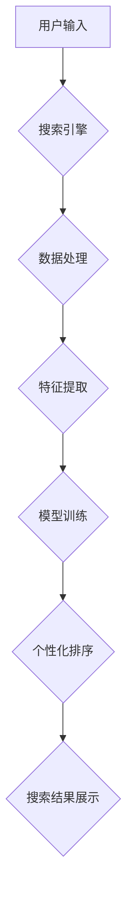

                 

## AI电商搜索平台的实时个性化

> 关键词：电商搜索、个性化推荐、实时分析、机器学习、深度学习、自然语言处理、用户行为分析

## 1. 背景介绍

随着电商平台的蓬勃发展，用户对商品搜索体验的需求日益提高。传统的基于关键词匹配的搜索方式已难以满足用户个性化需求，搜索结果往往缺乏针对性和相关性。为了提升用户体验，电商平台纷纷探索基于人工智能的个性化搜索解决方案。

实时个性化搜索是指根据用户实时行为、偏好和上下文信息，动态调整搜索结果排序和推荐，提供更加精准、个性化的商品搜索体验。这种技术能够有效解决传统搜索平台的局限性，提升用户满意度和转化率。

## 2. 核心概念与联系

### 2.1  核心概念

* **个性化推荐:** 根据用户的历史行为、偏好、兴趣等信息，推荐个性化的商品或内容。
* **实时分析:** 对用户行为数据进行实时采集、分析和处理，及时更新搜索结果。
* **机器学习:** 利用算法从数据中学习，不断优化搜索结果的个性化和准确性。
* **深度学习:** 一种更高级的机器学习方法，能够处理更复杂的数据模式，提升推荐效果。
* **自然语言处理:** 用于理解和处理用户自然语言输入，例如搜索关键词、评论等。

### 2.2  架构



## 3. 核心算法原理 & 具体操作步骤

### 3.1  算法原理概述

实时个性化搜索算法通常基于以下核心原理：

* **用户行为分析:** 收集用户搜索历史、浏览记录、购买行为等数据，分析用户兴趣和偏好。
* **商品特征提取:** 从商品信息中提取特征，例如商品类别、价格、品牌、描述等，构建商品向量表示。
* **相似度计算:** 利用机器学习算法计算用户和商品之间的相似度，例如余弦相似度、点积相似度等。
* **个性化排序:** 根据用户和商品的相似度，对搜索结果进行排序，将与用户兴趣相符的商品排在前面。

### 3.2  算法步骤详解

1. **数据采集:** 收集用户行为数据，例如搜索关键词、点击记录、浏览记录、购买记录等。
2. **数据预处理:** 对收集到的数据进行清洗、转换和格式化，例如去除重复数据、处理缺失值等。
3. **特征提取:** 从用户行为数据和商品信息中提取特征，例如用户性别、年龄、地理位置、商品类别、价格、品牌等。
4. **模型训练:** 利用机器学习算法，例如协同过滤、深度神经网络等，训练个性化推荐模型。
5. **实时预测:** 当用户进行搜索时，根据用户的实时行为和上下文信息，利用训练好的模型预测用户感兴趣的商品。
6. **个性化排序:** 对预测结果进行排序，将与用户兴趣相符的商品排在前面，展示给用户。

### 3.3  算法优缺点

**优点:**

* **个性化推荐:** 能够根据用户的兴趣和偏好，提供更加精准的商品推荐。
* **提升用户体验:** 提供更加个性化和相关的搜索结果，提升用户搜索体验。
* **提高转化率:** 通过精准推荐，提高用户购买意愿和转化率。

**缺点:**

* **数据依赖:** 需要大量用户行为数据进行训练，否则模型效果难以保证。
* **算法复杂:** 个性化推荐算法通常比较复杂，需要专业的技术人员进行开发和维护。
* **冷启动问题:** 对新用户和新商品的推荐效果可能较差。

### 3.4  算法应用领域

* **电商搜索:** 提供个性化商品推荐，提升用户体验和转化率。
* **内容推荐:** 根据用户的兴趣和偏好，推荐个性化的新闻、视频、文章等内容。
* **社交推荐:** 推荐用户可能感兴趣的社交好友、群组等。
* **广告推荐:** 根据用户的兴趣和行为，推荐更加精准的广告。

## 4. 数学模型和公式 & 详细讲解 & 举例说明

### 4.1  数学模型构建

个性化推荐算法通常基于以下数学模型：

* **协同过滤模型:** 基于用户-商品交互矩阵，预测用户对商品的评分或偏好。
* **深度学习模型:** 利用神经网络结构，学习用户和商品之间的复杂关系。

### 4.2  公式推导过程

**协同过滤模型:**

假设用户 $u$ 对商品 $i$ 的评分为 $r_{ui}$，则协同过滤模型的目标是预测用户 $u$ 对商品 $i$ 的评分。

常用的协同过滤算法包括基于用户的协同过滤和基于物品的协同过滤。

* **基于用户的协同过滤:**

预测用户 $u$ 对商品 $i$ 的评分为：

$$
r_{ui} = \frac{\sum_{v \in N(u)} \frac{r_{uv} \cdot sim(u, v)}{sim(u, v)}}{\sum_{v \in N(u)} 1}
$$

其中，$N(u)$ 表示与用户 $u$ 相似的用户集合，$sim(u, v)$ 表示用户 $u$ 和用户 $v$ 之间的相似度。

* **基于物品的协同过滤:**

预测用户 $u$ 对商品 $i$ 的评分为：

$$
r_{ui} = \frac{\sum_{j \in N(i)} \frac{r_{uj} \cdot sim(i, j)}{sim(i, j)}}{\sum_{j \in N(i)} 1}
$$

其中，$N(i)$ 表示与商品 $i$ 相似的商品集合，$sim(i, j)$ 表示商品 $i$ 和商品 $j$ 之间的相似度。

### 4.3  案例分析与讲解

假设有一个电商平台，用户 $A$ 和用户 $B$ 都购买了商品 $X$ 和商品 $Y$，用户 $A$ 对商品 $X$ 的评分为 5，对商品 $Y$ 的评分为 4，用户 $B$ 对商品 $X$ 的评分为 4，对商品 $Y$ 的评分为 5。

基于用户的协同过滤模型，可以计算用户 $A$ 和用户 $B$ 之间的相似度，并预测用户 $A$ 对商品 $Z$ 的评分。

## 5. 项目实践：代码实例和详细解释说明

### 5.1  开发环境搭建

* **操作系统:** Linux/macOS/Windows
* **编程语言:** Python
* **深度学习框架:** TensorFlow/PyTorch
* **数据库:** MySQL/MongoDB

### 5.2  源代码详细实现

```python
# 导入必要的库
import pandas as pd
from sklearn.metrics.pairwise import cosine_similarity

# 加载用户-商品交互数据
data = pd.read_csv('user_item_interactions.csv')

# 构建用户-商品交互矩阵
user_item_matrix = data.pivot_table(index='user_id', columns='item_id', values='rating')

# 计算用户之间的余弦相似度
user_similarity = cosine_similarity(user_item_matrix)

# 预测用户对商品的评分
def predict_rating(user_id, item_id):
    # 获取与用户相似的用户
    similar_users = user_similarity[user_id].argsort()[:-10:-1]
    # 计算预测评分
    predicted_rating = 0
    for similar_user in similar_users:
        if user_item_matrix.loc[similar_user, item_id] is not None:
            predicted_rating += user_item_matrix.loc[similar_user, item_id] * user_similarity[user_id][similar_user]
    return predicted_rating / sum(user_similarity[user_id][similar_users])

# 预测用户对商品 Z 的评分
predicted_rating = predict_rating(user_id=1, item_id=10)
print(f'Predicted rating for user 1 on item 10: {predicted_rating}')
```

### 5.3  代码解读与分析

* **数据加载:** 从 CSV 文件中加载用户-商品交互数据。
* **交互矩阵构建:** 将数据转换为用户-商品交互矩阵，其中每个元素表示用户对商品的评分。
* **相似度计算:** 使用余弦相似度计算用户之间的相似度。
* **评分预测:** 基于协同过滤模型，预测用户对商品的评分。

### 5.4  运行结果展示

运行代码后，将输出用户对商品 Z 的预测评分。

## 6. 实际应用场景

### 6.1  电商平台搜索

* **个性化商品推荐:** 根据用户的搜索历史、浏览记录、购买记录等数据，推荐与用户兴趣相符的商品。
* **搜索结果排序:** 根据用户的兴趣和偏好，对搜索结果进行排序，将与用户兴趣相符的商品排在前面。
* **商品分类和标签推荐:** 根据用户的搜索行为，推荐与用户搜索相关的商品分类和标签。

### 6.2  内容平台推荐

* **个性化内容推荐:** 根据用户的阅读历史、点赞记录、评论等数据，推荐与用户兴趣相符的新闻、视频、文章等内容。
* **内容分类和标签推荐:** 根据用户的阅读行为，推荐与用户阅读相关的文章分类和标签。

### 6.3  社交平台推荐

* **个性化好友推荐:** 根据用户的社交关系和兴趣爱好，推荐可能感兴趣的社交好友。
* **个性化群组推荐:** 根据用户的兴趣爱好和社交关系，推荐可能感兴趣的社交群组。

### 6.4  未来应用展望

随着人工智能技术的不断发展，实时个性化搜索将应用于更多领域，例如：

* **医疗保健:** 根据患者的病史、症状、基因信息等数据，推荐个性化的医疗方案。
* **教育:** 根据学生的学习进度、兴趣爱好、学习风格等数据，推荐个性化的学习资源和课程。
* **金融:** 根据用户的财务状况、风险偏好、投资目标等数据，推荐个性化的理财产品和投资策略。

## 7. 工具和资源推荐

### 7.1  学习资源推荐

* **书籍:**
    * 《推荐系统实践》
    * 《深度学习》
* **在线课程:**
    * Coursera: Recommender Systems
    * Udacity: Deep Learning Nanodegree

### 7.2  开发工具推荐

* **深度学习框架:** TensorFlow, PyTorch
* **数据处理工具:** Pandas, NumPy
* **机器学习库:** scikit-learn

### 7.3  相关论文推荐

* **协同过滤:**
    * "Collaborative Filtering: A User-Based Approach"
    * "Memory-Based Collaborative Filtering"
* **深度学习推荐:**
    * "Neural Collaborative Filtering"
    * "Deep Learning for Recommender Systems"

## 8. 总结：未来发展趋势与挑战

### 8.1  研究成果总结

实时个性化搜索技术取得了显著进展，能够有效提升用户体验和转化率。

### 8.2  未来发展趋势

* **更精准的推荐:** 利用更先进的机器学习算法和深度学习模型，提升推荐的精准度和个性化程度。
* **更丰富的特征:** 挖掘更丰富的用户行为数据和商品特征，构建更全面的用户画像和商品描述。
* **更实时化的分析:** 利用实时数据流处理技术，实现更实时的数据分析和推荐更新。
* **更个性化的交互:** 利用自然语言处理技术，实现更自然的用户交互，例如语音搜索和对话推荐。

### 8.3  面临的挑战

* **数据隐私保护:** 个性化推荐需要大量用户数据，如何保护用户隐私是一个重要的挑战。
* **算法公平性:** 个性化推荐算法可能存在偏差，导致某些用户获得不公平的推荐结果。
* **冷启动问题:** 对新用户和新商品的推荐效果难以保证。

### 8.4  研究展望

未来，实时个性化搜索技术将继续朝着更精准、更个性化、更智能的方向发展，为用户提供更加丰富的搜索体验和个性化服务。

## 9. 附录：常见问题与解答

* **Q1: 如何解决冷启动问题？**

A1: 可以利用用户提供的基本信息，例如年龄、性别、兴趣爱好等，进行初始化推荐。也可以利用协同过滤算法，从与新用户相似用户的行为数据中获取推荐信息。

* **Q2: 如何保证算法公平性？**

A2: 可以采用公平性度量指标，例如公平性损失函数，在训练过程中优化算法公平性。也可以采用反向公平性技术，例如对抗训练，提高算法对不同用户群体的公平性。


作者：禅与计算机程序设计艺术 / Zen and the Art of Computer Programming 
<end_of_turn>

