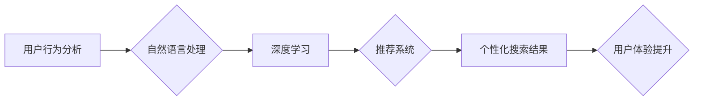

                 

## AI电商搜索：超个性化购物体验的发展前景

> 关键词：人工智能、电商搜索、个性化推荐、深度学习、自然语言处理、用户行为分析、推荐系统

## 1. 背景介绍

电子商务的蓬勃发展为消费者提供了便捷的购物体验，然而，传统的电商搜索引擎往往难以满足用户日益增长的个性化需求。随着人工智能技术的快速发展，AI电商搜索应运而生，旨在通过深度学习、自然语言处理等技术，理解用户的真实意图，提供更精准、更个性化的商品推荐和搜索结果。

传统的电商搜索引擎主要依赖于关键词匹配和商品属性检索，缺乏对用户意图和偏好的理解。当用户输入模糊或复杂的查询词时，搜索结果往往不准确，难以满足用户的需求。此外，传统的搜索引擎也难以提供个性化的商品推荐，用户只能浏览平台推荐的热门商品，缺乏针对自身需求的个性化选择。

AI电商搜索通过引入人工智能技术，可以突破传统搜索引擎的局限性，实现以下功能：

* **理解用户意图:** AI电商搜索可以利用自然语言处理技术，分析用户的查询词、浏览历史、购买记录等信息，理解用户的真实意图，并提供更精准的搜索结果。
* **个性化推荐:** AI电商搜索可以根据用户的兴趣爱好、购买习惯、浏览历史等信息，推荐个性化的商品，提高用户的购物体验。
* **智能问答:** AI电商搜索可以利用知识图谱和机器学习技术，回答用户的商品相关问题，提供更全面的购物信息。
* **多模态搜索:** AI电商搜索可以支持图片、语音等多模态的搜索方式，满足用户多样化的搜索需求。

## 2. 核心概念与联系

AI电商搜索的核心概念包括：

* **用户行为分析:** 通过分析用户的浏览记录、购买记录、评价等行为数据，了解用户的兴趣爱好、购买习惯等信息。
* **自然语言处理:** 利用自然语言处理技术，理解用户的查询词、评论等文本信息，提取关键信息，识别用户意图。
* **深度学习:** 利用深度学习算法，从海量数据中学习用户画像、商品特征等知识，提高搜索结果的准确性和个性化程度。
* **推荐系统:** 基于用户行为分析、自然语言处理、深度学习等技术，构建个性化的商品推荐系统，为用户提供更精准的商品推荐。

**Mermaid 流程图:**



## 3. 核心算法原理 & 具体操作步骤

### 3.1  算法原理概述

AI电商搜索的核心算法主要包括：

* **协同过滤:** 基于用户的历史行为数据，预测用户对商品的喜好。
* **内容过滤:** 基于商品的属性信息，推荐与用户兴趣相符的商品。
* **混合推荐:** 结合协同过滤和内容过滤算法，提高推荐的准确性和个性化程度。
* **深度学习推荐:** 利用深度学习算法，从海量数据中学习用户画像、商品特征等知识，构建更精准的推荐模型。

### 3.2  算法步骤详解

**协同过滤算法步骤:**

1. **数据收集:** 收集用户的历史行为数据，包括用户对商品的评分、购买记录、浏览记录等。
2. **用户相似度计算:** 计算用户之间的相似度，例如使用余弦相似度或皮尔逊相关系数。
3. **商品推荐:** 根据用户之间的相似度，推荐与相似用户喜欢的商品给目标用户。

**内容过滤算法步骤:**

1. **商品特征提取:** 从商品的属性信息中提取特征，例如商品类别、品牌、价格、描述等。
2. **用户兴趣建模:** 根据用户的历史行为数据，构建用户的兴趣模型，例如使用词袋模型或TF-IDF算法。
3. **商品推荐:** 根据用户的兴趣模型和商品特征，推荐与用户兴趣相符的商品。

### 3.3  算法优缺点

**协同过滤算法:**

* **优点:** 可以发现用户之间的隐性关联，推荐个性化的商品。
* **缺点:** 数据稀疏性问题，当用户行为数据不足时，算法效果会下降。

**内容过滤算法:**

* **优点:** 不需要用户行为数据，可以推荐基于商品属性的商品。
* **缺点:** 难以发现用户之间的隐性关联，推荐结果可能缺乏个性化。

### 3.4  算法应用领域

AI电商搜索算法广泛应用于以下领域:

* **电商平台:** 为用户提供个性化的商品推荐和搜索结果。
* **社交媒体:** 为用户推荐相关内容和商品。
* **内容平台:** 为用户推荐相关文章、视频等内容。
* **金融领域:** 为用户推荐理财产品和投资建议。

## 4. 数学模型和公式 & 详细讲解 & 举例说明

### 4.1  数学模型构建

协同过滤算法常用的数学模型包括：

* **用户-商品矩阵:** 将用户和商品作为行和列，用户对商品的评分作为矩阵元素。
* **相似度矩阵:** 计算用户之间的相似度，构建用户相似度矩阵。

### 4.2  公式推导过程

**余弦相似度公式:**

$$
\text{相似度} = \frac{\mathbf{u} \cdot \mathbf{v}}{\|\mathbf{u}\| \|\mathbf{v}\|}
$$

其中:

* $\mathbf{u}$ 和 $\mathbf{v}$ 是两个用户的向量表示。
* $\mathbf{u} \cdot \mathbf{v}$ 是两个向量的点积。
* $\|\mathbf{u}\|$ 和 $\|\mathbf{v}\|$ 是两个向量的模长。

### 4.3  案例分析与讲解

假设有两个用户 A 和 B，他们的评分向量分别为:

* $\mathbf{u}_A = [1, 2, 3, 4, 5]$
* $\mathbf{u}_B = [2, 3, 4, 5, 1]$

使用余弦相似度公式计算用户 A 和 B 的相似度:

$$
\text{相似度} = \frac{(1 \times 2) + (2 \times 3) + (3 \times 4) + (4 \times 5) + (5 \times 1)}{\sqrt{1^2 + 2^2 + 3^2 + 4^2 + 5^2} \sqrt{2^2 + 3^2 + 4^2 + 5^2 + 1^2}} = \frac{39}{\sqrt{55} \sqrt{55}} \approx 0.89
$$

结果表明，用户 A 和 B 的相似度较高，说明他们对商品的喜好有一定的相似性。

## 5. 项目实践：代码实例和详细解释说明

### 5.1  开发环境搭建

* **操作系统:** Ubuntu 20.04
* **编程语言:** Python 3.8
* **深度学习框架:** TensorFlow 2.0
* **数据处理库:** Pandas
* **机器学习库:** Scikit-learn

### 5.2  源代码详细实现

```python
import pandas as pd
from sklearn.metrics.pairwise import cosine_similarity

# 加载用户-商品评分数据
ratings_data = pd.read_csv('ratings.csv')

# 计算用户之间的余弦相似度
user_similarity = cosine_similarity(ratings_data.T)

# 获取用户 A 的相似用户
user_A_id = 1
similar_users = user_similarity[user_A_id].argsort()[:-6:-1]  # 排序获取相似度最高的 5 个用户

# 推荐商品给用户 A
recommended_items = ratings_data.iloc[similar_users].mean().sort_values(ascending=False)
```

### 5.3  代码解读与分析

* **数据加载:** 使用 Pandas 库加载用户-商品评分数据。
* **相似度计算:** 使用 Scikit-learn 库的 `cosine_similarity` 函数计算用户之间的余弦相似度。
* **相似用户获取:** 根据用户 A 的 ID，获取其相似度最高的 5 个用户。
* **商品推荐:** 计算相似用户对商品的平均评分，并根据评分排序推荐商品给用户 A。

### 5.4  运行结果展示

运行代码后，将输出用户 A 的商品推荐列表，其中包含相似用户评分最高的商品。

## 6. 实际应用场景

AI电商搜索技术已在各大电商平台得到广泛应用，例如：

* **淘宝:** 利用 AI 技术，提供个性化的商品推荐和搜索结果，提升用户购物体验。
* **京东:** 使用 AI 技术，实现智能问答功能，帮助用户快速找到所需商品信息。
* **亚马逊:** 利用 AI 技术，支持多模态搜索，例如图片搜索和语音搜索。

### 6.4  未来应用展望

AI电商搜索技术未来将朝着以下方向发展:

* **更精准的个性化推荐:** 利用更先进的深度学习算法，从更丰富的用户数据中学习用户画像，提供更精准的个性化推荐。
* **更智能的搜索体验:** 利用自然语言理解和知识图谱技术，实现更智能的搜索体验，例如理解用户的隐含意图，提供更全面的搜索结果。
* **多模态搜索的融合:** 将图片、语音、视频等多模态搜索方式融合，提供更丰富的搜索体验。
* **个性化电商场景构建:** 基于用户画像和行为数据，构建个性化的电商场景，例如虚拟试衣间、个性化商品搭配等。

## 7. 工具和资源推荐

### 7.1  学习资源推荐

* **书籍:**
    * 《深度学习》 by Ian Goodfellow, Yoshua Bengio, Aaron Courville
    * 《推荐系统实践》 by  王志强
* **在线课程:**
    * Coursera: 深度学习 Specialization
    * Udacity: 机器学习 Engineer Nanodegree

### 7.2  开发工具推荐

* **深度学习框架:** TensorFlow, PyTorch, Keras
* **数据处理库:** Pandas, NumPy
* **机器学习库:** Scikit-learn, XGBoost

### 7.3  相关论文推荐

* **Collaborative Filtering for Implicit Feedback Datasets** by  Rendle et al.
* **Deep Learning for Recommender Systems** by  Wang et al.
* **Neural Collaborative Filtering** by  Koren et al.

## 8. 总结：未来发展趋势与挑战

### 8.1  研究成果总结

AI电商搜索技术取得了显著的成果，能够提供更精准、更个性化的商品推荐和搜索结果，提升用户购物体验。

### 8.2  未来发展趋势

AI电商搜索技术未来将朝着更精准、更智能、更个性化的方向发展，例如利用更先进的深度学习算法、自然语言理解技术、多模态搜索技术等。

### 8.3  面临的挑战

AI电商搜索技术也面临一些挑战，例如:

* **数据稀疏性问题:** 用户行为数据往往是稀疏的，难以训练出准确的推荐模型。
* **冷启动问题:** 新用户和新商品难以获得准确的推荐。
* **公平性问题:** AI推荐算法可能存在偏见，导致推荐结果不公平。

### 8.4  研究展望

未来研究方向包括:

* **解决数据稀疏性问题:** 利用迁移学习、知识蒸馏等技术，提高模型的泛化能力。
* **解决冷启动问题:** 利用用户画像、商品属性等信息，为新用户和新商品提供初始推荐。
* **提升推荐公平性:** 开发公平的推荐算法，避免推荐结果存在偏见。

## 9. 附录：常见问题与解答

**Q1: AI电商搜索与传统电商搜索有什么区别？**

**A1:** AI电商搜索利用人工智能技术，能够理解用户的真实意图，提供更精准、更个性化的商品推荐和搜索结果，而传统电商搜索主要依赖于关键词匹配和商品属性检索，难以满足用户的个性化需求。

**Q2: AI电商搜索有哪些应用场景？**

**A2:** AI电商搜索广泛应用于电商平台、社交媒体、内容平台等领域，例如提供个性化商品推荐、智能问答、多模态搜索等功能。

**Q3: 如何评估 AI电商搜索的性能？**

**A3:** AI电商搜索的性能可以评估指标包括准确率、召回率、点击率、转化率等。

**作者：禅与计算机程序设计艺术 / Zen and the Art of Computer Programming**<end_of_turn>

