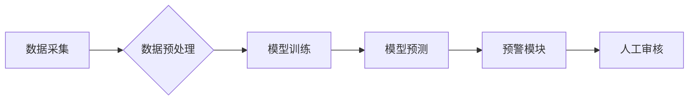

                 

## AI赋能的电商异常交易实时检测与预警系统

> 关键词：电商异常交易、实时检测、机器学习、深度学习、预警系统、数据分析、 fraud detection

## 1. 背景介绍

随着电商行业的蓬勃发展，交易规模不断扩大，异常交易问题也日益突出。异常交易是指违反平台规则或法律法规的交易行为，例如欺诈、刷单、盗刷等。这些行为不仅会造成经济损失，还会损害平台的声誉和用户信任。因此，构建高效、准确的异常交易检测与预警系统对于电商平台的运营至关重要。

传统的异常交易检测方法主要依赖于规则引擎，通过预先定义的规则来识别异常交易。然而，随着交易模式的不断变化和攻击手段的升级，规则引擎难以适应新的攻击方式，且容易产生误判。

近年来，人工智能技术的发展为异常交易检测提供了新的思路。机器学习和深度学习算法能够从海量交易数据中学习异常交易的特征，并自动识别新的异常交易模式。

## 2. 核心概念与联系

### 2.1 异常交易检测

异常交易检测是指识别与正常交易行为不同的交易行为，并将其标记为异常。异常交易检测系统通常由以下几个模块组成：

* **数据采集模块:** 收集电商平台的交易数据，包括用户行为、商品信息、支付信息等。
* **数据预处理模块:** 对采集到的数据进行清洗、转换和特征提取，以便于后续的模型训练和预测。
* **模型训练模块:** 利用机器学习或深度学习算法，从预处理后的数据中训练异常交易检测模型。
* **模型预测模块:** 将新交易数据输入到训练好的模型中，预测该交易是否为异常交易。
* **预警模块:** 当模型预测到异常交易时，触发预警机制，通知相关人员进行处理。

### 2.2  机器学习与深度学习

机器学习是人工智能的一个分支，它通过算法学习数据中的模式，并根据这些模式进行预测或决策。深度学习是机器学习的一种更高级形式，它利用多层神经网络来模拟人类大脑的学习过程，能够学习更复杂的模式。

在异常交易检测领域，机器学习和深度学习算法被广泛应用，例如：

* **分类算法:** 

例如逻辑回归、支持向量机、决策树等，用于将交易数据分类为正常交易或异常交易。
* **聚类算法:** 

例如k-means聚类、DBSCAN等，用于将交易数据聚类到不同的类别，并识别异常的交易类别。
* **异常检测算法:** 

例如Isolation Forest、One-Class SVM等，专门用于识别异常数据点。

### 2.3  架构设计

电商异常交易实时检测与预警系统通常采用分布式架构，以应对海量交易数据和实时处理的要求。



**数据采集:** 从电商平台的各个系统收集交易数据，例如订单信息、用户行为日志、支付记录等。

**数据预处理:** 对采集到的数据进行清洗、转换和特征提取，例如去除重复数据、转换数据格式、提取用户特征、商品特征、交易时间特征等。

**模型训练:** 利用机器学习或深度学习算法，从预处理后的数据中训练异常交易检测模型。

**模型预测:** 将新交易数据输入到训练好的模型中，预测该交易是否为异常交易。

**预警模块:** 当模型预测到异常交易时，触发预警机制，通知相关人员进行处理。

**人工审核:** 人工审核员对预警到的交易进行最终判断，并采取相应的处理措施。

## 3. 核心算法原理 & 具体操作步骤

### 3.1  算法原理概述

在电商异常交易实时检测与预警系统中，常用的算法包括：

* **逻辑回归:** 是一种线性分类算法，用于预测交易是否为异常交易。
* **支持向量机:** 是一种非线性分类算法，能够学习更复杂的决策边界。
* **决策树:** 是一种树形结构的分类算法，能够直观地展示决策规则。
* **随机森林:** 是一种集成学习算法，通过构建多个决策树并投票决策来提高预测精度。
* **Isolation Forest:** 是一种异常检测算法，通过隔离异常数据点来识别异常交易。

### 3.2  算法步骤详解

以逻辑回归为例，详细说明其算法步骤：

1. **数据预处理:** 对交易数据进行清洗、转换和特征提取，例如去除重复数据、转换数据格式、提取用户特征、商品特征、交易时间特征等。
2. **特征选择:** 选择与异常交易相关的特征作为模型输入，例如用户注册时间、交易金额、交易频率、商品类别等。
3. **模型训练:** 利用训练数据训练逻辑回归模型，学习交易数据与异常交易之间的关系。
4. **模型评估:** 利用测试数据评估模型的性能，例如准确率、召回率、F1-score等。
5. **模型部署:** 将训练好的模型部署到生产环境中，用于实时检测新交易的异常性。

### 3.3  算法优缺点

**逻辑回归:**

* **优点:** 算法简单易懂，训练速度快， interpretability 强。
* **缺点:** 只能处理线性关系，对复杂数据模式的学习能力有限。

**支持向量机:**

* **优点:** 能够学习非线性关系，对高维数据具有较好的鲁棒性。
* **缺点:** 训练速度慢，参数选择较复杂。

**决策树:**

* **优点:** 算法直观易懂，可解释性强。
* **缺点:** 容易过拟合，对数据噪声敏感。

**随机森林:**

* **优点:** 能够提高模型的泛化能力，降低过拟合风险。
* **缺点:** 训练速度慢，可解释性较弱。

**Isolation Forest:**

* **优点:** 能够有效识别异常数据点，对异常数据模式的学习能力强。
* **缺点:** 对数据分布的假设较强，对异常数据点的数量敏感。

### 3.4  算法应用领域

异常交易检测算法广泛应用于以下领域：

* **电商平台:** 检测欺诈交易、刷单、盗刷等异常行为。
* **金融机构:** 检测信用卡欺诈、账户盗取、洗钱等异常交易。
* **医疗机构:** 检测医疗保险欺诈、医疗数据异常等。
* **网络安全:** 检测网络攻击、恶意软件感染等异常行为。

## 4. 数学模型和公式 & 详细讲解 & 举例说明

### 4.1  数学模型构建

在异常交易检测中，常用的数学模型包括：

* **逻辑回归模型:** 用于预测交易是否为异常交易。
* **支持向量机模型:** 用于寻找最佳的超平面将交易数据分类为正常交易和异常交易。
* **决策树模型:** 用于构建决策规则，将交易数据分类为不同类别。

### 4.2  公式推导过程

以逻辑回归模型为例，其目标函数为：

$$
L(\theta) = -\frac{1}{m} \sum_{i=1}^{m} y^{(i)} \log(h_\theta(x^{(i)})) + (1-y^{(i)}) \log(1-h_\theta(x^{(i)}))
$$

其中：

* $m$ 是训练样本的数量。
* $y^{(i)}$ 是第 $i$ 个样本的真实标签，取值为 0 或 1。
* $h_\theta(x^{(i)})$ 是逻辑回归模型对第 $i$ 个样本的预测结果，取值为 0 到 1 之间。
* $\theta$ 是模型参数。

通过梯度下降算法，可以迭代更新模型参数 $\theta$，使得目标函数 $L(\theta)$ 最小化。

### 4.3  案例分析与讲解

假设我们有一个电商平台的交易数据，其中包含用户ID、商品ID、交易金额、交易时间等特征。我们想要利用逻辑回归模型来检测异常交易。

1. **数据预处理:** 对交易数据进行清洗、转换和特征提取，例如去除重复数据、转换数据格式、提取用户特征、商品特征、交易时间特征等。
2. **特征选择:** 选择与异常交易相关的特征作为模型输入，例如用户注册时间、交易金额、交易频率、商品类别等。
3. **模型训练:** 利用训练数据训练逻辑回归模型，学习交易数据与异常交易之间的关系。
4. **模型评估:** 利用测试数据评估模型的性能，例如准确率、召回率、F1-score等。
5. **模型部署:** 将训练好的模型部署到生产环境中，用于实时检测新交易的异常性。

## 5. 项目实践：代码实例和详细解释说明

### 5.1  开发环境搭建

* **操作系统:** Ubuntu 20.04 LTS
* **编程语言:** Python 3.8
* **深度学习框架:** TensorFlow 2.0
* **数据处理库:** Pandas, NumPy
* **机器学习库:** Scikit-learn

### 5.2  源代码详细实现

```python
import pandas as pd
from sklearn.model_selection import train_test_split
from sklearn.linear_model import LogisticRegression
from sklearn.metrics import accuracy_score

# 加载交易数据
data = pd.read_csv('transaction_data.csv')

# 选择特征和目标变量
features = ['user_id', 'product_id', 'amount', 'transaction_time']
target = 'is_fraud'

# 数据预处理
# ...

# 将数据划分为训练集和测试集
X_train, X_test, y_train, y_test = train_test_split(data[features], data[target], test_size=0.2, random_state=42)

# 创建逻辑回归模型
model = LogisticRegression()

# 训练模型
model.fit(X_train, y_train)

# 预测测试集结果
y_pred = model.predict(X_test)

# 计算模型准确率
accuracy = accuracy_score(y_test, y_pred)
print(f'模型准确率: {accuracy}')
```

### 5.3  代码解读与分析

* **数据加载:** 使用 Pandas 库加载交易数据。
* **特征选择:** 选择与异常交易相关的特征作为模型输入。
* **数据预处理:** 对数据进行清洗、转换和特征提取。
* **数据分割:** 将数据划分为训练集和测试集。
* **模型创建:** 创建逻辑回归模型。
* **模型训练:** 使用训练数据训练模型。
* **模型预测:** 使用训练好的模型预测测试集结果。
* **模型评估:** 计算模型的准确率。

### 5.4  运行结果展示

运行上述代码后，可以得到模型的准确率。

## 6. 实际应用场景

### 6.1  电商平台异常交易检测

电商平台可以利用异常交易检测系统来识别欺诈交易、刷单、盗刷等异常行为，保护平台和用户的利益。

### 6.2  金融机构反欺诈系统

金融机构可以利用异常交易检测系统来检测信用卡欺诈、账户盗取、洗钱等异常交易，降低金融风险。

### 6.3  医疗保险欺诈检测

医疗保险公司可以利用异常交易检测系统来检测医疗保险欺诈、医疗数据异常等，降低保险成本。

### 6.4  未来应用展望

随着人工智能技术的不断发展，异常交易检测系统将更加智能化、自动化，能够识别更加复杂的异常交易模式。

## 7. 工具和资源推荐

### 7.1  学习资源推荐

* **书籍:**
    * 《Python机器学习》
    * 《深度学习》
* **在线课程:**
    * Coursera: 机器学习
    * Udacity: 深度学习工程师
* **博客:**
    * Towards Data Science
    * Machine Learning Mastery

### 7.2  开发工具推荐

* **IDE:** PyCharm, VS Code
* **深度学习框架:** TensorFlow, PyTorch
* **数据处理库:** Pandas, NumPy
* **机器学习库:** Scikit-learn

### 7.3  相关论文推荐

* **Isolation Forest:**
    * Liu, F., Ting, K. M., & Zhou, Z. H. (2008). Isolation forest. In *Data mining (ICDM), 2008 IEEE/ACM international conference on* (pp. 413-422). IEEE.
* **Logistic Regression:**
    * Hosmer, D. W., & Lemeshow, S. (2000). *Applied logistic regression*. John Wiley & Sons.

## 8. 总结：未来发展趋势与挑战

### 8.1  研究成果总结

AI赋能的电商异常交易实时检测与预警系统取得了显著成果，能够有效识别各种类型的异常交易，降低平台和用户的损失。

### 8.2  未来发展趋势

* **模型精度提升:** 研究更先进的机器学习和深度学习算法，提高模型的识别精度。
* **实时性增强:** 利用分布式架构和云计算技术，提高系统的实时处理能力。
* **解释性增强:** 研究可解释的机器学习模型，提高模型的可理解性和可信任性。
* **个性化定制:** 根据不同平台和用户的需求，定制个性化的异常交易检测模型。

### 8.3  面临的挑战

* **数据质量问题:** 异常交易数据往往稀缺和不完整，需要开发更有效的处理方法。
* **攻击手段升级:** 攻击者不断开发新的攻击手段，需要不断更新模型以应对新的威胁。
* **模型可解释性:** 许多深度学习模型难以解释其决策过程，需要提高模型的可解释性。

### 8.4  研究展望

未来，AI赋能的电商异常交易实时检测与预警系统将朝着更智能化、自动化、个性化方向发展，为电商平台和用户提供更安全、可靠的交易环境。

## 9. 附录：常见问题与解答

### 9.1  常见问题

* **如何选择合适的异常交易检测算法？**

选择合适的算法取决于具体应用场景和数据特点。例如，对于高维数据，支持向量机可能更合适；对于数据分布较为均匀的情况，Isolation Forest可能更有效。

* **如何评估异常交易检测模型的性能？**

常用的评估指标包括准确率、召回率、F1-score等。

* **如何应对数据质量问题？**

可以采用数据清洗、数据增强等方法来提高数据质量。

* **如何应对攻击手段升级？**

需要不断更新模型，并结合其他安全措施，例如行为分析、多因素认证等。


作者：禅与计算机程序设计艺术 / Zen and the Art of Computer Programming<end_of_turn>

