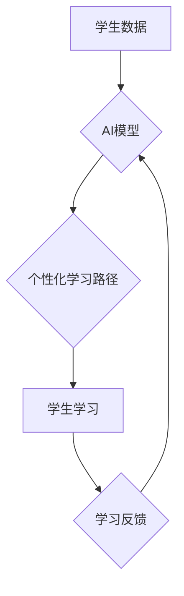

                 

## AI辅助教育：个性化学习路径设计

> 关键词：人工智能、教育科技、个性化学习、学习路径、机器学习、深度学习、推荐系统

## 1. 背景介绍

教育领域一直致力于提升学习效率和效果，而传统的教育模式往往难以满足每个学生个性化的学习需求。随着人工智能技术的快速发展，AI辅助教育逐渐成为教育改革的重要方向之一。其中，个性化学习路径设计是AI在教育领域的应用场景之一，旨在根据学生的学习能力、兴趣、目标等因素，定制专属的学习计划，帮助学生更高效地掌握知识，提升学习体验。

传统的教育模式通常采用“一刀切”的教学方法，将所有学生按照统一的课程安排进行学习。这种模式忽略了学生个体差异，导致部分学生学习进度过快，感到枯燥乏味，而另一些学生则学习进度过慢，难以跟上，最终影响学习效果。

AI辅助教育的个性化学习路径设计能够有效解决这一问题。通过对学生的学习数据进行分析和挖掘，AI系统可以识别学生的学习特点、掌握程度和兴趣偏好，并根据这些信息动态调整学习内容、学习节奏和学习方式，为每个学生提供个性化的学习体验。

## 2. 核心概念与联系

### 2.1 个性化学习

个性化学习是指根据学生的个体差异，定制专属的学习计划和学习资源，以满足其独特的学习需求。个性化学习的核心目标是提高学习效率和效果，帮助每个学生充分发挥其潜能。

### 2.2 学习路径

学习路径是指学生在学习过程中所遵循的路线和步骤，包括学习目标、学习内容、学习方法和学习时间等方面。个性化学习路径设计旨在根据学生的学习特点和目标，构建一条最适合其学习的路径。

### 2.3 AI辅助教育

AI辅助教育是指利用人工智能技术辅助教育教学过程，提高教育效率和质量。AI辅助教育的应用场景广泛，包括个性化学习路径设计、智能辅导、自动批改、学习资源推荐等。

**核心概念与联系流程图**



## 3. 核心算法原理 & 具体操作步骤

### 3.1 算法原理概述

个性化学习路径设计的核心算法通常基于机器学习和深度学习技术。通过对学生的学习数据进行分析和挖掘，算法可以识别学生的学习特点、掌握程度和兴趣偏好，并根据这些信息动态调整学习内容、学习节奏和学习方式。

常见的算法包括：

* **协同过滤算法:** 基于其他学生相似学习行为的推荐，例如，如果学生A和学生B学习兴趣相似，并且学生A对某个课程评价很高，那么系统可能会推荐该课程给学生B。
* **内容基元推荐算法:** 基于学生学习内容的特征进行推荐，例如，如果学生A对数学概念理解较好，那么系统可能会推荐一些难度更高的数学课程给学生A。
* **混合推荐算法:** 将协同过滤算法和内容基元推荐算法相结合，以提高推荐的准确性和个性化程度。

### 3.2 算法步骤详解

1. **数据收集:** 收集学生的学习数据，包括学习记录、考试成绩、学习偏好、学习时间等。
2. **数据预处理:** 对收集到的数据进行清洗、转换和特征提取，以便于算法训练和使用。
3. **模型训练:** 选择合适的机器学习或深度学习算法，并利用预处理后的数据进行模型训练。
4. **个性化路径生成:** 将训练好的模型应用于新的学生数据，根据模型的预测结果，生成个性化的学习路径。
5. **路径评估和优化:** 定期评估个性化学习路径的效果，并根据评估结果进行路径的优化和调整。

### 3.3 算法优缺点

**优点:**

* **个性化:** 可以根据学生的个体差异，定制专属的学习计划。
* **效率:** 可以帮助学生更高效地掌握知识，提高学习效率。
* **体验:** 可以提供更个性化、更有趣的学习体验，提高学生的学习兴趣。

**缺点:**

* **数据依赖:** 需要大量的学习数据才能训练出准确的模型。
* **算法复杂:** 算法的训练和优化需要一定的技术难度。
* **伦理问题:** 需要关注个性化学习路径设计的伦理问题，例如数据隐私保护和算法公平性。

### 3.4 算法应用领域

个性化学习路径设计算法在教育领域有着广泛的应用场景，例如：

* **在线教育平台:** 为学生提供个性化的学习课程和学习资源。
* **智慧课堂:** 根据学生的学习情况，动态调整课堂内容和教学方式。
* **教育游戏:** 通过游戏化的学习方式，提高学生的学习兴趣和学习效率。
* **职业技能培训:** 为不同职业的从业者提供个性化的技能培训方案。

## 4. 数学模型和公式 & 详细讲解 & 举例说明

### 4.1 数学模型构建

个性化学习路径设计算法通常基于推荐系统模型，常用的模型包括协同过滤模型和内容基元模型。

**协同过滤模型:**

协同过滤模型基于用户的行为相似性进行推荐。假设用户u和用户v对物品i和j的评分分别为r<sub>ui</sub>, r<sub>vj</sub>, r<sub>ui</sub>, r<sub>vj</sub>。协同过滤模型的目标是预测用户u对物品j的评分r<sub>uj</sub>。

常用的协同过滤算法包括基于用户的协同过滤和基于物品的协同过滤。

**基于用户的协同过滤:**

基于用户的协同过滤算法寻找与用户u行为相似的用户，并根据这些用户的评分预测用户u对物品j的评分。

**基于物品的协同过滤:**

基于物品的协同过滤算法寻找与物品j相似的物品，并根据这些物品的用户评分预测用户u对物品j的评分。

**内容基元模型:**

内容基元模型基于物品的特征进行推荐。假设物品i的特征向量为f<sub>i</sub>，用户的特征向量为u。内容基元模型的目标是计算用户u对物品i的评分预测值p<sub>ui</sub>。

常用的内容基元模型包括点积模型和余弦相似度模型。

**点积模型:**

点积模型计算用户u和物品i特征向量的点积作为评分预测值。

**余弦相似度模型:**

余弦相似度模型计算用户u和物品i特征向量的余弦相似度作为评分预测值。

### 4.2 公式推导过程

**协同过滤模型:**

* **基于用户的协同过滤:**

$$r_{uj} = \frac{\sum_{v \in N(u)} \frac{r_{vi} \cdot sim(u,v)}{\sum_{w \in N(u)} sim(u,w)}}{\sum_{v \in N(u)} \frac{1}{sim(u,v)}}$$

其中，N(u)表示与用户u行为相似的用户集合，sim(u,v)表示用户u和用户v之间的相似度。

* **基于物品的协同过滤:**

$$r_{uj} = \frac{\sum_{i \in N(j)} \frac{r_{ui} \cdot sim(i,j)}{\sum_{k \in N(j)} sim(i,j)}}{\sum_{i \in N(j)} \frac{1}{sim(i,j)}}$$

其中，N(j)表示与物品j相似的物品集合，sim(i,j)表示物品i和物品j之间的相似度。

**内容基元模型:**

* **点积模型:**

$$p_{ui} = f_i \cdot u$$

* **余弦相似度模型:**

$$p_{ui} = \frac{f_i \cdot u}{||f_i|| ||u||}$$

### 4.3 案例分析与讲解

假设有一个在线教育平台，平台收集了学生学习记录、考试成绩和学习偏好等数据。

可以使用协同过滤算法构建一个推荐系统，根据学生的学习行为相似性，推荐其他学生学习过的课程。

例如，如果学生A和学生B学习兴趣相似，并且学生A对某个课程评价很高，那么系统可能会推荐该课程给学生B。

可以使用内容基元算法构建一个个性化学习路径生成器，根据学生的学习内容特征，生成个性化的学习路径。

例如，如果学生A对数学概念理解较好，那么系统可能会推荐一些难度更高的数学课程给学生A。

## 5. 项目实践：代码实例和详细解释说明

### 5.1 开发环境搭建

* **操作系统:** Linux/macOS/Windows
* **编程语言:** Python
* **深度学习框架:** TensorFlow/PyTorch
* **数据处理库:** Pandas/NumPy
* **可视化库:** Matplotlib/Seaborn

### 5.2 源代码详细实现

```python
# 导入必要的库
import pandas as pd
from sklearn.metrics.pairwise import cosine_similarity

# 加载学生学习数据
data = pd.read_csv('student_data.csv')

# 计算学生之间的余弦相似度
similarity_matrix = cosine_similarity(data[['math', 'physics', 'chemistry']])

# 获取学生A的学习数据
student_A_data = data[data['student_id'] == 'A']

# 找到与学生A学习兴趣相似的学生
similar_students = similarity_matrix[student_A_data.index].argsort()[::-1][1:]

# 推荐给学生A的课程
recommended_courses = data.loc[similar_students, ['math', 'physics', 'chemistry']].mean().sort_values(ascending=False)

# 打印推荐结果
print(recommended_courses)
```

### 5.3 代码解读与分析

* **数据加载:** 使用Pandas库加载学生学习数据。
* **相似度计算:** 使用Scikit-learn库的cosine_similarity函数计算学生之间的余弦相似度。
* **学生匹配:** 根据相似度矩阵，找到与学生A学习兴趣相似的学生。
* **课程推荐:** 计算相似学生学习过的课程的平均评分，并根据评分排序推荐给学生A。

### 5.4 运行结果展示

运行代码后，会输出一个包含推荐课程名称和平均评分的DataFrame。

## 6. 实际应用场景

### 6.1 在线教育平台

个性化学习路径设计可以帮助在线教育平台提供更个性化的学习体验，提高学生的学习效率和学习兴趣。例如，平台可以根据学生的学习进度和掌握程度，动态调整学习内容和学习节奏，并推荐相关的学习资源。

### 6.2 智慧课堂

个性化学习路径设计可以帮助智慧课堂根据学生的学习情况，动态调整课堂内容和教学方式。例如，老师可以根据学生的学习进度和掌握程度，选择合适的教学内容和教学方法，并提供个性化的辅导和帮助。

### 6.3 教育游戏

个性化学习路径设计可以帮助教育游戏提供更个性化的游戏体验，提高学生的学习兴趣和学习效果。例如，游戏可以根据学生的学习进度和掌握程度，调整游戏难度和游戏内容，并提供个性化的奖励和反馈。

### 6.4 未来应用展望

个性化学习路径设计在未来将有更广泛的应用场景，例如：

* **远程教育:** 为远程教育学生提供个性化的学习体验，弥补远程教育的不足。
* **个性化职业培训:** 为不同职业的从业者提供个性化的技能培训方案，帮助他们提升职业竞争力。
* **终身学习:** 为成年人提供个性化的学习路径，帮助他们不断学习和成长。

## 7. 工具和资源推荐

### 7.1 学习资源推荐

* **书籍:**
    * 《机器学习》 - 周志华
    * 《深度学习》 - Ian Goodfellow
* **在线课程:**
    * Coursera: Machine Learning
    * edX: Deep Learning
* **博客和论坛:**
    * Towards Data Science
    * Kaggle

### 7.2 开发工具推荐

* **编程语言:** Python
* **深度学习框架:** TensorFlow, PyTorch
* **数据处理库:** Pandas, NumPy
* **可视化库:** Matplotlib, Seaborn

### 7.3 相关论文推荐

* **协同过滤推荐系统:**
    * "Collaborative Filtering for Recommender Systems" - Su-Yin Lee, et al.
* **内容基元推荐系统:**
    * "Content-Based Recommendation Systems" -  Paul Resnick, et al.
* **个性化学习路径设计:**
    * "Personalized Learning Paths: A Survey" -  A. K. Sharma, et al.

## 8. 总结：未来发展趋势与挑战

### 8.1 研究成果总结

个性化学习路径设计是AI辅助教育的重要应用场景，通过对学生的学习数据进行分析和挖掘，可以为每个学生提供个性化的学习体验，提高学习效率和学习效果。

### 8.2 未来发展趋势

* **更精准的个性化推荐:** 利用更先进的机器学习和深度学习算法，提高推荐的精准度和个性化程度。
* **多模态学习路径设计:** 将文本、图像、音频等多模态数据整合到学习路径设计中，提供更丰富的学习体验。
* **跨平台学习路径协同:** 实现不同平台的学习路径数据共享和协同，为学生提供更完整的学习体验。

### 8.3 面临的挑战

* **数据隐私保护:** 个性化学习路径设计需要收集大量的学生数据，因此需要关注数据隐私保护问题。
* **算法公平性:** 算法的训练数据可能存在偏差，导致算法推荐结果存在公平性问题。
* **教师角色转变:** 个性化学习路径设计需要教师转变角色，从传统的知识传授者转变为学习指导者和学习资源提供者。

### 8.4 研究展望

未来，个性化学习路径设计将继续朝着更精准、更个性化、更智能的方向发展，为学生提供更有效的学习体验，推动教育教学的创新发展。

## 9. 附录：常见问题与解答

### 9.1 如何保证数据隐私安全？

* 使用加密技术保护学生数据。
*  anonymize 学生数据，去除个人识别信息。
* 遵循数据隐私保护法规和标准。

### 9.2 如何解决算法公平性问题？

* 使用公平性算法，减少算法训练数据中的偏差。
* 定期评估算法的公平性，并进行调整。
* 邀请来自不同背景的学生参与算法测试和评估。

### 9.3 教师如何参与个性化学习路径设计？

* 参与学习数据收集和分析。
* 提供个性化的学习建议和辅导。
* 评估学习路径的效果，并进行调整。


作者：禅与计算机程序设计艺术 / Zen and the Art of Computer Programming 


<end_of_turn>

