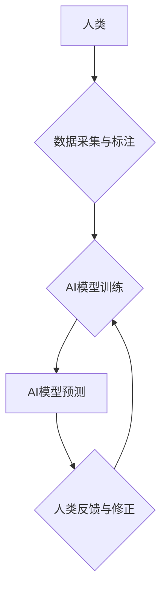

                 

## AI驱动的创新：利用人类计算的力量

> 关键词：人工智能、人类计算、协同智能、算法优化、机器学习、深度学习、应用场景

### 1. 背景介绍

人工智能（AI）正以惊人的速度发展，其影响力已渗透到各个领域，从医疗保健到金融，再到交通运输。然而，传统的AI模型往往依赖于海量数据和强大的计算能力，这在某些情况下可能难以实现。人类计算，即利用人类的智慧和认知能力辅助AI，正成为一种新的趋势，为AI的创新发展提供了新的思路和可能性。

人类计算的优势在于其灵活性和创造性。人类能够理解复杂的上下文、识别模式和做出基于经验的判断，这些能力在某些情况下超越了传统AI模型的处理能力。将人类计算与AI相结合，可以形成一种协同智能，发挥两者各自的优势，从而实现更智能、更有效的解决方案。

### 2. 核心概念与联系

**2.1 人类计算的概念**

人类计算是指利用人类的智慧和认知能力来解决问题、进行决策和进行数据分析。它可以采用多种形式，例如：

* **众包计算:** 利用互联网平台，将任务分发给全球范围内的志愿者或专业人员进行完成。
* **人类-AI协作:** 人类和AI共同完成任务，人类负责提供创意和判断，AI负责处理数据和执行操作。
* **增强现实(AR)和虚拟现实(VR)辅助:** 利用AR和VR技术，将虚拟信息叠加到现实世界中，帮助人类进行更直观的理解和决策。

**2.2 人类计算与AI的联系**

人类计算和AI是互补的，两者可以协同工作，共同推动智能化发展。

* **AI提供数据分析和处理能力:** AI可以快速处理海量数据，识别模式和趋势，为人类提供决策支持。
* **人类提供创造力和判断力:** 人类能够理解复杂的上下文、识别微妙的差异和做出基于经验的判断，弥补AI的不足。

**2.3  协同智能架构**



### 3. 核心算法原理 & 具体操作步骤

**3.1 算法原理概述**

人类计算算法通常基于以下原理：

* **分而治之:** 将复杂问题分解成多个子问题，由不同的参与者进行处理。
* **协同决策:** 多个参与者根据各自的经验和知识，共同做出最终决策。
* **迭代优化:** 通过不断反馈和修正，逐步提高算法的精度和效率。

**3.2 算法步骤详解**

1. **问题分解:** 将复杂问题分解成多个可处理的子问题。
2. **任务分配:** 将子问题分配给不同的参与者，根据他们的技能和经验进行匹配。
3. **数据处理:** 参与者收集、标注和处理数据，为AI模型提供训练数据。
4. **模型训练:** 利用收集到的数据，训练AI模型，使其能够识别模式和做出预测。
5. **结果反馈:** AI模型的预测结果反馈给参与者，参与者进行评估和修正。
6. **迭代优化:** 根据参与者的反馈，对AI模型进行调整和优化，提高算法的精度和效率。

**3.3 算法优缺点**

**优点:**

* **灵活性和创造性:** 人类能够理解复杂的上下文和做出基于经验的判断。
* **数据标注质量:** 人类可以进行更精准的数据标注，提高AI模型的训练效果。
* **解决新问题的能力:** 人类能够解决AI模型无法处理的新问题，推动创新发展。

**缺点:**

* **效率问题:** 人类计算的速度相对较慢，难以处理海量数据。
* **一致性问题:** 人类判断存在主观性，难以保证结果的一致性。
* **成本问题:** 人类计算的成本相对较高，需要投入人力和时间资源。

**3.4 算法应用领域**

* **医疗诊断:** 人类医生和AI模型共同诊断疾病，提高诊断准确率。
* **金融风险评估:** 人类专家和AI模型共同评估金融风险，降低风险损失。
* **法律判决:** 人类法官和AI模型共同分析法律案例，提高判决的公平性和准确性。
* **科学研究:** 人类科学家和AI模型共同进行科学研究，加速科技创新。

### 4. 数学模型和公式 & 详细讲解 & 举例说明

**4.1 数学模型构建**

人类计算可以抽象为一个多智能体系统，每个参与者都是一个独立的智能体，拥有自己的知识和能力。我们可以用图论模型来表示人类计算系统，其中每个节点代表一个参与者，边代表他们之间的交互关系。

**4.2 公式推导过程**

我们可以用概率论和博弈论来描述人类计算系统的行为。例如，我们可以用贝叶斯公式来描述参与者对信息的更新，用纳什均衡来描述参与者之间的合作策略。

**4.3 案例分析与讲解**

假设我们有一个医疗诊断系统，由人类医生和AI模型共同组成。我们可以用贝叶斯公式来描述医生对患者病情诊断的更新：

$$P(D|E) = \frac{P(E|D)P(D)}{P(E)}$$

其中：

* $P(D|E)$ 是医生在观察到证据 $E$ 后，对患者患有疾病 $D$ 的概率。
* $P(E|D)$ 是患者患有疾病 $D$ 的情况下，观察到证据 $E$ 的概率。
* $P(D)$ 是患者患有疾病 $D$ 的先验概率。
* $P(E)$ 是观察到证据 $E$ 的概率。

AI模型可以提供关于患者病情的信息，例如病历、检查结果等，这些信息可以作为证据 $E$。医生可以根据AI模型的预测结果和自己的经验，更新对患者病情诊断的概率。

### 5. 项目实践：代码实例和详细解释说明

**5.1 开发环境搭建**

* Python 3.x
* TensorFlow 或 PyTorch
* Jupyter Notebook

**5.2 源代码详细实现**

```python
# 人类计算模型示例代码

import numpy as np

# 定义一个简单的AI模型
class SimpleAI:
    def __init__(self):
        self.weights = np.random.randn(10)

    def predict(self, data):
        return np.dot(data, self.weights)

# 定义一个人类参与者
class HumanParticipant:
    def __init__(self):
        self.knowledge = {}

    def learn(self, data):
        self.knowledge.update(data)

    def provide_feedback(self, prediction):
        # 人类提供反馈，例如修正预测结果
        return prediction + 1

# 创建AI模型和人类参与者
ai = SimpleAI()
human = HumanParticipant()

# 模拟数据
data = np.random.randn(10)

# 人类参与者学习数据
human.learn(data)

# AI模型进行预测
prediction = ai.predict(data)

# 人类参与者提供反馈
feedback = human.provide_feedback(prediction)

# 打印结果
print("AI模型预测:", prediction)
print("人类反馈:", feedback)
```

**5.3 代码解读与分析**

这段代码展示了一个简单的AI模型和人类参与者的交互过程。AI模型使用随机权重进行预测，人类参与者可以学习数据并提供反馈，修正AI模型的预测结果。

**5.4 运行结果展示**

运行这段代码，会输出AI模型的预测结果和人类反馈的结果。

### 6. 实际应用场景

**6.1 医疗诊断辅助**

将人类医生和AI模型结合起来，可以提高医疗诊断的准确率和效率。AI模型可以分析患者的病历、检查结果等数据，提供初步诊断建议，而医生可以根据AI模型的建议和自己的经验，做出最终诊断。

**6.2 金融风险评估**

AI模型可以分析大量的金融数据，识别潜在的风险因素，为金融机构提供风险评估建议。人类专家可以根据AI模型的分析结果和自身的金融经验，做出更精准的风险评估。

**6.3 科学研究加速**

人类科学家和AI模型可以共同进行科学研究，例如分析实验数据、寻找新的理论模型等。AI模型可以处理海量数据，识别模式和趋势，而人类科学家可以根据AI模型的分析结果，提出新的研究假设和方向。

**6.4 未来应用展望**

随着人工智能技术的不断发展，人类计算将在更多领域得到应用，例如：

* **个性化教育:** 根据学生的学习情况，AI模型和人类老师共同制定个性化学习方案。
* **自动驾驶:** 人类驾驶员和AI模型共同控制车辆，提高自动驾驶的安全性和可靠性。
* **创意设计:** 人类设计师和AI模型共同进行创意设计，例如设计新的产品、服装或建筑。

### 7. 工具和资源推荐

**7.1 学习资源推荐**

* **Coursera:** 人工智能课程
* **edX:** 人工智能课程
* **Udacity:** 人工智能纳米学位

**7.2 开发工具推荐**

* **TensorFlow:** 深度学习框架
* **PyTorch:** 深度学习框架
* **Jupyter Notebook:** 数据分析和可视化工具

**7.3 相关论文推荐**

* **Human-in-the-Loop Machine Learning**
* **Crowdsourcing for Artificial Intelligence**
* **Human-AI Collaboration for Scientific Discovery**

### 8. 总结：未来发展趋势与挑战

**8.1 研究成果总结**

人类计算为AI的创新发展提供了新的思路和可能性，可以有效地弥补AI的不足，提高AI的智能化水平。

**8.2 未来发展趋势**

未来，人类计算将更加智能化、自动化和协同化。例如，将使用更先进的AI算法和交互技术，实现更自然的人类-AI交互。

**8.3 面临的挑战**

* **数据隐私和安全:** 人类计算涉及到大量个人数据，需要确保数据的隐私和安全。
* **算法公平性和可解释性:** 人类计算算法需要保证公平性和可解释性，避免产生偏见和歧视。
* **人类参与者的激励机制:** 需要设计有效的激励机制，鼓励人类参与者积极参与人类计算。

**8.4 研究展望**

未来，我们需要继续研究人类计算的理论基础、算法设计和应用场景，推动人类计算技术的发展，使其更好地服务于人类社会。

### 9. 附录：常见问题与解答

**9.1 如何保证人类计算的准确性？**

可以通过以下方式保证人类计算的准确性：

* **数据标注质量:** 确保数据标注的准确性和一致性。
* **参与者筛选:** 选择具有相关专业知识和经验的参与者。
* **反馈机制:** 建立有效的反馈机制，及时修正错误和偏差。

**9.2 如何激励人类参与者参与人类计算？**

可以通过以下方式激励人类参与者参与人类计算：

* **经济奖励:** 提供合理的经济奖励，例如酬金或积分。
* **社会认可:** 给予参与者社会认可和荣誉称号。
* **知识分享:** 提供参与者学习和提升的机会。


作者：禅与计算机程序设计艺术 / Zen and the Art of Computer Programming 
<end_of_turn>

