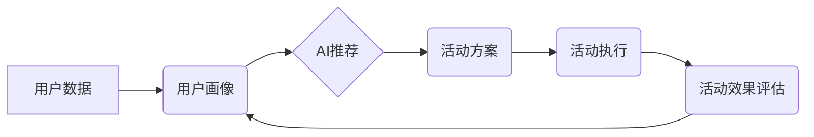

                 

## AI驱动的电商个性化活动设计

> 关键词：电商个性化、AI推荐、活动设计、用户画像、机器学习、深度学习

## 1. 背景介绍

随着电商行业的快速发展，用户对个性化购物体验的需求日益增长。传统的电商活动设计往往采用“一刀切”的方式，无法满足用户多样化的需求，导致活动效果不佳。而人工智能（AI）技术的快速发展为电商个性化活动设计提供了新的机遇。

AI驱动的电商个性化活动设计是指利用人工智能技术，对用户进行精准画像，分析用户行为和偏好，并根据这些信息，设计出个性化的活动方案，以提高用户参与度和转化率。

## 2. 核心概念与联系

### 2.1  用户画像

用户画像是指对用户进行深入分析，构建出用户特征、行为、偏好等多维度的描述。

### 2.2  AI推荐

AI推荐是指利用机器学习算法，根据用户的历史行为、浏览记录、购买记录等数据，预测用户可能感兴趣的商品或活动，并推荐给用户。

### 2.3  活动设计

活动设计是指根据目标用户群体和活动主题，制定活动规则、奖品、推广策略等，以吸引用户参与和提升活动效果。

**核心概念架构**



## 3. 核心算法原理 & 具体操作步骤

### 3.1  算法原理概述

AI驱动的电商个性化活动设计主要依赖于以下核心算法：

* **协同过滤算法:**  根据用户的历史行为数据，预测用户可能感兴趣的商品或活动。
* **内容过滤算法:**  根据商品或活动的特征数据，推荐与用户兴趣相符的内容。
* **深度学习算法:**  利用深度神经网络，对用户数据进行更深入的分析，挖掘用户潜在的兴趣和需求。

### 3.2  算法步骤详解

**协同过滤算法步骤:**

1. 收集用户行为数据，例如用户对商品的评分、购买记录、浏览记录等。
2. 计算用户之间的相似度，例如基于物品相似度、基于用户相似度等。
3. 根据用户相似度，推荐与相似用户喜欢的商品或活动给目标用户。

**内容过滤算法步骤:**

1. 建立商品或活动特征数据库，例如商品类别、价格、品牌、描述等。
2. 分析用户的兴趣偏好，例如用户浏览过的商品类别、购买过的商品品牌等。
3. 根据商品特征和用户兴趣偏好，推荐与用户兴趣相符的商品或活动。

**深度学习算法步骤:**

1. 收集用户行为数据、商品特征数据、文本数据等。
2. 利用深度神经网络，对数据进行训练，学习用户兴趣和需求的潜在模式。
3. 根据训练结果，预测用户可能感兴趣的商品或活动。

### 3.3  算法优缺点

| 算法类型 | 优点 | 缺点 |
|---|---|---|
| 协同过滤算法 | 能够发现用户之间的隐性关联，推荐个性化商品 | 需要大量用户行为数据，容易陷入数据稀疏问题 |
| 内容过滤算法 | 基于商品特征，推荐更精准的商品 | 难以发现用户潜在的兴趣，容易陷入“同质化推荐”问题 |
| 深度学习算法 | 能够学习用户兴趣和需求的复杂模式，推荐更个性化的商品 | 需要大量数据和计算资源，模型训练复杂 |

### 3.4  算法应用领域

* **电商推荐:**  推荐商品、活动、优惠券等。
* **内容推荐:**  推荐文章、视频、音乐等。
* **广告投放:**  精准投放广告，提高广告效果。
* **用户画像:**  构建用户画像，了解用户需求和行为。

## 4. 数学模型和公式 & 详细讲解 & 举例说明

### 4.1  数学模型构建

协同过滤算法的核心是计算用户之间的相似度。常用的相似度度量方法包括余弦相似度、皮尔逊相关系数等。

**余弦相似度:**

$$
\text{相似度} = \frac{\mathbf{u} \cdot \mathbf{v}}{\|\mathbf{u}\| \|\mathbf{v}\|}
$$

其中：

* $\mathbf{u}$ 和 $\mathbf{v}$ 是两个用户的向量表示。
* $\mathbf{u} \cdot \mathbf{v}$ 是两个向量的点积。
* $\|\mathbf{u}\|$ 和 $\|\mathbf{v}\|$ 是两个向量的模长。

**皮尔逊相关系数:**

$$
\text{相似度} = \frac{\sum_{i=1}^{n}(u_i - \bar{u})(v_i - \bar{v})}{\sqrt{\sum_{i=1}^{n}(u_i - \bar{u})^2} \sqrt{\sum_{i=1}^{n}(v_i - \bar{v})^2}}
$$

其中：

* $u_i$ 和 $v_i$ 是两个用户对第 $i$ 个商品的评分。
* $\bar{u}$ 和 $\bar{v}$ 是两个用户的平均评分。

### 4.2  公式推导过程

余弦相似度的推导过程如下：

1. 假设有两个用户 $u$ 和 $v$，他们的向量表示分别为 $\mathbf{u}$ 和 $\mathbf{v}$。
2. 两个向量的点积 $\mathbf{u} \cdot \mathbf{v}$ 表示两个向量在同一方向上的投影长度。
3. 两个向量的模长 $\|\mathbf{u}\|$ 和 $\|\mathbf{v}\|$ 表示两个向量的长度。
4. 将点积除以两个向量的模长乘积，可以得到两个向量在同一方向上的投影长度与长度的比值，即余弦相似度。

### 4.3  案例分析与讲解

假设有两个用户 $A$ 和 $B$，他们对三款商品的评分如下：

| 商品 | 用户 $A$ | 用户 $B$ |
|---|---|---|
| 商品 1 | 5 | 4 |
| 商品 2 | 3 | 5 |
| 商品 3 | 4 | 3 |

我们可以计算用户 $A$ 和 $B$ 的余弦相似度：

1. 将用户评分转换为向量表示：

   * $\mathbf{u}_A = [5, 3, 4]$
   * $\mathbf{u}_B = [4, 5, 3]$

2. 计算两个向量的点积：

   * $\mathbf{u}_A \cdot \mathbf{u}_B = (5 \times 4) + (3 \times 5) + (4 \times 3) = 20 + 15 + 12 = 47$

3. 计算两个向量的模长：

   * $\|\mathbf{u}_A\| = \sqrt{5^2 + 3^2 + 4^2} = \sqrt{50}$
   * $\|\mathbf{u}_B\| = \sqrt{4^2 + 5^2 + 3^2} = \sqrt{50}$

4. 计算余弦相似度：

   * $\text{相似度} = \frac{47}{\sqrt{50} \times \sqrt{50}} = \frac{47}{50} = 0.94$

因此，用户 $A$ 和 $B$ 的余弦相似度为 0.94，说明他们之间的兴趣偏好非常相似。

## 5. 项目实践：代码实例和详细解释说明

### 5.1  开发环境搭建

* Python 3.x
* TensorFlow 或 PyTorch
* Jupyter Notebook

### 5.2  源代码详细实现

```python
# 协同过滤算法示例代码

import numpy as np

# 用户评分数据
ratings = np.array([
    [5, 3, 4],
    [4, 5, 3],
    [3, 4, 5]
])

# 计算用户之间的余弦相似度
def cosine_similarity(u, v):
    return np.dot(u, v) / (np.linalg.norm(u) * np.linalg.norm(v))

# 计算用户之间的相似度矩阵
similarity_matrix = np.zeros((ratings.shape[0], ratings.shape[0]))
for i in range(ratings.shape[0]):
    for j in range(i + 1, ratings.shape[0]):
        similarity_matrix[i, j] = cosine_similarity(ratings[i], ratings[j])
        similarity_matrix[j, i] = similarity_matrix[i, j]

# 打印相似度矩阵
print(similarity_matrix)
```

### 5.3  代码解读与分析

* 该代码首先定义了一个用户评分数据矩阵 `ratings`。
* 然后定义了一个 `cosine_similarity` 函数，用于计算两个用户的余弦相似度。
* 接着，代码计算了用户之间的相似度矩阵 `similarity_matrix`。
* 最后，代码打印了相似度矩阵。

### 5.4  运行结果展示

运行该代码后，会输出一个用户之间的相似度矩阵，其中每个元素表示两个用户之间的相似度。

## 6. 实际应用场景

### 6.1  电商平台活动推荐

* 根据用户的历史购买记录、浏览记录等数据，推荐个性化的活动，例如生日优惠券、节日促销等。
* 根据用户的兴趣偏好，推荐与用户相关的活动，例如美食节、科技展等。

### 6.2  会员权益定制

* 根据用户的消费习惯、购买频率等数据，定制个性化的会员权益，例如积分奖励、专属服务等。
* 根据用户的兴趣爱好，推荐个性化的会员权益，例如电影票、旅游套餐等。

### 6.3  营销活动效果评估

* 利用 AI 算法分析活动参与度、转化率等数据，评估活动效果，并优化活动策略。
* 根据用户反馈数据，分析用户对活动的需求和偏好，改进活动设计。

### 6.4  未来应用展望

* **更精准的个性化推荐:**  利用更先进的 AI 算法，例如深度学习算法，对用户数据进行更深入的分析，实现更精准的个性化推荐。
* **更丰富的活动形式:**  利用 AI 技术，设计更丰富的活动形式，例如虚拟现实活动、增强现实活动等。
* **更智能的活动运营:**  利用 AI 技术，实现活动运营的自动化和智能化，例如自动生成活动文案、自动推送活动通知等。

## 7. 工具和资源推荐

### 7.1  学习资源推荐

* **书籍:**
    * 《深度学习》
    * 《机器学习实战》
* **在线课程:**
    * Coursera
    * edX
    * Udacity

### 7.2  开发工具推荐

* **Python:**  Python 是机器学习和深度学习的常用编程语言。
* **TensorFlow:**  TensorFlow 是 Google 开发的开源机器学习框架。
* **PyTorch:**  PyTorch 是 Facebook 开发的开源机器学习框架。

### 7.3  相关论文推荐

* **Collaborative Filtering for Recommender Systems**
* **Deep Learning for Recommender Systems**

## 8. 总结：未来发展趋势与挑战

### 8.1  研究成果总结

AI驱动的电商个性化活动设计取得了显著成果，例如：

* **提高了活动参与度和转化率:**  个性化活动能够更好地满足用户的需求，从而提高用户参与度和转化率。
* **提升了用户体验:**  个性化活动能够为用户提供更精准、更丰富的购物体验。
* **降低了活动运营成本:**  AI 技术可以自动化和智能化活动运营，降低活动运营成本。

### 8.2  未来发展趋势

* **更精准的个性化推荐:**  利用更先进的 AI 算法，例如强化学习算法，实现更精准的个性化推荐。
* **更丰富的活动形式:**  利用 AI 技术，设计更丰富的活动形式，例如沉浸式体验活动、互动式游戏活动等。
* **更智能的活动运营:**  利用 AI 技术，实现活动运营的自动化和智能化，例如自动生成活动文案、自动推送活动通知、自动分析活动效果等。

### 8.3  面临的挑战

* **数据隐私保护:**  AI 驱动的电商个性化活动设计需要大量用户数据，如何保护用户数据隐私是一个重要的挑战。
* **算法公平性:**  AI 算法可能会存在偏见，导致个性化推荐不公平。如何保证算法公平性是一个需要解决的问题。
* **用户信任:**  用户需要信任 AI 算法的推荐结果，如何建立用户信任是一个重要的挑战。

### 8.4  研究展望

未来，AI 驱动的电商个性化活动设计将朝着更精准、更智能、更公平的方向发展。研究者需要继续探索新的 AI 算法，解决算法公平性问题，并建立用户信任机制，推动 AI 技术在电商领域的应用。

## 9. 附录：常见问题与解答

**Q1: AI 驱动的电商个性化活动设计需要哪些数据？**

**A1:** AI 驱动的电商个性化活动设计需要以下数据：

* 用户行为数据：例如用户浏览记录、购买记录、评价记录等。
* 用户画像数据：例如用户年龄、性别、职业、兴趣爱好等。
* 商品特征数据：例如商品类别、价格、品牌、描述等。

**Q2: 如何保证 AI 算法的公平性？**

**A2:** 

* 使用公平性评估指标，例如公平性偏差、公平性差距等，评估算法的公平性。
* 使用公平性调整技术，例如加权平均、阈值调整等，调整算法参数，提高算法的公平性。
* 构建多元化的数据集合，减少算法偏见。

**Q3: 如何建立用户信任？**

**A3:** 

* 透明化算法决策过程，让用户了解算法是如何推荐商品的。
* 提供用户反馈机制，让用户对算法推荐进行评价和反馈。
* 保护用户数据隐私，确保用户数据安全。


作者：禅与计算机程序设计艺术 / Zen and the Art of Computer Programming<end_of_turn>

