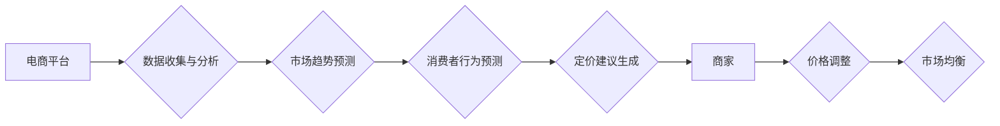

                 

## AI驱动的电商动态定价策略：多方博弈与市场均衡分析

> 关键词：电商动态定价、多方博弈、市场均衡、人工智能、机器学习、优化算法

## 1. 背景介绍

在当今激烈的电商市场竞争中，价格一直是商家吸引顾客和提升销量的重要因素。传统的定价策略往往依赖于经验和市场调研，缺乏灵活性，难以应对瞬息万变的市场需求。随着人工智能（AI）技术的快速发展，AI驱动的电商动态定价策略逐渐成为行业新趋势。

AI驱动的动态定价策略利用机器学习算法分析海量数据，包括商品信息、市场趋势、用户行为等，实时调整商品价格，以实现最大化利润的目标。这种策略能够根据市场变化、竞争对手动作、用户偏好等因素进行精准调整，提高定价效率和准确性，为电商企业带来显著的经济效益。

## 2. 核心概念与联系

### 2.1 多方博弈

多方博弈是经济学中研究多个理性主体相互竞争、合作或博弈的理论框架。在电商动态定价场景中，多方博弈主要涉及以下主体：

* **电商平台：** 作为平台方，需要平衡平台的利益和商家利益，制定合理的定价规则和机制。
* **商家：** 商家是商品的提供者，其目标是最大化利润，通过调整商品价格、促销活动等方式竞争市场份额。
* **消费者：** 消费者是商品的购买者，其目标是获得最优惠的价格和最佳的商品体验。

这些主体之间存在着复杂的相互依赖关系，他们的行为决策会相互影响，最终形成市场均衡。

### 2.2 市场均衡

市场均衡是指在特定条件下，所有参与主体都无法通过单方面改变行为来提高自身利益的状态。在电商动态定价场景中，市场均衡是指所有商家和消费者都无法通过调整价格或购买量来获得更高的收益或更低的成本的状态。

### 2.3 AI驱动的动态定价

AI驱动的动态定价策略利用机器学习算法分析多方博弈中的数据，预测市场趋势和消费者行为，为商家提供最优的定价建议。

**Mermaid 流程图**



## 3. 核心算法原理 & 具体操作步骤

### 3.1 算法原理概述

AI驱动的电商动态定价策略通常采用以下核心算法：

* **回归算法：** 用于预测商品价格与相关因素之间的关系，例如商品属性、市场需求、竞争对手价格等。
* **分类算法：** 用于分类商品，根据商品类型、属性等特征，制定不同的定价策略。
* **强化学习算法：** 用于训练智能代理，通过与环境交互，学习最优的定价策略。

### 3.2 算法步骤详解

1. **数据收集与预处理：** 收集电商平台、市场、用户等多源数据，进行清洗、转换、特征工程等预处理工作。
2. **模型训练：** 选择合适的机器学习算法，训练模型，并根据训练结果评估模型性能。
3. **预测与决策：** 利用训练好的模型，预测商品价格、市场趋势、消费者行为等，并根据预测结果生成定价建议。
4. **价格调整与监控：** 商家根据定价建议，调整商品价格，并持续监控市场变化和用户反馈，及时更新定价策略。

### 3.3 算法优缺点

**优点：**

* **数据驱动：** 基于海量数据分析，提高定价准确性和效率。
* **实时调整：** 能够根据市场变化和用户行为实时调整价格，提高竞争力。
* **个性化定价：** 可以根据用户画像和行为特征，制定个性化的定价策略。

**缺点：**

* **数据依赖：** 算法性能依赖于数据质量和数量，数据不足或质量差会导致模型精度下降。
* **黑盒问题：** 一些机器学习算法难以解释其决策过程，导致定价策略难以被理解和信任。
* **伦理风险：** 动态定价策略可能导致价格歧视或其他伦理问题，需要谨慎设计和应用。

### 3.4 算法应用领域

AI驱动的动态定价策略广泛应用于以下领域：

* **电商平台：** 淘宝、京东、亚马逊等电商平台利用AI算法进行商品定价，提高平台竞争力和用户体验。
* **酒店预订：** 酒店利用AI算法根据市场需求、季节性、竞争对手价格等因素，动态调整房间价格。
* **航空公司：** 航空公司利用AI算法根据航班需求、油价、竞争对手票价等因素，动态调整机票价格。
* **金融服务：** 金融机构利用AI算法根据风险评估、市场波动、用户行为等因素，动态调整贷款利率、保险费率等。

## 4. 数学模型和公式 & 详细讲解 & 举例说明

### 4.1 数学模型构建

在电商动态定价场景中，我们可以构建一个多方博弈模型，用数学公式描述各方参与者的行为决策和市场均衡。

假设存在n个商家，每个商家都销售一种商品，其价格由 $p_i$ 表示，其中 $i = 1, 2, ..., n$。每个商家的利润函数由其销售量和价格决定，可以表示为：

$$
\pi_i(p_1, p_2, ..., p_n) = f_i(p_1, p_2, ..., p_n) \cdot (p_i - c_i)
$$

其中，$f_i(p_1, p_2, ..., p_n)$ 是商家 $i$ 的销售量函数，$c_i$ 是商品的生产成本。

### 4.2 公式推导过程

为了找到市场均衡，我们需要找到一个价格组合 $(p_1, p_2, ..., p_n)$，使得每个商家在该价格组合下都无法通过单方面改变价格来提高自身利润。

我们可以使用纳什均衡的概念来描述市场均衡。纳什均衡是指在所有参与者都采取最优策略的情况下，没有参与者能够通过改变其策略来获得更高的收益。

在多方博弈模型中，纳什均衡可以通过求解以下方程组来找到：

$$
\frac{\partial \pi_i(p_1, p_2, ..., p_n)}{\partial p_i} = 0, \quad i = 1, 2, ..., n
$$

### 4.3 案例分析与讲解

假设有两个商家，分别销售相同类型的商品，其利润函数如下：

* 商家 1： $\pi_1(p_1, p_2) = 100 - 2p_1 + 0.5p_2$
* 商家 2： $\pi_2(p_1, p_2) = 100 - 2p_2 + 0.5p_1$

我们可以通过求解上述方程组，找到纳什均衡的价格组合。

通过计算，我们可以得到纳什均衡的价格为 $p_1 = p_2 = 33.33$。这意味着，在该价格下，两个商家都无法通过单方面改变价格来提高自身利润。

## 5. 项目实践：代码实例和详细解释说明

### 5.1 开发环境搭建

为了实现AI驱动的电商动态定价策略，我们可以使用以下开发环境：

* **编程语言：** Python
* **机器学习库：** scikit-learn, TensorFlow, PyTorch
* **数据处理库：** Pandas, NumPy
* **云计算平台：** AWS, Azure, GCP

### 5.2 源代码详细实现

以下是一个简单的Python代码示例，演示了如何使用线性回归算法进行商品价格预测：

```python
import pandas as pd
from sklearn.linear_model import LinearRegression

# 加载数据
data = pd.read_csv('ecommerce_data.csv')

# 选择特征和目标变量
features = ['product_category', 'brand', 'product_description', 'competitor_price']
target = 'price'

# 训练模型
model = LinearRegression()
model.fit(data[features], data[target])

# 预测价格
new_data = pd.DataFrame({
    'product_category': ['电子产品'],
    'brand': ['苹果'],
    'product_description': ['iPhone 14'],
    'competitor_price': [8000]
})
predicted_price = model.predict(new_data)

# 打印预测结果
print(f'预测价格: {predicted_price[0]}')
```

### 5.3 代码解读与分析

这段代码首先加载了电商数据，然后选择了一些特征和目标变量。接着，使用线性回归算法训练了一个模型，并使用该模型预测了新商品的价格。

### 5.4 运行结果展示

运行该代码后，会输出预测的价格值。

## 6. 实际应用场景

AI驱动的电商动态定价策略在实际应用场景中展现出强大的潜力。

### 6.1 案例分析

例如，一家电商平台可以利用AI算法分析用户购买历史、浏览记录、购物车内容等数据，预测用户对不同商品的购买意愿，并根据预测结果动态调整商品价格，提高转化率和销售额。

### 6.2 未来应用展望

未来，AI驱动的电商动态定价策略将会更加智能化、个性化和精准化。

## 7. 工具和资源推荐

### 7.1 学习资源推荐

* **书籍：**
    * 《机器学习》 - 周志华
    * 《深度学习》 - Ian Goodfellow, Yoshua Bengio, Aaron Courville
* **在线课程：**
    * Coursera: Machine Learning
    * edX: Artificial Intelligence

### 7.2 开发工具推荐

* **Python:** 
    * scikit-learn
    * TensorFlow
    * PyTorch
* **云计算平台:**
    * AWS
    * Azure
    * GCP

### 7.3 相关论文推荐

* **Multi-Agent Reinforcement Learning for Dynamic Pricing in E-Commerce**
* **Deep Learning for Dynamic Pricing: A Survey**

## 8. 总结：未来发展趋势与挑战

### 8.1 研究成果总结

AI驱动的电商动态定价策略已经取得了显著的成果，为电商企业带来了更高的利润和更优的用户体验。

### 8.2 未来发展趋势

未来，AI驱动的电商动态定价策略将会朝着以下方向发展：

* **更精准的预测：** 利用更先进的机器学习算法和更丰富的用户数据，提高价格预测的准确性。
* **更个性化的定价：** 根据用户的购买历史、浏览记录、偏好等信息，制定更个性化的定价策略。
* **更智能的决策：** 利用强化学习算法，训练智能代理，自动进行价格调整和市场分析。

### 8.3 面临的挑战

AI驱动的电商动态定价策略也面临着一些挑战：

* **数据安全和隐私保护：** 

AI算法需要大量用户数据进行训练，如何保证数据安全和用户隐私是需要认真考虑的问题。
* **算法解释性和可信度：** 一些机器学习算法难以解释其决策过程，这可能会导致定价策略难以被理解和信任。
* **公平性和伦理问题：** 动态定价策略可能会导致价格歧视或其他伦理问题，需要制定相应的规范和机制。

### 8.4 研究展望

未来，我们需要继续加强对AI驱动的电商动态定价策略的研究，解决上述挑战，推动其健康发展。

## 9. 附录：常见问题与解答

### 9.1  常见问题

* **AI驱动的电商动态定价策略是否会损害消费者利益？**

AI驱动的电商动态定价策略可以提高商品的性价比，为消费者提供更优惠的价格，但同时也需要关注价格歧视等问题，确保公平竞争。

* **如何保证AI驱动的电商动态定价策略的安全性？**

需要采取相应的技术措施和管理制度，保障数据安全和算法安全，防止恶意攻击和数据泄露。

* **如何提高AI驱动的电商动态定价策略的准确性？**

需要不断收集和完善数据，改进算法模型，并结合专家经验进行调优。

### 9.2  解答

AI驱动的电商动态定价策略是一个复杂的系统，需要多方面的研究和探索，才能更好地服务于消费者和企业。

作者：禅与计算机程序设计艺术 / Zen and the Art of Computer Programming


<end_of_turn>

