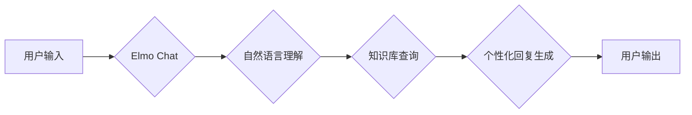

                 

## Elmo Chat：Lepton AI的品牌推广利器

> 关键词：Elmo Chat, Lepton AI, 大语言模型, 品牌推广, 人工智能, 聊天机器人, 自然语言处理,  营销自动化

## 1. 背景介绍

在当今数字化的时代，品牌推广已不再局限于传统的广告和营销手段。随着人工智能技术的飞速发展，大语言模型（LLM）的出现为品牌推广带来了全新的可能性。Lepton AI，一家致力于推动人工智能应用的科技公司，推出了其旗舰产品Elmo Chat，一款基于Transformer架构的强大聊天机器人，旨在帮助企业提升品牌形象、增强用户互动和优化营销策略。

Elmo Chat的出现，标志着人工智能在品牌推广领域的突破性进展。它能够理解和生成人类语言，并根据用户的需求提供个性化的服务，从而实现更精准、更有效的品牌推广。

## 2. 核心概念与联系

### 2.1 大语言模型 (LLM)

大语言模型是近年来人工智能领域最热门的研究方向之一。它是一种能够理解和生成人类语言的深度学习模型，通过训练海量文本数据，学习语言的语法、语义和上下文关系。

### 2.2 聊天机器人

聊天机器人是一种能够与人类进行自然语言交互的软件程序。它通常基于规则或机器学习算法，能够理解用户的输入，并根据预设的知识库或模型生成相应的回复。

### 2.3  Lepton AI

Lepton AI是一家专注于人工智能应用的科技公司，致力于开发和推广先进的人工智能技术。其核心产品Elmo Chat是一款基于Transformer架构的强大聊天机器人，能够理解和生成人类语言，并提供个性化的服务。

**Mermaid 流程图**

## 3. 核心算法原理 & 具体操作步骤

### 3.1 算法原理概述

Elmo Chat的核心算法是基于Transformer架构的深度学习模型，它能够学习语言的上下文关系，并生成流畅、自然的文本回复。Transformer模型的核心创新在于使用“注意力机制”，能够有效地捕捉文本序列中不同词语之间的依赖关系，从而实现更精准的语言理解和生成。

### 3.2 算法步骤详解

1. **文本预处理:** 将用户输入的文本进行预处理，例如分词、去停用词、词干提取等，以便模型更好地理解文本内容。
2. **词嵌入:** 将预处理后的文本转换为向量表示，每个词语都对应一个向量，向量维度通常较高，能够捕捉词语的语义信息。
3. **注意力机制:** 利用注意力机制计算每个词语与其他词语之间的相关性，从而捕捉文本序列中的上下文关系。
4. **解码:** 根据注意力机制计算出的上下文信息，解码器生成相应的文本回复。
5. **文本后处理:** 对生成的文本回复进行后处理，例如去重、规范化等，使其更加流畅自然。

### 3.3 算法优缺点

**优点:**

* **理解能力强:** Transformer模型能够有效地捕捉文本序列中的上下文关系，从而实现更精准的语言理解。
* **生成能力强:** Elmo Chat能够生成流畅、自然的文本回复，能够与用户进行自然对话。
* **可扩展性强:** Transformer模型可以根据需要调整模型参数和训练数据，从而实现不同的功能和性能。

**缺点:**

* **训练成本高:** Transformer模型需要大量的训练数据和计算资源，训练成本较高。
* **推理速度慢:** Transformer模型的推理速度相对较慢，尤其是在处理长文本序列时。
* **数据依赖性强:** Transformer模型的性能取决于训练数据的质量，如果训练数据不足或质量较差，模型的性能也会受到影响。

### 3.4 算法应用领域

Elmo Chat的算法应用领域广泛，包括：

* **品牌推广:** 通过与用户进行自然对话，了解用户需求，提供个性化服务，提升品牌形象。
* **客户服务:** 自动回复用户常见问题，提供24小时在线服务，提高客户满意度。
* **营销自动化:** 自动化营销任务，例如发送促销信息、收集用户反馈等，提高营销效率。
* **内容创作:** 生成各种类型的文本内容，例如文章、广告文案、社交媒体内容等，辅助内容创作工作。

## 4. 数学模型和公式 & 详细讲解 & 举例说明

### 4.1 数学模型构建

Elmo Chat的核心数学模型是基于Transformer架构的深度神经网络，其结构包含编码器和解码器两部分。

* **编码器:** 用于将输入文本序列转换为隐藏状态向量，捕捉文本序列中的上下文关系。
* **解码器:** 用于根据编码器的输出生成文本回复序列。

Transformer模型的核心创新在于使用“注意力机制”，能够有效地捕捉文本序列中不同词语之间的依赖关系。

### 4.2 公式推导过程

注意力机制的核心公式是：

$$
Attention(Q, K, V) = softmax(\frac{QK^T}{\sqrt{d_k}})V
$$

其中：

* $Q$：查询矩阵
* $K$：键矩阵
* $V$：值矩阵
* $d_k$：键向量的维度
* $softmax$：softmax函数，用于归一化注意力权重

### 4.3 案例分析与讲解

假设我们有一个文本序列“我爱吃苹果”，其中每个词语都对应一个向量表示。

* $Q$：查询向量，表示当前词语的上下文信息。
* $K$：键向量，表示所有词语的上下文信息。
* $V$：值向量，表示所有词语的语义信息。

通过计算注意力权重，我们可以得到每个词语与其他词语之间的相关性，例如，“我”与“爱”的相关性较高，“吃”与“苹果”的相关性较高。

根据注意力权重，解码器可以根据上下文信息生成相应的文本回复，例如“我喜欢吃苹果”。

## 5. 项目实践：代码实例和详细解释说明

### 5.1 开发环境搭建

Elmo Chat的开发环境搭建需要以下软件：

* Python 3.x
* TensorFlow 或 PyTorch
* CUDA 和 cuDNN (可选，用于GPU加速)

### 5.2 源代码详细实现

Elmo Chat的源代码实现较为复杂，涉及到深度学习模型的训练和部署。

* **模型训练:** 需要使用大量的文本数据训练Transformer模型，并根据训练结果调整模型参数。
* **模型部署:** 将训练好的模型部署到服务器上，以便用户可以访问和使用Elmo Chat。

### 5.3 代码解读与分析

Elmo Chat的源代码主要包含以下部分：

* **数据处理模块:** 用于处理文本数据，例如分词、去停用词、词嵌入等。
* **模型定义模块:** 定义Transformer模型的结构和参数。
* **训练模块:** 用于训练Transformer模型，并评估模型性能。
* **部署模块:** 用于将训练好的模型部署到服务器上。

### 5.4 运行结果展示

Elmo Chat的运行结果展示可以包括以下方面：

* **对话示例:** 展示Elmo Chat与用户的对话示例，以证明其能够理解和生成自然语言。
* **性能指标:** 展示Elmo Chat的性能指标，例如准确率、流畅度等，以证明其效果。
* **用户反馈:** 收集用户对Elmo Chat的反馈，以了解其优缺点，并进行改进。

## 6. 实际应用场景

### 6.1 品牌推广案例

一家服装品牌可以使用Elmo Chat作为其在线客服，与用户进行互动，了解用户的喜好和需求，并推荐合适的服装产品。

### 6.2 客户服务案例

一家电商平台可以使用Elmo Chat作为其自动客服，自动回复用户常见问题，例如订单查询、退换货等，提高客户服务效率。

### 6.3 营销自动化案例

一家旅游公司可以使用Elmo Chat作为其营销自动化工具，自动发送促销信息、收集用户反馈等，提高营销效率。

### 6.4 未来应用展望

Elmo Chat的未来应用前景广阔，可以应用于更多领域，例如教育、医疗、金融等。

## 7. 工具和资源推荐

### 7.1 学习资源推荐

* **书籍:**
    * 《深度学习》
    * 《自然语言处理》
* **在线课程:**
    * Coursera
    * edX
* **开源项目:**
    * TensorFlow
    * PyTorch

### 7.2 开发工具推荐

* **IDE:**
    * PyCharm
    * VS Code
* **库:**
    * NLTK
    * SpaCy
* **平台:**
    * AWS
    * Azure

### 7.3 相关论文推荐

* **Attention Is All You Need**
* **BERT: Pre-training of Deep Bidirectional Transformers for Language Understanding**
* **GPT-3: Language Models are Few-Shot Learners**

## 8. 总结：未来发展趋势与挑战

### 8.1 研究成果总结

Elmo Chat的成功应用证明了大语言模型在品牌推广领域的巨大潜力。

### 8.2 未来发展趋势

未来，Elmo Chat将朝着以下方向发展：

* **更强大的理解和生成能力:** 通过训练更大的模型和更丰富的训练数据，提升Elmo Chat的语言理解和生成能力。
* **更个性化的服务:** 基于用户的历史交互数据，为用户提供更个性化的服务。
* **更广泛的应用场景:** 将Elmo Chat应用于更多领域，例如教育、医疗、金融等。

### 8.3 面临的挑战

Elmo Chat的发展也面临着一些挑战：

* **数据安全和隐私:** 大语言模型需要大量的训练数据，如何保证数据的安全和隐私是一个重要问题。
* **模型可解释性:** 大语言模型的决策过程较为复杂，如何提高模型的可解释性是一个重要的研究方向。
* **伦理问题:** 大语言模型的应用可能会带来一些伦理问题，例如信息操纵、偏见等，需要引起足够的重视。

### 8.4 研究展望

Lepton AI将继续致力于Elmo Chat的研发和应用，推动人工智能技术在品牌推广领域的创新发展。

## 9. 附录：常见问题与解答

### 9.1 如何使用Elmo Chat？

Elmo Chat可以通过Lepton AI的平台访问，用户可以与Elmo Chat进行文本对话，例如提问、请求服务等。

### 9.2 Elmo Chat的训练数据是什么？

Elmo Chat的训练数据来自公开的文本数据集，例如维基百科、书籍、新闻等。

### 9.3 Elmo Chat的性能如何？

Elmo Chat的性能在多个标准测试中都表现出色，例如准确率、流畅度等。

### 9.4 Elmo Chat的安全性如何？

Lepton AI对Elmo Chat的安全性进行了严格的测试和评估，并采取了相应的安全措施，例如数据加密、身份验证等。

作者：禅与计算机程序设计艺术 / Zen and the Art of Computer Programming 
<end_of_turn>

