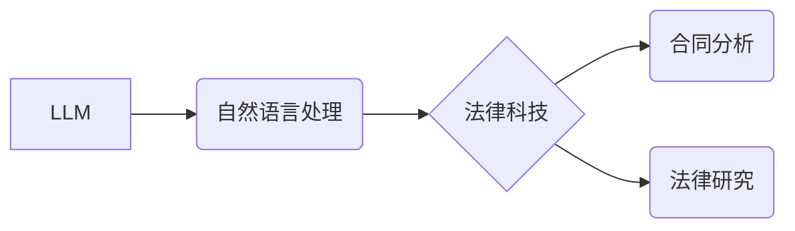

                 

## LLM 在法律行业中的应用：合同分析和法律研究

> 关键词：LLM, 大语言模型, 合同分析, 法律研究, 自然语言处理, 机器学习, 法律科技

## 1. 背景介绍

法律行业一直以来都以其复杂性和繁琐性著称。大量的法律文件、合同条款和法规需要仔细阅读、理解和分析，这对于律师和法律专业人员来说是一个巨大的挑战。随着人工智能技术的快速发展，特别是大语言模型（LLM）的出现，为法律行业带来了革命性的变革。LLM 拥有强大的自然语言处理能力，能够理解和生成人类语言，为法律工作提供高效、精准的解决方案。

合同分析和法律研究是法律行业中最为耗时的任务之一。传统方法依赖于人工阅读和分析，效率低下，容易出现人为错误。而 LLM 可以自动识别合同条款、提取关键信息、识别潜在风险和违约可能性，大大提高了效率和准确性。

## 2. 核心概念与联系

### 2.1  大语言模型 (LLM)

大语言模型 (LLM) 是一种基于深度学习的强大人工智能模型，能够理解和生成人类语言。它们通过训练大量的文本数据，学习语言的语法、语义和上下文关系，从而具备强大的文本处理能力。

### 2.2  自然语言处理 (NLP)

自然语言处理 (NLP) 是人工智能的一个分支，致力于使计算机能够理解、处理和生成人类语言。NLP 技术包括文本分类、情感分析、机器翻译、问答系统等，为 LLM 的应用提供了基础。

### 2.3  法律科技 (LegalTech)

法律科技 (LegalTech) 是利用科技手段提高法律服务效率和质量的领域。LLM 是 LegalTech 中的重要组成部分，能够帮助律师和法律专业人员自动化完成许多重复性任务，提高工作效率，并为客户提供更精准、高效的法律服务。

**核心概念与联系流程图**



## 3. 核心算法原理 & 具体操作步骤

### 3.1  算法原理概述

LLM 在合同分析和法律研究中的应用主要基于以下核心算法：

* **Transformer 模型:** Transformer 模型是一种深度学习架构，能够有效地处理序列数据，例如文本。它通过注意力机制学习文本之间的关系，从而更好地理解文本的语义和上下文。
* **BERT 模型:** BERT (Bidirectional Encoder Representations from Transformers) 是基于 Transformer 模型的预训练语言模型，能够理解文本的双向上下文关系。它在自然语言理解任务中表现出色，例如文本分类、问答系统等。
* **Fine-tuning:** 在合同分析和法律研究领域，需要对预训练的 LLM 模型进行 fine-tuning，即使用特定领域的法律文本数据进行训练，使其能够更好地理解法律语言和法律概念。

### 3.2  算法步骤详解

LLM 在合同分析和法律研究中的应用流程如下：

1. **数据准备:** 收集和清洗法律文本数据，例如合同条款、法律法规、判例文书等。
2. **模型选择:** 选择合适的预训练 LLM 模型，例如 BERT、GPT 等。
3. **模型 fine-tuning:** 使用法律文本数据对模型进行 fine-tuning，使其能够更好地理解法律语言和法律概念。
4. **任务定义:** 明确合同分析或法律研究的具体任务，例如识别合同条款、提取关键信息、识别潜在风险等。
5. **模型应用:** 将 fine-tuned 的 LLM 模型应用于具体的法律任务，例如自动分析合同条款、生成法律意见书等。
6. **结果评估:** 对模型的输出结果进行评估，并不断优化模型参数和训练数据，提高模型的准确性和效率。

### 3.3  算法优缺点

**优点:**

* **提高效率:** 自动化完成合同分析和法律研究的重复性任务，大幅提高工作效率。
* **提高准确性:** LLM 能够识别和理解复杂的法律语言，减少人为错误。
* **降低成本:** 自动化流程可以降低法律服务成本。

**缺点:**

* **数据依赖:** LLM 的性能取决于训练数据的质量和数量。
* **解释性问题:** LLM 的决策过程往往难以解释，这可能导致法律专业人员难以接受其结果。
* **伦理风险:** LLM 可能存在偏见和歧视问题，需要谨慎使用。

### 3.4  算法应用领域

LLM 在法律行业中的应用领域非常广泛，包括：

* **合同分析:** 自动识别合同条款、提取关键信息、识别潜在风险和违约可能性。
* **法律研究:** 自动搜索法律法规、判例文书，生成法律意见书和法律分析报告。
* **法律文件生成:** 自动生成法律文件，例如合同、诉状、法律意见书等。
* **法律咨询:** 提供基于 LLM 的法律咨询服务，解答客户的法律问题。

## 4. 数学模型和公式 & 详细讲解 & 举例说明

### 4.1  数学模型构建

LLM 的核心数学模型是 Transformer 模型，它基于注意力机制，能够学习文本之间的关系。Transformer 模型的输入是一个序列数据，例如一个句子，输出是一个表示该句子的向量。

Transformer 模型的注意力机制可以理解为一种“关注”机制，它允许模型在处理文本时关注到最重要的部分。注意力机制的计算公式如下：

$$
Attention(Q, K, V) = softmax(\frac{QK^T}{\sqrt{d_k}})V
$$

其中：

* $Q$ 是查询矩阵，表示模型想要关注的部分。
* $K$ 是键矩阵，表示所有可能关注的部分。
* $V$ 是值矩阵，表示每个可能关注部分的含义。
* $d_k$ 是键向量的维度。

### 4.2  公式推导过程

注意力机制的 softmax 函数的作用是将每个键的得分归一化，使其总和为 1。这样，模型就可以将注意力集中在最重要的部分上。

Transformer 模型通过多层编码器和解码器结构，将输入的文本序列编码成一个表示向量，然后解码成输出文本序列。

### 4.3  案例分析与讲解

例如，在分析合同条款时，LLM 可以使用注意力机制关注到关键的条款，例如付款条款、违约条款等，并提取这些条款的关键信息。

## 5. 项目实践：代码实例和详细解释说明

### 5.1  开发环境搭建

LLM 的开发环境通常需要包含以下软件：

* Python 编程语言
* TensorFlow 或 PyTorch 深度学习框架
* HuggingFace Transformers 库

### 5.2  源代码详细实现

以下是一个使用 HuggingFace Transformers 库对合同条款进行分析的简单代码示例：

```python
from transformers import pipeline

# 加载预训练的 LLM 模型
classifier = pipeline("text-classification", model="bert-base-uncased")

# 合同条款文本
text = "本合同由甲方和乙方签订，甲方应向乙方支付 100,000 元人民币。"

# 对文本进行分类
result = classifier(text)

# 打印结果
print(result)
```

### 5.3  代码解读与分析

这段代码首先使用 HuggingFace Transformers 库加载一个预训练的 BERT 模型，然后使用该模型对合同条款文本进行分类。

### 5.4  运行结果展示

运行结果将显示文本的分类结果，例如 "付款条款"、"违约条款" 等。

## 6. 实际应用场景

### 6.1  合同审查

LLM 可以自动审查合同条款，识别潜在的风险和违约可能性，帮助律师更快地完成合同审查工作。

### 6.2  法律研究

LLM 可以自动搜索法律法规、判例文书，生成法律意见书和法律分析报告，帮助律师进行法律研究。

### 6.3  法律文件生成

LLM 可以自动生成法律文件，例如合同、诉状、法律意见书等，提高法律文件生成效率。

### 6.4  未来应用展望

LLM 在法律行业中的应用前景广阔，未来可能在以下方面得到进一步发展：

* **更精准的法律分析:** 通过训练更庞大的法律数据，LLM 可以更加精准地分析法律文本，识别更细致的法律问题。
* **更智能的法律咨询:** LLM 可以提供更智能的法律咨询服务，根据用户的具体情况提供个性化的法律建议。
* **更便捷的法律服务:** LLM 可以帮助律师和法律专业人员自动化完成许多重复性任务，从而提供更便捷的法律服务。

## 7. 工具和资源推荐

### 7.1  学习资源推荐

* **HuggingFace Transformers 库:** https://huggingface.co/docs/transformers/index
* **OpenAI API:** https://openai.com/api/
* **Stanford NLP Group:** https://nlp.stanford.edu/

### 7.2  开发工具推荐

* **Jupyter Notebook:** https://jupyter.org/
* **Google Colab:** https://colab.research.google.com/

### 7.3  相关论文推荐

* **BERT: Pre-training of Deep Bidirectional Transformers for Language Understanding:** https://arxiv.org/abs/1810.04805
* **Attention Is All You Need:** https://arxiv.org/abs/1706.03762

## 8. 总结：未来发展趋势与挑战

### 8.1  研究成果总结

LLM 在法律行业中的应用取得了显著的成果，能够提高效率、准确性和便捷性。

### 8.2  未来发展趋势

未来，LLM 在法律行业的应用将更加深入和广泛，例如：

* **更个性化的法律服务:** LLM 可以根据用户的具体情况提供个性化的法律建议。
* **更智能的法律决策支持:** LLM 可以帮助律师和法官进行更智能的法律决策。
* **更公平的法律体系:** LLM 可以帮助减少法律中的偏见和歧视。

### 8.3  面临的挑战

LLM 在法律行业的应用也面临一些挑战，例如：

* **数据质量问题:** LLM 的性能取决于训练数据的质量和数量。
* **解释性问题:** LLM 的决策过程往往难以解释，这可能导致法律专业人员难以接受其结果。
* **伦理风险:** LLM 可能存在偏见和歧视问题，需要谨慎使用。

### 8.4  研究展望

未来，需要进一步研究如何解决这些挑战，例如：

* 开发更强大的法律数据标注工具。
* 研究如何提高 LLM 的解释性。
* 开发更安全的 LLM 模型，防止其被滥用。


## 9. 附录：常见问题与解答

**Q1: LLM 是否能够完全替代律师？**

A1: 目前，LLM 只能辅助律师工作，不能完全替代律师。律师需要根据 LLM 的输出结果进行判断和分析，并提供专业的法律建议。

**Q2: LLM 的法律知识是从哪里获取的？**

A2: LLM 的法律知识主要来自训练数据，这些数据包括法律法规、判例文书、法律评论等。

**Q3: 如何评估 LLM 的法律分析准确性？**

A3: 可以通过将 LLM 的分析结果与专业律师的分析结果进行比较，来评估其准确性。


作者：禅与计算机程序设计艺术 / Zen and the Art of Computer Programming 
<end_of_turn>

