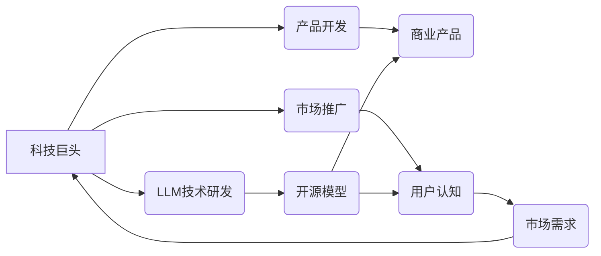

                 

## LLM 市场竞争：创新与合作

> 关键词：大型语言模型 (LLM)、市场竞争、创新、合作、人工智能、深度学习、自然语言处理

### 1. 背景介绍

大型语言模型 (LLM) 近年来发展迅速，其强大的文本生成、理解和翻译能力在各个领域展现出巨大潜力。从 ChatGPT 的爆火到 Google 的 LaMDA，LLM 正在改变我们与信息交互的方式，并催生出一场前所未有的技术革命。然而，随着 LLM 技术的成熟，市场竞争也日益激烈。

本篇文章将深入探讨 LLM 市场竞争的现状，分析其背后的核心概念、算法原理、数学模型以及实际应用场景。同时，我们将展望未来发展趋势，并探讨 LLM 创新与合作的机遇与挑战。

### 2. 核心概念与联系

**2.1  LLM 的定义**

大型语言模型 (LLM) 是一种基于深度学习的统计模型，能够理解和生成人类语言。它们通常由数十亿甚至数万亿个参数组成，通过训练海量文本数据，学习语言的语法、语义和上下文关系。

**2.2  LLM 的核心技术**

* **Transformer 架构:** Transformer 架构是 LLM 的关键技术之一，它通过注意力机制有效地捕捉文本序列中的长距离依赖关系，显著提升了 LLM 的性能。

* **深度学习:** LLM 的训练基于深度学习算法，例如反向传播算法，通过不断调整模型参数，使模型能够更好地预测下一个词。

* **预训练与微调:** LLM 通常采用预训练与微调的策略。首先，在大量文本数据上进行预训练，学习通用语言知识；然后，在特定任务数据上进行微调，使其能够胜任特定任务。

**2.3  LLM 的应用场景**

LLM 的应用场景广泛，包括：

* **自然语言理解:** 文本分类、情感分析、问答系统等。
* **自然语言生成:** 文本摘要、机器翻译、对话系统等。
* **代码生成:** 代码补全、代码翻译、代码生成等。
* **创意写作:**  诗歌创作、故事生成、剧本写作等。

**2.4  LLM 市场竞争格局**

LLM 市场竞争激烈，主要参与者包括：

* **科技巨头:** 谷歌、微软、亚马逊、Meta 等。
* **初创公司:** OpenAI、DeepMind、Hugging Face 等。
* **研究机构:**  斯坦福大学、麻省理工学院、清华大学等。

这些参与者在技术研发、产品开发、市场推广等方面展开竞争，推动 LLM 技术的快速发展。

**2.5  LLM 市场竞争关系图**

### 3. 核心算法原理 & 具体操作步骤

**3.1  算法原理概述**

LLM 的核心算法是基于 Transformer 架构的深度学习模型。Transformer 架构通过注意力机制有效地捕捉文本序列中的长距离依赖关系，显著提升了 LLM 的性能。

**3.2  算法步骤详解**

1. **输入编码:** 将输入文本序列转换为数字向量表示。
2. **多头注意力机制:** 利用多头注意力机制，捕捉文本序列中不同词之间的关系。
3. **前馈神经网络:** 对每个词的表示进行进一步处理，提取更深层次的语义信息。
4. **输出解码:** 将编码后的文本表示转换为输出文本序列。

**3.3  算法优缺点**

* **优点:** 能够捕捉长距离依赖关系，性能优异。
* **缺点:** 计算量大，训练成本高。

**3.4  算法应用领域**

LLM 算法广泛应用于自然语言理解、自然语言生成、机器翻译等领域。

### 4. 数学模型和公式 & 详细讲解 & 举例说明

**4.1  数学模型构建**

LLM 的数学模型通常基于概率论和统计学，其目标是学习一个概率分布，能够生成符合语义和语法规则的文本序列。

**4.2  公式推导过程**

LLM 的训练过程基于最大似然估计，其目标函数是：

$$
\mathcal{L} = -\sum_{i=1}^{N} \log p(x_i | x_{<i})
$$

其中：

* $\mathcal{L}$ 是目标函数。
* $N$ 是文本序列的长度。
* $x_i$ 是文本序列中的第 $i$ 个词。
* $x_{<i}$ 是文本序列中第 $i$ 个词之前的词。
* $p(x_i | x_{<i})$ 是给定前 $i-1$ 个词，预测第 $i$ 个词的概率。

**4.3  案例分析与讲解**

假设我们有一个文本序列 "The cat sat on the mat"，其目标是预测最后一个词 "mat" 的概率。

根据最大似然估计，我们需要找到一个模型参数，能够最大化预测 "mat" 的概率。

通过训练数据，模型学习到 "cat" 经常出现在 "sat" 之后，而 "sat" 经常出现在 "on" 之后，因此模型会预测 "mat" 的概率较高。

### 5. 项目实践：代码实例和详细解释说明

**5.1  开发环境搭建**

LLM 的开发环境通常需要安装 Python、深度学习框架 (例如 TensorFlow 或 PyTorch) 以及必要的库。

**5.2  源代码详细实现**

LLM 的源代码实现通常比较复杂，涉及大量的数学公式和编程技巧。

**5.3  代码解读与分析**

代码解读需要对 Transformer 架构、注意力机制、深度学习算法等知识有深入理解。

**5.4  运行结果展示**

LLM 的运行结果通常是文本序列，需要评估其生成质量、准确率和流畅度等指标。

### 6. 实际应用场景

**6.1  聊天机器人**

LLM 可以用于构建更智能、更自然的聊天机器人，能够理解用户意图并提供更精准的回复。

**6.2  文本摘要**

LLM 可以自动生成文本摘要，提取文本的关键信息，节省用户阅读时间。

**6.3  机器翻译**

LLM 可以实现更准确、更流畅的机器翻译，突破语言障碍，促进跨文化交流。

**6.4  未来应用展望**

LLM 的应用场景还在不断扩展，未来将应用于更多领域，例如教育、医疗、法律等。

### 7. 工具和资源推荐

**7.1  学习资源推荐**

* **书籍:** 《深度学习》、《自然语言处理》
* **在线课程:** Coursera、edX、Udacity 等平台提供深度学习和自然语言处理课程。
* **博客和论坛:**  Hugging Face、Towards Data Science 等平台提供大量 LLM 相关的博客文章和讨论。

**7.2  开发工具推荐**

* **深度学习框架:** TensorFlow、PyTorch
* **文本处理库:** NLTK、spaCy
* **云计算平台:** AWS、Google Cloud、Azure

**7.3  相关论文推荐**

* **Attention Is All You Need:**  https://arxiv.org/abs/1706.03762
* **BERT: Pre-training of Deep Bidirectional Transformers for Language Understanding:** https://arxiv.org/abs/1810.04805

### 8. 总结：未来发展趋势与挑战

**8.1  研究成果总结**

近年来，LLM 技术取得了显著进展，模型规模不断扩大，性能不断提升。

**8.2  未来发展趋势**

* **模型规模化:** 模型规模将继续扩大，带来更强大的性能。
* **多模态学习:** LLM 将与其他模态数据 (例如图像、音频) 相结合，实现更全面的理解和生成。
* **可解释性增强:** 研究将更加注重 LLM 的可解释性，使其决策过程更加透明。

**8.3  面临的挑战**

* **数据安全和隐私:** LLM 的训练需要大量数据，如何保证数据安全和隐私是一个重要挑战。
* **算法偏见:** LLM 可能会继承训练数据中的偏见，导致不公平的结果。
* **伦理问题:** LLM 的应用可能会带来伦理问题，例如虚假信息生成、深度伪造等。

**8.4  研究展望**

未来研究将集中在解决上述挑战，推动 LLM 技术的健康发展，使其更好地服务于人类社会。

### 9. 附录：常见问题与解答

**9.1  LLM 的训练需要多长时间？**

LLM 的训练时间取决于模型规模、训练数据量和硬件资源等因素，通常需要数天甚至数周。

**9.2  LLM 的应用场景有哪些？**

LLM 的应用场景广泛，包括自然语言理解、自然语言生成、机器翻译、代码生成等。

**9.3  如何评估 LLM 的性能？**

LLM 的性能通常通过准确率、流畅度、多样性等指标进行评估。

作者：禅与计算机程序设计艺术 / Zen and the Art of Computer Programming 
<end_of_turn>

