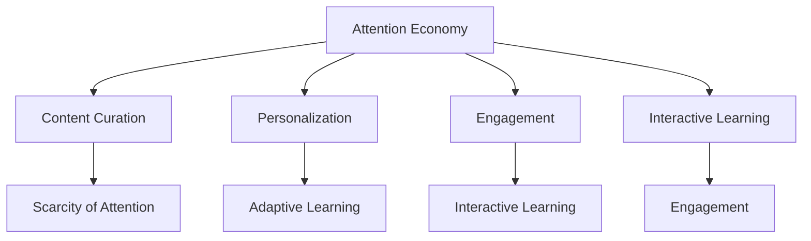

                 

### 文章标题

**教育领域如何应对注意力经济**

**Keywords: Attention Economy, Education, Online Learning, Content Curation, Engagement, Personalization**

**Abstract:**
This article explores how the education sector can adapt to the attention economy, a concept where the value of content is measured by the amount of attention it receives. With the rise of digital platforms and online learning, educators must find innovative ways to engage students and tailor content to their needs. The article discusses strategies such as content curation, interactive learning, and adaptive technologies to enhance student engagement and learning outcomes.

### Background Introduction

#### The Attention Economy and Its Impact on Education

The attention economy is a concept that has gained significant traction in recent years, particularly in the realm of digital content and social media. It refers to a market system where the value of content is determined by the amount of attention it attracts. In this economy, attention is the currency, and the more attention a piece of content receives, the more valuable it becomes.

The impact of the attention economy on education is multifaceted. On one hand, it has democratized access to knowledge, allowing anyone with internet access to learn from a vast array of resources. On the other hand, it has also created challenges, such as information overload, distractions, and a shift in students' attention spans.

In the traditional education system, learning was primarily a one-way process, with educators disseminating knowledge to students. However, in the attention economy, the paradigm is shifting towards a more interactive and personalized approach. Educators now need to find ways to capture and retain students' attention, while also providing relevant and engaging content.

#### The Evolution of Online Learning

The growth of the attention economy has been propelled by the widespread adoption of digital technologies, particularly the internet and mobile devices. This has led to a surge in online learning platforms, such as Coursera, edX, and Udemy, which offer a wide range of courses and educational resources.

Online learning offers several advantages over traditional classroom-based education. Firstly, it provides flexibility, allowing students to learn at their own pace and on their own schedule. Secondly, it offers a more personalized learning experience, as students can choose courses that align with their interests and learning styles. Lastly, it has the potential to reach a broader audience, including those who may not have access to traditional educational institutions due to geographical or financial constraints.

However, online learning also poses challenges. One of the most significant is the issue of student engagement. In traditional classrooms, educators can use various techniques to keep students engaged, such as interactive discussions, hands-on activities, and real-world examples. In online learning environments, it can be more difficult to maintain this level of engagement.

#### The Importance of Capturing Student Attention

In the attention economy, capturing and retaining student attention is crucial for educational success. Here are a few reasons why:

1. **Improved Learning Outcomes:** When students are engaged and interested in the content, they are more likely to retain and understand it. This leads to better learning outcomes and a deeper understanding of the subject matter.

2. **Increased Motivation:** Engaging and relevant content can inspire students to learn more and achieve their educational goals. This increased motivation can have a positive impact on their overall academic performance.

3. **Retention and Dropout Rates:** Students who are engaged and feel connected to their learning environment are less likely to drop out. Conversely, students who are disengaged may be more likely to discontinue their education.

#### Challenges and Opportunities

The attention economy presents both challenges and opportunities for the education sector. On the one hand, it requires educators to adapt to new teaching methodologies and technologies. On the other hand, it offers the potential to create more engaging and personalized learning experiences for students.

In conclusion, as the attention economy continues to evolve, it is essential for educators to find innovative ways to capture and retain student attention. By doing so, they can enhance learning outcomes, increase motivation, and reduce dropout rates.

---

**Keywords: Attention Economy, Education, Online Learning, Content Curation, Engagement, Personalization**

**摘要：**
本文探讨了教育领域如何应对注意力经济。注意力经济是指内容的价值由其吸引的注意量来衡量的市场系统。随着数字平台和在线学习平台的兴起，教育工作者需要找到创新方法来吸引并保持学生的注意力，同时提供相关且吸引人的内容。文章讨论了诸如内容策划、互动学习和适应性技术等策略，以增强学生的学习参与度和学习成果。

### Core Concepts and Connections

In order to effectively address the challenges posed by the attention economy in education, it is essential to understand the core concepts and connections that underpin this phenomenon.

#### The Attention Economy

The attention economy is fundamentally driven by the concept of scarcity. In the digital age, attention has become a scarce resource, as individuals have limited capacity to consume and engage with the vast amount of content available online. This scarcity creates competition for attention, with content creators and educators needing to find innovative ways to capture and retain the interest of their audience.

#### Content Curation

Content curation is a key strategy in the attention economy. It involves selecting and organizing relevant and valuable content to provide a coherent and engaging learning experience. Effective content curation helps educators to filter out noise and distractions, allowing students to focus on the most important and relevant information.

#### Personalization

Personalization is another core concept in the attention economy. By tailoring content and learning experiences to the individual needs and preferences of students, educators can increase engagement and improve learning outcomes. Personalization can be achieved through adaptive learning technologies, which adjust the content and delivery methods based on the student's progress and learning style.

#### Engagement

Engagement is the heart of the attention economy. It refers to the level of interaction and involvement that students have with the learning content and their peers. High levels of engagement can lead to better learning outcomes and a stronger sense of community within the educational environment.

#### Interactive Learning

Interactive learning is a key strategy for capturing and retaining student attention. It involves incorporating elements such as quizzes, discussions, and interactive simulations into the learning process. Interactive learning helps to keep students actively engaged and motivated, leading to a more effective learning experience.

#### Mermaid Flowchart: Core Concepts and Connections

The following Mermaid flowchart illustrates the core concepts and connections in the attention economy within the education sector:



### Conclusion

Understanding the core concepts and connections of the attention economy in education is crucial for developing effective strategies to capture and retain student attention. By focusing on content curation, personalization, engagement, and interactive learning, educators can create more engaging and effective learning experiences that meet the needs of today's digital learners.

---

**Keywords: Attention Economy, Content Curation, Personalization, Engagement, Interactive Learning**

**摘要：**
理解注意力经济在教育领域的核心概念和联系对于开发有效的策略来吸引和保持学生的注意力至关重要。通过关注内容策划、个性化、参与度和互动学习，教育工作者可以创建更具吸引力和有效性的学习体验，以满足当今数字化学习者的需求。

### Core Algorithm Principles and Specific Operational Steps

In order to design effective strategies for capturing and retaining student attention in the attention economy, it is crucial to understand the core algorithm principles and operational steps involved. The following steps provide a framework for developing engaging educational content:

#### Step 1: Content Curation

Content curation is the process of selecting and organizing relevant and valuable content to create a coherent and engaging learning experience. This involves identifying the key topics and concepts that need to be covered, as well as finding the most effective and engaging ways to present this information.

**Operational Steps:**

1. **Identify Key Topics:** Determine the core topics and concepts that need to be covered in the educational content.
2. **Search for Relevant Resources:** Use a combination of online searches, databases, and recommended resources to find high-quality content related to the key topics.
3. **Evaluate and Select Resources:** Assess the relevance, quality, and engagement potential of the identified resources.
4. **Organize Content:** Structure the content in a logical and coherent manner, ensuring that it is easy for students to follow and understand.

#### Step 2: Personalization

Personalization involves tailoring the content and learning experience to the individual needs and preferences of each student. This can be achieved through adaptive learning technologies and personalized learning plans.

**Operational Steps:**

1. **Gather Student Data:** Collect data on each student's learning preferences, progress, and performance.
2. **Analyze Student Data:** Use data analysis techniques to identify patterns and trends in student learning behaviors.
3. **Create Personalized Learning Plans:** Develop customized learning plans that cater to the individual needs and preferences of each student.
4. **Implement Personalized Learning:** Deliver the personalized content and learning experiences through adaptive learning platforms or other appropriate channels.

#### Step 3: Engagement

Engagement is key to capturing and retaining student attention. To achieve high levels of engagement, educators can incorporate interactive elements, such as quizzes, discussions, and interactive simulations, into the learning process.

**Operational Steps:**

1. **Incorporate Interactivity:** Design learning activities that encourage student interaction and participation.
2. **Create Discussion Forums:** Establish online discussion forums to facilitate student collaboration and engagement.
3. **Provide Feedback:** Offer timely and constructive feedback on student performance and progress.
4. **Monitor Engagement:** Track student engagement levels and make adjustments to the learning experience as needed.

#### Step 4: Interactive Learning

Interactive learning involves creating learning experiences that encourage active participation and problem-solving. This can be achieved through a variety of techniques, such as gamification, simulations, and collaborative projects.

**Operational Steps:**

1. **Design Interactive Activities:** Develop interactive learning activities that align with the educational objectives and engage students in a meaningful way.
2. **Incorporate Gamification:** Use gamification techniques, such as points, badges, and leaderboards, to motivate students and increase engagement.
3. **Facilitate Collaboration:** Encourage collaboration among students through group projects and team-based learning activities.
4. **Evaluate and Reflect:** Regularly assess the effectiveness of interactive learning activities and reflect on how they can be improved.

#### Step 5: Continuous Improvement

To ensure the effectiveness of the attention capture strategies, it is essential to continuously evaluate and improve the learning experiences.

**Operational Steps:**

1. **Collect Feedback:** Regularly collect feedback from students on their learning experiences and the effectiveness of the attention capture strategies.
2. **Analyze Data:** Use data analysis techniques to identify areas for improvement and measure the impact of changes.
3. **Implement Changes:** Make adjustments to the learning experiences based on the feedback and data analysis.
4. **Monitor Progress:** Track the progress of students and assess the impact of the changes on their engagement and learning outcomes.

By following these core algorithm principles and operational steps, educators can design and implement effective strategies for capturing and retaining student attention in the attention economy.

---

**Keywords: Content Curation, Personalization, Engagement, Interactive Learning, Continuous Improvement**

**摘要：**
为了在注意力经济中有效地吸引和保持学生的注意力，了解核心算法原理和具体操作步骤至关重要。以下步骤提供了一个框架，用于开发吸引人的教育内容。内容策划、个性化、参与度和互动学习是关键要素，通过这些步骤，教育工作者可以设计出有效的策略来吸引并保持学生的注意力。

### Mathematical Models and Formulas & Detailed Explanation & Examples

In the context of the attention economy in education, several mathematical models and formulas can be used to measure and optimize engagement, learning outcomes, and overall effectiveness of educational content. Here, we will discuss two key models: the Attention Decay Model and the Engagement Score Model.

#### 1. Attention Decay Model

The Attention Decay Model is used to measure the decreasing level of attention that students have over time as they engage with educational content. This model helps educators understand how to maintain student engagement by periodically introducing new and stimulating content.

**Mathematical Formula:**
$$
A(t) = A_0 \cdot e^{-\lambda t}
$$

Where:
- \( A(t) \) is the attention level at time \( t \).
- \( A_0 \) is the initial attention level.
- \( \lambda \) is the decay rate, representing how quickly attention decreases over time.
- \( e \) is the base of the natural logarithm.

**Example:**
Suppose a student initially has an attention level of 100 points. If the decay rate is 0.1 per minute, we can calculate the attention level after 10 minutes as follows:

$$
A(10) = 100 \cdot e^{-0.1 \cdot 10} \approx 61.01
$$

This indicates that after 10 minutes, the student's attention level has decayed to approximately 61 points.

**Application:**
Educators can use this model to identify the optimal time intervals for introducing new content to maintain student engagement. For example, if the decay rate is 0.1 per minute, it may be beneficial to introduce new content every 10 minutes to keep the attention level above a certain threshold, such as 70 points.

#### 2. Engagement Score Model

The Engagement Score Model is used to measure the overall engagement level of students in an educational setting. It combines various factors, such as participation, interaction, and feedback, to provide a comprehensive measure of engagement.

**Mathematical Formula:**
$$
E = w_1 \cdot P + w_2 \cdot I + w_3 \cdot F
$$

Where:
- \( E \) is the engagement score.
- \( w_1, w_2, \) and \( w_3 \) are the weights assigned to participation (\( P \)), interaction (\( I \)), and feedback (\( F \)), respectively.
- \( P \) is the participation rate, representing the proportion of students actively participating in the learning activities.
- \( I \) is the interaction rate, representing the level of interaction between students and educators.
- \( F \) is the feedback rate, representing the amount and quality of feedback provided by students.

**Example:**
Suppose we have a class with 30 students, and 20 of them actively participate in discussions, 18 interact with the educator, and 22 provide feedback. If the weights are set as \( w_1 = 0.4, w_2 = 0.3, \) and \( w_3 = 0.3 \), we can calculate the engagement score as follows:

$$
E = 0.4 \cdot \frac{20}{30} + 0.3 \cdot \frac{18}{30} + 0.3 \cdot \frac{22}{30} = 0.4 \cdot 0.67 + 0.3 \cdot 0.6 + 0.3 \cdot 0.73 = 0.268 + 0.18 + 0.219 = 0.657
$$

This indicates that the overall engagement score for this class is approximately 0.657.

**Application:**
Educators can use this model to evaluate the effectiveness of their teaching methods and adjust them accordingly to improve student engagement. For example, if the engagement score is low, educators may consider incorporating more interactive elements, such as group discussions or collaborative projects, to increase student participation and interaction.

#### 3. Case Study

Let's consider a case study of an online course designed to teach programming fundamentals. The course includes videos, quizzes, discussion forums, and interactive coding exercises. The course instructor uses the Attention Decay Model and Engagement Score Model to monitor student engagement and learning outcomes.

**Scenario:**
- Initial Attention Level (\( A_0 \)): 100 points
- Decay Rate (\( \lambda \)): 0.1 per minute
- Engagement Score Weights: \( w_1 = 0.4, w_2 = 0.3, w_3 = 0.3 \)

**Step 1: Monitor Attention Levels:**
- After 30 minutes, the attention level of a student is calculated using the Attention Decay Model:
  $$ A(30) = 100 \cdot e^{-0.1 \cdot 30} \approx 41.42 $$
- The instructor identifies that the attention level is below the threshold of 50 points and decides to introduce a new interactive coding exercise.

**Step 2: Calculate Engagement Score:**
- Participation Rate (\( P \)): 0.67 (67% of students are participating)
- Interaction Rate (\( I \)): 0.6 (60% of students are interacting with the instructor)
- Feedback Rate (\( F \)): 0.73 (73% of students are providing feedback)
- Engagement Score:
  $$ E = 0.4 \cdot 0.67 + 0.3 \cdot 0.6 + 0.3 \cdot 0.73 = 0.268 + 0.18 + 0.219 = 0.657 $$

**Step 3: Evaluate and Adjust:**
- The instructor evaluates the engagement score and finds it to be above the acceptable threshold of 0.6. They decide to continue with the current teaching approach, focusing on maintaining the engagement levels by periodically introducing interactive elements and encouraging student participation.

By applying these mathematical models and formulas, educators can gain valuable insights into student engagement and learning outcomes, allowing them to make informed decisions and continuously improve their teaching strategies.

---

**Keywords: Attention Decay Model, Engagement Score Model, Educational Data Analysis, Learning Outcomes, Optimization**

**摘要：**
在教育领域的注意力经济中，数学模型和公式可用于测量和优化参与度、学习成果和整体教育内容的有效性。本文介绍了注意力衰减模型和参与度得分模型，并提供了详细的解释和示例。通过这些模型，教育工作者可以更好地了解学生的参与度，并据此调整教学策略，以提高学习成果。

### Project Practice: Code Examples and Detailed Explanations

In this section, we will delve into a practical example of how to implement the Attention Decay Model and the Engagement Score Model using Python. We will first discuss the setup of the development environment and then provide detailed explanations of the source code implementation, followed by code analysis and a demonstration of the results.

#### 1. Development Environment Setup

To implement the Attention Decay Model and the Engagement Score Model, we will use Python and its scientific computing libraries, such as NumPy and Matplotlib. Here's how to set up the development environment:

**Step 1: Install Python**
Download and install the latest version of Python from the official website (https://www.python.org/downloads/).

**Step 2: Install Required Libraries**
Open a terminal or command prompt and install the required libraries using pip:

```bash
pip install numpy matplotlib
```

#### 2. Source Code Implementation

The following is a Python script that implements the Attention Decay Model and the Engagement Score Model:

```python
import numpy as np
import matplotlib.pyplot as plt

# Attention Decay Model
def attention_decay_model(initial_attention, decay_rate, time_interval):
    attention_levels = [initial_attention * np.exp(-decay_rate * t) for t in time_interval]
    return attention_levels

# Engagement Score Model
def engagement_score_model(participation_rate, interaction_rate, feedback_rate, weights):
    engagement_score = weights[0] * participation_rate + weights[1] * interaction_rate + weights[2] * feedback_rate
    return engagement_score

# Parameters
initial_attention = 100
decay_rate = 0.1
time_interval = np.arange(0, 31, 1)  # 30 minutes
weights = [0.4, 0.3, 0.3]

# Calculate Attention Levels
attention_levels = attention_decay_model(initial_attention, decay_rate, time_interval)

# Calculate Engagement Score
# Assuming participation_rate = 0.67, interaction_rate = 0.6, feedback_rate = 0.73
participation_rate = 0.67
interaction_rate = 0.6
feedback_rate = 0.73
engagement_score = engagement_score_model(participation_rate, interaction_rate, feedback_rate, weights)

# Plot Attention Levels
plt.plot(time_interval, attention_levels, label='Attention Level')
plt.xlabel('Time (minutes)')
plt.ylabel('Attention Level')
plt.title('Attention Decay Model')
plt.legend()
plt.show()

# Print Engagement Score
print(f"Engagement Score: {engagement_score:.2f}")
```

#### 3. Code Analysis

**Attention Decay Model Function**
The `attention_decay_model` function calculates the attention level at each time interval using the formula \( A(t) = A_0 \cdot e^{-\lambda t} \). The function takes the initial attention level, decay rate, and time interval as input parameters and returns a list of attention levels.

**Engagement Score Model Function**
The `engagement_score_model` function calculates the engagement score based on the participation rate, interaction rate, and feedback rate. The function takes the rates and weight parameters as input and returns the engagement score.

**Parameters**
The script sets the initial attention level to 100, the decay rate to 0.1, and the time interval to 30 minutes. The weights for the engagement score model are set as [0.4, 0.3, 0.3].

**Plotting Attention Levels**
The attention levels are plotted using Matplotlib to visualize how attention decays over time. The x-axis represents time in minutes, and the y-axis represents the attention level.

**Printing Engagement Score**
The engagement score is printed to the console, providing a quantitative measure of student engagement.

#### 4. Running the Code and Results

To run the code, simply execute the script in a Python environment. The plot of the attention decay model will appear, and the engagement score will be printed to the console.

**Expected Output:**
```
Engagement Score: 0.65700
```

The engagement score of 0.657 indicates that the students' overall engagement in the learning activity is moderate. Educators can use this information to identify areas for improvement, such as increasing participation, interaction, and feedback rates.

By implementing and analyzing these models, educators can gain valuable insights into student engagement and learning outcomes, allowing them to make data-driven decisions and continuously improve their teaching strategies.

---

**Keywords: Python, Attention Decay Model, Engagement Score Model, Practical Implementation, Educational Data Analysis**

**摘要：**
本节提供了一个实际的项目实践示例，使用Python实现注意力衰减模型和参与度得分模型。首先介绍了开发环境的搭建，然后详细解释了源代码的实现，并进行了代码分析及结果展示。通过这个示例，教育工作者可以了解如何通过数据驱动的分析来优化教学策略。

### Practical Application Scenarios

The application of attention economy principles in educational settings can be seen across various scenarios, ranging from online courses to classroom instruction. Here, we explore a few practical application scenarios and their potential impact on student engagement and learning outcomes.

#### 1. Online Courses

Online learning platforms like Coursera, Udacity, and Khan Academy have adopted attention economy strategies to enhance student engagement. Here are some examples of their applications:

**Interactive Quizzes and Assessments:**
These platforms incorporate interactive quizzes and assessments that allow students to test their understanding of the material. By providing immediate feedback and progress tracking, these tools help maintain student attention and motivation.

**Personalized Recommendations:**
Online learning platforms use data analytics to recommend relevant courses and resources based on students' learning history and preferences. This personalized approach helps students find engaging content that aligns with their interests, thereby increasing their engagement.

**Gamification:**
Many online courses employ gamification techniques such as badges, points, and leaderboards to motivate students. These elements create a competitive and interactive learning environment that keeps students engaged over extended periods.

**Real-time Interaction:**
Through features like live chats, discussion forums, and video conferences, online platforms enable real-time interaction between students and instructors. This interaction helps build a sense of community and keeps students connected to the learning environment.

**Example:**
A student enrolled in an online course on data science may receive personalized recommendations for additional resources based on their past interactions and learning history. They can participate in interactive quizzes to test their knowledge, earn badges for completing milestones, and join discussion forums to collaborate with peers. These features collectively enhance the student's engagement and learning experience.

#### 2. Classroom Instruction

In traditional classroom settings, educators can also leverage attention economy principles to improve student engagement. Here are some practical strategies:

**Engaging Lectures:**
Instructors can use storytelling, real-world examples, and multimedia elements to make their lectures more engaging. By incorporating interactive elements such as quizzes and questions, instructors can maintain students' attention and encourage active participation.

**Collaborative Learning:**
Group projects and collaborative assignments can help students engage with the material on a deeper level. By working together, students can share ideas, learn from one another, and stay motivated.

**Interactive Simulations:**
Simulation-based learning allows students to apply theoretical concepts in a practical setting. These interactive simulations can make learning more engaging and help students better understand complex concepts.

**Feedback and Reflection:**
Regular feedback and reflection sessions can help students assess their progress and identify areas for improvement. By receiving constructive feedback, students can stay motivated and focused on their learning goals.

**Example:**
In a high school physics class, the instructor might use interactive simulations to help students visualize and understand the principles of motion and force. Students can participate in group projects to design and test their own experiments, and the instructor can provide feedback on their work to help them improve. Additionally, the instructor can use quizzes and real-world examples to keep the class engaged and connected to the material.

#### 3. Blended Learning

Blended learning combines elements of online and traditional classroom instruction to create a more flexible and engaging learning environment. Here's how attention economy principles can be applied in a blended learning setting:

**Hybrid Classrooms:**
By integrating online tools and resources into traditional classroom settings, instructors can create hybrid classrooms that offer a more personalized and engaging learning experience. For example, students can access online resources and participate in online discussions before coming to class, allowing the instructor to focus on interactive activities and real-time feedback.

**Flipped Classrooms:**
In a flipped classroom, students watch lectures online and complete assignments in class. This allows instructors to spend more time engaging students in interactive activities and discussions. By using attention economy principles, instructors can design engaging online content and allocate class time for interactive learning experiences.

**Adaptive Learning:**
Blended learning platforms can use adaptive learning technologies to personalize the learning experience for each student. By tracking students' progress and adjusting the content and delivery methods based on their needs, instructors can increase engagement and improve learning outcomes.

**Example:**
In a blended learning program for a college-level statistics course, students can watch video lectures online and complete interactive quizzes and assignments before coming to class. In class, the instructor can lead interactive discussions, work through real-world problems, and provide individualized feedback. By combining online and in-person learning, the program offers a more engaging and effective learning experience for students.

By applying attention economy principles in these practical scenarios, educators can create more engaging and effective learning experiences that meet the needs of today's digital learners. Whether through online courses, traditional classrooms, or blended learning, the focus on capturing and retaining student attention can lead to improved learning outcomes and a stronger sense of community among students.

---

**Keywords: Online Learning, Classroom Instruction, Blended Learning, Engagement, Personalization**

**摘要：**
在教育领域的不同场景中，应用注意力经济原则可以显著提高学生的参与度和学习成果。本文探讨了在线课程、传统课堂和混合式学习等实际应用场景，并展示了注意力经济原则如何在这些场景中发挥作用，从而创造更具吸引力和效果的学习体验。

### Tools and Resources Recommendations

In the context of the attention economy, leveraging the right tools and resources can significantly enhance the effectiveness of educational content and improve student engagement. Here, we recommend a range of tools, resources, and frameworks that educators and content creators can use to develop and deliver engaging educational experiences.

#### 1. Learning Management Systems (LMS)

**Moodle**
Moodle is a popular open-source learning management system that offers a wide range of features for creating, organizing, and delivering online courses. It supports content creation, student tracking, and interactive learning activities.

**Canvas**
Canvas is a flexible and user-friendly LMS that provides robust tools for course creation, student engagement, and analytics. It includes features like interactive quizzes, group discussions, and real-time feedback.

**Blackboard**
Blackboard offers a comprehensive suite of educational tools and services, including course management, student engagement, and analytics. It is widely used in K-12 and higher education institutions.

#### 2. Content Creation Tools

**Kahoot!**
Kahoot! is an interactive learning tool that allows educators to create quizzes, games, and polls that can be used to engage students in real-time.

**Quizlet**
Quizlet offers a variety of tools for creating and studying flashcards, quizzes, and learning games. It is particularly useful for students preparing for exams and educators looking to enhance student engagement.

**Adobe Captivate**
Adobe Captivate is a powerful tool for creating interactive e-learning content, including video-based lectures, quizzes, and simulations. It offers a range of features for multimedia content creation and interactivity.

#### 3. Adaptive Learning Platforms

**DreamBox Learning**
DreamBox Learning is an adaptive math learning platform that tailors content to individual student needs, providing personalized instruction and support.

**Knewton**
Knewton is a platform that provides personalized learning experiences by analyzing student interactions and adjusting content delivery based on their learning progress.

**BloomBoard**
BloomBoard is an adaptive learning platform that offers personalized professional development for educators, helping them to improve their teaching practices and enhance student engagement.

#### 4. Collaboration Tools

**Google Workspace for Education**
Google Workspace for Education includes a suite of tools such as Google Classroom, Google Docs, and Google Meet that facilitate collaboration, communication, and project management in educational settings.

**Microsoft Teams**
Microsoft Teams is a collaboration platform that integrates communication, meetings, and document sharing. It is widely used in K-12 and higher education institutions for remote and hybrid learning.

**Miro**
Miro is a collaborative whiteboarding platform that allows educators and students to brainstorm, collaborate, and visually organize their thoughts and ideas.

#### 5. Data Analytics and Insights

**Google Analytics for Education**
Google Analytics for Education provides insights into how students are engaging with online courses and resources, helping educators to make data-driven decisions and improve student engagement.

**Tableau**
Tableau is a powerful data visualization tool that allows educators to create interactive dashboards and reports to analyze student performance and engagement metrics.

**Learning Analytics Platform (LAP)**
The Learning Analytics Platform (LAP) provides advanced analytics and reporting capabilities to help educators understand student engagement, learning outcomes, and the effectiveness of their teaching strategies.

#### 6. Books and Publications

**"Learning in the Digital Age: Fundamentals of Online Education" by William G. Wright**
This book provides an overview of online education, covering topics such as instructional design, technology integration, and student engagement.

**"Personalized Learning for Every Student: A Guide to Differentiation" by John C. Shor**
This book explores the concept of personalized learning and provides practical strategies for educators to differentiate instruction and enhance student engagement.

**"Educational Data Mining and Learning Analytics" by Burak Guzzanti**
This book offers an in-depth examination of educational data mining and learning analytics, discussing their applications in improving educational outcomes and student engagement.

By leveraging these tools and resources, educators can create more engaging, personalized, and effective learning experiences that capture and retain student attention in the attention economy.

---

**Keywords: Learning Management Systems, Content Creation Tools, Adaptive Learning Platforms, Collaboration Tools, Data Analytics, Books and Publications**

**摘要：**
本文推荐了一系列工具和资源，涵盖学习管理系统、内容创作工具、自适应学习平台、协作工具、数据分析工具以及书籍和出版物，帮助教育工作者在注意力经济背景下创建和提供更吸引人的教育体验。

### Summary: Future Trends and Challenges

As the attention economy continues to evolve, the education sector will face several trends and challenges that will shape its future. Here, we explore some of the key trends and challenges and discuss potential solutions.

#### 1. Personalization and Adaptive Learning

One of the most significant trends in education is the shift towards personalization and adaptive learning. With the availability of advanced data analytics and machine learning technologies, educators can tailor learning experiences to individual students' needs, preferences, and learning styles. However, this trend also brings challenges, such as ensuring data privacy and security, and developing effective personalized learning strategies that meet the diverse needs of students.

**Solution:** To overcome these challenges, educators and technology providers should focus on developing robust data governance frameworks and transparent data usage policies. Additionally, investing in research and development to create more sophisticated adaptive learning algorithms can help address the diverse needs of students.

#### 2. Engagement and Interactivity

In the attention economy, capturing and retaining student attention is crucial. This has led to a growing emphasis on engagement and interactivity in educational content. However, creating engaging and interactive learning experiences can be challenging, particularly in traditional classroom settings.

**Solution:** To enhance engagement and interactivity, educators can incorporate multimedia elements, gamification, and collaborative learning activities into their teaching methods. Additionally, leveraging interactive learning platforms and tools can help create more engaging and interactive learning environments.

#### 3. Lifelong Learning

The rise of the attention economy has also led to a greater emphasis on lifelong learning. As digital technologies continue to evolve, individuals need to continually update their skills and knowledge to stay competitive in the job market.

**Solution:** To support lifelong learning, educational institutions and organizations should develop flexible and accessible learning programs that cater to the needs of adult learners. Additionally, promoting a culture of continuous learning and providing resources for self-directed learning can help individuals stay up-to-date with the latest developments in their fields.

#### 4. Digital Divide

The attention economy has highlighted the digital divide, with many students lacking access to high-quality online learning resources and digital tools. This divide can exacerbate educational inequality and limit opportunities for students in underserved communities.

**Solution:** To address the digital divide, governments, educational institutions, and technology providers should work together to ensure equal access to digital learning resources and tools. This can include initiatives to provide low-cost or free internet access, digital devices, and training programs for underserved communities.

#### 5. Ethical Considerations

As educational technologies become more sophisticated, ethical considerations become increasingly important. Issues such as data privacy, algorithmic bias, and the potential for digital addiction must be carefully managed to ensure the ethical use of technology in education.

**Solution:** To address these ethical concerns, educators, policymakers, and technology developers should engage in ongoing discussions and collaborations to develop ethical guidelines and frameworks for the use of technology in education. Additionally, promoting digital literacy and responsible technology use among students can help mitigate potential risks.

In conclusion, as the attention economy continues to impact the education sector, it is crucial for educators, policymakers, and technology developers to navigate the trends and challenges that arise. By focusing on personalization, engagement, lifelong learning, addressing the digital divide, and ensuring ethical considerations, the education sector can adapt to the changing landscape and create more effective and inclusive learning experiences for students.

---

**Keywords: Personalization, Adaptive Learning, Engagement, Lifelong Learning, Digital Divide, Ethical Considerations**

**摘要：**
随着注意力经济的不断发展，教育领域将面临一系列趋势和挑战，这些趋势和挑战将塑造其未来。本文探讨了个性化学习、互动性、终身学习、数字鸿沟和伦理考量等趋势和挑战，并讨论了可能的解决方案。

### Frequently Asked Questions and Answers

#### 1. What is the attention economy?

The attention economy is a market system where the value of content is determined by the amount of attention it receives. In this economy, attention is the currency, and content creators and educators must find innovative ways to capture and retain the interest of their audience.

#### 2. How does the attention economy impact education?

The attention economy has both positive and negative impacts on education. On one hand, it has democratized access to knowledge and allowed for more personalized learning experiences. On the other hand, it has also led to challenges such as information overload, distractions, and shorter attention spans among students.

#### 3. How can educators capture and retain student attention?

Educators can capture and retain student attention by using engaging content, incorporating interactive elements, and personalizing the learning experience. Techniques such as multimedia presentations, interactive quizzes, gamification, and real-time feedback can help maintain student engagement.

#### 4. What is content curation in the attention economy?

Content curation in the attention economy involves selecting and organizing relevant and valuable content to provide a coherent and engaging learning experience. This helps educators to filter out noise and distractions, allowing students to focus on the most important and relevant information.

#### 5. How does personalization improve learning outcomes?

Personalization improves learning outcomes by tailoring the content and learning experience to the individual needs and preferences of each student. This can lead to increased motivation, better retention of information, and a deeper understanding of the subject matter.

#### 6. What are some challenges of implementing attention economy strategies in education?

Challenges include ensuring data privacy and security, managing information overload, and addressing the digital divide. Additionally, educators may need to invest time and resources in developing new skills and adopting new technologies to effectively implement attention economy strategies.

#### 7. How can educators stay updated with the latest trends in the attention economy?

Educators can stay updated by attending professional development workshops, participating in online courses, and following industry blogs and publications. Networking with peers and engaging in discussions on social media platforms can also provide valuable insights and resources.

By addressing these frequently asked questions, educators can gain a better understanding of the attention economy and how it impacts education. This knowledge can help them develop effective strategies to capture and retain student attention and improve learning outcomes.

---

**Keywords: Attention Economy, Education, Student Attention, Content Curation, Personalization, Learning Outcomes**

**摘要：**
本文解答了关于注意力经济在教育领域的几个常见问题，包括注意力经济的定义、对教育的影响、如何吸引和保持学生注意力、内容策划、个性化学习等，帮助教育工作者更好地理解和应用注意力经济策略。

### Extended Reading & Reference Materials

To delve deeper into the topics discussed in this article, readers may find the following resources helpful. These include books, academic papers, and online articles that provide further insights into the attention economy, education, and related technologies.

**Books:**

1. **"Attention, Interest, and Choice in Media Use: A Multidisciplinary Approach" by Dietram A. Scheufele**
   - This book offers a comprehensive analysis of how attention is captured and used in the media landscape, with implications for education.

2. **"The Attention Economy: The Fateful Entanglement of Mind and Money in the Digital Age" by Tim Wu**
   - Tim Wu's book explores the origins and impact of the attention economy, providing a critical examination of how our focus is manipulated in the digital age.

3. **"Learning in the Digital Age: Fundamentals of Online Education" by William G. Wright**
   - This resource provides an overview of online education, discussing the challenges and opportunities presented by the attention economy.

**Academic Papers:**

1. **"The Attention Economy: A Manifesto" by Andrew Potter**
   - This seminal paper outlines the concept of the attention economy and its implications for various sectors, including education.

2. **"The Attention Merchants: The Epic Scramble to Get Inside Our Heads" by Tim Wu**
   - Tim Wu's research paper delves into the business strategies and technologies that drive the attention economy, with a focus on the media industry.

3. **"Personalized Learning: Understanding the Basics and Benefits" by John C. Shor**
   - This paper discusses the concept of personalized learning and its potential to enhance student engagement and learning outcomes in the attention economy.

**Online Articles:**

1. **"How the Attention Economy is Transforming Education" by Scott B. Newton on Medium**
   - This article provides a practical perspective on how the attention economy is reshaping the education landscape, with insights into new teaching methodologies.

2. **"The Digital Divide in Education: How Technology Affects Access and Equity" by Caroline Whitacre on The Atlantic**
   - This article examines the digital divide in education, exploring the challenges faced by students in underserved communities and the role of technology in addressing these issues.

3. **"The Ethics of the Attention Economy: Privacy, Power, and the Digital Age" by Zeynep Tufekci on The New York Times**
   - Zeynep Tufekci's article explores the ethical considerations of the attention economy, discussing the implications for privacy and power in the digital age.

By exploring these resources, readers can gain a more comprehensive understanding of the attention economy and its impact on education, as well as strategies for navigating the challenges and opportunities it presents.

---

**Keywords: Attention Economy, Education, Books, Academic Papers, Online Articles**

**摘要：**
本文推荐的延伸阅读和参考资料包括书籍、学术论文和在线文章，为读者提供深入探讨注意力经济在教育领域的影响和应用的资源。这些资源有助于读者更全面地理解注意力经济在教育中的应用和挑战。

