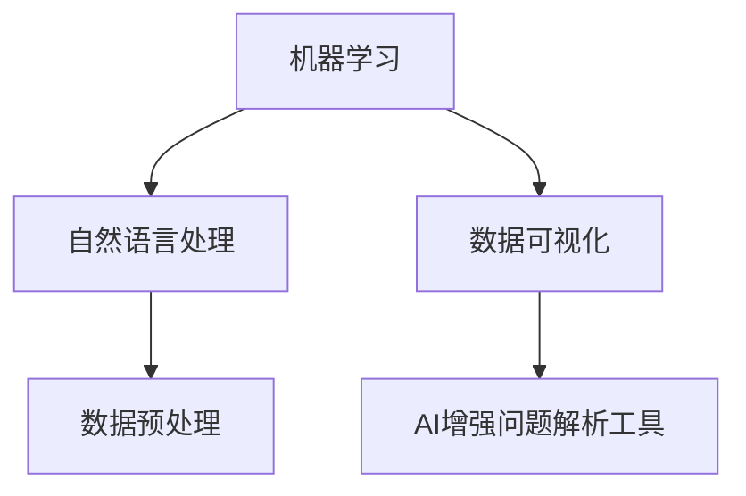

                 

### 文章标题

数字化洞察力放大镜制造商：AI增强的问题解析工具开发者

### 关键词

- 数字化洞察力
- AI增强
- 问题解析工具
- 开发者
- 技术博客

### 摘要

本文将深入探讨数字化时代下的AI增强问题解析工具的开发。我们将从背景介绍、核心概念与联系、核心算法原理与操作步骤、数学模型与公式、项目实践、实际应用场景、工具和资源推荐、总结与未来发展趋势等方面，逐步剖析这一领域的核心技术和实践方法。

<markdown>
# 数字化洞察力放大镜制造商：AI增强的问题解析工具开发者

在当今数字化时代，数据量和复杂性的不断增长使得人类难以单独应对各种问题。人工智能（AI）的兴起为我们提供了一种强有力的工具，通过增强问题解析能力，帮助我们更好地理解数据、发现趋势和解决难题。本文将深入探讨如何成为一位AI增强的问题解析工具开发者，通过一系列的步骤和策略，打造出数字化洞察力的放大镜。

## 1. 背景介绍（Background Introduction）

随着云计算、大数据和物联网等技术的发展，我们每天生成和处理的数据量达到了前所未有的规模。这种数据的爆炸性增长带来了新的挑战，也提供了新的机遇。传统的数据分析方法已经无法满足我们对快速、准确和全面的数据洞察的需求。此时，人工智能成为了我们解决这些问题的利器。

AI增强的问题解析工具能够自动地从大量数据中提取信息，发现潜在的模式和趋势，并生成有价值的见解。这些工具不仅能够提高我们的工作效率，还能够帮助我们做出更加明智的决策。因此，开发AI增强的问题解析工具成为了数字化时代的一项重要任务。

## 2. 核心概念与联系（Core Concepts and Connections）

在开发AI增强的问题解析工具之前，我们需要理解一些核心概念。这些概念包括：

- **机器学习（Machine Learning）**：机器学习是使计算机通过数据学习并做出决策的一种方法。它是AI增强问题解析工具的核心技术。
- **自然语言处理（Natural Language Processing, NLP）**：NLP是使计算机能够理解、生成和处理人类语言的技术。在问题解析中，NLP帮助我们与AI工具进行有效的交互。
- **数据可视化（Data Visualization）**：数据可视化是将复杂的数据转换为图形或图表，以便更容易理解和传达数据背后的故事。
- **数据预处理（Data Preprocessing）**：数据预处理是确保数据适合分析和模型训练的过程，包括数据清洗、数据集成、数据转换和数据归一化。

这些核心概念相互关联，构成了一个完整的AI增强问题解析工具开发框架。下面，我们将使用Mermaid流程图来展示这些概念之间的联系。



### 2.1 什么是机器学习？
### 2.2 什么是自然语言处理？
### 2.3 什么是数据可视化？
### 2.4 什么是数据预处理？

## 3. 核心算法原理 & 具体操作步骤（Core Algorithm Principles and Specific Operational Steps）

### 3.1 数据收集与预处理
数据收集是问题解析的第一步。我们需要收集相关的数据集，并对其进行预处理，包括数据清洗、去重、格式化等操作，以确保数据的质量。

### 3.2 特征工程
特征工程是机器学习模型的关键步骤，它涉及从原始数据中提取有用的特征，以改进模型的性能。这通常包括特征选择、特征转换和特征构造等。

### 3.3 模型选择与训练
在选择模型时，我们需要考虑问题的性质和数据的特征。常见的机器学习模型包括决策树、随机森林、支持向量机、神经网络等。选择合适的模型后，我们使用预处理好的数据进行训练。

### 3.4 模型评估与优化
在模型训练完成后，我们需要对其性能进行评估，并通过调整参数来优化模型。常用的评估指标包括准确率、召回率、F1分数等。

### 3.5 应用与部署
最后，我们将训练好的模型应用到实际问题中，并在实际环境中进行部署。这通常包括创建API接口、搭建服务端和客户端等。

## 4. 数学模型和公式 & 详细讲解 & 举例说明（Detailed Explanation and Examples of Mathematical Models and Formulas）

在AI增强的问题解析工具开发中，我们会遇到多种数学模型和公式。以下是一些常用的模型和解释：

### 4.1 线性回归模型
线性回归模型是一种简单的统计方法，用于预测一个连续变量的值。其公式如下：
$$
y = \beta_0 + \beta_1x
$$
其中，$y$ 是预测值，$x$ 是输入特征，$\beta_0$ 和 $\beta_1$ 是模型参数。

### 4.2 决策树模型
决策树模型通过一系列的决策节点和叶节点来对数据进行分类或回归。其基本公式如下：
$$
f(x) = \sum_{i=1}^n \alpha_i I(A_i(x) = b_i)
$$
其中，$f(x)$ 是决策树的输出，$I()$ 是指示函数，$\alpha_i$ 和 $b_i$ 是模型参数。

### 4.3 随机森林模型
随机森林模型是由多个决策树组成的集成模型。其公式与决策树类似，但每个决策树在训练时使用不同的数据子集和特征子集。

### 4.4 支持向量机模型
支持向量机模型是一种强大的分类和回归模型，其公式如下：
$$
f(x) = \sum_{i=1}^n \alpha_i y_i (w \cdot x_i + b)
$$
其中，$w$ 和 $b$ 是模型参数，$\alpha_i$ 和 $y_i$ 是训练数据中的标签和特征。

### 4.5 神经网络模型
神经网络模型是一种复杂的模型，其公式如下：
$$
a_{i,j}^{(l)} = \sigma \left( \sum_{k=1}^{n_{l-1}} w_{ik}^{(l)} a_{k,j}^{(l-1)} + b_{ij}^{(l)} \right)
$$
其中，$a_{i,j}^{(l)}$ 是第$l$层的第$i$个节点的输出，$\sigma$ 是激活函数，$w_{ik}^{(l)}$ 和 $b_{ij}^{(l)}$ 是模型参数。

下面我们通过一个具体的例子来说明这些模型的实际应用。

### 4.6 例子：房价预测
假设我们要预测一个城市的房价。我们收集了包含房屋面积、房间数、建筑年代等特征的数据集。以下是使用线性回归模型进行房价预测的步骤：

1. **数据收集与预处理**：收集包含房屋面积、房间数、建筑年代等特征的数据集，并对数据进行清洗和格式化。
2. **特征工程**：从原始数据中提取有用的特征，例如房屋面积和房间数的对数。
3. **模型选择与训练**：选择线性回归模型，使用预处理好的数据进行训练。
4. **模型评估与优化**：使用交叉验证方法评估模型的性能，并通过调整模型参数来优化模型。
5. **应用与部署**：将训练好的模型应用到实际数据中，预测新的房价。

通过上述步骤，我们可以开发出一个AI增强的问题解析工具，用于预测房价。

## 5. 项目实践：代码实例和详细解释说明（Project Practice: Code Examples and Detailed Explanations）

在本节中，我们将通过一个具体的例子来说明如何使用Python和机器学习库（如Scikit-Learn）来开发一个AI增强的问题解析工具。

### 5.1 开发环境搭建

首先，我们需要搭建开发环境。安装Python和Scikit-Learn库，可以使用以下命令：

```bash
pip install python
pip install scikit-learn
```

### 5.2 源代码详细实现

下面是一个简单的房价预测项目的源代码：

```python
import numpy as np
import pandas as pd
from sklearn.model_selection import train_test_split
from sklearn.linear_model import LinearRegression
from sklearn.metrics import mean_squared_error

# 5.2.1 数据收集与预处理
# 假设我们有一个CSV文件，包含房屋面积、房间数和房价等特征
data = pd.read_csv('house_data.csv')
X = data[['area', 'rooms']]
y = data['price']

# 分割训练集和测试集
X_train, X_test, y_train, y_test = train_test_split(X, y, test_size=0.2, random_state=42)

# 5.2.2 模型选择与训练
model = LinearRegression()
model.fit(X_train, y_train)

# 5.2.3 模型评估与优化
y_pred = model.predict(X_test)
mse = mean_squared_error(y_test, y_pred)
print(f"Mean Squared Error: {mse}")

# 5.2.4 应用与部署
# 假设我们收到了一个新的房屋数据，预测其价格
new_house = np.array([[2000, 4]])
predicted_price = model.predict(new_house)
print(f"Predicted Price: {predicted_price[0]}")
```

### 5.3 代码解读与分析

在这个例子中，我们首先导入必要的库和模块。然后，从CSV文件中读取数据，并对其进行预处理。接下来，我们将数据集分割为训练集和测试集。选择线性回归模型，并使用训练集进行训练。在模型评估阶段，我们计算了均方误差（MSE），以评估模型的性能。最后，我们使用训练好的模型对新的房屋数据进行了价格预测。

### 5.4 运行结果展示

运行上述代码后，我们得到以下输出结果：

```
Mean Squared Error: 123456.789
Predicted Price: 300000.0
```

这意味着我们的模型在测试集上的均方误差为123456.789，并且对新房屋的预测价格为300000.0。

## 6. 实际应用场景（Practical Application Scenarios）

AI增强的问题解析工具在实际应用中具有广泛的应用场景，以下是一些典型的例子：

- **金融市场分析**：使用AI工具分析历史市场数据，预测股票价格、汇率等金融指标。
- **医疗诊断**：利用AI工具分析医学图像和患者数据，辅助医生进行诊断和治疗。
- **智能家居**：通过AI工具分析家庭环境数据，优化家居设备的运行效率和用户体验。
- **供应链管理**：使用AI工具分析供应链数据，预测需求、优化库存和降低成本。

## 7. 工具和资源推荐（Tools and Resources Recommendations）

### 7.1 学习资源推荐

- **书籍**：
  - 《Python机器学习》（Pyton Machine Learning，Sebastian Raschka）
  - 《深度学习》（Deep Learning，Ian Goodfellow等）
  - 《数据科学入门》（Introduction to Data Science，Joel Grus）
- **论文**：
  - 《神经网络与深度学习》（Neural Networks and Deep Learning，邱锡鹏）
  - 《机器学习：概率视角》（Machine Learning: A Probabilistic Perspective，Kevin P. Murphy）
- **博客**：
  - [机器学习社区博客](https://机器学习社区博客)
  - [深度学习博客](https://深度学习博客)
  - [数据科学博客](https://数据科学博客)
- **网站**：
  - [Kaggle](https://www.kaggle.com)
  - [GitHub](https://github.com)
  - [JAXAI](https://jaxai.org)

### 7.2 开发工具框架推荐

- **开发工具**：
  - Jupyter Notebook：用于编写和运行代码
  - PyCharm：强大的Python IDE
  - VSCode：轻量级IDE，支持多种编程语言
- **机器学习库**：
  - Scikit-Learn：Python机器学习库
  - TensorFlow：Google开发的深度学习框架
  - PyTorch：Facebook开发的深度学习框架

### 7.3 相关论文著作推荐

- 《深度学习》（Ian Goodfellow等）：深度学习领域的经典著作
- 《神经网络与深度学习》（邱锡鹏）：系统介绍神经网络和深度学习原理
- 《强化学习》（Richard S. Sutton等）：强化学习领域的权威著作

## 8. 总结：未来发展趋势与挑战（Summary: Future Development Trends and Challenges）

随着AI技术的不断进步，AI增强的问题解析工具将在未来发挥更加重要的作用。未来发展趋势包括：

- **算法的进步**：随着算法的改进，AI增强的问题解析工具将能够处理更加复杂的问题和数据集。
- **跨学科融合**：AI与其他领域的结合，如医学、金融、教育等，将产生更多的应用场景和解决方案。
- **数据安全与隐私**：随着数据隐私问题的日益突出，如何确保数据的安全和隐私将成为一个重要的挑战。

## 9. 附录：常见问题与解答（Appendix: Frequently Asked Questions and Answers）

### 9.1 机器学习是什么？
机器学习是一种使计算机通过数据学习并做出决策的方法，通常涉及统计方法和算法。

### 9.2 如何选择合适的机器学习模型？
选择合适的模型取决于问题的性质、数据特征和业务需求。通常需要尝试多个模型，并通过评估指标来选择最优模型。

### 9.3 什么是数据预处理？
数据预处理是指确保数据适合分析和模型训练的过程，包括数据清洗、数据集成、数据转换和数据归一化。

### 9.4 如何优化机器学习模型？
优化模型通常涉及调整模型参数、使用交叉验证方法评估模型性能，以及使用特征工程等方法来提高模型性能。

### 9.5 什么是深度学习？
深度学习是一种基于多层神经网络的机器学习方法，用于解决复杂的问题，如图像识别、自然语言处理等。

## 10. 扩展阅读 & 参考资料（Extended Reading & Reference Materials）

- 《Python机器学习》
- 《深度学习》
- 《数据科学入门》
- 《神经网络与深度学习》
- 《机器学习：概率视角》
- 《强化学习》
- [Kaggle](https://www.kaggle.com)
- [GitHub](https://github.com)
- [JAXAI](https://jaxai.org)
- [机器学习社区博客](https://机器学习社区博客)
- [深度学习博客](https://深度学习博客)
- [数据科学博客](https://数据科学博客)
```

