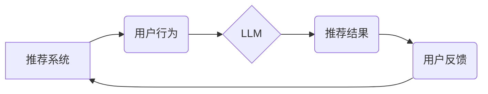

                 

## LLM对推荐系统实时决策的不确定性分析

> 关键词：大型语言模型 (LLM)、推荐系统、实时决策、不确定性、概率推理、风险管理

## 1. 背景介绍

推荐系统作为信息过滤和个性化内容呈现的重要工具，在电商、社交媒体、视频平台等领域发挥着至关重要的作用。传统的推荐系统主要依赖于协同过滤、内容过滤和基于知识图谱的方法，这些方法通常基于历史数据和已知的用户偏好进行预测。然而，随着用户行为的复杂性和数据量的激增，传统的推荐系统面临着新的挑战，例如数据稀疏性、冷启动问题和用户偏好的动态变化。

近年来，大型语言模型 (LLM) 凭借其强大的文本理解和生成能力，在推荐系统领域展现出巨大的潜力。LLM 可以理解用户需求的复杂语义，生成更个性化和相关的推荐内容，并适应用户偏好的动态变化。然而，LLM 的输出结果往往带有不确定性，因为其训练数据可能存在偏差，模型本身也存在一定的泛化能力限制。

## 2. 核心概念与联系

**2.1 推荐系统概述**

推荐系统旨在根据用户的历史行为、偏好和上下文信息，预测用户对特定物品的兴趣，并提供个性化的推荐列表。

**2.2 大型语言模型 (LLM)**

LLM 是训练于海量文本数据上的深度学习模型，能够理解和生成人类语言。其强大的文本处理能力使其能够用于各种自然语言处理任务，包括文本分类、问答系统、机器翻译和推荐系统。

**2.3 不确定性分析**

不确定性分析是指在决策过程中识别和量化不确定性因素，并评估其对决策结果的影响。在推荐系统中，不确定性分析可以帮助我们理解模型预测的可靠性，并采取相应的措施降低风险。

**2.4 核心概念关系图**



## 3. 核心算法原理 & 具体操作步骤

**3.1 算法原理概述**

LLM 可以用于推荐系统中的多个环节，例如：

* **用户需求理解:** LLM 可以理解用户自然语言查询，并将其转换为推荐模型可以处理的格式。
* **内容表示学习:** LLM 可以学习物品的语义表示，并将其与用户偏好进行匹配。
* **推荐结果生成:** LLM 可以根据用户需求和物品表示，生成个性化的推荐列表。

**3.2 算法步骤详解**

1. **数据预处理:** 收集用户行为数据、物品信息和文本描述等数据，并进行清洗、格式化和特征提取。
2. **LLM 训练:** 使用预处理后的数据训练 LLM 模型，使其能够理解用户需求和物品语义。
3. **推荐模型构建:** 基于 LLM 的输出结果，构建推荐模型，例如基于用户的协同过滤模型、基于内容的过滤模型或基于知识图谱的推荐模型。
4. **推荐结果生成:** 使用训练好的推荐模型，根据用户的历史行为和当前上下文信息，生成个性化的推荐列表。
5. **不确定性分析:** 使用概率推理方法，分析推荐结果的不确定性，并提供相应的风险评估和应对措施。

**3.3 算法优缺点**

**优点:**

* 能够理解用户需求的复杂语义。
* 生成更个性化和相关的推荐内容。
* 适应用户偏好的动态变化。

**缺点:**

* LLM 模型训练成本高，需要海量数据和计算资源。
* LLM 的输出结果可能带有不确定性，需要进行相应的风险管理。

**3.4 算法应用领域**

* 电子商务推荐
* 内容推荐 (新闻、视频、音乐等)
* 社交媒体推荐
* 个性化教育推荐

## 4. 数学模型和公式 & 详细讲解 & 举例说明

**4.1 数学模型构建**

假设我们有一个推荐系统，它需要预测用户 $u$ 对物品 $i$ 的评分。我们可以使用以下数学模型来表示用户对物品的评分预测：

$$
\hat{r}_{ui} = f(h_u, h_i, \theta)
$$

其中：

* $\hat{r}_{ui}$ 是模型预测的用户 $u$ 对物品 $i$ 的评分。
* $h_u$ 是用户 $u$ 的特征向量。
* $h_i$ 是物品 $i$ 的特征向量。
* $\theta$ 是模型参数。
* $f$ 是一个非线性函数，例如神经网络。

**4.2 公式推导过程**

LLM 可以用于学习用户和物品的特征向量 $h_u$ 和 $h_i$。例如，我们可以使用 Transformer 模型来学习用户和物品的文本表示，并将这些表示作为特征向量输入到推荐模型中。

**4.3 案例分析与讲解**

假设我们有一个电商平台，用户 $u$ 对商品 $i$ 的评分是未知的。我们可以使用 LLM 来预测用户 $u$ 对商品 $i$ 的评分。首先，我们可以使用 LLM 来学习用户 $u$ 的兴趣偏好和商品 $i$ 的属性描述。然后，我们可以将这些学习到的特征向量输入到推荐模型中，并使用公式 (1) 来预测用户 $u$ 对商品 $i$ 的评分。

## 5. 项目实践：代码实例和详细解释说明

**5.1 开发环境搭建**

* Python 3.7+
* PyTorch 或 TensorFlow
* CUDA 和 cuDNN (可选)

**5.2 源代码详细实现**

```python
import torch
import torch.nn as nn

class LLMRecommender(nn.Module):
    def __init__(self, embedding_dim, hidden_dim):
        super(LLMRecommender, self).__init__()
        self.embedding_dim = embedding_dim
        self.hidden_dim = hidden_dim
        self.user_embedding = nn.Embedding(num_users, embedding_dim)
        self.item_embedding = nn.Embedding(num_items, embedding_dim)
        self.fc = nn.Linear(embedding_dim * 2, hidden_dim)
        self.output = nn.Linear(hidden_dim, 1)

    def forward(self, user_id, item_id):
        user_embedding = self.user_embedding(user_id)
        item_embedding = self.item_embedding(item_id)
        combined_embedding = torch.cat((user_embedding, item_embedding), dim=1)
        hidden = torch.relu(self.fc(combined_embedding))
        output = self.output(hidden)
        return output

# ... (其他代码)
```

**5.3 代码解读与分析**

* 该代码实现了一个基于 LLM 的推荐模型。
* 模型使用两个 Embedding 层来学习用户和物品的特征向量。
* 然后，将用户和物品的特征向量拼接在一起，并通过一个全连接层进行变换。
* 最后，使用一个线性层输出用户对物品的评分预测。

**5.4 运行结果展示**

* 可以使用训练数据评估模型的性能，例如使用 Mean Squared Error (MSE) 或 Root Mean Squared Error (RMSE) 作为评价指标。
* 可以将模型部署到生产环境中，并实时生成推荐结果。

## 6. 实际应用场景

**6.1 电子商务推荐**

LLM 可以理解用户的商品搜索词和浏览历史，并推荐更相关的商品。例如，如果用户搜索“运动鞋”，LLM 可以理解用户的运动需求，并推荐不同品牌、款式和价格的运动鞋。

**6.2 内容推荐**

LLM 可以理解用户的阅读偏好和观看习惯，并推荐相关的新闻、视频、音乐等内容。例如，如果用户经常阅读科技新闻，LLM 可以推荐最新的科技资讯和产品评测。

**6.3 个性化教育推荐**

LLM 可以理解学生的学习目标和知识水平，并推荐个性化的学习资源和课程。例如，如果学生需要学习 Python 编程，LLM 可以推荐相关的在线课程、书籍和练习题。

**6.4 未来应用展望**

* **多模态推荐:** 将文本、图像、音频等多模态数据融合到推荐系统中，提供更丰富的用户体验。
* **实时个性化推荐:** 基于用户的实时行为和上下文信息，动态调整推荐结果，提供更精准的个性化服务。
* **解释性推荐:** LLM 可以解释推荐结果背后的逻辑，帮助用户理解推荐系统的决策过程。

## 7. 工具和资源推荐

**7.1 学习资源推荐**

* **书籍:**
    * Deep Learning by Ian Goodfellow, Yoshua Bengio, and Aaron Courville
    * Natural Language Processing with Python by Steven Bird, Ewan Klein, and Edward Loper
* **在线课程:**
    * Stanford CS224N: Natural Language Processing with Deep Learning
    * DeepLearning.AI: TensorFlow for Deep Learning Specialization

**7.2 开发工具推荐**

* **框架:** PyTorch, TensorFlow
* **库:** Hugging Face Transformers, Gensim

**7.3 相关论文推荐**

* **BERT: Pre-training of Deep Bidirectional Transformers for Language Understanding**
* **GPT-3: Language Models are Few-Shot Learners**
* **Recurrent Neural Network for Recommendation Systems**

## 8. 总结：未来发展趋势与挑战

**8.1 研究成果总结**

LLM 在推荐系统领域展现出巨大的潜力，能够理解用户需求、生成个性化推荐和适应用户偏好的动态变化。

**8.2 未来发展趋势**

* 多模态推荐
* 实时个性化推荐
* 解释性推荐

**8.3 面临的挑战**

* LLM 模型训练成本高
* LLM 的输出结果可能带有不确定性
* 如何有效地解释 LLM 的推荐结果

**8.4 研究展望**

* 研究更有效的 LLM 模型训练方法，降低训练成本。
* 开发更 robust 的不确定性分析方法，提高推荐结果的可靠性。
* 研究如何将 LLM 与其他推荐技术结合，发挥协同效应。

## 9. 附录：常见问题与解答

* **Q1: LLM 的训练数据对推荐结果的影响是什么？**

* **A1:** LLM 的训练数据直接影响其推荐结果的质量。如果训练数据存在偏差或不完整，则推荐结果也可能存在偏差或不准确。

* **Q2: 如何评估 LLM 基于推荐系统的性能？**

* **A2:** 可以使用 Mean Squared Error (MSE) 或 Root Mean Squared Error (RMSE) 作为评价指标，评估模型预测的评分与实际评分之间的差异。

* **Q3: 如何应对 LLM 推荐结果的不确定性？**

* **A3:** 可以使用概率推理方法，分析推荐结果的不确定性，并提供相应的风险评估和应对措施。例如，可以将不确定性高的推荐结果降序排列，或者提供多个推荐结果供用户选择。


作者：禅与计算机程序设计艺术 / Zen and the Art of Computer Programming 
<end_of_turn>

