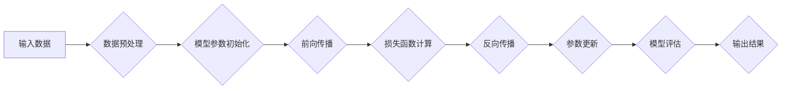

                 

## LLM的计算模型：超越传统冯·诺依曼架构

> 关键词：大型语言模型 (LLM)、计算模型、冯·诺依曼架构、张量计算、并行处理、神经网络、深度学习

## 1. 背景介绍

大型语言模型 (LLM) 近年来取得了令人瞩目的成就，在自然语言处理 (NLP) 领域展现出强大的能力，例如文本生成、翻译、问答和代码生成。这些模型的成功离不开其独特的计算模型，它与传统的冯·诺依曼架构存在显著差异。

传统冯·诺依曼架构以指令序列和数据存储在主存中进行处理为核心，其计算过程是串行执行的。然而，LLM 的训练和推理过程依赖于海量数据和复杂的计算，传统的冯·诺依曼架构难以满足其需求。

## 2. 核心概念与联系

LLM 的计算模型主要基于深度学习和张量计算，其核心概念包括：

* **神经网络:**  LLM 的基础是深度神经网络，它由多个层级的神经元组成，每个神经元接收输入信号，并通过激活函数进行处理，最终输出信号。
* **张量计算:**  LLM 的训练和推理过程本质上是张量计算，即对高维数组 (张量) 进行数学运算。张量计算可以利用 GPU 等并行计算设备进行加速，大幅提升计算效率。
* **并行处理:**  LLM 的训练和推理通常采用并行处理技术，将模型参数和数据分布到多个计算节点上，并同时进行计算，从而缩短训练时间和提高推理速度。

**Mermaid 流程图:**



## 3. 核心算法原理 & 具体操作步骤

### 3.1  算法原理概述

LLM 的核心算法是基于深度神经网络的训练算法，主要包括以下步骤：

1. **数据预处理:** 将原始文本数据转换为模型可以理解的格式，例如词嵌入。
2. **模型参数初始化:** 为模型中的神经元赋予初始权重。
3. **前向传播:** 将输入数据通过神经网络传递，计算输出结果。
4. **损失函数计算:** 计算模型输出结果与真实值的差异。
5. **反向传播:** 计算损失函数对模型参数的梯度。
6. **参数更新:** 使用梯度下降算法更新模型参数，使其朝着降低损失函数的方向调整。

### 3.2  算法步骤详解

1. **数据预处理:**

   * **分词:** 将文本数据分割成单词或子词。
   * **词嵌入:** 将每个单词或子词映射到一个低维向量空间，表示其语义信息。
   * **数据增强:** 通过随机插入、删除或替换单词等方式增加训练数据的多样性。

2. **模型参数初始化:**

   * 使用随机数初始化模型参数，例如正态分布或均匀分布。
   * 使用预训练模型的权重进行初始化，可以加速模型训练。

3. **前向传播:**

   * 将输入数据通过神经网络层级传递，每个神经元接收前一层神经元的输出作为输入，并通过激活函数进行处理。
   * 最后输出层计算模型对输入数据的预测结果。

4. **损失函数计算:**

   * 使用与任务相关的损失函数计算模型输出结果与真实值的差异。
   * 常用的损失函数包括交叉熵损失、均方误差损失等。

5. **反向传播:**

   * 计算损失函数对模型参数的梯度，即参数的变化量对损失函数的影响。
   * 使用链式法则将梯度从输出层反向传播到输入层。

6. **参数更新:**

   * 使用梯度下降算法更新模型参数，使其朝着降低损失函数的方向调整。
   * 常用的梯度下降算法包括随机梯度下降、动量梯度下降等。

### 3.3  算法优缺点

**优点:**

* **强大的表达能力:** 深度神经网络可以学习复杂的非线性关系，从而实现强大的文本表示能力。
* **端到端训练:** 整个模型可以一次性进行训练，无需人工设计特征，简化了模型开发流程。
* **可迁移性:** 预训练模型可以迁移到不同的下游任务，提高模型的通用性。

**缺点:**

* **训练成本高:** LLM 的训练需要海量数据和强大的计算资源，成本较高。
* **可解释性差:** 深度神经网络的决策过程难以解释，缺乏透明度。
* **数据依赖性强:** 模型的性能依赖于训练数据的质量和数量。

### 3.4  算法应用领域

LLM 的应用领域非常广泛，包括：

* **自然语言理解:** 文本分类、情感分析、问答系统、文本摘要等。
* **自然语言生成:** 文本生成、机器翻译、对话系统、代码生成等。
* **其他领域:** 图像识别、语音识别、药物研发等。

## 4. 数学模型和公式 & 详细讲解 & 举例说明

### 4.1  数学模型构建

LLM 的数学模型主要基于神经网络，其核心是激活函数和损失函数。

* **激活函数:** 用于将神经元的输入信号转换为输出信号，常见的激活函数包括 sigmoid 函数、ReLU 函数、tanh 函数等。

* **损失函数:** 用于衡量模型预测结果与真实值的差异，常见的损失函数包括交叉熵损失、均方误差损失等。

### 4.2  公式推导过程

**交叉熵损失函数:**

$$
L = -\sum_{i=1}^{N} y_i \log(\hat{y}_i)
$$

其中:

* $L$ 是损失函数值。
* $N$ 是样本数量。
* $y_i$ 是真实标签。
* $\hat{y}_i$ 是模型预测的概率。

**梯度下降算法:**

$$
\theta = \theta - \alpha \nabla L(\theta)
$$

其中:

* $\theta$ 是模型参数。
* $\alpha$ 是学习率。
* $\nabla L(\theta)$ 是损失函数对模型参数的梯度。

### 4.3  案例分析与讲解

假设我们训练一个二分类模型，用于判断文本是正面评价还是负面评价。

* **训练数据:** 包含 1000 个文本样本，每个样本都有对应的标签 (正面或负面)。
* **模型:** 使用一个两层神经网络，第一层有 128 个神经元，第二层有 2 个神经元 (对应两个类别)。
* **损失函数:** 使用交叉熵损失函数。
* **梯度下降算法:** 使用随机梯度下降算法。

通过训练，模型学习到文本特征和类别之间的关系，最终可以准确地预测文本的类别。

## 5. 项目实践：代码实例和详细解释说明

### 5.1  开发环境搭建

* **操作系统:** Linux 或 macOS
* **编程语言:** Python
* **深度学习框架:** TensorFlow 或 PyTorch
* **硬件:** GPU 

### 5.2  源代码详细实现

```python
import tensorflow as tf

# 定义模型结构
model = tf.keras.models.Sequential([
    tf.keras.layers.Embedding(input_dim=vocab_size, output_dim=embedding_dim),
    tf.keras.layers.LSTM(units=128),
    tf.keras.layers.Dense(units=2, activation='softmax')
])

# 编译模型
model.compile(optimizer='adam',
              loss='sparse_categorical_crossentropy',
              metrics=['accuracy'])

# 训练模型
model.fit(x_train, y_train, epochs=10)

# 评估模型
loss, accuracy = model.evaluate(x_test, y_test)
print('Loss:', loss)
print('Accuracy:', accuracy)
```

### 5.3  代码解读与分析

* **Embedding 层:** 将单词映射到低维向量空间。
* **LSTM 层:** 学习文本序列中的长短时依赖关系。
* **Dense 层:** 输出模型对文本的预测结果。
* **Adam 优化器:** 用于更新模型参数。
* **Sparse Categorical Crossentropy 损失函数:** 用于二分类任务。
* **fit() 方法:** 用于训练模型。
* **evaluate() 方法:** 用于评估模型性能。

### 5.4  运行结果展示

训练完成后，可以将模型应用于新的文本数据进行预测。

## 6. 实际应用场景

LLM 在各个领域都有广泛的应用场景，例如：

* **聊天机器人:**  构建更自然、更智能的聊天机器人，能够理解用户意图并提供更精准的回复。
* **文本生成:**  自动生成高质量的文本内容，例如新闻报道、广告文案、诗歌等。
* **机器翻译:**  实现更高效、更准确的机器翻译，突破语言障碍。
* **代码生成:**  根据自然语言描述自动生成代码，提高开发效率。

### 6.4  未来应用展望

随着 LLM 技术的不断发展，其应用场景将更加广泛，例如：

* **个性化教育:**  根据学生的学习情况提供个性化的学习内容和辅导。
* **医疗诊断:**  辅助医生进行疾病诊断，提高诊断准确率。
* **科学研究:**  加速科学研究的进程，例如药物研发、材料科学等。

## 7. 工具和资源推荐

### 7.1  学习资源推荐

* **书籍:**
    * 《深度学习》
    * 《自然语言处理》
* **在线课程:**
    * Coursera: 深度学习
    * edX: 自然语言处理
* **博客:**
    * The Gradient
    * Towards Data Science

### 7.2  开发工具推荐

* **深度学习框架:** TensorFlow, PyTorch
* **编程语言:** Python
* **云计算平台:** AWS, Google Cloud, Azure

### 7.3  相关论文推荐

* **Attention Is All You Need**
* **BERT: Pre-training of Deep Bidirectional Transformers for Language Understanding**
* **GPT-3: Language Models are Few-Shot Learners**

## 8. 总结：未来发展趋势与挑战

### 8.1  研究成果总结

LLM 的发展取得了显著成果，其强大的文本理解和生成能力为 NLP 领域带来了革命性的变革。

### 8.2  未来发展趋势

* **模型规模更大:**  更大的模型参数量和训练数据将进一步提升模型性能。
* **训练效率更高:**  新的训练算法和硬件加速技术将降低模型训练成本。
* **应用场景更广泛:**  LLM 将应用于更多领域，例如医疗、教育、科学研究等。

### 8.3  面临的挑战

* **可解释性:**  LLM 的决策过程难以解释，缺乏透明度。
* **数据偏见:**  模型的性能可能受到训练数据中的偏见影响。
* **安全风险:**  LLM 可能被用于生成虚假信息或进行恶意攻击。

### 8.4  研究展望

未来研究方向包括：

* **提高模型的可解释性:**  开发新的方法和技术，使 LLMs 的决策过程更加透明。
* **解决数据偏见问题:**  开发新的数据处理和模型训练方法，减少模型的偏见。
* **增强模型的安全性和鲁棒性:**  开发新的方法和技术，防止 LLMs 被用于恶意目的。

## 9. 附录：常见问题与解答

* **什么是 LLM?**

LLM 指的是大型语言模型，是一种基于深度学习的模型，能够理解和生成人类语言。

* **LLM 的训练数据是什么?**

LLM 的训练数据通常是海量文本数据，例如书籍、文章、网站内容等。

* **LLM 的应用场景有哪些?**

LLM 的应用场景非常广泛，例如聊天机器人、文本生成、机器翻译、代码生成等。

* **如何训练一个 LLM?**

训练一个 LLM 需要大量的计算资源和时间，通常需要使用深度学习框架和强大的 GPU。

* **LLM 的未来发展趋势是什么?**

LLM 的未来发展趋势包括模型规模更大、训练效率更高、应用场景更广泛等。


作者：禅与计算机程序设计艺术 / Zen and the Art of Computer Programming 
<end_of_turn>

