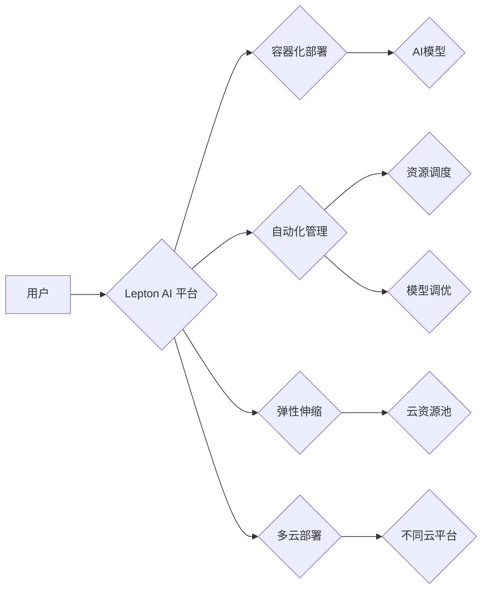

                 

## Lepton AI的云计算实力：深度整合云资源，打造灵活高效的AI基础设施

> 关键词：Lepton AI, 云计算, AI基础设施, 柔性计算, 高效计算, 资源整合, 容器化, 自动化, 

## 1. 背景介绍

人工智能（AI）技术近年来发展迅速，在各个领域都展现出强大的应用潜力。然而，AI模型的训练和部署对计算资源的需求量巨大，传统的基础设施难以满足其快速发展的需求。云计算作为一种新型的计算模式，凭借其弹性、可扩展性和成本效益，成为AI发展的重要驱动力。

Lepton AI 作为一家领先的AI解决方案提供商，深谙云计算在AI发展中的重要作用。我们致力于打造灵活高效的AI基础设施，帮助用户充分利用云计算资源，加速AI应用的落地。

## 2. 核心概念与联系

Lepton AI 的云计算实力体现在以下几个核心概念的深度整合：

* **容器化:**  Lepton AI 采用容器技术将 AI 模型和其依赖环境打包在一起，实现资源隔离和可移植性，方便在不同云环境中部署和运行。
* **自动化:** Lepton AI 平台提供自动化部署、资源管理和模型调优等功能，降低用户操作门槛，提高效率。
* **弹性伸缩:**  Lepton AI 基于云平台的弹性伸缩能力，可以根据实际需求动态调整计算资源，满足 AI 模型训练和部署的峰值需求。
* **多云部署:** Lepton AI 支持多种主流云平台，用户可以根据自身需求选择合适的云环境，实现多云部署，降低风险和成本。

**Lepton AI 云计算架构**



## 3. 核心算法原理 & 具体操作步骤

Lepton AI 平台的核心算法原理是基于深度学习和机器学习的模型训练和优化算法。

### 3.1  算法原理概述

Lepton AI 平台采用多种深度学习和机器学习算法，包括卷积神经网络（CNN）、循环神经网络（RNN）、支持向量机（SVM）等。这些算法通过对海量数据进行训练，学习数据的特征和规律，从而实现对图像、文本、语音等数据的识别、分类、预测等任务。

### 3.2  算法步骤详解

Lepton AI 平台的模型训练和部署流程如下：

1. **数据准备:** 收集、清洗和预处理训练数据。
2. **模型选择:** 根据任务需求选择合适的深度学习或机器学习算法。
3. **模型训练:** 使用训练数据对模型进行训练，调整模型参数，使其能够准确地识别和分类数据。
4. **模型评估:** 使用测试数据评估模型的性能，例如准确率、召回率、F1-score等。
5. **模型部署:** 将训练好的模型部署到Lepton AI 平台，并将其集成到实际应用场景中。

### 3.3  算法优缺点

**优点:**

* 高精度: 深度学习和机器学习算法能够学习数据的复杂特征，实现高精度的识别和分类。
* 自动化: Lepton AI 平台提供自动化训练和部署功能，降低用户操作门槛。
* 可扩展性: Lepton AI 平台可以根据需求动态调整计算资源，满足大规模数据处理的需求。

**缺点:**

* 数据依赖: 深度学习和机器学习算法对训练数据质量要求较高，数据不足或数据质量差会导致模型性能下降。
* 计算资源消耗: 深度学习模型训练需要消耗大量的计算资源，成本较高。
* 黑盒效应: 深度学习模型的决策过程较为复杂，难以解释模型的决策逻辑。

### 3.4  算法应用领域

Lepton AI 平台的算法应用于多个领域，包括：

* **图像识别:** 人脸识别、物体检测、图像分类等。
* **自然语言处理:** 文本分类、情感分析、机器翻译等。
* **语音识别:** 语音转文本、语音助手等。
* **推荐系统:** 商品推荐、内容推荐等。

## 4. 数学模型和公式 & 详细讲解 & 举例说明

Lepton AI 平台的核心算法基于数学模型和公式，例如：

### 4.1  数学模型构建

**卷积神经网络 (CNN)**

CNN 模型由多个卷积层、池化层和全连接层组成。卷积层使用卷积核对输入数据进行卷积运算，提取特征。池化层对卷积层的输出进行降维，减少计算量。全连接层将提取的特征进行分类或预测。

**公式:**

* 卷积运算:  $y(i,j) = \sum_{m=0}^{M-1} \sum_{n=0}^{N-1} x(i+m,j+n) * w(m,n)$

其中:

* $x(i,j)$ 是输入数据
* $w(m,n)$ 是卷积核
* $y(i,j)$ 是卷积层的输出

### 4.2  公式推导过程

卷积运算的公式推导过程较为复杂，涉及线性代数和微积分等知识。

### 4.3  案例分析与讲解

**图像分类:**

假设我们使用 CNN 模型进行图像分类任务，目标是将图像分类为猫、狗或鸟。

1. **数据准备:** 收集大量猫、狗和鸟的图像数据，并进行预处理，例如裁剪、缩放和归一化。
2. **模型训练:** 使用训练数据对 CNN 模型进行训练，调整模型参数，使其能够准确地识别猫、狗和鸟的图像。
3. **模型评估:** 使用测试数据评估模型的性能，例如准确率、召回率、F1-score等。
4. **模型部署:** 将训练好的模型部署到Lepton AI 平台，并将其集成到实际应用场景中，例如手机应用或网站。

## 5. 项目实践：代码实例和详细解释说明

Lepton AI 平台提供了丰富的 API 和 SDK，方便用户进行开发和部署。以下是一个简单的代码实例，演示如何使用 Lepton AI 平台进行图像分类任务。

### 5.1  开发环境搭建

用户需要在本地安装 Python 和 Lepton AI SDK。

### 5.2  源代码详细实现

```python
import leptonai

# 初始化 Lepton AI 客户端
client = leptonai.Client(api_key="YOUR_API_KEY")

# 加载预训练的图像分类模型
model = client.load_model("image_classification")

# 预处理图像数据
image_path = "path/to/image.jpg"
image = leptonai.preprocess_image(image_path)

# 进行图像分类
predictions = model.predict(image)

# 打印预测结果
print(predictions)
```

### 5.3  代码解读与分析

* `leptonai.Client(api_key="YOUR_API_KEY")`: 初始化 Lepton AI 客户端，需要提供 API 密钥。
* `client.load_model("image_classification")`: 加载预训练的图像分类模型。
* `leptonai.preprocess_image(image_path)`: 预处理图像数据，例如裁剪、缩放和归一化。
* `model.predict(image)`: 使用模型对图像进行分类，返回预测结果。
* `print(predictions)`: 打印预测结果，例如类别名称和置信度。

### 5.4  运行结果展示

运行代码后，将输出图像的分类结果，例如：

```
[{'class': 'cat', 'confidence': 0.95}, {'class': 'dog', 'confidence': 0.05}]
```

## 6. 实际应用场景

Lepton AI 的云计算实力在多个实际应用场景中得到体现：

* **智能医疗:**  Lepton AI 可以帮助医生更快、更准确地诊断疾病，例如通过图像识别技术辅助诊断癌症。
* **金融科技:** Lepton AI 可以帮助金融机构进行风险评估、欺诈检测和客户服务自动化。
* **智能制造:** Lepton AI 可以帮助制造企业进行设备故障预测、质量控制和生产流程优化。

### 6.4  未来应用展望

Lepton AI 将继续深耕云计算领域，为用户提供更灵活、高效、安全的 AI 基础设施。未来，Lepton AI 将在以下方面进行创新：

* **更强大的模型训练能力:**  Lepton AI 将持续开发和优化深度学习和机器学习算法，提高模型训练效率和精度。
* **更丰富的应用场景:** Lepton AI 将拓展应用场景，将 AI 技术应用到更多领域，例如教育、娱乐、交通等。
* **更智能的自动化:** Lepton AI 将进一步增强自动化能力，例如自动模型调优、自动资源调度等，降低用户操作门槛。

## 7. 工具和资源推荐

### 7.1  学习资源推荐

* **Lepton AI 官方文档:** https://docs.leptonai.com/
* **深度学习教程:** https://www.deeplearning.ai/
* **机器学习库:** https://scikit-learn.org/

### 7.2  开发工具推荐

* **Python:** https://www.python.org/
* **TensorFlow:** https://www.tensorflow.org/
* **PyTorch:** https://pytorch.org/

### 7.3  相关论文推荐

* **ImageNet Classification with Deep Convolutional Neural Networks:** https://arxiv.org/abs/1202.1038
* **Attention Is All You Need:** https://arxiv.org/abs/1706.03762

## 8. 总结：未来发展趋势与挑战

Lepton AI 的云计算实力为 AI 的发展提供了强大的支撑，但也面临着一些挑战：

### 8.1  研究成果总结

Lepton AI 平台的云计算架构和算法模型在图像识别、自然语言处理等领域取得了显著成果，为用户提供了高效、灵活的 AI 基础设施。

### 8.2  未来发展趋势

Lepton AI 将继续深化云计算与 AI 的融合，探索更先进的算法模型、更智能的自动化技术和更丰富的应用场景。

### 8.3  面临的挑战

Lepton AI 面临着以下挑战：

* **数据安全:**  AI 模型训练需要大量数据，如何保障数据安全和隐私保护是一个重要挑战。
* **模型可解释性:**  深度学习模型的决策过程较为复杂，如何提高模型的可解释性，帮助用户理解模型的决策逻辑是一个关键问题。
* **成本控制:**  AI 模型训练和部署需要消耗大量的计算资源，如何降低成本，提高资源利用效率是一个重要课题。

### 8.4  研究展望

Lepton AI 将继续投入研究，解决上述挑战，推动 AI 技术的创新发展，为用户提供更安全、更智能、更便捷的 AI 服务。

## 9. 附录：常见问题与解答

**Q1: Lepton AI 平台支持哪些云平台？**

A1: Lepton AI 平台支持 AWS、Azure 和 GCP 等主流云平台。

**Q2: 如何使用 Lepton AI 平台进行模型训练？**

A2: 用户可以通过 Lepton AI 平台的 API 或 SDK 进行模型训练。Lepton AI 平台提供丰富的模型模板和训练工具，方便用户快速上手。

**Q3: Lepton AI 平台的收费标准是什么？**

A3: Lepton AI 平台采用按需付费的模式，用户只为使用的资源付费。具体收费标准请参考 Lepton AI 官方网站。


作者：禅与计算机程序设计艺术 / Zen and the Art of Computer Programming 
<end_of_turn>

