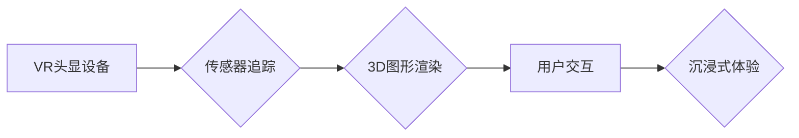

                 

## Oculus Rift SDK：在 Rift 平台上开发 VR 体验

> 关键词：Oculus Rift, VR, SDK, Unity, C++, 虚拟现实, 3D图形, 沉浸式体验

## 1. 背景介绍

虚拟现实 (VR) 技术近年来发展迅速，为人们提供了沉浸式体验的新途径。Oculus Rift作为业界领先的VR头显设备，凭借其高分辨率显示、低延迟追踪和舒适的佩戴体验，吸引了众多开发者和用户。为了帮助开发者轻松构建高质量的VR应用，Oculus公司推出了Oculus Rift SDK，为开发者提供了丰富的工具和API，简化了VR开发流程。

本篇文章将深入探讨Oculus Rift SDK，涵盖其核心概念、开发流程、数学模型、代码实例以及实际应用场景等方面，帮助读者全面理解VR开发的原理和实践方法。

## 2. 核心概念与联系

Oculus Rift SDK的核心概念包括：

* **VR头显设备:** Oculus Rift头显设备是VR体验的基础，它通过双目显示和头部追踪技术，模拟用户身临其境的视觉体验。
* **传感器追踪:** Oculus Rift SDK利用传感器追踪技术，实时记录用户的头部和手部运动，并将这些数据传递给应用程序，实现虚拟世界的交互。
* **3D图形渲染:** VR应用程序需要渲染逼真的3D图形场景，以提供沉浸式的视觉体验。Oculus Rift SDK提供了高效的3D图形渲染引擎，支持多种图形API，例如OpenGL和DirectX。
* **用户交互:** VR应用程序需要提供多种用户交互方式，例如手柄控制、语音识别和眼动追踪，以增强用户体验。Oculus Rift SDK提供了丰富的交互API，支持多种交互方式。

**核心概念架构图:**



## 3. 核心算法原理 & 具体操作步骤

### 3.1  算法原理概述

Oculus Rift SDK的核心算法主要包括：

* **头部追踪算法:** 利用传感器数据，通过滤波和校正算法，计算出用户的头部运动轨迹。
* **手部追踪算法:** 利用手柄传感器数据，通过识别手部关键点和运动轨迹，实现手部运动的追踪。
* **3D图形渲染算法:** 利用图形API，渲染逼真的3D图形场景，并根据用户的头部运动轨迹，动态调整场景视角。

### 3.2  算法步骤详解

**头部追踪算法步骤:**

1. **数据采集:** 接收来自头显设备的传感器数据，包括加速度、陀螺仪和磁力计数据。
2. **数据滤波:** 使用滤波算法，去除传感器数据中的噪声和抖动。
3. **姿态估计:** 利用姿态估计算法，计算出用户的头部姿态，包括旋转和倾斜角度。
4. **轨迹计算:** 将头部姿态信息与之前的时间戳进行关联，计算出用户的头部运动轨迹。

**手部追踪算法步骤:**

1. **关键点识别:** 利用手柄传感器数据，识别出手部关键点，例如手指关节和手掌中心。
2. **运动轨迹追踪:** 根据关键点的运动轨迹，计算出手部的运动轨迹。
3. **手部模型构建:** 将手部关键点和运动轨迹信息，构建出虚拟的手部模型。

### 3.3  算法优缺点

**优点:**

* 高精度追踪: Oculus Rift SDK的算法能够提供高精度的头部和手部追踪，实现逼真的虚拟交互体验。
* 低延迟响应: 算法的实时性强，能够快速响应用户的动作，降低延迟，提升用户体验。
* 稳定性高: 算法经过优化，能够稳定运行，即使在复杂的环境下也能保持准确性。

**缺点:**

* 计算资源消耗: 头部和手部追踪算法需要消耗一定的计算资源，对于低性能设备可能会造成性能瓶颈。
* 环境依赖性: 算法的精度受环境因素影响，例如光线和遮挡物，可能会导致追踪精度下降。

### 3.4  算法应用领域

Oculus Rift SDK的算法广泛应用于以下领域:

* **游戏开发:** 构建沉浸式的VR游戏体验，实现逼真的角色动作和交互。
* **教育培训:** 提供虚拟仿真环境，进行模拟操作和场景演练，提升学习效果。
* **医疗保健:** 用于手术模拟、康复训练和疾病诊断等，提高医疗效率和安全性。
* **设计与制造:** 进行虚拟产品设计和测试，缩短产品开发周期。

## 4. 数学模型和公式 & 详细讲解 & 举例说明

### 4.1  数学模型构建

Oculus Rift SDK的头部追踪算法基于以下数学模型:

* **旋转矩阵:** 用于描述用户的头部旋转角度。
* **欧拉角:** 用于描述用户的头部倾斜角度。
* **四元数:** 用于表示旋转，具有更简洁的数学运算和更低的计算成本。

### 4.2  公式推导过程

**旋转矩阵:**

假设用户头部绕X轴旋转角度为$\alpha$, 绕Y轴旋转角度为$\beta$, 绕Z轴旋转角度为$\gamma$, 则旋转矩阵可以表示为:

$$
R = \begin{bmatrix}
cos\beta cos\gamma & -cos\beta sin\gamma & sin\beta \\
sin\alpha sin\beta cos\gamma + cos\alpha sin\gamma & sin\alpha sin\beta sin\gamma - cos\alpha cos\gamma & -sin\alpha cos\beta \\
-cos\alpha sin\beta cos\gamma + sin\alpha sin\gamma & cos\alpha sin\beta sin\gamma + sin\alpha cos\gamma & cos\alpha cos\beta
\end{bmatrix}
$$

**欧拉角:**

欧拉角由三个角度组成: 俯仰角$\theta$, 偏航角$\phi$和滚转角$\psi$. 

**四元数:**

四元数可以表示为:

$$
q = w + x i + y j + z k
$$

其中，$w$为实部，$x$, $y$, $z$为虚部，$i$, $j$, $k$为虚单位。

### 4.3  案例分析与讲解

**案例:**

假设用户头部绕X轴旋转了45度，绕Y轴旋转了30度，则可以使用旋转矩阵计算出用户的最终头部姿态。

**讲解:**

将$\alpha = 45^\circ$, $\beta = 30^\circ$, $\gamma = 0^\circ$代入旋转矩阵公式，即可得到用户的最终旋转矩阵。

## 5. 项目实践：代码实例和详细解释说明

### 5.1  开发环境搭建

为了开发Oculus Rift应用程序，需要搭建以下开发环境:

* **Oculus Rift头显设备:** 确保头显设备已连接并正常工作。
* **开发计算机:** 满足Oculus Rift SDK最低配置要求的计算机。
* **开发工具:** 选择合适的开发工具，例如Unity或Unreal Engine。
* **Oculus Rift SDK:** 下载并安装Oculus Rift SDK。

### 5.2  源代码详细实现

以下是一个简单的Oculus Rift应用程序代码示例，使用Unity引擎实现:

```csharp
using UnityEngine;
using Oculus.VR;

public class VRController : MonoBehaviour
{
    public Transform head;

    void Update()
    {
        // 获取用户的头部位置和旋转
        Vector3 headPosition = head.position;
        Quaternion headRotation = head.rotation;

        // 将头部位置和旋转应用到场景中
        transform.position = headPosition;
        transform.rotation = headRotation;
    }
}
```

### 5.3  代码解读与分析

* **using UnityEngine;** 和 **using Oculus.VR;** 引入必要的命名空间。
* **public Transform head;** 定义一个公共变量，用于存储用户的头部游戏对象。
* **void Update()** 函数在每帧更新时执行。
* **Vector3 headPosition = head.position;** 获取用户的头部位置。
* **Quaternion headRotation = head.rotation;** 获取用户的头部旋转。
* **transform.position = headPosition;** 将用户的头部位置应用到当前游戏对象的变换。
* **transform.rotation = headRotation;** 将用户的头部旋转应用到当前游戏对象的变换。

### 5.4  运行结果展示

运行此代码后，游戏对象将跟随用户的头部运动，实现简单的VR体验。

## 6. 实际应用场景

Oculus Rift SDK在以下实际应用场景中发挥着重要作用:

* **游戏开发:** 

    * **动作冒险游戏:** 玩家可以身临其境地体验游戏场景，并通过手柄控制角色进行动作操作。
    * **模拟驾驶游戏:** 玩家可以坐在虚拟驾驶舱中，体验逼真的驾驶感受。
    * **体育竞技游戏:** 玩家可以身临其境地体验各种体育竞技项目，例如篮球、足球和网球。

* **教育培训:**

    * **虚拟实验室:** 学生可以在虚拟实验室中进行实验操作，无需担心安全风险。
    * **历史模拟:** 学生可以身临其境地体验历史事件，例如古埃及文明或二战时期。
    * **医学培训:** 医学生可以利用虚拟人体模型进行手术模拟和诊断练习。

* **医疗保健:**

    * **手术模拟:** 医生可以利用VR技术进行手术模拟，提高手术技能和安全性。
    * **康复训练:** 患者可以通过VR技术进行康复训练，例如肢体运动和平衡训练。
    * **心理治疗:** VR技术可以用于治疗恐惧症和创伤后应激障碍等心理疾病。

* **设计与制造:**

    * **虚拟产品设计:** 设计师可以使用VR技术进行虚拟产品设计，并进行虚拟测试和评估。
    * **虚拟工厂:** 工厂可以利用VR技术进行虚拟工厂布局和流程优化。
    * **远程协作:** VR技术可以实现远程协作，例如设计师和工程师可以共同进行虚拟产品设计。

### 6.4  未来应用展望

Oculus Rift SDK在未来将继续推动VR技术的进步，并应用于更多领域，例如:

* **元宇宙:** VR技术将成为元宇宙的重要组成部分，构建沉浸式的虚拟世界。
* **远程教育:** VR技术将改变远程教育模式，提供更身临其境的学习体验。
* **虚拟旅游:** VR技术将让人们能够身临其境地体验世界各地风景名胜。
* **虚拟社交:** VR技术将改变社交模式，让人们能够在虚拟世界中与朋友和家人互动。

## 7. 工具和资源推荐

### 7.1  学习资源推荐

* **Oculus Rift SDK官方文档:** https://developer.oculus.com/documentation/
* **Unity VR开发教程:** https://learn.unity.com/tutorial/vr-introduction
* **Unreal Engine VR开发教程:** https://docs.unrealengine.com/5.0/en-US/virtual-reality/

### 7.2  开发工具推荐

* **Unity:** https://unity.com/
* **Unreal Engine:** https://www.unrealengine.com/
* **Visual Studio:** https://visualstudio.microsoft.com/

### 7.3  相关论文推荐

* **A Survey of Virtual Reality Head-Mounted Displays:** https://ieeexplore.ieee.org/document/7909702
* **Oculus Rift: A Review of the First-Generation Head-Mounted Display:** https://www.researchgate.net/publication/329871938_Oculus_Rift_A_Review_of_the_First-Generation_Head-Mounted_Display

## 8. 总结：未来发展趋势与挑战

### 8.1  研究成果总结

Oculus Rift SDK为VR开发提供了强大的工具和API，推动了VR技术的进步，并应用于多个领域。

### 8.2  未来发展趋势

* **更高分辨率和刷新率:** 未来VR头显设备将拥有更高的分辨率和刷新率，提供更逼真的视觉体验。
* **更舒适的佩戴体验:** 未来VR头显设备将更加轻便舒适，减少佩戴时的疲劳感。
* **更丰富的交互方式:** 未来VR应用程序将支持更多交互方式，例如眼动追踪和触觉反馈。
* **更低廉的成本:** 未来VR技术将更加普及，成本将更加低廉。

### 8.3  面临的挑战

* **内容匮乏:** 目前VR内容相对匮乏，需要更多优质的VR应用程序来吸引用户。
* **技术瓶颈:** VR技术还面临着一些技术瓶颈，例如计算资源消耗和延迟问题。
* **用户接受度:** 一些用户对VR技术仍存在担忧，例如晕动症和隐私问题。

### 8.4  研究展望

未来VR技术将继续发展，并应用于更多领域，为人们的生活带来更多便利和乐趣。

## 9. 附录：常见问题与解答

**常见问题:**

* **如何安装Oculus Rift SDK?**

**解答:**

请访问Oculus Rift SDK官方网站，下载并安装SDK。

* **如何使用Oculus Rift SDK开发VR应用程序?**

**解答:**

请参考Oculus Rift SDK官方文档和相关教程，学习如何使用SDK开发VR应用程序。

* **Oculus Rift SDK支持哪些开发平台?**

**解答:**

Oculus Rift SDK支持Windows平台。

* **Oculus Rift SDK有哪些限制?**

**解答:**

Oculus Rift SDK的使用受限于Oculus Rift头显设备，并且需要满足最低配置要求。

作者：禅与计算机程序设计艺术 / Zen and the Art of Computer Programming


<end_of_turn>

