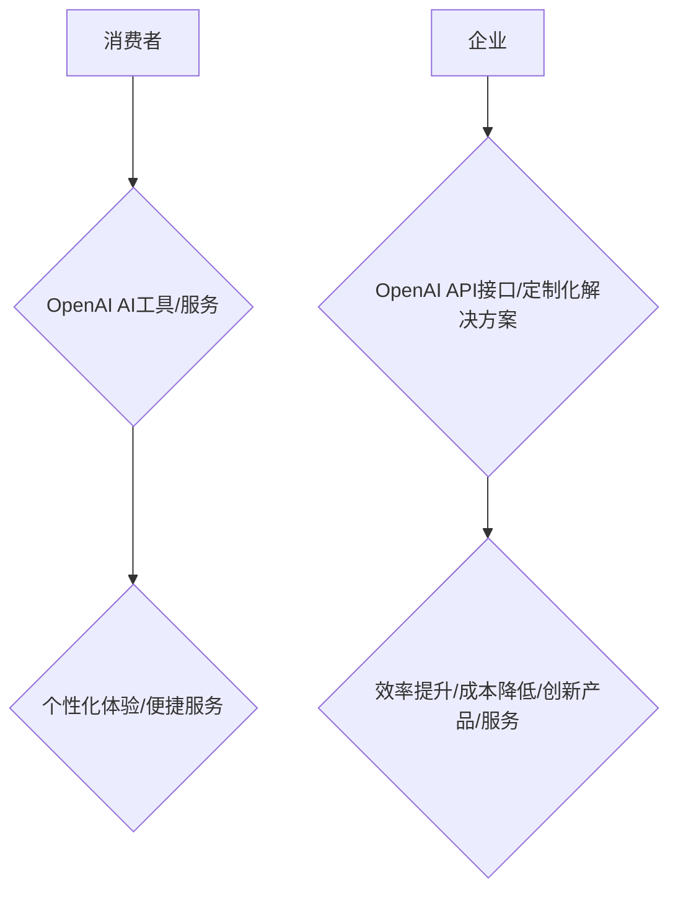

                 

## OpenAI的成功之道：贾扬清的分析，在To C和To B市场取得平衡

> 关键词：OpenAI, 贾扬清,  人工智能,  To C, To B,  市场平衡,  技术创新,  商业模式

## 1. 背景介绍

OpenAI，这家由马斯克、萨莫赫、扎克伯格等科技巨头共同创立的非营利人工智能研究公司，近年来在人工智能领域取得了令人瞩目的成就。从GPT-3的横空出世到DALL-E 2的惊艳表现，OpenAI不断突破技术边界，引领人工智能发展潮流。

然而，OpenAI的成功并非偶然。其创始人贾扬清在接受采访时曾强调，OpenAI的成功之道在于在To C（面向消费者）和To B（面向企业）市场取得平衡。

## 2. 核心概念与联系

OpenAI的商业模式的核心在于将强大的AI技术应用于不同的领域，为消费者和企业提供价值。

**To C市场:** OpenAI通过开发易于使用的AI工具和服务，例如ChatGPT、DALL-E 2等，直接面向消费者提供个性化体验和便捷服务。

**To B市场:** OpenAI通过提供API接口和定制化解决方案，帮助企业提升效率、降低成本、开发创新产品和服务。

**核心概念原理和架构的 Mermaid 流程图:**

## 3. 核心算法原理 & 具体操作步骤

OpenAI的核心算法原理主要基于深度学习，特别是Transformer模型。

### 3.1  算法原理概述

Transformer模型是一种基于注意力机制的深度神经网络架构，能够有效处理序列数据，例如文本和图像。其核心优势在于能够捕捉长距离依赖关系，并实现并行计算，从而在自然语言处理和计算机视觉等领域取得突破性进展。

### 3.2  算法步骤详解

1. **输入编码:** 将输入序列（例如文本句子）转换为向量表示。
2. **自注意力机制:** 计算每个词与其他词之间的相关性，并生成注意力权重。
3. **多头注意力:** 使用多个自注意力层，从不同的角度捕捉序列信息。
4. **前馈神经网络:** 对每个词的向量表示进行非线性变换。
5. **输出解码:** 将编码后的序列信息解码成输出序列（例如预测下一个词）。

### 3.3  算法优缺点

**优点:**

* 能够有效捕捉长距离依赖关系。
* 并行计算能力强，训练速度快。
* 在自然语言处理和计算机视觉等领域取得了突破性进展。

**缺点:**

* 参数量大，训练成本高。
* 对训练数据要求高。

### 3.4  算法应用领域

Transformer模型在自然语言处理、计算机视觉、语音识别、机器翻译等领域都有广泛应用。

## 4. 数学模型和公式 & 详细讲解 & 举例说明

Transformer模型的核心是自注意力机制，其数学公式如下：

$$
Attention(Q, K, V) = softmax(\frac{QK^T}{\sqrt{d_k}})V
$$

其中：

* $Q$：查询矩阵
* $K$：键矩阵
* $V$：值矩阵
* $d_k$：键向量的维度
* $softmax$：softmax函数

**公式推导过程:**

自注意力机制通过计算查询向量 $Q$ 与键向量 $K$ 之间的相似度，并将其作为权重来加权值向量 $V$。

**案例分析与讲解:**

例如，在机器翻译任务中，查询向量 $Q$ 表示源语言句子中的每个词，键向量 $K$ 表示目标语言词典中的每个词，值向量 $V$ 表示目标语言词典中的每个词的向量表示。

通过计算 $Q$ 与 $K$ 之间的相似度，可以找到源语言词与目标语言词之间的对应关系，并根据这些对应关系来生成目标语言句子。

## 5. 项目实践：代码实例和详细解释说明

OpenAI提供了许多开源项目和API接口，开发者可以利用这些资源进行实践。

### 5.1  开发环境搭建

OpenAI的开发环境搭建相对简单，主要需要安装Python和必要的库，例如TensorFlow或PyTorch。

### 5.2  源代码详细实现

OpenAI的源代码主要开源在GitHub平台上，开发者可以根据自己的需求选择合适的项目进行学习和修改。

### 5.3  代码解读与分析

OpenAI的代码结构清晰，注释详细，开发者可以参考代码注释进行理解和学习。

### 5.4  运行结果展示

OpenAI的项目实践可以生成各种各样的结果，例如文本生成、图像识别、语音合成等。

## 6. 实际应用场景

OpenAI的AI技术在各个领域都有广泛的应用场景。

### 6.1  教育领域

* 智能辅导系统：提供个性化的学习辅导和答疑服务。
* 自动批改系统：自动批改作业，提高教师效率。

### 6.2  医疗领域

* 疾病诊断辅助系统：辅助医生进行疾病诊断，提高诊断准确率。
* 药物研发：加速药物研发过程，降低研发成本。

### 6.3  金融领域

* 风险评估：评估投资风险，帮助投资者做出更明智的决策。
* 金融欺诈检测：识别金融欺诈行为，保护用户资产安全。

### 6.4  未来应用展望

随着人工智能技术的不断发展，OpenAI的AI技术将在更多领域得到应用，例如自动驾驶、机器人、个性化推荐等。

## 7. 工具和资源推荐

### 7.1  学习资源推荐

* OpenAI官方网站：https://openai.com/
* OpenAI博客：https://openai.com/blog/
* Transformer模型论文：https://arxiv.org/abs/1706.03762

### 7.2  开发工具推荐

* Python：https://www.python.org/
* TensorFlow：https://www.tensorflow.org/
* PyTorch：https://pytorch.org/

### 7.3  相关论文推荐

* Attention Is All You Need：https://arxiv.org/abs/1706.03762
* BERT：https://arxiv.org/abs/1810.04805
* GPT-3：https://arxiv.org/abs/2005.14165

## 8. 总结：未来发展趋势与挑战

OpenAI在人工智能领域取得了令人瞩目的成就，其成功之道在于在To C和To B市场取得平衡。未来，OpenAI将继续致力于推动人工智能技术的发展，并将其应用于更多领域，为人类社会带来更多价值。

### 8.1  研究成果总结

OpenAI在自然语言处理、计算机视觉、机器人等领域取得了突破性进展，其开发的AI模型和工具已广泛应用于各个领域。

### 8.2  未来发展趋势

* **更强大的AI模型:** OpenAI将继续开发更强大、更智能的AI模型，例如通用人工智能（AGI）。
* **更广泛的应用场景:** OpenAI的AI技术将应用于更多领域，例如医疗、教育、金融等。
* **更安全的AI系统:** OpenAI将致力于开发更安全、更可靠的AI系统，防止AI技术被滥用。

### 8.3  面临的挑战

* **数据安全和隐私保护:** AI模型的训练需要大量数据，如何保证数据安全和隐私保护是一个重要的挑战。
* **算法偏见:** AI模型可能存在算法偏见，如何解决算法偏见是一个重要的研究课题。
* **伦理问题:** AI技术的快速发展引发了许多伦理问题，例如人工智能的责任和义务、人工智能对人类社会的影响等。

### 8.4  研究展望

OpenAI将继续致力于人工智能技术的研发和应用，并与学术界、产业界和政府部门合作，推动人工智能技术的发展和应用，造福人类社会。

## 9. 附录：常见问题与解答

**Q1: OpenAI的AI技术是否开源？**

A1: OpenAI的部分项目和模型是开源的，例如GPT-2、DALL-E 2等。

**Q2: 如何使用OpenAI的API接口？**

A2: 开发者可以访问OpenAI官网获取API接口文档和使用指南。

**Q3: OpenAI的AI技术是否安全可靠？**

A3: OpenAI致力于开发安全可靠的AI系统，并采取多种措施来防止AI技术被滥用。

作者：禅与计算机程序设计艺术 / Zen and the Art of Computer Programming 
<end_of_turn>

