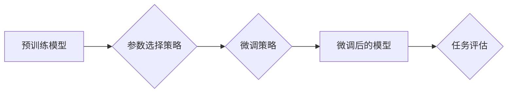

                 

## PEFT技术：高效微调大型语言模型

> 关键词：PEFT, 微调, 大模型, 效率, 参数共享, 低资源

## 1. 背景介绍

大型语言模型 (LLM) 在自然语言处理 (NLP) 领域取得了令人瞩目的成就，展现出强大的文本生成、翻译、问答和代码生成能力。然而，这些模型通常拥有数十亿甚至数千亿的参数，训练成本极高，对计算资源和数据需求也十分苛刻。因此，高效地微调预训练的 LLMs 成为一个重要的研究方向，以降低部署成本并使其更易于应用于实际场景。

PEFT (Parameter-Efficient Fine-Tuning) 技术应运而生，旨在通过精细地调整模型的一部分参数，而不是整个模型，从而实现高效的微调。这种方法显著降低了微调所需的计算资源和时间，同时保持了模型性能的优势。

## 2. 核心概念与联系

PEFT 的核心概念是**参数共享**和**局部微调**。

* **参数共享:**  PEFT 策略通常会将预训练模型的某些层冻结，只微调特定层或部分参数，从而共享大部分预训练知识，避免过拟合。
* **局部微调:**  PEFT 关注于微调与特定任务相关的参数，例如添加任务特定的嵌入层、调整分类层的权重等，从而提高模型在目标任务上的性能。

**PEFT 架构流程图:**



## 3. 核心算法原理 & 具体操作步骤

### 3.1  算法原理概述

PEFT 的核心算法原理是通过**添加可训练的适配器**来实现局部微调。适配器可以是简单的线性层、全连接层或更复杂的 Transformer 结构，它们被插入到预训练模型的特定位置，例如输入层、中间层或输出层。

通过微调适配器参数，模型可以学习到特定任务的知识，而预训练模型的权重则保持不变。这种方法可以有效地降低微调所需的计算资源和时间，同时保持模型的整体性能。

### 3.2  算法步骤详解

1. **选择预训练模型:** 选择一个与目标任务相关的预训练模型作为基础。
2. **选择参数选择策略:** 根据任务需求选择合适的参数选择策略，例如冻结所有层，只微调最后一层；冻结大部分层，只微调特定层；或使用混合策略，冻结部分层，微调部分参数。
3. **设计适配器:** 设计一个合适的适配器结构，并将其插入到预训练模型的特定位置。
4. **微调适配器:** 使用目标任务的数据对适配器进行微调，同时冻结预训练模型的权重。
5. **评估模型性能:** 使用测试集评估微调后的模型性能，并根据结果进行调整。

### 3.3  算法优缺点

**优点:**

* **效率高:** 只微调少量参数，显著降低了计算资源和时间需求。
* **性能好:** 可以保持预训练模型的整体性能，并提高模型在目标任务上的性能。
* **可解释性强:** 由于只微调部分参数，更容易理解模型的行为和决策过程。

**缺点:**

* **适配器设计:** 需要根据任务需求设计合适的适配器结构，这可能需要一定的经验和技巧。
* **参数选择:** 选择合适的参数选择策略对于模型性能至关重要，需要进行一定的实验和调优。

### 3.4  算法应用领域

PEFT 技术广泛应用于各种 NLP 任务，例如：

* **文本分类:** 微调预训练模型进行情感分析、主题分类等任务。
* **问答系统:** 微调预训练模型进行问答、信息检索等任务。
* **机器翻译:** 微调预训练模型进行不同语言之间的翻译。
* **代码生成:** 微调预训练模型进行代码生成、代码修复等任务。

## 4. 数学模型和公式 & 详细讲解 & 举例说明

### 4.1  数学模型构建

PEFT 的数学模型构建主要围绕着**适配器**的设计和训练。

假设预训练模型的输出为 $h_t$，适配器为 $A$，则微调后的模型输出为：

$$
h'_t = A(h_t)
$$

其中，$A$ 可以是一个简单的线性层，也可以是一个更复杂的 Transformer 结构。

### 4.2  公式推导过程

PEFT 的训练目标是**最小化微调后的模型在目标任务上的损失函数**。

假设目标任务的损失函数为 $L$，则训练目标为：

$$
\min_A L(h'_t, y)
$$

其中，$y$ 为目标任务的真实标签。

通过反向传播算法，可以计算出适配器参数 $A$ 的梯度，并使用梯度下降算法更新参数。

### 4.3  案例分析与讲解

例如，在文本分类任务中，PEFT 可以通过添加一个全连接层作为适配器，将预训练模型的输出映射到不同的类别。

假设预训练模型的输出维度为 $d$，类别数为 $k$，则适配器的输出维度为 $k$。

适配器的权重矩阵为 $W$，偏置项为 $b$，则适配器的输出为：

$$
h'_t = W h_t + b
$$

通过 softmax 函数将输出映射到概率分布，并使用交叉熵损失函数进行训练。

## 5. 项目实践：代码实例和详细解释说明

### 5.1  开发环境搭建

PEFT 的开发环境搭建相对简单，主要需要安装 Python 和相关的库，例如 PyTorch、Transformers 等。

### 5.2  源代码详细实现

以下是一个使用 PEFT 微调预训练模型进行文本分类的简单代码示例：

```python
from transformers import AutoModelForSequenceClassification, AutoTokenizer
from peft import LoraConfig, get_peft_model

# 加载预训练模型和 Tokenizer
model_name = "bert-base-uncased"
model = AutoModelForSequenceClassification.from_pretrained(model_name)
tokenizer = AutoTokenizer.from_pretrained(model_name)

# 配置 PEFT Lora 适配器
lora_config = LoraConfig(
    r=8,  # Lora rank
    lora_alpha=32,  # Lora alpha
    target_modules=["classifier"],  # 微调目标模块
)

# 获取 PEFT 微调后的模型
model = get_peft_model(model, lora_config)

# 训练模型
# ...

# 保存微调后的模型
model.save_pretrained("peft_model")
```

### 5.3  代码解读与分析

* 使用 `AutoModelForSequenceClassification` 和 `AutoTokenizer` 从 HuggingFace Hub 加载预训练模型和 Tokenizer。
* 使用 `LoraConfig` 配置 PEFT Lora 适配器，指定 Lora rank、alpha 和微调目标模块。
* 使用 `get_peft_model` 函数获取 PEFT 微调后的模型。
* 训练模型并保存微调后的模型。

### 5.4  运行结果展示

通过 PEFT 微调后的模型在目标任务上的性能通常会显著提升，例如在文本分类任务中，准确率、F1 分数等指标会得到提高。

## 6. 实际应用场景

PEFT 技术在实际应用场景中具有广泛的应用前景，例如：

* **个性化推荐:** 微调预训练模型进行用户个性化推荐，例如推荐商品、电影、音乐等。
* **医疗诊断:** 微调预训练模型进行疾病诊断、药物推荐等任务。
* **法律文本分析:** 微调预训练模型进行法律文本分析、合同审查等任务。
* **教育领域:** 微调预训练模型进行智能问答、个性化学习辅导等任务。

### 6.4  未来应用展望

随着大模型的发展和普及，PEFT 技术将发挥越来越重要的作用，例如：

* **更有效的参数共享策略:** 研究更有效的参数共享策略，例如动态参数共享、模块化微调等。
* **更灵活的适配器设计:** 设计更灵活的适配器结构，例如可学习的适配器、多任务适配器等。
* **低资源微调:** 研究低资源微调方法，例如迁移学习、知识蒸馏等。

## 7. 工具和资源推荐

### 7.1  学习资源推荐

* **PEFT 官方文档:** https://huggingface.co/docs/peft/index
* **PEFT GitHub 仓库:** https://github.com/huggingface/peft
* **Transformers 库文档:** https://huggingface.co/docs/transformers/index

### 7.2  开发工具推荐

* **PyTorch:** https://pytorch.org/
* **HuggingFace Transformers:** https://huggingface.co/docs/transformers/index

### 7.3  相关论文推荐

* **Parameter-Efficient Fine-Tuning for Large Language Models** (https://arxiv.org/abs/2106.09681)
* **LoRA: Low-Rank Adaptation of Large Language Models** (https://arxiv.org/abs/2106.09681)

## 8. 总结：未来发展趋势与挑战

### 8.1  研究成果总结

PEFT 技术为高效微调大型语言模型提供了有效的解决方案，显著降低了微调成本，并提高了模型在目标任务上的性能。

### 8.2  未来发展趋势

PEFT 技术的发展趋势包括：

* **更有效的参数共享策略:** 研究更有效的参数共享策略，例如动态参数共享、模块化微调等。
* **更灵活的适配器设计:** 设计更灵活的适配器结构，例如可学习的适配器、多任务适配器等。
* **低资源微调:** 研究低资源微调方法，例如迁移学习、知识蒸馏等。

### 8.3  面临的挑战

PEFT 技术也面临一些挑战，例如：

* **适配器设计:** 适配器设计需要一定的经验和技巧，如何设计更有效的适配器结构仍然是一个研究方向。
* **参数选择:** 选择合适的参数选择策略对于模型性能至关重要，需要进行一定的实验和调优。
* **可解释性:** PEFT 微调后的模型的决策过程可能难以解释，如何提高模型的可解释性是一个重要的研究方向。

### 8.4  研究展望

PEFT 技术的研究前景广阔，未来将继续推动大型语言模型在更多领域应用，并为人工智能的进一步发展做出贡献。

## 9. 附录：常见问题与解答

**Q1: PEFT 和传统微调有什么区别？**

**A1:** 传统微调需要调整整个模型的所有参数，而 PEFT 只微调部分参数，例如适配器，从而降低了计算资源和时间需求。

**Q2: 如何选择合适的 PEFT 策略？**

**A2:** 选择合适的 PEFT 策略需要根据任务需求和模型结构进行选择。例如，对于文本分类任务，可以使用 Lora 适配器微调分类层；对于机器翻译任务，可以使用 Adapter 微调编码器和解码器。

**Q3: PEFT 技术的局限性是什么？**

**A3:** PEFT 技术的局限性包括：

* 适配器设计需要一定的经验和技巧。
* 选择合适的参数选择策略需要进行一定的实验和调优。
* PEFT 微调后的模型的决策过程可能难以解释。


作者：禅与计算机程序设计艺术 / Zen and the Art of Computer Programming 
<end_of_turn>

