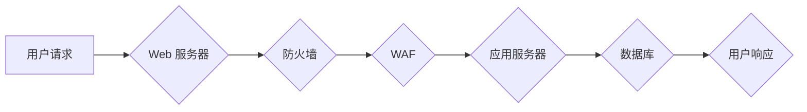

                 

## Web 安全策略实施：保护网站和应用程序免受威胁

> 关键词：Web 安全、安全策略、威胁模型、漏洞扫描、入侵检测、安全意识培训、数据加密、访问控制、代码审计、持续安全

## 1. 背景介绍

随着互联网的蓬勃发展，网站和应用程序已成为人们生活和工作的重要组成部分。然而，随着网络攻击的日益复杂化和频繁化，网站和应用程序的安全问题也日益突出。数据泄露、系统瘫痪、勒索软件攻击等安全事件频发，给个人、企业和社会造成巨大损失。因此，制定和实施有效的 Web 安全策略至关重要，以保护网站和应用程序免受各种威胁。

## 2. 核心概念与联系

### 2.1 Web 安全威胁模型

Web 安全威胁模型是分析和评估网站和应用程序安全风险的框架。它识别潜在的攻击者、攻击目标、攻击手段和攻击后果，帮助组织制定针对性的安全措施。常见的 Web 安全威胁包括：

* **跨站脚本攻击 (XSS)：**攻击者注入恶意代码到网站，以窃取用户数据或执行其他恶意操作。
* **SQL 注入攻击：**攻击者利用漏洞向数据库注入恶意 SQL 代码，以窃取数据或破坏数据库。
* **跨站请求伪造 (CSRF)：**攻击者诱骗用户执行未经授权的操作，例如转账或修改个人信息。
* **拒绝服务攻击 (DoS)：**攻击者发送大量请求，使网站或应用程序无法正常运行。

### 2.2 Web 安全架构

Web 安全架构是指为保护网站和应用程序安全而设计的系统结构和组件。常见的 Web 安全架构包括：

* **防火墙：**过滤网络流量，阻止恶意请求。
* **入侵检测系统 (IDS)：**监控网络活动，检测可疑行为。
* **Web 应用防火墙 (WAF)：**专门针对 Web 应用的攻击进行防护。
* **身份验证和授权系统：**控制用户访问网站和应用程序的权限。
* **数据加密：**保护敏感数据不被窃取。

**Mermaid 流程图**



## 3. 核心算法原理 & 具体操作步骤

### 3.1 算法原理概述

Web 安全策略的实施涉及多种算法和技术，例如：

* **哈希算法：**用于加密密码和敏感数据，防止数据泄露。
* **数字签名算法：**用于验证数据来源和完整性，防止数据篡改。
* **加密算法：**用于保护数据传输安全，防止数据被窃听。
* **身份验证算法：**用于验证用户身份，防止未经授权的访问。

### 3.2 算法步骤详解

具体算法的步骤详解取决于具体的算法类型和应用场景。例如，SHA-256 哈希算法的步骤如下：

1. 将输入数据分成块，每个块大小为512位。
2. 对每个块进行一系列的循环运算，使用特定的哈希函数。
3. 将所有块的运算结果合并，得到最终的哈希值。

### 3.3 算法优缺点

不同的算法具有不同的优缺点，需要根据实际应用场景选择合适的算法。例如，SHA-256 算法具有安全性高、速度快的特点，但其哈希值长度较短，容易受到碰撞攻击。

### 3.4 算法应用领域

Web 安全策略的实施涉及多种算法的应用，例如：

* **密码管理：**使用哈希算法加密用户密码，防止密码泄露。
* **数据加密：**使用加密算法保护敏感数据传输安全。
* **数字签名：**使用数字签名算法验证数据来源和完整性。
* **身份验证：**使用身份验证算法验证用户身份，防止未经授权的访问。

## 4. 数学模型和公式 & 详细讲解 & 举例说明

### 4.1 数学模型构建

Web 安全策略的实施可以利用数学模型来分析和评估风险。例如，可以使用贝叶斯网络模型来表示网站和应用程序的安全状态，以及各种攻击事件发生的概率。

### 4.2 公式推导过程

贝叶斯网络模型中的概率计算可以使用贝叶斯公式进行推导。贝叶斯公式如下：

$$P(A|B) = \frac{P(B|A)P(A)}{P(B)}$$

其中：

* $P(A|B)$ 是事件 A 在事件 B 发生条件下的概率。
* $P(B|A)$ 是事件 B 在事件 A 发生条件下的概率。
* $P(A)$ 是事件 A 的概率。
* $P(B)$ 是事件 B 的概率。

### 4.3 案例分析与讲解

例如，假设我们想要计算在网站被攻击的情况下，用户数据泄露的概率。我们可以使用贝叶斯网络模型和贝叶斯公式进行计算。

* 事件 A：用户数据泄露。
* 事件 B：网站被攻击。

我们可以根据历史数据和专家知识，估计事件 A 和事件 B 的概率，以及事件 B 发生的情况下事件 A 发生的概率。然后，我们可以使用贝叶斯公式计算事件 A 在事件 B 发生条件下的概率，即用户数据泄露的概率。

## 5. 项目实践：代码实例和详细解释说明

### 5.1 开发环境搭建

Web 安全策略的实施需要使用多种开发工具和技术。例如，可以使用 Python 语言编写 Web 应用安全测试脚本，可以使用 OWASP ZAP 工具进行漏洞扫描，可以使用 Burp Suite 工具进行渗透测试。

### 5.2 源代码详细实现

以下是一个简单的 Python 代码示例，用于检测网站是否存在 XSS 漏洞：

```python
import requests

def check_xss(url):
    payload = "<script>alert('XSS')</script>"
    response = requests.get(url + "?" + payload)
    if "XSS" in response.text:
        return True
    else:
        return False

url = "https://www.example.com"
if check_xss(url):
    print("网站存在 XSS 漏洞")
else:
    print("网站不存在 XSS 漏洞")
```

### 5.3 代码解读与分析

该代码首先定义了一个函数 `check_xss`，该函数接受一个网站 URL 作为参数。然后，它构造了一个包含恶意脚本的 payload，并将其添加到 URL 中。最后，它发送一个 GET 请求到网站，并检查响应文本中是否包含 "XSS" 字符串。如果包含，则表示网站存在 XSS 漏洞。

### 5.4 运行结果展示

运行该代码后，如果网站存在 XSS 漏洞，则会输出 "网站存在 XSS 漏洞" 的信息。否则，则会输出 "网站不存在 XSS 漏洞" 的信息。

## 6. 实际应用场景

Web 安全策略的实施在各种实际应用场景中都有重要意义，例如：

* **电商网站：**保护用户支付信息和个人信息安全。
* **金融网站：**防止金融诈骗和数据泄露。
* **医疗网站：**保护患者隐私和医疗数据安全。
* **政府网站：**维护国家安全和信息安全。

### 6.4 未来应用展望

随着互联网技术的不断发展，Web 安全威胁也日益复杂化。未来，Web 安全策略的实施将更加注重以下方面：

* **人工智能和机器学习：**利用人工智能和机器学习技术，提高安全检测和响应能力。
* **云安全：**针对云计算环境的安全风险，制定相应的安全策略。
* **物联网安全：**保护物联网设备的安全，防止攻击和数据泄露。

## 7. 工具和资源推荐

### 7.1 学习资源推荐

* OWASP 网站：https://owasp.org/
* SANS Institute：https://www.sans.org/
* NIST Cybersecurity Framework：https://www.nist.gov/cyberframework

### 7.2 开发工具推荐

* OWASP ZAP：https://owasp.org/www-project-zap/
* Burp Suite：https://portswigger.net/burp
* Nessus：https://www.tenable.com/products/nessus

### 7.3 相关论文推荐

* The Web Application Hacker's Handbook: Finding and Exploiting Security Flaws
* OWASP Top 10: 2021
* Secure Coding Practices for Web Applications

## 8. 总结：未来发展趋势与挑战

### 8.1 研究成果总结

Web 安全策略的实施取得了显著成果，有效地降低了网站和应用程序的安全风险。

### 8.2 未来发展趋势

未来，Web 安全策略的实施将更加注重人工智能、机器学习、云安全和物联网安全等新兴技术。

### 8.3 面临的挑战

Web 安全威胁不断演变，新的攻击手段和漏洞不断涌现，Web 安全策略的实施面临着持续的挑战。

### 8.4 研究展望

未来，需要不断研究和开发新的 Web 安全技术和策略，以应对不断变化的网络安全威胁。

## 9. 附录：常见问题与解答

### 9.1 如何选择合适的 Web 安全策略？

选择合适的 Web 安全策略需要根据组织的具体情况和需求进行评估。需要考虑组织的规模、业务类型、敏感数据类型、预算等因素。

### 9.2 如何实施 Web 安全策略？

实施 Web 安全策略需要多方面的努力，包括：

* 建立安全意识培训体系。
* 采用安全编码规范。
* 使用安全工具和技术。
* 定期进行安全评估和测试。

### 9.3 如何应对 Web 安全威胁？

应对 Web 安全威胁需要采取多重防御措施，包括：

* 防火墙、入侵检测系统等基础安全措施。
* 代码审计、漏洞扫描等主动防御措施。
* 安全事件响应计划等被动防御措施。


作者：禅与计算机程序设计艺术 / Zen and the Art of Computer Programming 
<end_of_turn>

