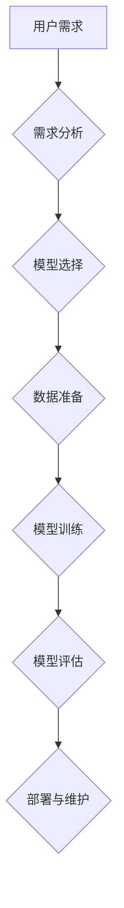

                 

## 个性化AIGC应用定制指南

> 关键词：AIGC, 个性化, 应用定制, 深度学习, 自然语言处理, 图像生成, 算法原理, 项目实践, 未来趋势

## 1. 背景介绍

近年来，人工智能（AI）技术取得了飞速发展，特别是生成式人工智能（AIGC）的兴起，为人们的生活和工作带来了革命性的改变。AIGC能够根据输入的文本、代码、图像等数据生成新的内容，例如文本、代码、图像、音频等，其应用场景广泛，涵盖了创作、教育、娱乐、商业等各个领域。

然而，现有的AIGC模型往往是通用的，缺乏针对特定应用场景的个性化定制能力。随着对个性化需求的不断增高，如何将AIGC技术应用于特定场景，并根据用户需求进行个性化定制，成为一个重要的研究方向。

## 2. 核心概念与联系

**2.1 个性化AIGC**

个性化AIGC是指根据用户的特定需求和偏好，对AIGC模型进行定制，使其能够生成更符合用户期望的内容。个性化定制可以体现在多个方面，例如：

* **内容风格:** 用户可以指定生成内容的风格，例如正式、幽默、专业等。
* **内容主题:** 用户可以指定生成内容的主题，例如新闻、科技、娱乐等。
* **内容格式:** 用户可以指定生成内容的格式，例如文本、代码、图像等。
* **内容质量:** 用户可以指定生成内容的质量标准，例如准确性、流畅度、原创性等。

**2.2 AIGC应用定制流程**

个性化AIGC应用定制流程通常包括以下几个步骤：

1. **需求分析:** 首先需要对用户的需求进行详细分析，了解用户的具体需求和偏好。
2. **模型选择:** 根据用户的需求选择合适的AIGC模型。
3. **数据准备:** 为模型提供个性化的训练数据，例如用户偏好的文本、代码、图像等。
4. **模型训练:** 使用个性化的训练数据对模型进行训练，使其能够生成符合用户期望的内容。
5. **模型评估:** 对训练后的模型进行评估，确保其能够满足用户的需求。
6. **部署与维护:** 将训练好的模型部署到实际应用场景中，并进行持续的维护和更新。

**2.3 AIGC应用定制架构**



## 3. 核心算法原理 & 具体操作步骤

**3.1 算法原理概述**

个性化AIGC应用定制的核心算法通常基于深度学习技术，特别是自然语言处理（NLP）和计算机视觉（CV）领域。常用的算法包括：

* **Transformer网络:** Transformer网络是一种强大的NLP模型，能够捕捉文本序列中的长距离依赖关系，广泛应用于文本生成、机器翻译、文本摘要等任务。
* **生成对抗网络（GAN）：** GAN是一种生成模型，由生成器和判别器两部分组成，通过对抗训练的方式生成逼真的数据，广泛应用于图像生成、文本生成、音频生成等任务。
* **变分自编码器（VAE）：** VAE是一种生成模型，通过学习数据的潜在表示来生成新的数据，广泛应用于图像生成、文本生成、数据降维等任务。

**3.2 算法步骤详解**

具体的操作步骤取决于选择的算法和应用场景，但一般包括以下几个步骤：

1. **数据收集和预处理:** 收集与应用场景相关的训练数据，并进行预处理，例如文本清洗、数据标注、数据增强等。
2. **模型选择和架构设计:** 根据应用场景选择合适的深度学习模型，并进行架构设计，例如调整模型参数、添加新的层结构等。
3. **模型训练:** 使用训练数据对模型进行训练，并通过评估指标来监控模型的性能。
4. **模型评估和优化:** 对训练后的模型进行评估，并根据评估结果进行模型优化，例如调整模型参数、增加训练数据等。
5. **模型部署和应用:** 将训练好的模型部署到实际应用场景中，并进行持续的监控和维护。

**3.3 算法优缺点**

* **优点:**

    * 能够生成高质量、个性化的内容。
    * 能够适应不同的应用场景。
    * 能够不断学习和改进。

* **缺点:**

    * 需要大量的训练数据。
    * 模型训练成本较高。
    * 模型解释性较差。

**3.4 算法应用领域**

个性化AIGC应用定制技术在各个领域都有广泛的应用，例如：

* **教育:** 个性化学习辅导、智能答疑系统、自动生成学习材料等。
* **娱乐:** 个性化游戏体验、智能剧本创作、虚拟偶像等。
* **商业:** 个性化营销推广、智能客服系统、自动生成产品描述等。
* **医疗:** 个性化医疗诊断、智能病历分析、自动生成医疗报告等。

## 4. 数学模型和公式 & 详细讲解 & 举例说明

**4.1 数学模型构建**

个性化AIGC应用定制的数学模型通常基于概率论和统计学，例如贝叶斯网络、隐马尔可夫模型等。这些模型能够学习数据之间的关系，并根据输入的数据生成相应的输出。

**4.2 公式推导过程**

例如，在文本生成任务中，可以使用Transformer网络的注意力机制来学习文本序列中的长距离依赖关系。注意力机制的计算公式如下：

$$
Attention(Q, K, V) = softmax(\frac{QK^T}{\sqrt{d_k}})V
$$

其中：

* $Q$ 是查询矩阵。
* $K$ 是键矩阵。
* $V$ 是值矩阵。
* $d_k$ 是键向量的维度。

**4.3 案例分析与讲解**

假设我们想要构建一个个性化新闻推荐系统。我们可以使用贝叶斯网络来建模用户和新闻之间的关系。用户特征包括年龄、性别、兴趣爱好等，新闻特征包括主题、作者、时间等。贝叶斯网络可以学习用户特征和新闻特征之间的概率关系，并根据用户的历史阅读记录预测用户可能感兴趣的新闻。

## 5. 项目实践：代码实例和详细解释说明

**5.1 开发环境搭建**

个性化AIGC应用定制项目通常需要使用Python语言和相关的深度学习框架，例如TensorFlow、PyTorch等。

**5.2 源代码详细实现**

以下是一个简单的文本生成示例代码，使用PyTorch框架实现：

```python
import torch
import torch.nn as nn

class TextGenerator(nn.Module):
    def __init__(self, vocab_size, embedding_dim, hidden_dim):
        super(TextGenerator, self).__init__()
        self.embedding = nn.Embedding(vocab_size, embedding_dim)
        self.lstm = nn.LSTM(embedding_dim, hidden_dim)
        self.fc = nn.Linear(hidden_dim, vocab_size)

    def forward(self, x):
        embedded = self.embedding(x)
        output, (hidden, cell) = self.lstm(embedded)
        output = self.fc(output[:, -1, :])
        return output

# ... 模型训练和评估代码 ...
```

**5.3 代码解读与分析**

该代码实现了一个简单的文本生成模型，包含三个主要部分：

* **Embedding层:** 将单词转换为向量表示。
* **LSTM层:** 学习文本序列中的长距离依赖关系。
* **全连接层:** 将LSTM输出映射到单词的概率分布。

**5.4 运行结果展示**

训练好的模型可以用于生成新的文本内容。例如，可以输入一个起始词，模型会根据训练数据生成后续的词语，最终生成一段完整的文本。

## 6. 实际应用场景

**6.1 个性化教育**

个性化AIGC可以用于生成个性化的学习材料，例如根据学生的学习进度和知识点生成相应的习题和练习，或者根据学生的学习风格生成不同的学习内容。

**6.2 个性化娱乐**

个性化AIGC可以用于生成个性化的游戏体验，例如根据玩家的喜好生成不同的游戏场景和任务，或者根据玩家的游戏行为生成个性化的游戏剧情。

**6.3 个性化营销**

个性化AIGC可以用于生成个性化的营销推广内容，例如根据用户的兴趣爱好生成个性化的广告，或者根据用户的购买历史生成个性化的产品推荐。

**6.4 未来应用展望**

随着AIGC技术的不断发展，个性化AIGC应用将更加广泛，例如：

* **个性化医疗:** 根据患者的病史和基因信息生成个性化的医疗方案。
* **个性化法律服务:** 根据用户的法律问题生成个性化的法律建议。
* **个性化艺术创作:** 根据用户的喜好生成个性化的艺术作品。

## 7. 工具和资源推荐

**7.1 学习资源推荐**

* **书籍:**

    * 《深度学习》
    * 《自然语言处理》
    * 《生成对抗网络》

* **在线课程:**

    * Coursera
    * edX
    * Udacity

**7.2 开发工具推荐**

* **深度学习框架:** TensorFlow、PyTorch、Keras
* **文本处理工具:** NLTK、spaCy
* **图像处理工具:** OpenCV、Pillow

**7.3 相关论文推荐**

* 《Attention Is All You Need》
* 《Generative Adversarial Networks》
* 《Variational Autoencoders》

## 8. 总结：未来发展趋势与挑战

**8.1 研究成果总结**

个性化AIGC应用定制技术取得了显著的进展，能够生成高质量、个性化的内容，并应用于多个领域。

**8.2 未来发展趋势**

未来，个性化AIGC应用定制技术将朝着以下几个方向发展：

* **更强大的模型:** 开发更强大的深度学习模型，能够学习更复杂的数据关系，生成更逼真的内容。
* **更个性化的定制:** 更加细粒度的个性化定制，例如根据用户的实时情绪生成不同的内容。
* **更广泛的应用场景:** 将个性化AIGC应用于更多领域，例如医疗、法律、艺术等。

**8.3 面临的挑战**

个性化AIGC应用定制技术也面临一些挑战：

* **数据隐私:** 个性化AIGC需要大量用户数据，如何保护用户隐私是一个重要的挑战。
* **模型解释性:** 深度学习模型的决策过程难以解释，如何提高模型的解释性是一个重要的研究方向。
* **伦理问题:** 个性化AIGC可能带来一些伦理问题，例如内容偏见、信息操控等，需要进行深入的伦理探讨。

**8.4 研究展望**

未来，需要加强对个性化AIGC应用定制技术的研究，解决技术挑战，并探索其在各个领域的应用潜力，推动其健康发展。

## 9. 附录：常见问题与解答

**9.1 如何选择合适的AIGC模型？**

选择合适的AIGC模型取决于具体的应用场景和需求。例如，对于文本生成任务，可以选择Transformer网络；对于图像生成任务，可以选择GAN网络。

**9.2 如何进行个性化数据准备？**

个性化数据准备需要根据用户的需求收集和预处理数据。例如，对于个性化新闻推荐系统，需要收集用户的阅读记录、兴趣爱好等数据。

**9.3 如何评估个性化AIGC模型的性能？**

个性化AIGC模型的性能可以根据具体的应用场景进行评估。例如，对于文本生成任务，可以使用BLEU、ROUGE等指标进行评估；对于图像生成任务，可以使用PSNR、SSIM等指标进行评估。


作者：禅与计算机程序设计艺术 / Zen and the Art of Computer Programming 
<end_of_turn>

