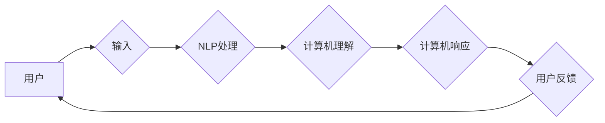

                 

## 人机交互：未来趋势与展望

> 关键词： 人机交互、自然语言处理、人工智能、增强现实、虚拟现实、情感计算、跨模态交互、可穿戴设备

## 1. 背景介绍

人机交互（Human-Computer Interaction，HCI）是计算机科学的一个重要分支，它研究用户与计算机之间交互的方式和体验。随着科技的飞速发展，人机交互技术不断革新，从传统的鼠标键盘输入到语音、手势、生物识别等更加自然、便捷的方式，正在改变我们与数字世界的互动方式。

早期的人机交互主要依赖于命令行界面和图形用户界面，用户需要通过特定的指令或操作来与计算机进行交互。随着人工智能（AI）和自然语言处理（NLP）技术的进步，人机交互逐渐向更加自然、智能的方向发展。如今，我们能够通过语音、文字、图像等多种方式与计算机进行交流，计算机也能理解我们的意图并提供相应的反馈。

## 2. 核心概念与联系

### 2.1 人机交互模型

人机交互模型是描述用户与计算机之间交互过程的框架。常见的模型包括：

* **信息处理模型:** 将用户和计算机视为信息处理系统，强调信息的传递和处理过程。
* **认知模型:**  关注用户的认知过程，例如感知、记忆、决策等，试图理解用户如何理解和使用计算机。
* **社会文化模型:**  强调人际交往和社会文化背景对人机交互的影响。

### 2.2 核心技术

人机交互的核心技术包括：

* **自然语言处理 (NLP):** 使计算机能够理解和生成人类语言。
* **计算机视觉:** 使计算机能够“看”图像和视频，并从中提取信息。
* **语音识别和合成:** 使计算机能够识别和生成语音。
* **情感计算:**  使计算机能够识别和理解人类的情感。
* **增强现实 (AR) 和虚拟现实 (VR):**  创建沉浸式交互体验。

**Mermaid 流程图**



## 3. 核心算法原理 & 具体操作步骤

### 3.1 算法原理概述

自然语言处理 (NLP) 算法是人机交互的核心技术之一，它使计算机能够理解和生成人类语言。常见的 NLP 算法包括：

* **词嵌入:** 将单词映射到向量空间，捕捉单词之间的语义关系。
* **序列标注:**  对文本序列进行标记，例如词性标注、命名实体识别等。
* **机器翻译:** 将文本从一种语言翻译成另一种语言。
* **文本摘要:**  生成文本的简短摘要。
* **对话系统:**  与用户进行自然语言对话。

### 3.2 算法步骤详解

以词嵌入算法为例，其具体操作步骤如下：

1. **构建词典:**  从训练数据中收集所有出现的单词，并将其组成一个词典。
2. **创建词向量:**  为每个单词分配一个向量，该向量代表单词的语义信息。
3. **训练词向量模型:**  使用训练数据训练词向量模型，例如 Word2Vec 或 GloVe。
4. **获取词向量:**  根据训练好的模型，可以获取任意单词的词向量。

### 3.3 算法优缺点

**优点:**

* 可以捕捉单词之间的语义关系。
* 可以用于多种 NLP 任务，例如机器翻译、文本分类等。

**缺点:**

* 需要大量的训练数据。
* 对于罕见单词的表示可能不够准确。

### 3.4 算法应用领域

词嵌入算法广泛应用于以下领域：

* **搜索引擎:**  提高搜索结果的准确性。
* **机器翻译:**  提高机器翻译的质量。
* **文本分类:**  自动分类文本内容。
* **情感分析:**  分析文本的情感倾向。

## 4. 数学模型和公式 & 详细讲解 & 举例说明

### 4.1 数学模型构建

词嵌入模型通常使用神经网络结构，例如 Word2Vec 的 CBOW 模型。CBOW 模型将上下文词向量相加，作为目标词的预测输入。

### 4.2 公式推导过程

CBOW 模型的目标是预测目标词，给定其上下文词。模型的损失函数为交叉熵损失函数，其公式如下：

$$
L = -\sum_{i=1}^{N} \log p(w_i | w_{context})
$$

其中：

* $N$ 为目标词的词典大小。
* $w_i$ 为目标词。
* $w_{context}$ 为目标词的上下文词。
* $p(w_i | w_{context})$ 为目标词 $w_i$ 在给定上下文词 $w_{context}$ 的条件概率。

### 4.3 案例分析与讲解

假设我们有一个句子 "The cat sat on the mat"，目标词为 "cat"，上下文词为 "The" 和 "sat"。CBOW 模型将 "The" 和 "sat" 的词向量相加，作为 "cat" 的预测输入。模型训练完成后，可以获取 "cat" 的词向量，该词向量可以用于其他 NLP 任务，例如机器翻译或文本分类。

## 5. 项目实践：代码实例和详细解释说明

### 5.1 开发环境搭建

* Python 3.x
* TensorFlow 或 PyTorch
* NLTK 或 spaCy

### 5.2 源代码详细实现

```python
import tensorflow as tf

# 定义词嵌入层
embedding_layer = tf.keras.layers.Embedding(input_dim=vocab_size, output_dim=embedding_dim)

# 定义 CBOW 模型
model = tf.keras.Sequential([
    embedding_layer,
    tf.keras.layers.AveragePooling1D(),
    tf.keras.layers.Dense(units=1, activation='softmax')
])

# 编译模型
model.compile(optimizer='adam', loss='sparse_categorical_crossentropy', metrics=['accuracy'])

# 训练模型
model.fit(x_train, y_train, epochs=10)

# 预测目标词
predictions = model.predict(x_test)
```

### 5.3 代码解读与分析

* `embedding_layer`: 定义词嵌入层，将单词映射到向量空间。
* `AveragePooling1D()`: 对上下文词向量进行平均池化，得到一个固定长度的向量。
* `Dense(units=1, activation='softmax')`: 全连接层，输出目标词的概率分布。
* `model.compile()`: 编译模型，指定优化器、损失函数和评估指标。
* `model.fit()`: 训练模型，使用训练数据进行训练。
* `model.predict()`: 使用训练好的模型预测目标词。

### 5.4 运行结果展示

训练完成后，可以评估模型的性能，例如准确率。

## 6. 实际应用场景

### 6.1 智能客服

* 使用 NLP 算法，使聊天机器人能够理解用户的自然语言请求，并提供相应的帮助。

### 6.2 语音助手

* 使用语音识别和合成技术，使用户能够通过语音与设备进行交互。

### 6.3 个性化推荐

* 使用用户行为数据和机器学习算法，为用户提供个性化的产品或内容推荐。

### 6.4 医疗诊断

* 使用机器学习算法，分析患者的医疗记录和症状，辅助医生进行诊断。

### 6.5 教育辅助

* 使用 AR/VR 技术，创建沉浸式的学习环境，提高学生的学习兴趣和效果。

## 7. 工具和资源推荐

### 7.1 学习资源推荐

* **书籍:**
    * 人机交互设计
    * 自然语言处理
    * 人工智能
* **在线课程:**
    * Coursera
    * edX
    * Udacity

### 7.2 开发工具推荐

* **Python:**
    * TensorFlow
    * PyTorch
    * NLTK
    * spaCy
* **AR/VR 开发平台:**
    * Unity
    * Unreal Engine

### 7.3 相关论文推荐

* **ACL:** Association for Computational Linguistics
* **EMNLP:** Empirical Methods in Natural Language Processing
* **NAACL:** North American Chapter of the Association for Computational Linguistics

## 8. 总结：未来发展趋势与挑战

### 8.1 研究成果总结

近年来，人机交互技术取得了显著进展，例如：

* 自然语言处理算法的性能大幅提升。
* AR/VR 技术更加成熟。
* 人机交互设备更加多样化。

### 8.2 未来发展趋势

* **更加自然、智能的人机交互:**  例如，基于情感计算的人机交互，以及更加灵活、适应性的交互方式。
* **跨模态交互:**  融合多种交互方式，例如语音、图像、触觉等，创造更加丰富的交互体验。
* **个性化、定制化的人机交互:**  根据用户的需求和偏好，提供个性化的交互体验。

### 8.3 面临的挑战

* **数据隐私和安全:**  人机交互需要收集大量的用户数据，如何保护用户隐私和数据安全是一个重要挑战。
* **算法公平性:**  人机交互算法可能存在偏见，如何确保算法公平性是一个重要的研究方向。
* **伦理问题:**  人机交互技术的发展可能带来一些伦理问题，例如人工智能的责任和义务，需要进行深入的探讨和研究。

### 8.4 研究展望

未来，人机交互技术将继续发展，为我们带来更加便捷、智能、丰富的数字体验。我们需要加强对人机交互技术的研究，解决面临的挑战，并确保其健康、可持续发展。

## 9. 附录：常见问题与解答

* **Q1: 什么是人机交互？**

* **A1:** 人机交互是指用户与计算机之间交互的方式和体验。

* **Q2: 人机交互有哪些核心技术？**

* **A2:** 人机交互的核心技术包括自然语言处理、计算机视觉、语音识别和合成、情感计算等。

* **Q3: 人机交互有哪些应用场景？**

* **A3:** 人机交互广泛应用于智能客服、语音助手、个性化推荐、医疗诊断、教育辅助等领域。


作者：禅与计算机程序设计艺术 / Zen and the Art of Computer Programming 
<end_of_turn>

