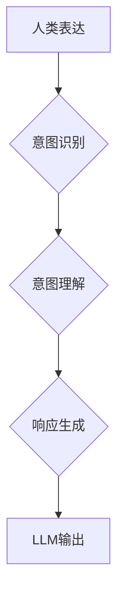

                 

## 人类意图与LLM对齐的挑战

> 关键词：大型语言模型 (LLM)、人类意图、模型对齐、伦理问题、可解释性、安全问题、未来发展

### 1. 背景介绍

近年来，大型语言模型 (LLM) 在自然语言处理领域取得了令人瞩目的成就。从文本生成、翻译到对话系统，LLM展现出强大的能力，并逐渐渗透到我们的日常生活。然而，LLM的强大也带来了新的挑战，其中最关键的便是如何有效地将人类意图与模型输出对齐。

人类意图是人类行为背后的动机和目标，它往往是复杂、多层次、甚至是模糊的。而LLM则基于大量的文本数据进行训练，学习了语言的统计规律和模式。尽管LLM能够生成看似合理的文本，但其内部机制难以完全捕捉人类意图的复杂性。

当人类与LLM进行交互时，人类往往期望LLM能够理解其深层意图，并提供符合预期、有价值的响应。然而，由于意图对齐问题，LLM可能产生误解、偏差甚至有害的输出，这不仅影响了用户体验，也引发了伦理和安全方面的担忧。

### 2. 核心概念与联系

**2.1  人类意图**

人类意图是人类行为背后的动机和目标，它往往是复杂、多层次、甚至是模糊的。人类意图的表达方式多种多样，包括：

* **直接表达:** 明确陈述自己的目标或需求。例如：“我想订购一杯咖啡。”
* **间接表达:** 通过暗示、比喻或隐喻表达意图。例如：“我感觉很疲惫，需要点精神。”
* **混合表达:** 将直接表达和间接表达结合起来。例如：“我想喝一杯咖啡，能给我提提神吗？”

**2.2  LLM**

大型语言模型 (LLM) 是基于深度学习算法训练的强大人工智能模型，能够理解和生成人类语言。LLM通常由 Transformer 架构构成，并通过大量的文本数据进行预训练。

**2.3  意图对齐**

意图对齐是指使LLM能够准确理解人类意图，并生成符合预期、有价值的响应。这是一个复杂而具有挑战性的问题，需要考虑以下几个方面：

* **意图识别:** 识别人类表达中的意图，例如请求、询问、陈述等。
* **意图理解:** 深入理解人类意图背后的动机和目标，例如用户想要什么、为什么想要。
* **响应生成:** 根据理解的人类意图，生成符合预期、有价值的响应。

**2.4  Mermaid 流程图**



### 3. 核心算法原理 & 具体操作步骤

**3.1  算法原理概述**

LLM的训练过程本质上是通过优化模型参数，使得模型能够预测下一个词的概率。在训练过程中，模型会学习到语言的统计规律和模式，从而能够生成流畅、合理的文本。

然而，LLM的训练目标并不直接包含意图对齐。为了解决意图对齐问题，需要引入额外的模块和算法，例如：

* **意图分类模型:** 使用监督学习算法，训练一个模型能够识别人类表达中的意图类别。
* **意图理解模型:** 使用深度学习算法，训练一个模型能够理解人类意图背后的动机和目标。
* **响应生成模型:** 使用强化学习算法，训练一个模型能够根据理解的人类意图，生成符合预期、有价值的响应。

**3.2  算法步骤详解**

1. **数据预处理:** 收集人类表达和对应的意图标签的数据集。对数据进行清洗、格式化和编码。
2. **意图分类模型训练:** 使用监督学习算法，例如支持向量机 (SVM) 或随机森林 (RF)，训练一个意图分类模型。
3. **意图理解模型训练:** 使用深度学习算法，例如循环神经网络 (RNN) 或 Transformer，训练一个意图理解模型。
4. **响应生成模型训练:** 使用强化学习算法，例如策略梯度 (PG) 或深度Q网络 (DQN)，训练一个响应生成模型。
5. **模型评估:** 使用测试数据集评估模型的性能，例如准确率、召回率和F1-score。
6. **模型调优:** 根据评估结果，调整模型参数和训练策略，提高模型性能。

**3.3  算法优缺点**

* **优点:**

    * 能够有效地识别和理解人类意图。
    * 可以生成符合预期、有价值的响应。
    * 能够适应不同的应用场景。

* **缺点:**

    * 需要大量的训练数据。
    * 模型训练复杂，需要专业的技术人员。
    * 模型性能受数据质量和训练策略影响较大。

**3.4  算法应用领域**

* **对话系统:** 使对话系统能够更好地理解用户的意图，并提供更自然、更人性化的交互体验。
* **搜索引擎:** 提高搜索引擎的准确性和相关性，更好地满足用户的搜索需求。
* **客户服务:** 自动化客户服务流程，提高服务效率和客户满意度。
* **教育:** 提供个性化的学习体验，帮助学生更好地理解和掌握知识。

### 4. 数学模型和公式 & 详细讲解 & 举例说明

**4.1  数学模型构建**

意图对齐问题可以建模为一个概率问题。假设人类表达为输入序列 $x = (x_1, x_2, ..., x_n)$，意图为输出类别 $y \in \{y_1, y_2, ..., y_m\}$。

我们可以使用条件概率来表示模型对给定输入序列 $x$ 的意图 $y$ 的预测：

$$P(y|x) = \frac{P(x|y)P(y)}{P(x)}$$

其中：

* $P(x|y)$ 是给定意图 $y$ 下，观察到输入序列 $x$ 的概率。
* $P(y)$ 是意图 $y$ 的先验概率。
* $P(x)$ 是观察到输入序列 $x$ 的概率。

**4.2  公式推导过程**

为了计算 $P(x|y)$，我们可以使用语言模型来估计给定意图 $y$ 下，生成输入序列 $x$ 的概率。语言模型通常使用神经网络架构，例如 Transformer，来学习语言的统计规律和模式。

**4.3  案例分析与讲解**

假设我们有一个意图分类模型，能够识别人类表达中的意图类别。例如，模型能够识别“我想喝一杯咖啡”的意图为“订购”。

我们可以使用上述公式来计算模型对给定输入序列 “我想喝一杯咖啡” 的意图 “订购” 的预测概率。

### 5. 项目实践：代码实例和详细解释说明

**5.1  开发环境搭建**

* Python 3.7+
* TensorFlow 或 PyTorch
* CUDA 和 cuDNN (可选，用于GPU加速)

**5.2  源代码详细实现**

```python
# 导入必要的库
import tensorflow as tf

# 定义一个简单的意图分类模型
model = tf.keras.models.Sequential([
    tf.keras.layers.Embedding(input_dim=vocab_size, output_dim=embedding_dim),
    tf.keras.layers.LSTM(units=128),
    tf.keras.layers.Dense(units=num_classes, activation='softmax')
])

# 编译模型
model.compile(optimizer='adam',
              loss='sparse_categorical_crossentropy',
              metrics=['accuracy'])

# 训练模型
model.fit(x_train, y_train, epochs=10)

# 评估模型
loss, accuracy = model.evaluate(x_test, y_test)
print('Loss:', loss)
print('Accuracy:', accuracy)
```

**5.3  代码解读与分析**

* 该代码示例定义了一个简单的意图分类模型，使用 Embedding 层将词向量化，LSTM 层捕捉文本序列的上下文信息，Dense 层输出意图类别概率。
* 模型使用 Adam 优化器，交叉熵损失函数和准确率作为评估指标。
* 模型使用训练数据进行训练，并使用测试数据进行评估。

**5.4  运行结果展示**

运行结果将显示模型的训练损失和准确率，以及在测试数据上的损失和准确率。

### 6. 实际应用场景

**6.1  智能客服**

LLM可以用于构建智能客服系统，自动处理客户的常见问题，例如订单查询、退换货等。通过意图对齐技术，智能客服能够更好地理解客户的需求，并提供更准确、更有效的帮助。

**6.2  个性化教育**

LLM可以用于提供个性化的学习体验，根据学生的学习进度和需求，定制学习内容和教学方式。通过意图对齐技术，教育系统能够更好地理解学生的学习意图，并提供更有效的学习支持。

**6.3  医疗诊断辅助**

LLM可以用于辅助医生进行医疗诊断，例如分析患者的病历和症状，提供可能的诊断结果。通过意图对齐技术，医疗诊断系统能够更好地理解医生的意图，并提供更准确、更可靠的诊断建议。

**6.4  未来应用展望**

随着LLM技术的不断发展，其应用场景将更加广泛，例如：

* **自动写作:** LLM可以用于辅助写作，例如生成文章标题、段落开头、甚至整篇文章。
* **代码生成:** LLM可以用于生成代码，例如根据用户需求生成代码片段或完整程序。
* **跨语言沟通:** LLM可以用于实现跨语言沟通，例如实时翻译、跨语言对话等。

### 7. 工具和资源推荐

**7.1  学习资源推荐**

* **书籍:**

    * 《深度学习》 by Ian Goodfellow, Yoshua Bengio, and Aaron Courville
    * 《自然语言处理》 by Dan Jurafsky and James H. Martin

* **在线课程:**

    * Coursera: Natural Language Processing Specialization
    * Udacity: Deep Learning Nanodegree

**7.2  开发工具推荐**

* **TensorFlow:** https://www.tensorflow.org/
* **PyTorch:** https://pytorch.org/
* **Hugging Face Transformers:** https://huggingface.co/transformers/

**7.3  相关论文推荐**

* **BERT: Pre-training of Deep Bidirectional Transformers for Language Understanding**
* **GPT-3: Language Models are Few-Shot Learners**
* **T5: Text-to-Text Transfer Transformer**

### 8. 总结：未来发展趋势与挑战

**8.1  研究成果总结**

近年来，LLM取得了显著的进展，在自然语言处理领域取得了令人瞩目的成就。意图对齐技术也取得了重要进展，能够有效地识别和理解人类意图，使LLM能够更好地与人类交互。

**8.2  未来发展趋势**

* **更强大的模型:** 研究人员将继续开发更强大的LLM，例如参数规模更大、能力更强的模型。
* **更有效的训练方法:** 研究人员将继续探索更有效的训练方法，例如自监督学习、强化学习等。
* **更广泛的应用场景:** LLM将应用于更多领域，例如医疗、教育、金融等。

**8.3  面临的挑战**

* **数据偏差:** LLM的训练数据可能存在偏差，导致模型输出存在偏见。
* **可解释性:** LLM的决策过程难以解释，这使得模型的应用存在风险。
* **安全问题:** LLM可能被用于生成恶意内容，例如虚假信息、仇恨言论等。

**8.4  研究展望**

未来，LLM研究需要更加关注以下几个方面:

* **解决数据偏差问题:** 开发更公平、更准确的训练数据。
* **提高模型的可解释性:** 研究更有效的模型解释方法。
* **确保模型安全:** 开发安全可靠的LLM应用。


### 9. 附录：常见问题与解答

**9.1  Q: 如何评估LLM的意图对齐性能？**

**A:** 常见的评估指标包括准确率、召回率、F1-score等。

**9.2  Q: 如何解决LLM训练数据中的偏差问题？**

**A:** 可以通过数据清洗、数据增强、对抗训练等方法来解决数据偏差问题。

**9.3  Q: 如何提高LLM的安全性？**

**A:** 可以通过对抗训练、红队攻击、伦理审查等方法来提高LLM的安全性。


作者：禅与计算机程序设计艺术 / Zen and the Art of Computer Programming 
<end_of_turn>

