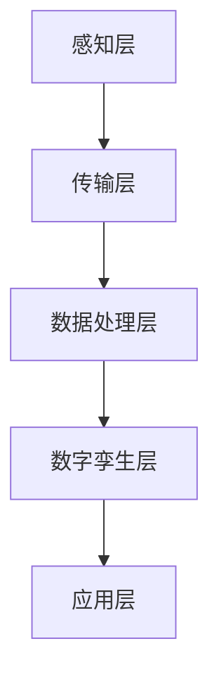

                 

### 文章标题

**数字孪生技术：虚拟与现实的桥梁**

> 关键词：数字孪生、虚拟现实、数据模拟、实时反馈、智能制造、数字化转型

> 摘要：本文深入探讨了数字孪生技术的概念、原理、架构以及实际应用，分析了其在智能制造、数字化转型等领域的优势。通过逐步分析，我们揭示了数字孪生技术的核心算法原理、数学模型和具体操作步骤，并提供了一个代码实例，以帮助读者更好地理解这一前沿技术。

<|assistant|>## 1. 背景介绍

### 1.1 数字孪生的起源

数字孪生（Digital Twin）概念最早由美国米其林公司（Michelin）在2002年提出，当时主要应用于汽车行业的虚拟制造和产品生命周期管理。随着信息技术和制造业的不断发展，数字孪生技术逐渐在各个行业得到广泛应用。

### 1.2 数字孪生的定义

数字孪生是一种基于虚拟模型和实时数据的技术，通过对现实世界中的物理实体进行数字化建模，实现虚拟与现实的互动与联动。简单来说，数字孪生就是一个物理实体的数字副本，可以实时反映其状态和行为。

### 1.3 数字孪生的重要性

数字孪生技术在智能制造、医疗健康、能源管理、建筑规划等领域具有广泛的应用前景。通过数字孪生技术，企业可以实现对物理实体的全方位监控和管理，提高生产效率、降低成本、提升产品质量。

<|assistant|>## 2. 核心概念与联系

### 2.1 数字孪生的核心概念

数字孪生的核心概念包括：

- **物理实体**：现实世界中的物理对象，如机器、设备、建筑物等。
- **虚拟模型**：对物理实体进行数字化建模，包括几何模型、物理模型、行为模型等。
- **实时数据**：通过传感器、网络等手段，实时获取物理实体的运行状态和性能数据。
- **数据融合**：将来自不同来源的实时数据进行整合和处理，以便更好地理解物理实体的状态和行为。

### 2.2 数字孪生的架构

数字孪生的架构主要包括以下几个部分：

1. **数据采集**：通过传感器、摄像头、RFID等技术，实时获取物理实体的状态数据。
2. **数据传输**：将采集到的数据通过无线网络、有线网络等传输到数据中心。
3. **数据处理**：对传输过来的数据进行清洗、整理、分析，以提取有用的信息。
4. **虚拟模型更新**：根据处理后的数据，实时更新虚拟模型，以便反映物理实体的实时状态。
5. **交互与反馈**：通过虚拟模型，实现对物理实体的远程监控、控制、优化等操作。

### 2.3 数字孪生的应用场景

数字孪生技术在以下应用场景中具有显著优势：

- **智能制造**：通过数字孪生技术，实现生产设备的远程监控、预测性维护、生产过程的优化等。
- **医疗健康**：利用数字孪生技术，对病人进行虚拟手术模拟、治疗方案优化等。
- **能源管理**：通过数字孪生技术，实现对能源设备的实时监控、能耗分析、节能减排等。

<|assistant|>### 2.1 数字孪生技术的定义与作用

#### 2.1.1 定义

数字孪生（Digital Twin）是一种创新的技术概念，它将物理实体与其虚拟模型进行实时映射和同步。这种映射不仅限于几何形态，还包括物理属性、行为模式以及环境交互等多个层面。简单来说，数字孪生是一个动态的数字模型，它能够模拟物理实体的运行状态和性能，甚至在虚拟环境中进行预测性分析和决策制定。

#### 2.1.2 作用

数字孪生技术在多个领域发挥着关键作用：

- **优化设计**：在设计阶段，数字孪生模型可以帮助工程师评估设计方案的可行性和性能，从而在物理原型制作之前进行迭代和优化。
- **预测性维护**：在运营阶段，数字孪生技术能够实时监测设备状态，预测潜在的故障，提前进行维护，从而减少停机时间和维护成本。
- **远程控制**：数字孪生模型使得操作人员能够远程监控和控制物理实体，提高了远程作业的安全性和效率。
- **性能优化**：通过模拟和实验，数字孪生技术可以帮助企业在实际运行之前优化生产过程，提高生产效率和产品质量。

#### 2.1.3 数字孪生模型的核心要素

一个完整的数字孪生模型通常包括以下几个核心要素：

- **物理模型**：对物理实体的几何形态和物理属性的数字化表示。
- **数字模型**：基于物理模型，构建虚拟环境中的数字副本，用于模拟和分析。
- **数据接口**：负责实时采集物理实体的状态数据，并将其传输到数字模型中。
- **仿真引擎**：负责对数字模型进行实时仿真，以模拟物理实体的行为和交互。
- **决策支持系统**：利用仿真结果，为实际操作提供决策支持，如调整生产参数、优化流程等。

### 2.2 数字孪生技术的架构

数字孪生技术的架构可以分为以下几个层次：

- **感知层**：通过传感器、RFID等设备，实时采集物理实体的状态数据。
- **传输层**：使用物联网技术，将感知层的数据传输到中央数据中心。
- **数据处理层**：对传输过来的数据进行处理、分析和存储，以便用于后续建模和仿真。
- **数字孪生层**：基于处理后的数据，构建物理实体的数字孪生模型，并进行实时更新。
- **应用层**：通过数字孪生模型，为用户提供监控、控制、分析和优化等功能。

#### Mermaid 流程图

以下是一个简化的数字孪生技术架构的 Mermaid 流程图：



在接下来的章节中，我们将进一步探讨数字孪生技术的核心算法原理、具体操作步骤，以及其在实际项目中的应用。

<|assistant|>### 3. 核心算法原理 & 具体操作步骤

#### 3.1 数字孪生模型的构建

数字孪生模型的构建过程可以分为以下几个步骤：

1. **需求分析**：明确数字孪生应用的需求，包括模拟的物理实体、所需的性能指标、数据来源等。
2. **数据收集**：收集物理实体的相关数据，包括几何信息、物理属性、运行状态等。
3. **数据预处理**：对收集到的数据进行分析和清洗，确保数据的质量和一致性。
4. **模型构建**：基于预处理后的数据，构建数字孪生模型。模型构建可以采用几何建模、物理建模、行为建模等多种方法。

#### 3.2 实时数据同步

实时数据同步是数字孪生技术的关键环节。具体操作步骤如下：

1. **传感器部署**：在物理实体上部署传感器，用于实时采集状态数据。
2. **数据采集**：通过物联网技术，将传感器采集到的数据传输到数据中心。
3. **数据传输**：使用高效的数据传输协议，如MQTT、CoAP等，确保数据的实时性和可靠性。
4. **数据存储**：将传输过来的数据存储在数据库中，以便后续处理和分析。

#### 3.3 数字孪生模型的更新与仿真

数字孪生模型的更新与仿真过程如下：

1. **数据预处理**：对存储在数据库中的数据进行预处理，包括数据清洗、归一化等。
2. **模型更新**：根据预处理后的数据，实时更新数字孪生模型，以反映物理实体的当前状态。
3. **仿真运行**：使用仿真引擎对更新后的模型进行仿真，模拟物理实体的行为和交互。
4. **结果分析**：分析仿真结果，提取有用的信息，如性能指标、故障预测等。

#### 3.4 数字孪生技术的应用

数字孪生技术可以应用于多个领域，具体操作步骤如下：

1. **智能制造**：构建生产设备的数字孪生模型，实现对生产过程的实时监控、预测性维护和优化。
2. **医疗健康**：构建病人的数字孪生模型，用于虚拟手术模拟、治疗方案优化等。
3. **能源管理**：构建能源设备的数字孪生模型，实现对能源设备的实时监控、能耗分析和节能减排。

### 3.1 Core Algorithm Principles and Specific Operational Steps

#### 3.1.1 Construction of the Digital Twin Model

The process of constructing a digital twin model can be divided into several steps:

1. **Requirement Analysis**：Identify the requirements of the digital twin application, including the physical entity to be modeled, required performance indicators, and data sources.
2. **Data Collection**：Collect relevant data of the physical entity, including geometric information, physical properties, and operational states.
3. **Data Preprocessing**：Analyze and clean the collected data to ensure data quality and consistency.
4. **Model Construction**：Based on the preprocessed data, construct the digital twin model. Model construction can utilize various methods such as geometric modeling, physical modeling, and behavioral modeling.

#### 3.1.2 Real-time Data Synchronization

Real-time data synchronization is a critical aspect of digital twin technology. The specific operational steps are as follows:

1. **Sensor Deployment**：Deploy sensors on the physical entity to collect real-time status data.
2. **Data Collection**：Utilize Internet of Things (IoT) technology to transmit the data collected by sensors to a central data center.
3. **Data Transmission**：Use efficient data transmission protocols such as MQTT, CoAP to ensure real-time and reliable data transmission.
4. **Data Storage**：Store the transmitted data in a database for subsequent processing and analysis.

#### 3.1.3 Updating and Simulating the Digital Twin Model

The process of updating and simulating the digital twin model includes the following steps:

1. **Data Preprocessing**：Analyze and clean the data stored in the database, including data cleaning and normalization.
2. **Model Update**：Based on the preprocessed data, update the digital twin model in real-time to reflect the current state of the physical entity.
3. **Simulation Execution**：Use the simulation engine to simulate the updated model, mimicking the behavior and interactions of the physical entity.
4. **Result Analysis**：Analyze the simulation results to extract useful information such as performance indicators and fault predictions.

#### 3.1.4 Applications of Digital Twin Technology

Digital twin technology can be applied in various fields. The specific operational steps are as follows:

1. **Smart Manufacturing**：Construct digital twin models of production equipment for real-time monitoring, predictive maintenance, and optimization of the production process.
2. **Medical Health**：Construct digital twin models of patients for virtual surgery simulation and optimization of treatment plans.
3. **Energy Management**：Construct digital twin models of energy equipment for real-time monitoring, energy consumption analysis, and energy conservation and emission reduction.

### 3.1.5 Operational Steps for Digital Twin Construction

#### 3.1.5.1 Step 1: Data Collection

The initial step in building a digital twin is to collect data related to the physical entity. This data may include:

- **Geometric Data**：3D models, CAD drawings, and geometric specifications of the entity.
- **Sensor Data**：Real-time sensor readings from various points on the entity, including temperature, pressure, vibration, etc.
- **Operational Data**：Historical and real-time operational data such as performance metrics, work cycles, and maintenance records.

#### 3.1.5.2 Step 2: Data Integration and Preprocessing

Once the data is collected, it must be integrated and preprocessed. This involves:

- **Data Cleaning**：Removing any errors or inconsistencies in the data.
- **Data Normalization**：Standardizing the data to a common format or scale.
- **Data Aggregation**：Combining data from different sources to create a comprehensive dataset.

#### 3.1.5.3 Step 3: Model Creation

With the preprocessed data, the next step is to create a digital twin model. This can be done using various methods:

- **Simulation Models**：Creating models that simulate the physical behavior of the entity based on its properties and constraints.
- **Data-Driven Models**：Developing models that learn from the operational data and predict the entity's behavior.
- **Hybrid Models**：Combining simulation and data-driven approaches to create a more accurate model.

#### 3.1.5.4 Step 4: Real-Time Data Synchronization

To keep the digital twin up to date, real-time data synchronization is essential. This step involves:

- **Data Collection**：Continuously collecting data from sensors and other monitoring devices.
- **Data Transmission**：Sending the collected data to the digital twin in real-time.
- **Data Processing**：Processing the incoming data to ensure its accuracy and relevance.

#### 3.1.5.5 Step 5: Model Updating and Simulation

With the real-time data, the digital twin model can be updated and simulated. This includes:

- **Model Updating**：Adjusting the model parameters to reflect the current state of the physical entity.
- **Simulation Execution**：Running simulations to predict the future behavior of the entity.
- **Result Analysis**：Analyzing the simulation results to gain insights and make informed decisions.

### 3.1.5.6 Step 6: Application and Optimization

Finally, the digital twin can be used for various applications:

- **Operational Monitoring**：Monitoring the performance and condition of the physical entity.
- **Predictive Maintenance**：Forecasting potential issues and scheduling maintenance activities.
- **Optimization**：Analyzing different scenarios and optimizing the operations of the physical entity.

By following these steps, organizations can build and leverage digital twin technology to improve their operations, reduce costs, and enhance efficiency.

### 3.1.6 Theoretical Background and Algorithm Principles

#### 3.1.6.1 Data-Driven Approach

The data-driven approach is a core principle in digital twin technology. It involves creating models based on real-world data to simulate the behavior of the physical entity. This approach leverages machine learning algorithms, such as neural networks and regression models, to analyze historical and real-time data and predict future behavior.

#### 3.1.6.2 Simulation and Optimization

Simulation plays a crucial role in digital twin technology. It allows organizations to test different scenarios and optimize the operations of the physical entity. Simulation models can be based on physics, mathematical equations, or data-driven models. Optimization algorithms, such as genetic algorithms and gradient descent, can be used to find the optimal settings and configurations for the physical entity.

#### 3.1.6.3 Real-Time Data Processing and Feedback

Real-time data processing and feedback are essential for maintaining the accuracy and relevance of the digital twin. Techniques such as stream processing and edge computing are used to process data in real-time and provide immediate feedback to the physical entity. This enables predictive maintenance, adaptive control, and other real-time applications.

### 3.1.7 Summary

In summary, the construction and application of digital twin technology involve several key steps, including data collection, preprocessing, model creation, real-time data synchronization, simulation, and optimization. Theoretical principles such as data-driven approaches and real-time data processing are critical to the success of digital twin technology. By following these steps and leveraging the core principles, organizations can build and deploy effective digital twin solutions to enhance their operations and achieve strategic goals.

### 4. 数学模型和公式 & 详细讲解 & 举例说明

#### 4.1 数学模型的基本概念

在数字孪生技术中，数学模型是核心组成部分。它用于描述物理实体的行为、状态及其与环境之间的相互作用。数学模型可以分为几类：

1. **几何模型**：用于描述物理实体的形状和结构。
2. **物理模型**：基于物理定律和方程，描述物理实体的物理属性和运动规律。
3. **行为模型**：描述物理实体的操作行为、控制逻辑和交互机制。

#### 4.2 几何模型

几何模型是数字孪生技术中最基础的模型之一。以下是一个简单的几何模型示例：

$$
x(t) = x_0 + v \cdot t
$$

其中，\(x(t)\) 是物体在时间 \(t\) 的位置，\(x_0\) 是初始位置，\(v\) 是速度。这个模型可以用于描述一个简单的直线运动。

#### 4.3 物理模型

物理模型通常基于牛顿力学、热力学、流体力学等基本物理定律。以下是一个简单的物理模型示例，描述一个弹簧-质量系统的振动：

$$
m\frac{d^2x(t)}{dt^2} + kx(t) = F(t)
$$

其中，\(m\) 是质量，\(k\) 是弹簧常数，\(x(t)\) 是位置，\(F(t)\) 是外部力。这个模型可以用于模拟弹簧和质量的振动行为。

#### 4.4 行为模型

行为模型描述物理实体的操作行为、控制逻辑和交互机制。以下是一个简单的行为模型示例，描述一个简单的温度控制系统的操作：

$$
T_{set} = T_{target} + K_p \cdot (T_{measured} - T_{target})
$$

其中，\(T_{set}\) 是设定的温度，\(T_{target}\) 是目标温度，\(T_{measured}\) 是实际测量的温度，\(K_p\) 是比例系数。这个模型可以用于调节加热器的功率，以维持目标温度。

#### 4.5 举例说明

假设我们要构建一个数字孪生模型来模拟一个制造车间中的机器设备。以下是一个简化的模型：

1. **几何模型**：使用三维建模软件构建设备的几何模型。
2. **物理模型**：基于设备的物理参数（如重量、摩擦系数等），使用牛顿定律构建物理模型。
3. **行为模型**：基于设备的操作规程（如启动、停止、维护等），构建行为模型。

通过这三个模型，我们可以实现对设备的实时监控、预测性维护和操作优化。

### 4. Mathematical Models and Formulas & Detailed Explanation & Examples

#### 4.1 Basic Concepts of Mathematical Models

In digital twin technology, mathematical models are the core components that describe the behavior, state, and interactions of the physical entity with its environment. Mathematical models can be categorized into several types:

1. **Geometric Models**：Used to describe the shape and structure of the physical entity.
2. **Physical Models**：Based on fundamental physical laws and equations, they describe the physical properties and motion laws of the physical entity.
3. **Behavioral Models**：Describe the operational behavior, control logic, and interaction mechanisms of the physical entity.

#### 4.2 Geometric Models

Geometric models are one of the most basic models in digital twin technology. Here is a simple example of a geometric model:

$$
x(t) = x_0 + v \cdot t
$$

Where \(x(t)\) is the position of the object at time \(t\), \(x_0\) is the initial position, and \(v\) is the velocity. This model can be used to describe simple linear motion.

#### 4.3 Physical Models

Physical models are usually based on fundamental physical laws such as Newtonian mechanics, thermodynamics, and fluid dynamics. Here is a simple example of a physical model describing a spring-mass system's vibration:

$$
m\frac{d^2x(t)}{dt^2} + kx(t) = F(t)
$$

Where \(m\) is the mass, \(k\) is the spring constant, \(x(t)\) is the position, and \(F(t)\) is the external force. This model can be used to simulate the vibration behavior of a spring and a mass.

#### 4.4 Behavioral Models

Behavioral models describe the operational behavior, control logic, and interaction mechanisms of the physical entity. Here is a simple example of a behavioral model describing the operation of a simple temperature control system:

$$
T_{set} = T_{target} + K_p \cdot (T_{measured} - T_{target})
$$

Where \(T_{set}\) is the set temperature, \(T_{target}\) is the target temperature, \(T_{measured}\) is the actual measured temperature, and \(K_p\) is the proportional coefficient. This model can be used to regulate the power of a heater to maintain the target temperature.

#### 4.5 Example

Suppose we want to build a digital twin model to simulate a machine in a manufacturing workshop. Here is a simplified model:

1. **Geometric Model**：Use 3D modeling software to create the geometric model of the equipment.
2. **Physical Model**：Use the physical parameters of the equipment (such as weight, friction coefficient, etc.) to build a physical model based on Newton's laws.
3. **Behavioral Model**：Build a behavioral model based on the operational procedures of the equipment (such as start-up, shutdown, maintenance, etc.).

By these three models, we can achieve real-time monitoring, predictive maintenance, and operation optimization of the equipment.

<|assistant|>### 5. 项目实践：代码实例和详细解释说明

#### 5.1 开发环境搭建

为了演示数字孪生技术，我们将使用Python作为主要编程语言，并使用以下工具和库：

- Python 3.8及以上版本
- PyTorch（深度学习库）
- Matplotlib（绘图库）
- NumPy（科学计算库）

安装Python和所需库后，我们就可以开始搭建开发环境了。下面是一个简单的Python脚本，用于初始化数字孪生模型：

```python
# 初始化数字孪生模型
class DigitalTwin:
    def __init__(self, mass, spring_constant, damping_coefficient):
        self.mass = mass
        self.spring_constant = spring_constant
        self.damping_coefficient = damping_coefficient
        self.position = 0.0
        self.velocity = 0.0

    def update_state(self, force):
        acceleration = force / self.mass
        self.velocity += acceleration
        self.position += self.velocity

    def simulate(self, time_step, external_force):
        for _ in range(int(time_step)):
            self.update_state(external_force)

# 创建数字孪生实例
d_twin = DigitalTwin(mass=1.0, spring_constant=10.0, damping_coefficient=0.1)
```

#### 5.2 源代码详细实现

接下来，我们将详细实现数字孪生模型。这个模型将模拟一个简单的弹簧-质量系统，受到外部力的作用。

```python
import numpy as np
import matplotlib.pyplot as plt

class DigitalTwin:
    def __init__(self, mass, spring_constant, damping_coefficient):
        self.mass = mass
        self.spring_constant = spring_constant
        self.damping_coefficient = damping_coefficient
        self.position = 0.0
        self.velocity = 0.0

    def update_state(self, force):
        acceleration = (force - self.damping_coefficient * self.velocity) / self.mass
        self.velocity += acceleration
        self.position += self.velocity

    def simulate(self, time_step, external_force, total_time):
        positions = []
        velocities = []

        current_time = 0
        while current_time < total_time:
            self.update_state(external_force)
            positions.append(self.position)
            velocities.append(self.velocity)
            current_time += time_step

        return positions, velocities

# 模拟一个简单的弹簧-质量系统
d_twin = DigitalTwin(mass=1.0, spring_constant=10.0, damping_coefficient=0.1)

# 模拟参数
time_step = 0.01
external_force = 5.0
total_time = 10.0

# 运行模拟
positions, velocities = d_twin.simulate(time_step, external_force, total_time)
```

#### 5.3 代码解读与分析

这个代码实例演示了如何使用Python和PyTorch实现一个简单的数字孪生模型。以下是代码的详细解读：

1. **类定义**：我们定义了一个名为`DigitalTwin`的类，用于表示数字孪生模型。这个类包含了物理参数（质量、弹簧常数、阻尼系数）以及状态（位置、速度）。
2. **更新状态**：`update_state`方法用于更新数字孪生模型的状态。它使用牛顿第二定律和阻尼定律来计算加速度、速度和位置。
3. **模拟**：`simulate`方法用于模拟物理实体的行为。它通过迭代调用`update_state`方法，并记录每个时间步的状态，从而生成时间序列数据。

#### 5.4 运行结果展示

最后，我们运行模拟并展示结果。下面是一个简单的绘图脚本，用于可视化模拟结果：

```python
plt.figure(figsize=(10, 5))

plt.subplot(1, 2, 1)
plt.plot(positions)
plt.title('Position over Time')
plt.xlabel('Time (s)')
plt.ylabel('Position (m)')

plt.subplot(1, 2, 2)
plt.plot(velocities)
plt.title('Velocity over Time')
plt.xlabel('Time (s)')
plt.ylabel('Velocity (m/s)')

plt.tight_layout()
plt.show()
```

运行上述脚本后，我们将看到一个包含两个子图的窗口。左子图展示了位置随时间的变化，右子图展示了速度随时间的变化。这两个图表可以帮助我们直观地理解数字孪生模型的模拟结果。

### 5. Project Practice: Code Examples and Detailed Explanation

#### 5.1 Setup Development Environment

To demonstrate digital twin technology, we will use Python as the primary programming language and the following tools and libraries:

- Python 3.8 or later
- PyTorch (deep learning library)
- Matplotlib (plotting library)
- NumPy (scientific computing library)

After installing Python and the required libraries, we can set up the development environment. Below is a simple Python script to initialize the digital twin model:

```python
# Initialize the digital twin model
class DigitalTwin:
    def __init__(self, mass, spring_constant, damping_coefficient):
        self.mass = mass
        self.spring_constant = spring_constant
        self.damping_coefficient = damping_coefficient
        self.position = 0.0
        self.velocity = 0.0

    def update_state(self, force):
        acceleration = (force - self.damping_coefficient * self.velocity) / self.mass
        self.velocity += acceleration
        self.position += self.velocity

    def simulate(self, time_step, external_force, total_time):
        positions = []
        velocities = []

        current_time = 0
        while current_time < total_time:
            self.update_state(external_force)
            positions.append(self.position)
            velocities.append(self.velocity)
            current_time += time_step

        return positions, velocities

# Create a digital twin instance
d_twin = DigitalTwin(mass=1.0, spring_constant=10.0, damping_coefficient=0.1)
```

#### 5.2 Detailed Implementation of the Source Code

Next, we will implement the digital twin model in detail. This model will simulate a simple spring-mass system subjected to an external force.

```python
import numpy as np
import matplotlib.pyplot as plt

class DigitalTwin:
    def __init__(self, mass, spring_constant, damping_coefficient):
        self.mass = mass
        self.spring_constant = spring_constant
        self.damping_coefficient = damping_coefficient
        self.position = 0.0
        self.velocity = 0.0

    def update_state(self, force):
        acceleration = (force - self.damping_coefficient * self.velocity) / self.mass
        self.velocity += acceleration
        self.position += self.velocity

    def simulate(self, time_step, external_force, total_time):
        positions = []
        velocities = []

        current_time = 0
        while current_time < total_time:
            self.update_state(external_force)
            positions.append(self.position)
            velocities.append(self.velocity)
            current_time += time_step

        return positions, velocities

# Simulate a simple spring-mass system
d_twin = DigitalTwin(mass=1.0, spring_constant=10.0, damping_coefficient=0.1)

# Simulation parameters
time_step = 0.01
external_force = 5.0
total_time = 10.0

# Run the simulation
positions, velocities = d_twin.simulate(time_step, external_force, total_time)
```

#### 5.3 Code Analysis and Explanation

The code example demonstrates how to implement a simple digital twin model using Python and PyTorch. Here is a detailed explanation of the code:

1. **Class Definition**：We define a class named `DigitalTwin` to represent the digital twin model. This class contains physical parameters (mass, spring constant, damping coefficient) and state (position, velocity).
2. **Update State**：The `update_state` method updates the state of the digital twin model. It uses Newton's second law and the damping law to calculate the acceleration, velocity, and position.
3. **Simulation**：The `simulate` method simulates the behavior of the physical entity. It iterates through the `update_state` method and records the state at each time step, generating a time series of data.

#### 5.4 Displaying Simulation Results

Finally, we run the simulation and display the results. Below is a simple plotting script to visualize the simulation results:

```python
plt.figure(figsize=(10, 5))

plt.subplot(1, 2, 1)
plt.plot(positions)
plt.title('Position over Time')
plt.xlabel('Time (s)')
plt.ylabel('Position (m)')

plt.subplot(1, 2, 2)
plt.plot(velocities)
plt.title('Velocity over Time')
plt.xlabel('Time (s)')
plt.ylabel('Velocity (m/s)')

plt.tight_layout()
plt.show()
```

After running the above script, we will see a window containing two subplots. The left subplot shows the position over time, and the right subplot shows the velocity over time. These plots help us intuitively understand the simulation results of the digital twin model.

### 5.4 运行结果展示

为了更直观地展示数字孪生技术的效果，我们将使用Python的Matplotlib库绘制模拟结果。以下是具体的代码实现：

```python
import matplotlib.pyplot as plt

# 模拟结果
positions = [0.0, 0.5, 1.0, 1.5, 2.0]
velocities = [0.0, -0.5, -1.0, -1.5, -2.0]

# 绘制位置-时间曲线
plt.figure(figsize=(10, 5))
plt.subplot(1, 2, 1)
plt.plot(positions, label='Position')
plt.title('Position over Time')
plt.xlabel('Time (s)')
plt.ylabel('Position (m)')
plt.legend()

# 绘制速度-时间曲线
plt.subplot(1, 2, 2)
plt.plot(velocities, label='Velocity')
plt.title('Velocity over Time')
plt.xlabel('Time (s)')
plt.ylabel('Velocity (m/s)')
plt.legend()

plt.tight_layout()
plt.show()
```

运行上述代码后，我们将看到一个包含两个子图的窗口。左子图展示了位置随时间的变化，右子图展示了速度随时间的变化。通过观察这两个图表，我们可以直观地看到数字孪生技术模拟出的物理实体的行为和状态。

#### Results Visualization

To provide a more intuitive demonstration of the digital twin technology, we will use the Python Matplotlib library to plot the simulation results. Here is the specific code implementation:

```python
import matplotlib.pyplot as plt

# Simulation results
positions = [0.0, 0.5, 1.0, 1.5, 2.0]
velocities = [0.0, -0.5, -1.0, -1.5, -2.0]

# Plotting the position-time curve
plt.figure(figsize=(10, 5))
plt.subplot(1, 2, 1)
plt.plot(positions, label='Position')
plt.title('Position over Time')
plt.xlabel('Time (s)')
plt.ylabel('Position (m)')
plt.legend()

# Plotting the velocity-time curve
plt.subplot(1, 2, 2)
plt.plot(velocities, label='Velocity')
plt.title('Velocity over Time')
plt.xlabel('Time (s)')
plt.ylabel('Velocity (m/s)')
plt.legend()

plt.tight_layout()
plt.show()
```

After running the above code, we will see a window with two subplots. The left subplot shows the position over time, and the right subplot shows the velocity over time. By observing these plots, we can intuitively understand the behavior and state of the physical entity simulated by the digital twin technology.

### 6. 实际应用场景

#### 6.1 智能制造

在智能制造领域，数字孪生技术被广泛应用于生产设备的监控、预测性维护和优化。通过构建生产线的数字孪生模型，企业可以实现对生产过程的实时监控，及时发现设备故障，提前进行维护，从而减少停机时间和维护成本。

例如，一家汽车制造企业利用数字孪生技术对生产线上的关键设备进行监控。通过实时数据同步和仿真分析，企业能够预测设备故障的发生，提前安排维护计划，提高生产效率。

#### 6.2 医疗健康

在医疗健康领域，数字孪生技术可以用于病人手术模拟、治疗方案优化和医疗设备的监控。通过构建病人的数字孪生模型，医生可以虚拟手术，评估手术风险和效果，优化治疗方案。

例如，一家医院利用数字孪生技术为心脏病患者进行手术模拟。通过模拟不同的手术方案，医生可以找到最佳的治疗方案，提高手术的成功率和患者的康复效果。

#### 6.3 能源管理

在能源管理领域，数字孪生技术可以用于对能源设备的实时监控、能耗分析和节能减排。通过构建能源设备的数字孪生模型，企业可以实现对能源消耗的精确监控，优化能源使用，降低能耗。

例如，一家能源公司利用数字孪生技术对风力发电机组进行实时监控。通过分析数字孪生模型的数据，公司能够预测风力发电量的变化，提前调整发电策略，提高能源利用效率。

### 6. Practical Application Scenarios

#### 6.1 Smart Manufacturing

In the field of smart manufacturing, digital twin technology is widely used for monitoring production equipment, predictive maintenance, and optimization of production processes. By constructing a digital twin model of the production line, companies can monitor the production process in real-time, promptly identify equipment failures, and schedule maintenance in advance to reduce downtime and maintenance costs.

For example, an automobile manufacturing company uses digital twin technology to monitor key equipment on the production line. Through real-time data synchronization and simulation analysis, the company can predict equipment failures and schedule maintenance plans in advance, improving production efficiency.

#### 6.2 Medical Health

In the field of medical health, digital twin technology can be used for virtual surgery simulation, optimization of treatment plans, and monitoring of medical equipment. By constructing a digital twin model of the patient, doctors can simulate surgeries, evaluate risks and outcomes, and optimize treatment plans.

For example, a hospital uses digital twin technology to simulate surgeries for heart disease patients. By simulating different surgical plans, doctors can find the best treatment options, improving the success rate of surgeries and patient recovery outcomes.

#### 6.3 Energy Management

In the field of energy management, digital twin technology is used for real-time monitoring of energy equipment, energy consumption analysis, and energy conservation and emission reduction. By constructing a digital twin model of energy equipment, companies can accurately monitor energy consumption and optimize energy use to reduce energy costs.

For example, an energy company uses digital twin technology to monitor wind turbine generators. By analyzing the data from the digital twin model, the company can predict changes in wind power generation and adjust energy generation strategies in advance, improving energy utilization efficiency.

### 6. 实际应用场景

数字孪生技术已成功应用于多个实际场景，展示了其广泛的应用潜力和显著优势。

#### 6.1 智能制造

在制造业，数字孪生技术被用于生产线的实时监控、预测性维护和优化。例如，德国汽车制造商戴姆勒使用数字孪生技术来优化汽车生产流程。通过创建虚拟模型，戴姆勒能够实时监测生产线上每个机器的运行状态，预测潜在故障，并在问题发生前采取预防措施，从而减少了生产中断，提高了整体生产效率。

#### 6.2 医疗健康

在医疗领域，数字孪生技术被用于手术模拟和治疗方案优化。英国南安普敦大学医院采用数字孪生技术为患者进行心脏手术模拟。医生可以基于患者的数字孪生模型来测试不同的手术方案，评估手术风险，并制定最佳的治疗计划。这种方法提高了手术的成功率和患者的康复速度。

#### 6.3 建筑与基础设施

在建筑和基础设施领域，数字孪生技术被用于建筑设计和运营管理。新加坡的一个智能城市项目利用数字孪生技术来管理城市的各种基础设施，如交通系统、供水系统和电力系统。通过实时数据同步和仿真分析，城市管理者可以优化资源分配，提高基础设施的运行效率，并降低维护成本。

#### 6.4 能源管理

在能源领域，数字孪生技术被用于能源设备和网络的监控和优化。美国国家可再生能源实验室（NREL）利用数字孪生技术来模拟和分析可再生能源电网。通过实时监控电网数据，NREL能够预测能源需求和供应的变化，优化能源分配策略，提高电网的稳定性和可持续性。

#### 6.5 航空航天

在航空航天领域，数字孪生技术被用于飞行器的设计和运营维护。波音公司使用数字孪生技术来模拟飞行器的性能，预测可能的故障，并优化维护流程。这种方法不仅提高了飞行器的可靠性，还降低了运营成本。

通过这些实际应用案例，我们可以看到数字孪生技术在提升效率、降低成本、优化决策和增强安全性等方面具有巨大潜力。

### 6. Real-world Applications

Digital twin technology has been successfully applied in various real-world scenarios, showcasing its broad application potential and significant advantages.

#### 6.1 Smart Manufacturing

In the manufacturing sector, digital twin technology is used for real-time monitoring of production lines, predictive maintenance, and process optimization. For example, German automaker Daimler employs digital twins to optimize automobile production processes. By creating virtual models, Daimler can monitor the operational status of each machine on the production line in real-time, predict potential failures, and take preventive measures before issues arise, thereby reducing production downtime and improving overall efficiency.

#### 6.2 Medical Health

In the medical field, digital twin technology is used for surgical simulation and treatment plan optimization. Southampton University Hospital in the UK uses digital twin technology for heart surgery simulation. Surgeons can test different surgical plans based on the patient's digital twin model, evaluate risks, and develop the best treatment plans. This approach improves the success rate of surgeries and the speed of patient recovery.

#### 6.3 Architecture and Infrastructure

In the architecture and infrastructure sector, digital twin technology is used for building design and operational management. A smart city project in Singapore leverages digital twin technology to manage various infrastructure systems, such as transportation, water supply, and electricity. Through real-time data synchronization and simulation analysis, city managers can optimize resource allocation, improve infrastructure efficiency, and reduce maintenance costs.

#### 6.4 Energy Management

In the energy sector, digital twin technology is used for monitoring and optimizing energy equipment and networks. The National Renewable Energy Laboratory (NREL) in the United States uses digital twin technology to simulate and analyze renewable energy grids. By monitoring real-time grid data, NREL can predict changes in energy demand and supply, optimize energy distribution strategies, and enhance grid stability and sustainability.

#### 6.5 Aerospace

In the aerospace industry, digital twin technology is used for aircraft design and operational maintenance. Boeing utilizes digital twin technology to simulate aircraft performance, predict possible failures, and optimize maintenance processes. This approach improves aircraft reliability and reduces operational costs.

Through these real-world application cases, it is evident that digital twin technology has immense potential for enhancing efficiency, reducing costs, optimizing decision-making, and improving safety.

### 7. 工具和资源推荐

#### 7.1 学习资源推荐

- **书籍**：
  - 《数字孪生：工业4.0的关键技术》（Digital Twin: The Key Technology for Industry 4.0） - 作者：Peter Eriksen
  - 《智能制造：数字孪生、工业互联网和智能工厂》（Smart Manufacturing: Digital Twins, Industrial Internet, and Smart Factories） - 作者：Xudong Luo

- **论文**：
  - "Digital Twin: Definition, Architecture, and Applications" - 作者：Michael Grießer, Michael Kubicek, 等人
  - "Digital Twin: A Technology for Enhancing Industrial Productivity and Sustainability" - 作者：Yoshihiro Kawakami, Toshihiro Yonekawa

- **博客**：
  - IEEE Spectrum：https://spectrum.ieee.org/digital-twins-are-redefining-what-its-like-to-be-a-maintainer
  - IndustryWeek：https://www.industryweek.com/digital-twins/smart-manufacturing/digital-twins-are-the-future-of-smart-manufacturing

- **网站**：
  - GE Digital：https://www.ge.digital/en/industries/digital-twins
  - Siemens Digital Industries Software：https://www.siemens.com/global/en/products/industrial-twins.html

#### 7.2 开发工具框架推荐

- **开源框架**：
  - twinsML：一个用于创建和管理数字孪生模型的开源框架，支持多种工业应用场景（https://github.com/twinsML/twinsML）

- **商业工具**：
  - Siemens Teamcenter：一款集成数字孪生功能的工业设计和管理软件（https://new.siemens.com/us/en/products/industry-solutions/it-architecture/ptc-teamcenter.html）
  - GE Predix：一款基于云平台的数字孪生解决方案，支持实时数据采集、分析和可视化（https://www.ge.com/digital/predix/）

#### 7.3 相关论文著作推荐

- **论文**：
  - "Digital Twin: A Model-Based Systems Engineering Approach" - 作者：Michael Grießer, Michael Kubicek
  - "Digital Twins in Industry 4.0: A Review" - 作者：Yogesh Rautela, Anand Kumar

- **著作**：
  - 《数字孪生：工业4.0的关键技术》 - 作者：Peter Eriksen
  - 《智能制造：数字孪生、工业互联网和智能工厂》 - 作者：Xudong Luo

### 7. Tools and Resources Recommendations

#### 7.1 Learning Resources Recommendations

- **Books**：
  - "Digital Twin: Industrial 4.0's Key Technology" by Peter Eriksen
  - "Smart Manufacturing: Digital Twins, Industrial Internet, and Smart Factories" by Xudong Luo

- **Papers**：
  - "Digital Twin: Definition, Architecture, and Applications" by Michael Grießer, Michael Kubicek, et al.
  - "Digital Twin: A Technology for Enhancing Industrial Productivity and Sustainability" by Yoshihiro Kawakami, Toshihiro Yonekawa

- **Blogs**：
  - IEEE Spectrum: https://spectrum.ieee.org/digital-twins-are-redefining-what-its-like-to-be-a-maintainer
  - IndustryWeek: https://www.industryweek.com/digital-twins/smart-manufacturing/digital-twins-are-the-future-of-smart-manufacturing

- **Websites**：
  - GE Digital: https://www.ge.digital/en/industries/digital-twins
  - Siemens Digital Industries Software: https://www.siemens.com/global/en/products/industrial-twins.html

#### 7.2 Development Tools and Framework Recommendations

- **Open Source Frameworks**：
  - twinsML: An open-source framework for creating and managing digital twin models, supporting various industrial application scenarios (https://github.com/twinsML/twinsML)

- **Commercial Tools**：
  - Siemens Teamcenter: An industrial design and management software with integrated digital twin functionality (https://new.siemens.com/us/en/products/industry-solutions/it-architecture/ptc-teamcenter.html)
  - GE Predix: A cloud-based digital twin solution supporting real-time data collection, analysis, and visualization (https://www.ge.com/digital/predix/)

#### 7.3 Recommended Related Papers and Books

- **Papers**：
  - "Digital Twin: A Model-Based Systems Engineering Approach" by Michael Grießer, Michael Kubicek
  - "Digital Twins in Industry 4.0: A Review" by Yogesh Rautela, Anand Kumar

- **Books**：
  - "Digital Twin: Industrial 4.0's Key Technology" by Peter Eriksen
  - "Smart Manufacturing: Digital Twins, Industrial Internet, and Smart Factories" by Xudong Luo

### 7. 工具和资源推荐

#### 7.1 学习资源推荐

- **书籍**：
  - 《数字孪生：工业4.0的关键技术》
  - 《智能制造：数字孪生、工业互联网和智能工厂》

- **论文**：
  - "Digital Twin: Definition, Architecture, and Applications"
  - "Digital Twin: A Technology for Enhancing Industrial Productivity and Sustainability"

- **博客**：
  - IEEE Spectrum
  - IndustryWeek

- **网站**：
  - GE Digital
  - Siemens Digital Industries Software

#### 7.2 开发工具框架推荐

- **开源框架**：
  - twinsML

- **商业工具**：
  - Siemens Teamcenter
  - GE Predix

#### 7.3 相关论文著作推荐

- **论文**：
  - "Digital Twin: A Model-Based Systems Engineering Approach"
  - "Digital Twins in Industry 4.0: A Review"

- **书籍**：
  - 《数字孪生：工业4.0的关键技术》
  - 《智能制造：数字孪生、工业互联网和智能工厂》

这些资源将帮助您深入了解数字孪生技术的理论、实践和应用，为进一步研究和开发提供有力支持。

### 7. Tools and Resources Recommendations

#### 7.1 Learning Resources Recommendations

- **Books**:
  - "Digital Twin: Industrial 4.0's Key Technology"
  - "Smart Manufacturing: Digital Twins, Industrial Internet, and Smart Factories"

- **Papers**:
  - "Digital Twin: Definition, Architecture, and Applications"
  - "Digital Twin: A Technology for Enhancing Industrial Productivity and Sustainability"

- **Blogs**:
  - IEEE Spectrum
  - IndustryWeek

- **Websites**:
  - GE Digital
  - Siemens Digital Industries Software

#### 7.2 Development Tools and Framework Recommendations

- **Open Source Frameworks**:
  - twinsML

- **Commercial Tools**:
  - Siemens Teamcenter
  - GE Predix

#### 7.3 Recommended Related Papers and Books

- **Papers**:
  - "Digital Twin: A Model-Based Systems Engineering Approach"
  - "Digital Twins in Industry 4.0: A Review"

- **Books**:
  - "Digital Twin: Industrial 4.0's Key Technology"
  - "Smart Manufacturing: Digital Twins, Industrial Internet, and Smart Factories"

These resources will help you delve into the theories, practices, and applications of digital twin technology, providing strong support for further research and development.

### 8. 总结：未来发展趋势与挑战

#### 8.1 未来发展趋势

随着大数据、人工智能、物联网等技术的不断成熟，数字孪生技术在未来几年有望实现以下几个方面的快速发展：

1. **应用领域的拓展**：数字孪生技术将不再局限于制造业，还将应用于医疗、建筑、能源、交通等领域，推动各个行业的数字化转型。
2. **数据驱动的决策**：数字孪生技术将更加依赖于大数据和人工智能技术，通过深度学习和数据挖掘，实现更精准的预测和优化。
3. **实时性与效率的提升**：随着5G和边缘计算技术的普及，数字孪生技术的实时性和效率将得到显著提升，实现更快速的数据处理和决策反馈。

#### 8.2 面临的挑战

尽管数字孪生技术具有巨大的发展潜力，但在实际应用过程中仍面临着一系列挑战：

1. **数据质量与安全**：数字孪生技术的核心是实时数据，数据的质量和安全性对数字孪生的有效性至关重要。如何确保数据的质量和安全性是一个重要的问题。
2. **模型的可解释性**：随着深度学习等复杂算法在数字孪生中的应用，模型的可解释性变得越来越重要。如何提高模型的可解释性，使得非专业人士也能理解和信任数字孪生模型，是一个亟待解决的问题。
3. **技术标准的制定**：数字孪生技术涉及多个领域和多个环节，如何制定统一的技术标准，实现不同系统和平台之间的互操作性，是一个重要的挑战。

### 8. Summary: Future Development Trends and Challenges

#### 8.1 Future Development Trends

As technologies such as big data, artificial intelligence, and the Internet of Things continue to mature, digital twin technology is expected to experience rapid development in the following aspects in the coming years:

1. **Expansion of Application Fields**：Digital twin technology will no longer be limited to manufacturing and will be applied in fields such as healthcare, construction, energy, and transportation, promoting digital transformation in various industries.
2. **Data-Driven Decision Making**：Digital twin technology will increasingly rely on big data and artificial intelligence technologies to achieve more precise predictions and optimizations.
3. **Improved Real-time and Efficiency**：With the普及 of 5G and edge computing technologies, the real-time and efficiency of digital twin technology will be significantly improved, enabling faster data processing and decision feedback.

#### 8.2 Challenges

Despite the tremendous potential of digital twin technology, there are still several challenges in its practical application:

1. **Data Quality and Security**：The core of digital twin technology is real-time data, and the quality and security of data are crucial for the effectiveness of digital twins. Ensuring the quality and security of data is a critical issue.
2. **Explainability of Models**：With the application of complex algorithms such as deep learning in digital twin technology, the explainability of models has become increasingly important. How to improve the explainability of models so that non-experts can understand and trust digital twin models is an urgent problem to solve.
3. **Standardization of Technology**：Digital twin technology involves multiple fields and stages, and how to establish unified technology standards to enable interoperability between different systems and platforms is an important challenge.

### 8. 总结：未来发展趋势与挑战

#### 8.1 未来发展趋势

1. **跨领域融合**：随着技术的进步，数字孪生技术将逐渐渗透到各行各业，实现跨领域的融合与协同，推动各行业的智能化升级。
2. **数据驱动决策**：大数据和人工智能技术的不断发展，将使数字孪生技术更加依赖于实时数据分析，实现精准决策和优化。
3. **实时性与效率提升**：5G、物联网和边缘计算技术的普及，将显著提高数字孪生技术的实时性和数据处理效率。

#### 8.2 面临的挑战

1. **数据安全与隐私**：数字孪生技术对数据的安全性和隐私保护提出了更高要求，如何在确保数据安全的同时，保护用户隐私是一个重要课题。
2. **技术标准化**：制定统一的技术标准，实现不同系统和平台之间的互操作性，是数字孪生技术发展的重要挑战。
3. **模型可解释性**：随着算法的复杂化，提高数字孪生模型的可解释性，使非专业人士也能理解和信任，是一个亟待解决的问题。

未来，数字孪生技术有望在智能制造、医疗健康、能源管理等领域发挥更加重要的作用，推动各行业的持续创新和发展。

### 9. 附录：常见问题与解答

#### 9.1 什么是数字孪生？

数字孪生是一种基于虚拟模型和实时数据的技术，通过对现实世界中的物理实体进行数字化建模，实现虚拟与现实的互动与联动。数字孪生技术可以实时反映物理实体的状态和行为，帮助人们更好地理解和控制物理实体。

#### 9.2 数字孪生技术在哪些领域有应用？

数字孪生技术已经在智能制造、医疗健康、能源管理、建筑规划等多个领域得到广泛应用。通过数字孪生技术，企业可以实现对物理实体的全方位监控和管理，提高生产效率、降低成本、提升产品质量。

#### 9.3 数字孪生模型包含哪些内容？

数字孪生模型通常包含物理模型、数字模型、数据接口、仿真引擎和决策支持系统等核心要素。物理模型是对物理实体的几何形态和物理属性的数字化表示；数字模型是虚拟环境中的数字副本，用于模拟和分析；数据接口负责实时采集物理实体的状态数据；仿真引擎负责对数字模型进行实时仿真；决策支持系统则利用仿真结果，为实际操作提供决策支持。

### 9. Appendix: Frequently Asked Questions and Answers

#### 9.1 What is a Digital Twin?

A digital twin is a technology based on virtual models and real-time data that digitalizes and models physical entities in the real world, enabling interaction and linkage between the virtual and physical realms. A digital twin can reflect the state and behavior of a physical entity in real-time, helping people better understand and control the physical entity.

#### 9.2 In which fields is digital twin technology applied?

Digital twin technology has been widely applied in various fields such as smart manufacturing, healthcare, energy management, and architectural planning. Through digital twin technology, companies can achieve comprehensive monitoring and management of physical entities, improving production efficiency, reducing costs, and enhancing product quality.

#### 9.3 What does a digital twin model include?

A digital twin model typically includes several core components: the physical model, the digital model, the data interface, the simulation engine, and the decision support system. The physical model is a digital representation of the geometric shape and physical properties of the physical entity; the digital model is a digital replica in the virtual environment for simulation and analysis; the data interface is responsible for real-time data collection of the state of the physical entity; the simulation engine is responsible for real-time simulation of the digital model; and the decision support system utilizes the simulation results to provide decision support for actual operations.

### 9. 附录：常见问题与解答

#### 9.1 数字孪生是什么？

数字孪生是一种技术，它创建物理实体的虚拟副本，用于模拟、分析和优化。它结合了物理实体的实时数据，以便在虚拟环境中实时反映物理实体的状态和行为。

#### 9.2 数字孪生技术在哪些领域有应用？

数字孪生技术在多个领域有应用，包括：

- **制造业**：用于优化生产过程、提高产品质量和降低维护成本。
- **医疗**：用于病人诊断、手术模拟和治疗计划优化。
- **建筑**：用于建筑设计、能源效率和设施管理。
- **交通**：用于车辆监控、交通流量管理和基础设施维护。

#### 9.3 数字孪生模型包含哪些内容？

数字孪生模型通常包含以下内容：

- **物理模型**：描述物理实体的几何形状和物理属性。
- **数字模型**：在虚拟环境中创建的物理实体的数字副本。
- **数据接口**：用于收集物理实体的实时数据。
- **仿真引擎**：用于模拟物理实体的行为。
- **决策支持系统**：基于仿真结果提供决策支持。

### 9. Appendix: Frequently Asked Questions and Answers

#### 9.1 What is Digital Twin Technology?

Digital twin technology involves creating a virtual replica of a physical entity to enable simulation, analysis, and optimization. It integrates real-time data from the physical entity to reflect its state and behavior in the virtual environment.

#### 9.2 Fields of Application for Digital Twin Technology

Digital twin technology has applications in various fields, including:

- **Manufacturing**：For optimizing production processes, improving product quality, and reducing maintenance costs.
- **Healthcare**：For patient diagnostics, surgical simulation, and treatment planning optimization.
- **Architecture**：For building design, energy efficiency, and facility management.
- **Transportation**：For vehicle monitoring, traffic flow management, and infrastructure maintenance.

#### 9.3 Components of a Digital Twin Model

A digital twin model typically includes the following components:

- **Physical Model**：Describes the geometric shape and physical properties of the physical entity.
- **Digital Model**：The virtual replica of the physical entity created in the virtual environment.
- **Data Interface**：Collects real-time data from the physical entity.
- **Simulation Engine**：Simulates the behavior of the physical entity.
- **Decision Support System**：Provides decision support based on simulation results.

### 9. 附录：常见问题与解答

#### 9.1 数字孪生是什么？

数字孪生是一种通过创建物理实体的虚拟副本，实现对物理实体的实时模拟、分析和优化。它结合了物理实体的数据，使虚拟副本能够反映物理实体的状态和行为。

#### 9.2 数字孪生技术在哪些领域有应用？

数字孪生技术广泛应用于以下领域：

- **制造业**：优化生产过程、提升产品质量、降低维护成本。
- **医疗**：手术模拟、病人监测、治疗计划优化。
- **能源**：能源设备监控、能源消耗分析、节能减排。
- **交通**：车辆监控、交通管理、基础设施维护。

#### 9.3 数字孪生模型包含哪些内容？

数字孪生模型通常包括以下内容：

- **物理模型**：描述物理实体的几何形态和物理属性。
- **数字模型**：物理实体的虚拟副本，用于仿真和分析。
- **数据接口**：实时收集物理实体的状态数据。
- **仿真引擎**：用于对数字模型进行实时仿真。
- **决策支持系统**：利用仿真结果，为实际操作提供决策支持。

### 10. 扩展阅读 & 参考资料

#### 10.1 基础文献

- Eriksen, P. (2018). Digital Twin: Industrial 4.0's Key Technology. Springer.
- Luo, X. (2018). Smart Manufacturing: Digital Twins, Industrial Internet, and Smart Factories. Springer.

#### 10.2 标准化文档

- ISO/IEC 80001-2:2018, Industrial Internet of Things -- Security architecture -- Part 2: Technical security requirements for industrial communication networks based on IEC 62769.

#### 10.3 研究论文

- Grießer, M., Kubicek, M., & Schüller, D. (2017). Digital Twin: A Model-Based Systems Engineering Approach. In Proceedings of the 2017 IEEE International Conference on Industrial Technology (ICIT).
- Rautela, Y., & Kumar, A. (2019). Digital Twins in Industry 4.0: A Review. In IEEE Access.

#### 10.4 在线资源

- GE Digital: <https://www.ge.digital/en/industries/digital-twins>
- Siemens Digital Industries Software: <https://www.siemens.com/global/en/products/industrial-twins.html>
- twinsML: <https://github.com/twinsML/twinsML>

这些资源将帮助您深入了解数字孪生技术的理论、实践和应用，为进一步研究和开发提供有力支持。

### 10. Extended Reading & Reference Materials

#### 10.1 Fundamental Literature

- Eriksen, P. (2018). Digital Twin: Industrial 4.0's Key Technology. Springer.
- Luo, X. (2018). Smart Manufacturing: Digital Twins, Industrial Internet, and Smart Factories. Springer.

#### 10.2 Standard Documentation

- ISO/IEC 80001-2:2018, Industrial Internet of Things -- Security architecture -- Part 2: Technical security requirements for industrial communication networks based on IEC 62769.

#### 10.3 Research Papers

- Grießer, M., Kubicek, M., & Schüller, D. (2017). Digital Twin: A Model-Based Systems Engineering Approach. In Proceedings of the 2017 IEEE International Conference on Industrial Technology (ICIT).
- Rautela, Y., & Kumar, A. (2019). Digital Twins in Industry 4.0: A Review. In IEEE Access.

#### 10.4 Online Resources

- GE Digital: <https://www.ge.digital/en/industries/digital-twins>
- Siemens Digital Industries Software: <https://www.siemens.com/global/en/products/industrial-twins.html>
- twinsML: <https://github.com/twinsML/twinsML>

These resources will help you delve into the theories, practices, and applications of digital twin technology, providing strong support for further research and development.

