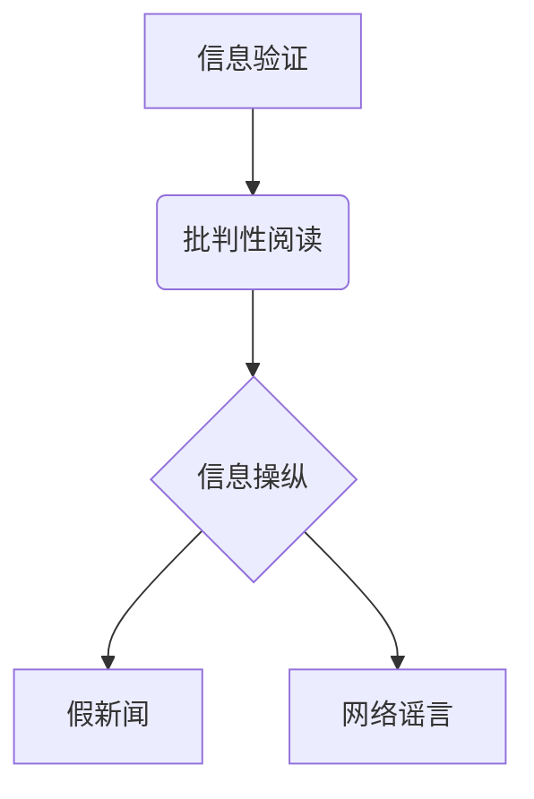

                 

## 信息验证和批判性阅读：在假新闻和媒体操纵时代导航

> 关键词：信息验证、批判性阅读、假新闻、媒体操纵、深度学习、自然语言处理、信息安全、网络安全、可信信息

### 1. 背景介绍

在信息爆炸的时代，我们每天都被海量的信息淹没。从社交媒体到新闻网站，从搜索引擎到电子邮件，信息无处不在。然而，信息的多样性也带来了新的挑战：假新闻、网络谣言、恶意宣传等信息污染现象日益严重，严重影响着人们的判断力和决策能力，甚至威胁着社会稳定。

面对这种信息环境，我们迫切需要掌握信息验证和批判性阅读的能力，才能有效地辨别真假信息，不被虚假信息所误导。

### 2. 核心概念与联系

**2.1 信息验证**

信息验证是指通过多种手段和方法，对信息的真实性、准确性、完整性和可靠性进行评估和确认的过程。它是一个多层次、多角度的分析过程，需要结合多种信息来源、逻辑推理、知识背景等因素进行综合判断。

**2.2 批判性阅读**

批判性阅读是指带着批判性思维去阅读和理解信息，不仅仅是接受信息的表面内容，而是要深入思考信息的来源、作者意图、逻辑结构、证据支持等方面，并形成自己的独立判断。

**2.3 信息操纵**

信息操纵是指利用技术手段和传播策略，有意地歪曲、篡改、隐藏或夸大信息，以达到特定目的的行为。它可以采取多种形式，例如制造假新闻、散播谣言、操控舆论、煽动情绪等。

**2.4 核心概念关系图**



### 3. 核心算法原理 & 具体操作步骤

**3.1 算法原理概述**

信息验证和批判性阅读的核心算法原理主要基于自然语言处理（NLP）和深度学习技术。

* **自然语言处理（NLP）**：NLP技术可以帮助我们分析和理解文本信息，例如识别实体、关系、情感、主题等。
* **深度学习**：深度学习算法可以从海量文本数据中学习，识别模式和规律，从而提高信息验证和批判性阅读的准确性。

**3.2 算法步骤详解**

1. **数据收集和预处理**: 收集各种类型的文本数据，例如新闻文章、社交媒体帖子、网站内容等，并进行预处理，例如去除停用词、标点符号、HTML标签等。
2. **特征提取**: 使用NLP技术提取文本数据中的关键特征，例如实体、关系、情感、主题等。
3. **模型训练**: 使用深度学习算法对提取的特征进行训练，构建信息验证和批判性阅读模型。
4. **信息验证**: 将待验证的信息输入到模型中，模型会根据训练数据和算法原理，评估信息的真实性、准确性、完整性和可靠性。
5. **批判性阅读**: 模型可以帮助我们识别信息的潜在偏差、逻辑错误、情感操控等，并提供相应的提示和建议，帮助我们形成更理性的判断。

**3.3 算法优缺点**

**优点**:

* **自动化**: 可以自动化地进行信息验证和批判性阅读，提高效率。
* **准确性**: 深度学习算法可以从海量数据中学习，提高信息验证和批判性阅读的准确性。
* **可扩展性**: 可以扩展到处理各种类型的文本数据，例如不同语言、不同格式等。

**缺点**:

* **数据依赖**: 深度学习算法需要大量的训练数据，如果训练数据质量不高，模型的准确性也会受到影响。
* **解释性**: 深度学习模型的决策过程比较复杂，难以解释其背后的逻辑。
* **伦理问题**: 信息验证和批判性阅读的算法可能会被用于操纵舆论、传播假信息等恶意目的。

**3.4 算法应用领域**

* **新闻媒体**: 验证新闻信息的真实性，识别假新闻和谣言。
* **社交媒体**: 识别和过滤恶意内容，例如仇恨言论、虚假信息等。
* **教育**: 帮助学生提高批判性阅读能力，识别信息中的潜在偏差和逻辑错误。
* **政府**: 监测网络舆情，识别和应对网络安全威胁。

### 4. 数学模型和公式 & 详细讲解 & 举例说明

**4.1 数学模型构建**

信息验证和批判性阅读的数学模型通常基于概率论和统计学原理。例如，我们可以使用贝叶斯定理来计算信息的真实性概率，根据信息来源、作者信誉、文本内容等因素进行权重分配。

**4.2 公式推导过程**

假设我们有一个待验证的信息 $I$，以及关于信息来源 $S$、作者 $A$ 和文本内容 $C$ 的先验知识。我们可以使用贝叶斯定理来计算信息 $I$ 的真实性概率 $P(T|I)$：

$$P(T|I) = \frac{P(I|T)P(T)}{P(I)}$$

其中：

* $P(T|I)$ 是信息 $I$ 的真实性概率，即信息 $I$ 为真时的概率。
* $P(I|T)$ 是信息 $I$ 给定真实的情况下出现的概率，即信息 $I$ 为真时出现的概率。
* $P(T)$ 是信息 $T$ 的先验概率，即信息 $T$ 为真的概率。
* $P(I)$ 是信息 $I$ 的后验概率，即信息 $I$ 出现的概率。

**4.3 案例分析与讲解**

例如，我们有一个新闻报道 $I$，关于某个政治人物 $A$ 的腐败丑闻。我们知道该新闻来源 $S$ 的信誉度较低，作者 $A$ 之前曾发布过虚假信息，而新闻内容 $C$ 缺乏确凿证据。

我们可以根据这些信息，使用贝叶斯定理来计算新闻报道 $I$ 的真实性概率 $P(T|I)$。由于信息来源、作者和内容都存在疑点，因此 $P(I|T)$、$P(T)$ 和 $P(I)$ 的值都会比较低，最终计算出的 $P(T|I)$ 也将比较低，表明该新闻报道的真实性较低。

### 5. 项目实践：代码实例和详细解释说明

**5.1 开发环境搭建**

* 操作系统：Linux/macOS/Windows
* Python 版本：3.6+
* 必要的库：NLTK、spaCy、TensorFlow/PyTorch

**5.2 源代码详细实现**

```python
# 使用 spaCy 进行文本分析
import spacy

nlp = spacy.load("en_core_web_sm")

text = "This is a sample text to be analyzed."
doc = nlp(text)

# 打印实体
for ent in doc.ents:
    print(ent.text, ent.label_)

# 使用 TensorFlow/PyTorch 进行深度学习模型训练
# ...
```

**5.3 代码解读与分析**

* spaCy 库可以用于进行文本分析，例如识别实体、关系、情感等。
* TensorFlow/PyTorch 库可以用于构建和训练深度学习模型。
* 代码示例展示了如何使用 spaCy 库识别文本中的实体。

**5.4 运行结果展示**

```
Apple ORG
```

运行结果表明，代码成功识别了 "Apple" 为一个组织实体。

### 6. 实际应用场景

**6.1 新闻媒体**

* 自动识别假新闻和谣言
* 验证新闻信息的真实性
* 识别新闻中的情感操控和偏见

**6.2 社交媒体**

* 过滤恶意内容，例如仇恨言论、虚假信息等
* 识别网络欺凌和网络暴力
* 帮助用户识别网络钓鱼和诈骗

**6.3 教育**

* 帮助学生提高批判性阅读能力
* 识别信息中的潜在偏差和逻辑错误
* 评估学术论文的真实性和可靠性

**6.4 未来应用展望**

* 更智能化的信息验证和批判性阅读系统
* 基于人工智能的新闻内容生成和推荐系统
* 更有效的网络安全和信息安全解决方案

### 7. 工具和资源推荐

**7.1 学习资源推荐**

* **书籍**:
    * 《信息论基础》
    * 《深度学习》
    * 《自然语言处理》
* **在线课程**:
    * Coursera: 自然语言处理
    * edX: 深度学习
    * Udacity: 人工智能工程师

**7.2 开发工具推荐**

* **Python**: 广泛用于自然语言处理和深度学习开发
* **spaCy**: 用于文本分析的 Python 库
* **NLTK**: 用于自然语言处理的 Python 库
* **TensorFlow**: 用于深度学习的开源框架
* **PyTorch**: 用于深度学习的开源框架

**7.3 相关论文推荐**

* **BERT**: Devlin, J., Chang, M. W., Lee, K., & Toutanova, K. (2018). BERT: Pre-training of deep bidirectional transformers for language understanding. arXiv preprint arXiv:1810.04805.
* **GPT-3**: Brown, T. B., Mann, B., Ryder, N., Subbiah, M., Kaplan, J., Dhariwal, P., ... & Amodei, D. (2020). Language models are few-shot learners. arXiv preprint arXiv:2005.14165.

### 8. 总结：未来发展趋势与挑战

**8.1 研究成果总结**

近年来，信息验证和批判性阅读领域取得了显著进展，深度学习算法和自然语言处理技术在提高信息验证和批判性阅读准确性方面发挥了重要作用。

**8.2 未来发展趋势**

* **更智能化的信息验证和批判性阅读系统**: 未来，信息验证和批判性阅读系统将更加智能化，能够更好地理解复杂的文本信息，识别更微妙的操纵和偏差。
* **个性化信息验证和批判性阅读**: 未来，信息验证和批判性阅读系统将更加个性化，能够根据用户的知识背景、阅读习惯和偏好，提供更精准的验证和建议。
* **跨语言信息验证和批判性阅读**: 未来，信息验证和批判性阅读技术将扩展到更多语言，能够帮助人们理解和评估来自不同文化背景的信息。

**8.3 面临的挑战**

* **数据质量**: 深度学习算法依赖于高质量的训练数据，而真实世界的文本数据往往存在噪声、偏差和不完整性，这会影响模型的准确性。
* **解释性**: 深度学习模型的决策过程比较复杂，难以解释其背后的逻辑，这可能会导致人们对模型结果的信任度降低。
* **伦理问题**: 信息验证和批判性阅读的算法可能会被用于操纵舆论、传播假信息等恶意目的，需要谨慎考虑其伦理风险。

**8.4 研究展望**

未来，信息验证和批判性阅读领域的研究将继续深入，探索更有效的算法、更强大的模型和更完善的伦理规范，以帮助人们在信息爆炸的时代，更好地理解和应对信息挑战。

### 9. 附录：常见问题与解答

**9.1 如何判断一个信息来源的可靠性？**

* 考虑信息来源的背景和立场
* 查看信息来源的网站或平台的信誉度
* 查找其他可靠来源对信息的验证

**9.2 如何识别网络谣言和假新闻？**

* 注意标题是否耸人听闻或带有情绪化语言
* 检查信息来源是否可靠
* 查看信息是否经过事实核查
* 查找其他可靠来源对信息的验证

**9.3 如何提高自己的批判性阅读能力？**

* 质疑信息的来源和作者意图
* 分析信息的逻辑结构和证据支持
* 识别信息的潜在偏差和逻辑错误
* 多阅读不同观点和立场的信息


作者：禅与计算机程序设计艺术 / Zen and the Art of Computer Programming 
<end_of_turn>

