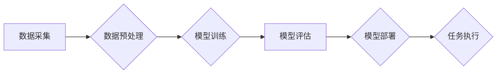

                 

## 利用AI工具提升工作效率与收入

> 关键词：人工智能、AI工具、工作效率、收入提升、自动化、机器学习、自然语言处理、代码生成、数据分析

## 1. 背景介绍

在当今科技飞速发展的时代，人工智能（AI）已经渗透到生活的方方面面，并正在深刻地改变着人们的工作方式。AI工具的出现，为我们提供了强大的能力，可以自动化完成许多重复性、耗时的任务，从而大幅提升工作效率和收入潜力。

从简单的智能搜索引擎到复杂的机器学习模型，AI工具的种类日益丰富，涵盖了各个领域，例如：

* **自然语言处理（NLP）：** 用于理解和生成人类语言，例如聊天机器人、文本摘要、机器翻译等。
* **计算机视觉：** 用于理解和分析图像和视频，例如图像识别、物体检测、人脸识别等。
* **代码生成：** 用于自动生成代码，例如GitHub Copilot、Tabnine等。
* **数据分析：** 用于分析和挖掘数据，例如预测分析、异常检测、数据可视化等。

## 2. 核心概念与联系

AI工具的核心概念是利用机器学习算法，从海量数据中学习模式和规律，从而实现智能化决策和自动化执行。

**AI工具工作原理：**



**AI工具与工作效率提升的关系：**

AI工具可以帮助我们自动化完成许多重复性、耗时的任务，例如：

* **数据录入：** 使用OCR技术自动识别和录入文本数据。
* **报告生成：** 使用NLP技术自动生成报告摘要和图表。
* **邮件处理：** 使用AI智能分类和回复邮件。
* **代码编写：** 使用代码生成工具自动完成代码片段。

通过自动化这些任务，我们可以腾出更多时间和精力去专注于更具创造性和战略性的工作，从而提升工作效率。

## 3. 核心算法原理 & 具体操作步骤

### 3.1  算法原理概述

机器学习算法是AI工具的核心，它可以根据训练数据学习并预测结果。常见的机器学习算法包括：

* **监督学习：** 利用标记数据训练模型，例如分类和回归问题。
* **无监督学习：** 利用未标记数据发现数据中的模式，例如聚类和降维。
* **强化学习：** 通过试错学习，在环境中获得最大奖励。

### 3.2  算法步骤详解

**以监督学习为例，其基本步骤如下：**

1. **数据采集和预处理：** 收集相关数据并进行清洗、转换、特征工程等预处理步骤。
2. **模型选择：** 根据具体问题选择合适的机器学习模型，例如线性回归、逻辑回归、决策树等。
3. **模型训练：** 利用训练数据训练模型，调整模型参数以最小化预测误差。
4. **模型评估：** 利用测试数据评估模型的性能，例如准确率、召回率、F1-score等。
5. **模型部署：** 将训练好的模型部署到实际应用场景中，用于预测新的数据。

### 3.3  算法优缺点

**优点：**

* 自动化学习：无需人工编程，可以自动从数据中学习模式。
* 高精度：在特定领域，机器学习模型可以达到甚至超过人类的预测精度。
* 可扩展性：可以处理海量数据，并随着数据量的增加而提升性能。

**缺点：**

* 数据依赖：机器学习模型的性能依赖于训练数据的质量和数量。
* 黑盒效应：一些复杂的机器学习模型难以解释其决策过程。
* 算法偏差：训练数据中的偏差可能会导致模型产生不公平或不准确的预测结果。

### 3.4  算法应用领域

机器学习算法广泛应用于各个领域，例如：

* **医疗保健：** 疾病诊断、药物研发、患者风险评估等。
* **金融服务：** 欺诈检测、信用评分、投资决策等。
* **电商：** 商品推荐、个性化营销、库存管理等。
* **交通运输：** 自驾车、交通流量预测、物流优化等。

## 4. 数学模型和公式 & 详细讲解 & 举例说明

### 4.1  数学模型构建

机器学习模型通常基于数学函数，例如线性回归模型：

$$
y = w_0 + w_1x_1 + w_2x_2 + ... + w_nx_n
$$

其中：

* $y$ 是预测结果
* $w_0, w_1, w_2, ..., w_n$ 是模型参数
* $x_1, x_2, ..., x_n$ 是输入特征

### 4.2  公式推导过程

模型参数的学习过程通常使用梯度下降算法，其目标是找到使预测误差最小化的参数值。梯度下降算法的基本原理是：

1. 计算模型预测结果与真实结果之间的误差。
2. 计算误差对每个参数的梯度。
3. 根据梯度方向更新每个参数值。
4. 重复步骤1-3，直到误差达到最小值。

### 4.3  案例分析与讲解

**举例说明：**

假设我们有一个线性回归模型，用于预测房价。输入特征包括房屋面积、房间数量、地理位置等。

通过训练数据，我们可以学习到模型参数，例如：

* $w_0 = 100000$
* $w_1 = 500$ (每平方米面积增加500元)
* $w_2 = 10000$ (每增加一间房间增加10000元)

因此，我们可以使用这个模型预测新房子的价格。例如，如果新房子的面积为100平方米，房间数量为3间，地理位置为市中心，那么预测价格为：

$$
y = 100000 + 500 * 100 + 10000 * 3 = 200000
$$

## 5. 项目实践：代码实例和详细解释说明

### 5.1  开发环境搭建

* **操作系统：** Windows、macOS、Linux
* **编程语言：** Python
* **机器学习库：** scikit-learn、TensorFlow、PyTorch
* **IDE：** PyCharm、VS Code

### 5.2  源代码详细实现

```python
from sklearn.linear_model import LinearRegression
from sklearn.model_selection import train_test_split
import pandas as pd

# 加载数据
data = pd.read_csv('house_price.csv')

# 划分训练集和测试集
X = data[['area', 'rooms']]
y = data['price']
X_train, X_test, y_train, y_test = train_test_split(X, y, test_size=0.2, random_state=42)

# 创建线性回归模型
model = LinearRegression()

# 训练模型
model.fit(X_train, y_train)

# 预测测试集数据
y_pred = model.predict(X_test)

# 评估模型性能
from sklearn.metrics import mean_squared_error
mse = mean_squared_error(y_test, y_pred)
print(f'Mean Squared Error: {mse}')
```

### 5.3  代码解读与分析

* **数据加载和预处理：** 使用pandas库加载数据，并选择需要使用的特征和目标变量。
* **数据划分：** 将数据划分为训练集和测试集，用于训练模型和评估模型性能。
* **模型创建：** 使用scikit-learn库创建线性回归模型。
* **模型训练：** 使用训练数据训练模型，学习模型参数。
* **模型预测：** 使用训练好的模型预测测试集数据。
* **模型评估：** 使用均方误差（MSE）评估模型性能。

### 5.4  运行结果展示

运行代码后，会输出模型的均方误差值，该值越小，模型的预测精度越高。

## 6. 实际应用场景

AI工具在各个领域都有广泛的应用场景，例如：

* **软件开发：** 使用代码生成工具自动完成代码片段，提高开发效率。
* **数据分析：** 使用机器学习模型分析海量数据，发现隐藏的模式和趋势。
* **客户服务：** 使用聊天机器人自动回复客户问题，提高客户满意度。
* **营销推广：** 使用AI算法进行精准营销，提高广告转化率。

### 6.4  未来应用展望

随着AI技术的不断发展，AI工具的应用场景将会更加广泛，例如：

* **个性化教育：** 使用AI算法根据学生的学习情况提供个性化的学习方案。
* **医疗诊断：** 使用AI模型辅助医生进行疾病诊断，提高诊断准确率。
* **自动驾驶：** 使用AI算法实现自动驾驶汽车，提高交通安全。

## 7. 工具和资源推荐

### 7.1  学习资源推荐

* **在线课程：** Coursera、edX、Udacity
* **书籍：** 《深度学习》、《机器学习实战》
* **博客和论坛：** Towards Data Science、Machine Learning Mastery

### 7.2  开发工具推荐

* **编程语言：** Python
* **机器学习库：** scikit-learn、TensorFlow、PyTorch
* **数据可视化工具：** Matplotlib、Seaborn

### 7.3  相关论文推荐

* **《ImageNet Classification with Deep Convolutional Neural Networks》**
* **《Attention Is All You Need》**
* **《BERT: Pre-training of Deep Bidirectional Transformers for Language Understanding》**

## 8. 总结：未来发展趋势与挑战

### 8.1  研究成果总结

AI工具的发展取得了显著的成果，在各个领域都发挥着越来越重要的作用。机器学习算法的不断进步，使得AI工具能够处理更复杂的任务，并取得更高的精度。

### 8.2  未来发展趋势

* **模型更加强大：** 随着计算能力的提升，AI模型将会更加强大，能够处理更复杂的任务。
* **应用更加广泛：** AI工具将会应用到更多领域，例如医疗保健、教育、金融等。
* **更加可解释：** 研究者将致力于开发更加可解释的AI模型，以便更好地理解模型的决策过程。

### 8.3  面临的挑战

* **数据安全和隐私：** AI工具的训练和应用需要大量数据，如何保证数据安全和隐私是一个重要的挑战。
* **算法偏见：** 训练数据中的偏差可能会导致模型产生不公平或不准确的预测结果，需要研究如何解决算法偏见问题。
* **伦理问题：** AI技术的快速发展引发了一些伦理问题，例如人工智能的责任和义务，需要进行深入的探讨和研究。

### 8.4  研究展望

未来，AI工具将会继续发展，并对我们的生活产生更深远的影响。我们需要积极探索AI技术的应用，并关注其带来的挑战和机遇，以确保AI技术能够造福人类。

## 9. 附录：常见问题与解答

**Q1：如何选择合适的AI工具？**

**A1：** 选择AI工具需要根据具体的需求和应用场景进行选择。例如，如果需要进行文本分析，可以选择NLP工具；如果需要进行图像识别，可以选择计算机视觉工具。

**Q2：如何学习使用AI工具？**

**A2：** 可以通过在线课程、书籍、博客和论坛等方式学习使用AI工具。

**Q3：AI工具会取代人类的工作吗？**

**A3：** AI工具可以自动化完成许多重复性、耗时的任务，但它并不会完全取代人类的工作。AI工具可以帮助人类提高效率，并解放人类去做更具创造性和战略性的工作。


作者：禅与计算机程序设计艺术 / Zen and the Art of Computer Programming 
<end_of_turn>

