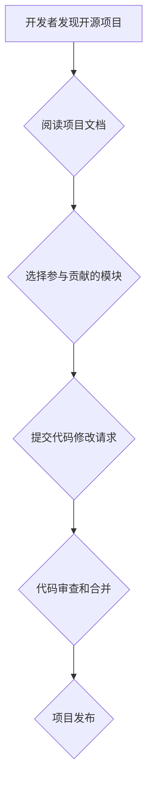

                 

## 利用开源贡献提升职场竞争力

> 关键词：开源贡献、职场竞争力、代码实践、技术能力、社区参与、个人品牌

### 1. 背景介绍

在当今科技日新月异的时代，技术人才的竞争日益激烈。想要在激烈的职场竞争中脱颖而出，仅仅拥有扎实的理论知识已经远远不够。实践经验、项目经验和团队协作能力成为越来越重要的评判标准。开源贡献作为一种独特的实践方式，为IT从业者提供了提升职场竞争力的绝佳途径。

开源贡献是指将自己的代码、文档、测试用例等资源免费发布到公共平台，供他人使用、修改和再发布的行为。参与开源项目，不仅可以锻炼自身的编程能力和解决问题的能力，还能积累宝贵的项目经验，建立广泛的人脉关系，提升个人品牌价值。

### 2. 核心概念与联系

#### 2.1 开源贡献的本质

开源贡献的核心概念是“共享”和“协作”。开源项目鼓励开发者共同参与，分享知识和经验，共同推动项目的进步。

#### 2.2 开源贡献与职场竞争力的关系

开源贡献可以从以下几个方面提升职场竞争力：

* **提升技术能力:** 通过参与开源项目，可以接触到不同领域的代码和技术，学习先进的开发理念和实践经验，从而提升自身的编程能力和解决问题的能力。
* **积累项目经验:** 开源项目通常规模较大，涉及多个模块和功能，参与者需要与其他开发者协作，完成复杂的开发任务。这可以帮助开发者积累宝贵的项目经验，了解项目管理、代码规范、测试流程等方面的知识。
* **建立人脉关系:** 开源社区是一个充满活力的网络，开发者可以与来自世界各地的技术专家交流学习，建立广泛的人脉关系。这些人脉关系可以为未来的职业发展提供宝贵的资源和支持。
* **提升个人品牌价值:** 开源贡献可以展示开发者的技术能力和专业素养，提升其个人品牌价值。在求职过程中，开源贡献可以成为重要的加分项，帮助开发者脱颖而出。

#### 2.3 开源贡献的流程



### 3. 核心算法原理 & 具体操作步骤

#### 3.1 算法原理概述

开源贡献的核心算法原理是“协作开发”。 

* **版本控制:** 使用 Git 等版本控制系统管理代码，方便多人协作开发，追踪代码变更历史。
* **代码审查:** 提交代码修改请求后，其他开发者会进行代码审查，确保代码质量和符合项目规范。
* **合并冲突解决:** 当多个开发者同时修改同一部分代码时，需要进行冲突解决，合并代码变更。

#### 3.2 算法步骤详解

1. **选择开源项目:** 根据自己的兴趣和技术水平选择合适的开源项目参与。
2. **阅读项目文档:** 仔细阅读项目的文档，了解项目的架构、设计理念、代码规范等。
3. **选择贡献模块:** 根据自己的能力和兴趣选择一个合适的模块进行贡献。
4. **提交代码修改请求:** 在项目平台上提交代码修改请求，并撰写详细的描述和测试用例。
5. **代码审查:** 其他开发者会对提交的代码进行审查，提出修改建议或意见。
6. **代码修改和合并:** 根据审查意见修改代码，并与其他开发者协作合并代码变更。
7. **项目发布:** 合并后的代码会被发布到项目平台，供其他开发者使用。

#### 3.3 算法优缺点

* **优点:**
    * 提升技术能力和项目经验
    * 建立人脉关系和提升个人品牌价值
    * 参与社区建设，回馈开源社区
* **缺点:**
    * 需要投入时间和精力
    * 可能需要面对代码审查和冲突解决等挑战
    * 需要具备良好的沟通和协作能力

#### 3.4 算法应用领域

开源贡献的应用领域非常广泛，包括：

* **软件开发:** 参与开源软件项目的开发，贡献代码、文档、测试用例等。
* **硬件开发:** 参与开源硬件项目的开发，贡献硬件设计、驱动程序、测试工具等。
* **数据科学:** 参与开源数据科学项目的开发，贡献算法模型、数据处理工具、可视化工具等。
* **人工智能:** 参与开源人工智能项目的开发，贡献算法模型、训练数据、评估工具等。

### 4. 数学模型和公式 & 详细讲解 & 举例说明

#### 4.1 数学模型构建

开源贡献可以看作是一个网络效应模型，其核心是参与者数量和贡献价值之间的正反馈关系。

* **参与者数量:** 参与开源项目的开发者数量越多，项目的影响力越大，吸引更多开发者参与。
* **贡献价值:** 开发者贡献的代码质量、文档完善程度、测试用例覆盖率等因素决定了贡献价值。

#### 4.2 公式推导过程

假设：

* $N$ 为开源项目参与者数量
* $V$ 为开源项目贡献价值
* $k$ 为正反馈系数

则开源项目的影响力 $I$ 可以表示为：

$$I = k * N * V$$

#### 4.3 案例分析与讲解

例如，一个开源项目拥有 1000 名开发者，每个开发者的贡献价值为 10 分，正反馈系数为 0.1。则该项目的总影响力为：

$$I = 0.1 * 1000 * 10 = 1000$$

如果该项目吸引了 2000 名开发者，每个开发者的贡献价值保持不变，则总影响力将为：

$$I = 0.1 * 2000 * 10 = 2000$$

可见，参与者数量和贡献价值的增加都会显著提升开源项目的总影响力。

### 5. 项目实践：代码实例和详细解释说明

#### 5.1 开发环境搭建

1. 安装 Git 版本控制系统。
2. 选择一个开源项目平台，例如 GitHub、GitLab 或 Bitbucket。
3. 创建一个项目账号并登录到平台。

#### 5.2 源代码详细实现

以贡献一个简单的开源项目为例，假设该项目是一个简单的文本编辑器。

1. **选择贡献模块:** 选择一个简单的功能模块，例如添加字体大小选择功能。
2. **阅读项目文档:** 仔细阅读项目的文档，了解项目的架构、设计理念、代码规范等。
3. **提交代码修改请求:** 在项目平台上提交代码修改请求，并撰写详细的描述和测试用例。

#### 5.3 代码解读与分析

```python
# 添加字体大小选择功能

def set_font_size(size):
    """设置文本编辑器字体大小"""
    # 获取文本编辑器窗口
    window = get_active_window()
    # 设置字体大小
    window.font_size = size

# 添加菜单项
menu_item = Menu.add_item("字体大小", set_font_size)
```

#### 5.4 运行结果展示

运行代码后，在文本编辑器菜单中会出现“字体大小”选项，用户可以选择不同的字体大小。

### 6. 实际应用场景

#### 6.1 开源贡献的应用场景

开源贡献在各个领域都有广泛的应用场景，例如：

* **软件开发:** 参与开源软件项目的开发，例如 Linux、Apache、MySQL 等。
* **硬件开发:** 参与开源硬件项目的开发，例如 Arduino、Raspberry Pi 等。
* **数据科学:** 参与开源数据科学项目的开发，例如 TensorFlow、PyTorch 等。
* **人工智能:** 参与开源人工智能项目的开发，例如 OpenAI、Hugging Face 等。

#### 6.2 开源贡献的案例分析

* **Linux:** Linux 操作系统是开源社区的典范，由全球开发者共同贡献，成为全球最流行的操作系统之一。
* **Apache:** Apache HTTP 服务器是开源社区的又一代表，广泛应用于网站服务器，推动了互联网的发展。
* **TensorFlow:** TensorFlow 是开源的机器学习框架，被广泛应用于人工智能领域，推动了人工智能技术的普及。

#### 6.4 未来应用展望

随着科技的不断发展，开源贡献将发挥越来越重要的作用。未来，开源贡献将更加深入地融入各个领域，推动科技创新和社会进步。

### 7. 工具和资源推荐

#### 7.1 学习资源推荐

* **GitHub:** https://github.com/
* **GitLab:** https://gitlab.com/
* **Bitbucket:** https://bitbucket.org/
* **开源中国:** https://www.oschina.net/

#### 7.2 开发工具推荐

* **Git:** https://git-scm.com/
* **Visual Studio Code:** https://code.visualstudio.com/
* **IntelliJ IDEA:** https://www.jetbrains.com/idea/

#### 7.3 相关论文推荐

* **The Cathedral and the Bazaar** by Eric S. Raymond
* **Open Source Software Development** by Karl Fogel

### 8. 总结：未来发展趋势与挑战

#### 8.1 研究成果总结

开源贡献已经成为一种重要的软件开发模式，为软件开发提供了新的思路和方法。开源贡献不仅可以提升开发者的技术能力和项目经验，还能建立人脉关系和提升个人品牌价值。

#### 8.2 未来发展趋势

* **开源社区的进一步发展:** 开源社区将更加活跃，吸引更多开发者参与。
* **开源项目的规模和复杂度不断提高:** 开源项目将更加注重质量和可维护性。
* **开源贡献与商业模式的融合:** 开源贡献将更加与商业模式相结合，形成新的商业模式。

#### 8.3 面临的挑战

* **代码质量控制:** 确保开源项目的代码质量，避免出现安全漏洞和性能问题。
* **社区治理:** 建立有效的社区治理机制，维护社区的和谐发展。
* **知识产权保护:** 确保开源项目的知识产权得到有效保护。

#### 8.4 研究展望

未来，开源贡献的研究将更加注重以下方面:

* **开源贡献的激励机制:** 研究如何激励开发者参与开源贡献。
* **开源贡献的评估方法:** 研究如何评估开源贡献的价值。
* **开源贡献与人工智能的结合:** 研究如何利用人工智能技术提升开源贡献的效率和质量。

### 9. 附录：常见问题与解答

#### 9.1 如何开始参与开源贡献？

1. 选择一个感兴趣的开源项目。
2. 阅读项目的文档，了解项目的架构、设计理念、代码规范等。
3. 寻找一个合适的贡献模块，例如修复 bug、添加新功能等。
4. 提交代码修改请求，并撰写详细的描述和测试用例。

#### 9.2 如何解决代码审查中的问题？

1. 耐心阅读代码审查意见，认真理解意见的含义。
2. 与代码审查者进行沟通，澄清疑问，寻求解决方案。
3. 根据意见修改代码，并提交修改后的代码。

#### 9.3 开源贡献有什么好处？

* 提升技术能力和项目经验
* 建立人脉关系和提升个人品牌价值
* 参与社区建设，回馈开源社区


作者：禅与计算机程序设计艺术 / Zen and the Art of Computer Programming 
<end_of_turn>

