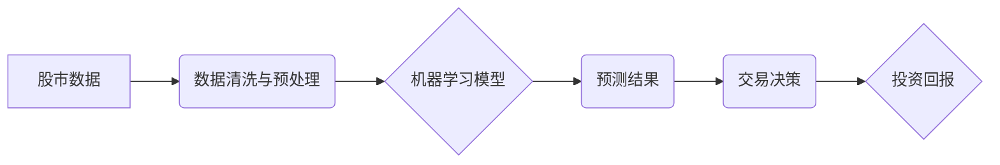

                 

## 利用技术优势进行股市投资

> 关键词：人工智能、机器学习、深度学习、量化交易、股市预测、技术分析、数据挖掘、风险管理

## 1. 背景介绍

股市投资一直以来都是一个充满机遇和挑战的领域。传统的投资策略往往依赖于经验、直觉和市场分析，而近年来，随着人工智能（AI）技术的快速发展，利用技术优势进行股市投资逐渐成为一种新的趋势。AI算法能够处理海量数据，识别复杂的模式，并做出更精准的预测，为投资者提供更有效的决策支持。

## 2. 核心概念与联系

### 2.1 量化交易

量化交易是一种利用数学模型和计算机程序进行股票交易的投资策略。它通过对历史数据进行分析，建立预测模型，并根据模型输出的信号自动执行交易。量化交易的核心是数据驱动，它依赖于大量的数据和先进的算法来识别市场机会并进行交易。

### 2.2 机器学习

机器学习是人工智能的一个分支，它通过算法训练模型，使模型能够从数据中学习并做出预测。在股市投资中，机器学习算法可以用于预测股票价格走势、识别市场趋势、评估投资风险等。

### 2.3 深度学习

深度学习是机器学习的一种更高级形式，它使用多层神经网络来模拟人类大脑的学习过程。深度学习算法能够处理更复杂的数据，并获得更精准的预测结果。在股市投资中，深度学习算法可以用于识别复杂的市场模式，并进行更精准的预测。

**核心概念与联系流程图**



## 3. 核心算法原理 & 具体操作步骤

### 3.1 算法原理概述

在股市投资中，常用的机器学习算法包括线性回归、逻辑回归、支持向量机、决策树、随机森林、梯度提升树等。这些算法都基于不同的原理，用于从历史数据中学习股票价格走势的规律，并做出预测。

### 3.2 算法步骤详解

**以线性回归为例，其具体操作步骤如下：**

1. **数据收集与预处理:** 收集历史股票价格数据，并进行清洗、转换和特征工程，例如计算移动平均线、波动率等特征。
2. **模型训练:** 使用训练数据训练线性回归模型，找到股票价格与特征之间的线性关系。
3. **模型评估:** 使用测试数据评估模型的预测精度，例如使用均方误差（MSE）或R-squared等指标。
4. **模型优化:** 根据评估结果，调整模型参数，例如学习率、正则化系数等，提高模型的预测精度。
5. **预测与交易:** 使用训练好的模型预测未来股票价格，并根据预测结果进行交易决策。

### 3.3 算法优缺点

**线性回归算法的优缺点:**

* **优点:** 算法简单易懂，易于实现，计算效率高。
* **缺点:** 只能处理线性关系，对非线性关系的预测精度较低。

### 3.4 算法应用领域

线性回归算法广泛应用于股票价格预测、市场趋势分析、投资风险评估等领域。

## 4. 数学模型和公式 & 详细讲解 & 举例说明

### 4.1 数学模型构建

线性回归模型的数学表达式为：

$$y = \beta_0 + \beta_1x_1 + \beta_2x_2 + ... + \beta_nx_n + \epsilon$$

其中：

* $y$ 是预测变量，例如股票价格。
* $x_1, x_2, ..., x_n$ 是特征变量，例如移动平均线、波动率等。
* $\beta_0, \beta_1, ..., \beta_n$ 是模型参数，需要通过训练数据进行估计。
* $\epsilon$ 是误差项，代表模型预测与实际值之间的偏差。

### 4.2 公式推导过程

线性回归模型的目标是找到最佳的模型参数，使得模型预测与实际值之间的误差最小。常用的优化算法是梯度下降法，其原理是通过迭代更新模型参数，逐步降低误差。

### 4.3 案例分析与讲解

假设我们想要预测某只股票的未来价格，并收集了其历史价格、移动平均线和波动率等数据。我们可以使用线性回归模型来建立预测模型，并根据模型输出的预测结果进行交易决策。

## 5. 项目实践：代码实例和详细解释说明

### 5.1 开发环境搭建

为了实现股市投资项目，我们需要搭建一个开发环境，包括以下软件：

* Python 编程语言
* NumPy、Pandas、Scikit-learn 等数据科学库
* Matplotlib、Seaborn 等数据可视化库
* TradingView、Alpaca 等交易平台接口

### 5.2 源代码详细实现

```python
import pandas as pd
from sklearn.linear_model import LinearRegression

# 数据加载
data = pd.read_csv('stock_data.csv')

# 数据预处理
data['MA5'] = data['Close'].rolling(window=5).mean()
data['Volatility'] = data['Close'].pct_change().std()

# 特征选择
features = ['MA5', 'Volatility']
target = 'Close'

# 模型训练
model = LinearRegression()
model.fit(data[features], data[target])

# 模型预测
predictions = model.predict(data[features])

# 结果展示
print(predictions)
```

### 5.3 代码解读与分析

这段代码首先加载股票数据，然后进行数据预处理，例如计算移动平均线和波动率等特征。接着，选择特征变量和目标变量，并使用线性回归模型进行训练。最后，使用训练好的模型预测未来股票价格，并输出预测结果。

### 5.4 运行结果展示

运行代码后，会输出预测的股票价格，我们可以将预测结果与实际价格进行比较，评估模型的预测精度。

## 6. 实际应用场景

### 6.1 股票价格预测

利用机器学习算法预测股票价格是量化交易的核心应用场景。通过分析历史数据，识别市场趋势和价格波动规律，可以帮助投资者做出更精准的买入和卖出决策。

### 6.2 市场趋势分析

机器学习算法可以用于分析市场趋势，识别潜在的投资机会。例如，可以分析不同行业、不同地区的股票价格走势，识别表现优异的行业或地区，并进行相应的投资配置。

### 6.3 投资风险评估

机器学习算法可以用于评估投资风险，帮助投资者做出更合理的投资决策。例如，可以分析股票的波动性、相关性等指标，评估投资组合的风险水平，并进行相应的风险控制。

### 6.4 未来应用展望

随着人工智能技术的不断发展，其在股市投资领域的应用场景将更加广泛。例如，可以利用深度学习算法识别更复杂的市场模式，并进行更精准的预测；可以利用自然语言处理技术分析新闻、社交媒体等信息，识别市场情绪变化；可以利用强化学习算法优化交易策略，提高投资回报率。

## 7. 工具和资源推荐

### 7.1 学习资源推荐

* **书籍:**
    * 《Python机器学习实战》
    * 《深度学习》
    * 《量化投资》
* **在线课程:**
    * Coursera
    * edX
    * Udemy

### 7.2 开发工具推荐

* **Python:** 
    * Jupyter Notebook
    * Spyder
* **数据科学库:**
    * NumPy
    * Pandas
    * Scikit-learn
* **交易平台接口:**
    * TradingView
    * Alpaca

### 7.3 相关论文推荐

* **机器学习在金融领域的应用:**
    * 《机器学习在金融领域的应用》
    * 《深度学习在金融领域的应用》
* **量化交易策略:**
    * 《量化交易策略》
    * 《量化交易算法》

## 8. 总结：未来发展趋势与挑战

### 8.1 研究成果总结

利用技术优势进行股市投资已经取得了一定的成果，机器学习算法能够有效地预测股票价格、识别市场趋势和评估投资风险。

### 8.2 未来发展趋势

未来，人工智能技术在股市投资领域的应用将更加广泛和深入，例如：

* **更精准的预测:** 利用深度学习算法识别更复杂的市场模式，并进行更精准的预测。
* **更智能的交易策略:** 利用强化学习算法优化交易策略，提高投资回报率。
* **更个性化的投资服务:** 利用人工智能技术提供个性化的投资建议和服务。

### 8.3 面临的挑战

尽管人工智能技术在股市投资领域展现出巨大的潜力，但也面临一些挑战：

* **数据质量:** 股市数据往往存在噪声、缺失值等问题，需要进行有效的数据清洗和预处理。
* **模型解释性:** 一些深度学习算法的预测结果难以解释，这可能会影响投资者的信任和决策。
* **监管风险:** 随着人工智能技术的应用，监管机构需要制定相应的规则和规范，确保市场公平、透明和安全。

### 8.4 研究展望

未来，我们需要继续加强人工智能技术在股市投资领域的应用研究，解决上述挑战，并推动人工智能技术在金融领域的健康发展。

## 9. 附录：常见问题与解答

### 9.1 如何选择合适的机器学习算法？

选择合适的机器学习算法需要根据具体的数据特点和投资目标进行选择。例如，对于线性关系的数据，可以使用线性回归算法；对于非线性关系的数据，可以使用决策树、随机森林或神经网络算法。

### 9.2 如何评估机器学习模型的预测精度？

常用的评估指标包括均方误差（MSE）、R-squared、准确率等。

### 9.3 如何控制投资风险？

投资风险可以通过以下方式控制：

* **分散投资:** 将资金分散投资于不同的资产类别、行业和地区。
* **止损策略:** 设置止损点，在股票价格跌幅达到一定程度时自动卖出。
* **风险管理工具:** 使用风险管理工具，例如Value at Risk（VaR）等，评估投资组合的风险水平。


作者：禅与计算机程序设计艺术 / Zen and the Art of Computer Programming 
<end_of_turn>

