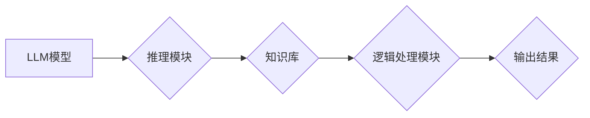

                 

## 图灵完备LLM:通向人工通用智能

> 关键词：图灵完备性、LLM、人工通用智能、深度学习、自然语言处理、知识表示、推理能力、算法原理、数学模型、代码实现

### 1. 背景介绍

近年来，深度学习技术取得了飞速发展，特别是生成式预训练语言模型（LLM）的出现，为人工智能领域带来了革命性的变革。从 GPT-3 到 LaMDA，这些模型展现出惊人的文本生成、翻译、摘要等能力，让人们对人工智能的未来充满了期待。然而，现有的LLM模型仍然存在一些局限性，例如缺乏推理能力、难以处理复杂逻辑问题、对新知识的学习能力有限。

图灵完备性是人工智能领域一个重要的概念，它指的是一个系统能够理解和执行任意算法的能力。如果一个LLM模型能够实现图灵完备性，那么它将具备更强大的智能，能够解决更复杂的问题，甚至可以模拟人类的思考方式。

### 2. 核心概念与联系

**2.1 图灵完备性**

图灵完备性源于图灵机的概念。图灵机是一种理论上的计算模型，它能够模拟任何算法。如果一个系统能够模拟图灵机，那么它就具有图灵完备性。

**2.2 LLM模型**

LLM模型是一种基于深度学习的语言模型，它通过训练大量的文本数据来学习语言的规律和结构。这些模型通常具有数十亿甚至数千亿的参数，能够生成流畅、自然的文本。

**2.3 连接关系**

图灵完备性是LLM模型追求的目标之一。通过增强LLM模型的推理能力、逻辑处理能力和知识表示能力，可以使其逐步接近图灵完备性。

**2.4 架构图**



### 3. 核心算法原理 & 具体操作步骤

**3.1 算法原理概述**

实现图灵完备LLM模型需要结合多种算法和技术，包括：

* **Transformer网络:** Transformer网络是一种强大的深度学习架构，能够有效地处理序列数据，例如文本。它通过注意力机制学习文本之间的关系，提高了LLM模型的理解能力。
* **符号逻辑:** 符号逻辑是一种形式化的推理系统，能够处理逻辑关系和推理问题。将符号逻辑融入LLM模型可以增强其推理能力。
* **知识图谱:** 知识图谱是一种结构化的知识表示形式，可以存储和推理各种知识。将知识图谱与LLM模型结合可以提高其对知识的理解和应用能力。

**3.2 算法步骤详解**

1. **预训练:** 使用大量的文本数据预训练LLM模型，使其学习语言的规律和结构。
2. **微调:** 根据特定任务对LLM模型进行微调，例如文本分类、问答系统等。
3. **推理模块集成:** 将符号逻辑、知识图谱等技术集成到LLM模型中，增强其推理能力。
4. **测试与评估:** 对图灵完备LLM模型进行测试和评估，评估其性能和能力。

**3.3 算法优缺点**

* **优点:** 
    * 能够处理更复杂的任务，例如推理、逻辑判断、知识问答等。
    * 具备更强的学习能力，能够从数据中学习新的知识和技能。
    * 更接近人类的智能水平。
* **缺点:** 
    * 算法复杂度高，训练成本高。
    * 需要大量的训练数据和计算资源。
    * 仍然存在一些局限性，例如难以处理开放式问题、缺乏常识推理能力等。

**3.4 算法应用领域**

* **自然语言理解:** 
    * 问答系统
    * 文本分类
    * 情感分析
    * 摘要生成
* **人工智能助手:** 
    * 智能聊天机器人
    * 个人助理
    * 教学助手
* **科学研究:** 
    * 知识发现
    * 数据分析
    * 模型预测

### 4. 数学模型和公式 & 详细讲解 & 举例说明

**4.1 数学模型构建**

图灵完备LLM模型可以看作是一个复杂的概率模型，其核心是利用深度学习算法学习语言的概率分布。

* **概率分布:** 每个单词在句子中的出现概率可以被表示为一个概率分布。
* **神经网络:** 深度神经网络可以学习这些概率分布，并根据输入的文本序列预测下一个单词的概率。

**4.2 公式推导过程**

* **交叉熵损失函数:** 用于衡量模型预测结果与真实结果之间的差异。

$$
J(\theta) = -\frac{1}{N} \sum_{i=1}^{N} \sum_{j=1}^{M} y_{ij} \log p_{\theta}(x_{ij})
$$

其中：

* $J(\theta)$ 是交叉熵损失函数
* $\theta$ 是模型参数
* $N$ 是训练样本数量
* $M$ 是每个样本的单词数量
* $y_{ij}$ 是真实标签，1表示单词 $x_{ij}$ 出现，0表示不出现
* $p_{\theta}(x_{ij})$ 是模型预测单词 $x_{ij}$ 出现的概率

* **梯度下降算法:** 用于更新模型参数，使其最小化损失函数。

$$
\theta = \theta - \alpha \nabla J(\theta)
$$

其中：

* $\alpha$ 是学习率
* $\nabla J(\theta)$ 是损失函数的梯度

**4.3 案例分析与讲解**

假设我们有一个LLM模型，需要预测句子 "The cat sat on the" 中下一个单词。

* 模型根据输入的文本序列 "The cat sat on the" 计算每个单词出现的概率。
* 选择概率最高的单词作为预测结果。

例如，如果模型预测 "mat" 的概率最高，那么它将预测下一个单词是 "mat"。

### 5. 项目实践：代码实例和详细解释说明

**5.1 开发环境搭建**

* Python 3.7+
* PyTorch 或 TensorFlow
* CUDA 和 cuDNN (可选，用于GPU加速)

**5.2 源代码详细实现**

由于篇幅限制，这里只提供一个简单的LLM模型训练代码示例，完整的代码实现需要根据具体需求进行调整。

```python
import torch
import torch.nn as nn

class SimpleLLM(nn.Module):
    def __init__(self, vocab_size, embedding_dim, hidden_dim):
        super(SimpleLLM, self).__init__()
        self.embedding = nn.Embedding(vocab_size, embedding_dim)
        self.lstm = nn.LSTM(embedding_dim, hidden_dim)
        self.fc = nn.Linear(hidden_dim, vocab_size)

    def forward(self, x):
        embedded = self.embedding(x)
        output, (hidden, cell) = self.lstm(embedded)
        output = self.fc(output[:, -1, :])
        return output

# ... (其他代码，例如数据加载、训练循环等)
```

**5.3 代码解读与分析**

* `SimpleLLM` 类定义了一个简单的LLM模型。
* `embedding` 层将单词转换为向量表示。
* `lstm` 层是一个循环神经网络，用于处理序列数据。
* `fc` 层是一个全连接层，用于预测下一个单词的概率。

**5.4 运行结果展示**

训练完成后，可以将模型应用于文本生成任务，例如根据给定的文本序列预测下一个单词。

### 6. 实际应用场景

图灵完备LLM模型在多个领域具有广泛的应用前景：

* **智能客服:** 能够理解用户的自然语言问题，并提供准确的答案。
* **个性化教育:** 根据学生的学习进度和需求，提供个性化的学习内容和辅导。
* **科学研究:** 帮助科学家分析数据、发现新知识和进行模型预测。

**6.4 未来应用展望**

随着人工智能技术的不断发展，图灵完备LLM模型有望在未来实现更广泛的应用，例如：

* **通用人工智能:** 构建能够执行任意任务的人工智能系统。
* **人类-机器协作:** 人类和机器协同工作，提高工作效率和创造力。
* **科学发现:** 帮助科学家解决复杂科学问题，加速科学进步。

### 7. 工具和资源推荐

**7.1 学习资源推荐**

* **书籍:**
    * 《深度学习》 by Ian Goodfellow, Yoshua Bengio, and Aaron Courville
    * 《自然语言处理》 by Dan Jurafsky and James H. Martin
* **在线课程:**
    * Coursera: Deep Learning Specialization
    * Stanford CS224N: Natural Language Processing with Deep Learning

**7.2 开发工具推荐**

* **PyTorch:** 一个开源的深度学习框架。
* **TensorFlow:** 另一个开源的深度学习框架。
* **Hugging Face Transformers:** 一个用于预训练语言模型的库。

**7.3 相关论文推荐**

* **Attention Is All You Need:** https://arxiv.org/abs/1706.03762
* **BERT: Pre-training of Deep Bidirectional Transformers for Language Understanding:** https://arxiv.org/abs/1810.04805
* **GPT-3: Language Models are Few-Shot Learners:** https://arxiv.org/abs/2005.14165

### 8. 总结：未来发展趋势与挑战

**8.1 研究成果总结**

近年来，图灵完备LLM模型取得了显著进展，例如GPT-3、LaMDA等模型展现出惊人的文本生成能力。这些模型的出现标志着人工智能领域迈向一个新的阶段。

**8.2 未来发展趋势**

* **模型规模和能力的提升:** 未来LLM模型的规模和能力将继续提升，能够处理更复杂的任务，例如推理、逻辑判断、代码生成等。
* **多模态学习:** LLMs将融合视觉、音频等多模态数据，实现更全面的智能。
* **可解释性增强:** 研究如何提高LLM模型的可解释性，使其决策过程更加透明。

**8.3 面临的挑战**

* **数据获取和标注:** 训练图灵完备LLM模型需要大量的训练数据，获取和标注这些数据是一个巨大的挑战。
* **计算资源:** 训练大型LLM模型需要大量的计算资源，这对于资源有限的机构来说是一个瓶颈。
* **伦理问题:** LLMs的强大能力也带来了伦理问题，例如信息操纵、偏见放大等，需要谨慎对待。

**8.4 研究展望**

图灵完备LLM模型的研究是一个充满挑战和机遇的领域。未来，我们需要继续探索新的算法、模型架构和训练方法，以实现更强大的智能，并解决人工智能带来的伦理问题。

### 9. 附录：常见问题与解答

* **什么是图灵完备性？**

图灵完备性是指一个系统能够模拟任何算法的能力。

* **LLM模型如何实现图灵完备性？**

通过增强LLM模型的推理能力、逻辑处理能力和知识表示能力，可以使其逐步接近图灵完备性。

* **图灵完备LLM模型有哪些应用场景？**

图灵完备LLM模型在智能客服、个性化教育、科学研究等多个领域具有广泛的应用前景。

* **图灵完备LLM模型面临哪些挑战？**

数据获取和标注、计算资源、伦理问题是图灵完备LLM模型面临的主要挑战。


作者：禅与计算机程序设计艺术 / Zen and the Art of Computer Programming 
<end_of_turn>

