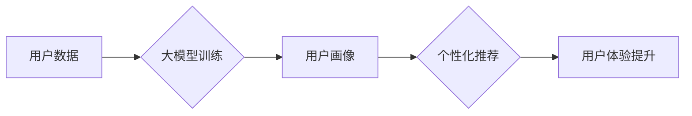

                 

## 基于大模型的电商平台个性化营销

> 关键词：大模型、电商平台、个性化营销、推荐系统、自然语言处理、深度学习、Transformer

## 1. 背景介绍

随着电商平台的蓬勃发展，用户数量激增，商品种类繁多，个性化需求日益突出。传统的电商营销模式难以满足用户多样化的需求，因此，个性化营销成为电商平台发展的重要趋势。

大模型作为一种强大的人工智能技术，在自然语言处理、图像识别、语音合成等领域取得了突破性进展。其强大的学习能力和泛化能力使其成为个性化营销的理想选择。

基于大模型的个性化营销能够通过深度理解用户需求，精准推荐商品，提升用户体验，最终促进销售增长。

## 2. 核心概念与联系

### 2.1  大模型

大模型是指参数量巨大、训练数据海量的人工智能模型。其强大的学习能力和泛化能力使其能够处理复杂的任务，并生成高质量的输出。

常见的代表性大模型包括GPT-3、BERT、LaMDA等。

### 2.2  电商平台个性化营销

电商平台个性化营销是指根据用户的个人特征、行为模式、偏好等信息，定制化地提供商品推荐、广告推送、促销活动等服务，以满足用户的个性化需求。

### 2.3  核心概念联系

大模型能够通过学习海量用户数据，构建用户画像，并预测用户的行为模式和偏好。

电商平台可以利用大模型的优势，构建基于用户的个性化推荐系统，精准推荐商品，提升用户体验。

**Mermaid 流程图**



## 3. 核心算法原理 & 具体操作步骤

### 3.1  算法原理概述

基于大模型的个性化营销主要依赖于以下核心算法：

* **协同过滤算法:** 通过分析用户对商品的评分或购买行为，预测用户对其他商品的兴趣。
* **内容过滤算法:** 通过分析商品的特征和用户对商品的偏好，推荐与用户兴趣相符的商品。
* **深度学习算法:** 利用深度神经网络，学习用户行为模式和商品特征之间的复杂关系，进行更精准的推荐。

### 3.2  算法步骤详解

**协同过滤算法:**

1. 收集用户对商品的评分或购买行为数据。
2. 计算用户之间的相似度，以及商品之间的相似度。
3. 基于用户相似度，推荐与相似用户喜欢的商品。
4. 基于商品相似度，推荐与相似商品相关的商品。

**内容过滤算法:**

1. 提取商品的特征信息，例如商品类别、品牌、价格等。
2. 提取用户的兴趣偏好信息，例如用户浏览过的商品、购买过的商品等。
3. 计算商品特征与用户兴趣偏好之间的相似度。
4. 推荐与用户兴趣偏好相符的商品。

**深度学习算法:**

1. 构建深度神经网络模型，例如多层感知机、卷积神经网络等。
2. 使用用户行为数据和商品特征数据训练模型。
3. 利用训练好的模型，预测用户对商品的兴趣。
4. 推荐预测用户感兴趣的商品。

### 3.3  算法优缺点

**协同过滤算法:**

* **优点:** 能够发现用户之间的隐性关系，推荐个性化商品。
* **缺点:** 数据稀疏性问题，新用户和新商品推荐效果较差。

**内容过滤算法:**

* **优点:** 不依赖于用户行为数据，能够推荐与用户兴趣相符的商品。
* **缺点:** 难以发现用户之间的隐性关系，推荐结果可能过于单一。

**深度学习算法:**

* **优点:** 能够学习用户行为模式和商品特征之间的复杂关系，推荐效果更精准。
* **缺点:** 需要海量数据训练，模型复杂度高，部署成本较高。

### 3.4  算法应用领域

* **电商平台个性化推荐:** 推荐商品、广告、促销活动等。
* **内容平台个性化推荐:** 推荐文章、视频、音乐等。
* **社交平台个性化推荐:** 推荐好友、群组、话题等。
* **金融平台个性化推荐:** 推荐理财产品、贷款服务等。

## 4. 数学模型和公式 & 详细讲解 & 举例说明

### 4.1  数学模型构建

基于大模型的个性化营销通常采用以下数学模型：

* **协同过滤模型:** 基于用户-商品交互矩阵，使用矩阵分解技术，预测用户对商品的评分或购买概率。
* **内容过滤模型:** 基于商品特征向量和用户兴趣向量，使用余弦相似度或点积计算商品与用户之间的相似度，预测用户对商品的兴趣。
* **深度学习模型:** 使用多层神经网络，学习用户行为数据和商品特征数据之间的复杂关系，预测用户对商品的兴趣。

### 4.2  公式推导过程

**协同过滤模型:**

假设用户-商品交互矩阵为R，其中R(u,i)表示用户u对商品i的评分或购买行为。

可以使用矩阵分解技术将R分解为两个低维矩阵：

* **用户特征矩阵:** U，其中U(u,:)表示用户u的特征向量。
* **商品特征矩阵:** V，其中V(i,:)表示商品i的特征向量。

则R(u,i)可以近似表示为：

$$R(u,i) \approx U(u,:) \cdot V(i,:)$$

### 4.3  案例分析与讲解

**举例说明:**

假设有一个电商平台，用户数据包括用户ID、商品ID、评分或购买行为等信息。

可以使用协同过滤算法，将用户-商品交互矩阵分解为用户特征矩阵和商品特征矩阵。

然后，可以根据用户的特征向量，推荐与用户兴趣相符的商品。

## 5. 项目实践：代码实例和详细解释说明

### 5.1  开发环境搭建

* **操作系统:** Linux/macOS/Windows
* **编程语言:** Python
* **深度学习框架:** TensorFlow/PyTorch
* **数据处理库:** Pandas/NumPy

### 5.2  源代码详细实现

```python
# 导入必要的库
import pandas as pd
from sklearn.model_selection import train_test_split
from sklearn.metrics import mean_squared_error

# 加载用户-商品交互数据
data = pd.read_csv('user_item_interactions.csv')

# 将数据拆分为训练集和测试集
train_data, test_data = train_test_split(data, test_size=0.2)

# 构建协同过滤模型
from surprise import Dataset, Reader, SVD
reader = Reader(rating_scale=(1, 5))
data = Dataset.load_from_df(train_data[['userId', 'itemId', 'rating']], reader)
algo = SVD()
algo.fit(data)

# 对测试集进行预测
predictions = algo.test(test_data[['userId', 'itemId', 'rating']])

# 计算模型精度
rmse = mean_squared_error(test_data['rating'], predictions.est, squared=False)
print(f'RMSE: {rmse}')
```

### 5.3  代码解读与分析

* **数据加载:** 使用Pandas库加载用户-商品交互数据。
* **数据拆分:** 使用Scikit-learn库将数据拆分为训练集和测试集。
* **模型构建:** 使用Surprise库构建协同过滤模型，并使用训练集进行模型训练。
* **模型预测:** 使用训练好的模型对测试集进行预测。
* **模型精度评估:** 使用RMSE指标评估模型精度。

### 5.4  运行结果展示

运行代码后，会输出模型的RMSE值，表示模型预测的准确度。

## 6. 实际应用场景

### 6.1  商品推荐

基于大模型的个性化推荐系统能够根据用户的历史购买记录、浏览记录、收藏记录等信息，精准推荐用户可能感兴趣的商品。

### 6.2  广告推送

电商平台可以利用大模型分析用户的兴趣偏好，精准推送与用户需求相符的广告，提升广告点击率和转化率。

### 6.3  促销活动

电商平台可以利用大模型分析用户的消费习惯，精准推送促销活动信息，提升用户参与度和销售额。

### 6.4  未来应用展望

* **多模态个性化营销:** 将文本、图像、视频等多模态数据融合，构建更全面的用户画像，实现更精准的个性化营销。
* **实时个性化推荐:** 利用实时数据流，动态更新用户画像，实现更实时、更精准的个性化推荐。
* **个性化客服:** 利用大模型构建个性化客服系统，为用户提供更精准、更人性化的服务。

## 7. 工具和资源推荐

### 7.1  学习资源推荐

* **书籍:**
    * 深度学习
    * 自然语言处理
    * 人工智能
* **在线课程:**
    * Coursera
    * edX
    * Udacity

### 7.2  开发工具推荐

* **深度学习框架:** TensorFlow, PyTorch
* **数据处理库:** Pandas, NumPy
* **机器学习库:** Scikit-learn
* **云计算平台:** AWS, Azure, GCP

### 7.3  相关论文推荐

* Attention Is All You Need
* BERT: Pre-training of Deep Bidirectional Transformers for Language Understanding
* Transformer-XL: Attentive Language Modeling Beyond Millions of Tokens

## 8. 总结：未来发展趋势与挑战

### 8.1  研究成果总结

基于大模型的电商平台个性化营销取得了显著成果，能够提升用户体验、促进销售增长。

### 8.2  未来发展趋势

* **模型规模和能力提升:** 大模型规模将继续扩大，模型能力将进一步提升，能够处理更复杂的任务，提供更精准的个性化服务。
* **多模态融合:** 将文本、图像、视频等多模态数据融合，构建更全面的用户画像，实现更精准的个性化营销。
* **实时个性化推荐:** 利用实时数据流，动态更新用户画像，实现更实时、更精准的个性化推荐。

### 8.3  面临的挑战

* **数据隐私和安全:** 大模型训练需要海量用户数据，如何保护用户隐私和数据安全是一个重要挑战。
* **模型解释性和可控性:** 大模型的决策过程往往难以解释，如何提高模型的解释性和可控性是一个重要研究方向。
* **模型部署和维护成本:** 大模型的部署和维护成本较高，需要开发更有效的部署和维护方案。

### 8.4  研究展望

未来，基于大模型的电商平台个性化营销将继续发展，朝着更智能、更精准、更安全的方向发展。


## 9. 附录：常见问题与解答

**Q1: 如何选择合适的个性化推荐算法？**

**A1:** 选择合适的个性化推荐算法需要根据具体业务场景和数据特点进行选择。

* 如果数据稀疏，可以使用协同过滤算法。
* 如果数据丰富，可以使用内容过滤算法或深度学习算法。

**Q2: 如何评估个性化推荐算法的性能？**

**A2:** 可以使用RMSE、MAP、NDCG等指标评估个性化推荐算法的性能。

**Q3: 如何解决数据隐私和安全问题？**

**A3:** 可以采用数据脱敏、联邦学习等技术来解决数据隐私和安全问题。


作者：禅与计算机程序设计艺术 / Zen and the Art of Computer Programming 
<end_of_turn>

