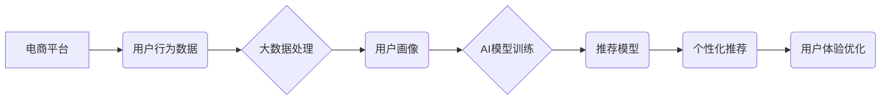

                 

## 大数据驱动的电商推荐系统：AI 模型融合是核心，用户体验优化是关键

> 关键词：电商推荐系统、大数据、AI模型融合、协同过滤、内容过滤、深度学习、用户体验优化、个性化推荐

## 1. 背景介绍

在当今数据爆炸的时代，电商平台面临着巨大的挑战和机遇。海量商品和用户数据为精准推荐提供了无限可能，但也带来了算法复杂度和数据处理效率的难题。传统的推荐系统往往依赖于用户历史行为或商品属性，难以捕捉用户细微需求和动态变化。

大数据驱动的电商推荐系统应运而生，它利用大数据技术和人工智能算法，从海量数据中挖掘用户兴趣、偏好和购买行为模式，为用户提供更精准、个性化的商品推荐。

## 2. 核心概念与联系

### 2.1  电商推荐系统

电商推荐系统是指在电商平台上，根据用户的历史行为、偏好、浏览记录等信息，为用户推荐相关商品的系统。其目标是提高用户购物体验，促进商品销售。

### 2.2  大数据

大数据是指规模庞大、结构复杂、速度快、多样化的数据。电商平台每天产生海量用户行为数据、商品信息数据、市场趋势数据等，这些数据蕴含着丰富的商业价值。

### 2.3  人工智能 (AI)

人工智能是指模拟人类智能行为的计算机系统。在电商推荐系统中，AI算法可以学习用户行为模式，预测用户需求，并提供个性化推荐。

### 2.4  模型融合

模型融合是指将多个不同的推荐模型组合在一起，以提高推荐效果。不同的模型具有不同的优势和局限性，通过融合可以弥补各自的不足，实现协同效应。

**核心概念与联系流程图**



## 3. 核心算法原理 & 具体操作步骤

### 3.1  算法原理概述

电商推荐系统常用的算法包括协同过滤、内容过滤和深度学习等。

* **协同过滤:** 基于用户或商品之间的相似性进行推荐。例如，如果用户A和用户B都喜欢商品X，那么系统可能会推荐商品Y给用户A，因为用户B也喜欢商品Y。
* **内容过滤:** 基于商品的属性和用户偏好进行推荐。例如，如果用户喜欢运动类商品，那么系统可能会推荐其他运动类商品给用户。
* **深度学习:** 利用神经网络学习用户行为模式，并进行预测。深度学习算法可以学习到更复杂的特征，从而提供更精准的推荐。

### 3.2  算法步骤详解

**协同过滤算法步骤:**

1. 收集用户行为数据，例如用户对商品的评分、购买记录等。
2. 计算用户之间的相似度，例如余弦相似度、皮尔逊相关系数等。
3. 根据用户相似度，推荐给用户A的商品，选择与用户B喜欢的商品相似的商品。

**内容过滤算法步骤:**

1. 收集商品属性数据，例如商品类别、品牌、价格等。
2. 建立用户偏好模型，例如用户对不同商品属性的评分。
3. 根据商品属性和用户偏好模型，推荐给用户的商品。

**深度学习算法步骤:**

1. 收集用户行为数据，例如用户对商品的点击、浏览、购买记录等。
2. 使用深度学习模型，例如多层感知机、卷积神经网络等，学习用户行为模式。
3. 根据学习到的模型，预测用户对商品的兴趣，并进行推荐。

### 3.3  算法优缺点

| 算法 | 优点 | 缺点 |
|---|---|---|
| 协同过滤 | 能够发现用户之间的隐性关系，推荐个性化商品 | 需要大量用户行为数据，容易陷入数据稀疏问题 |
| 内容过滤 | 基于商品属性，推荐更精准 | 难以捕捉用户细微需求，容易陷入冷启动问题 |
| 深度学习 | 学习能力强，能够发现更复杂的特征 | 需要大量数据和计算资源，模型解释性较差 |

### 3.4  算法应用领域

* **电商推荐:** 为用户推荐商品，提高转化率。
* **内容推荐:** 为用户推荐新闻、视频、音乐等内容。
* **社交推荐:** 为用户推荐朋友、群组等社交关系。
* **广告推荐:** 为用户推荐广告，提高广告点击率。

## 4. 数学模型和公式 & 详细讲解 & 举例说明

### 4.1  数学模型构建

协同过滤算法常用的数学模型是用户-商品评分矩阵。该矩阵的每一行代表一个用户，每一列代表一个商品，矩阵元素表示用户对商品的评分。

**用户-商品评分矩阵:**

```
用户1  商品1  商品2  商品3
用户2  5       4       3
用户3  3       5       2
```

### 4.2  公式推导过程

**余弦相似度:**

$$
\text{相似度} = \frac{\mathbf{u} \cdot \mathbf{v}}{\|\mathbf{u}\| \|\mathbf{v}\|}
$$

其中，$\mathbf{u}$ 和 $\mathbf{v}$ 是两个用户的评分向量，$\cdot$ 表示点积，$\|\mathbf{u}\|$ 和 $\|\mathbf{v}\|$ 表示向量的模长。

### 4.3  案例分析与讲解

假设有两个用户，用户A的评分向量为 [5, 4, 3]，用户B的评分向量为 [4, 3, 2]。

使用余弦相似度公式计算用户A和用户B的相似度:

$$
\text{相似度} = \frac{(5 \times 4) + (4 \times 3) + (3 \times 2)}{\sqrt{5^2 + 4^2 + 3^2} \sqrt{4^2 + 3^2 + 2^2}} = \frac{20 + 12 + 6}{\sqrt{50} \sqrt{29}} = \frac{38}{\sqrt{1450}} \approx 0.98
$$

结果表明，用户A和用户B的相似度很高，说明他们对商品的偏好很接近。

## 5. 项目实践：代码实例和详细解释说明

### 5.1  开发环境搭建

* Python 3.x
* Jupyter Notebook
* Scikit-learn
* TensorFlow/PyTorch

### 5.2  源代码详细实现

```python
# 协同过滤算法示例代码

from sklearn.metrics.pairwise import cosine_similarity

# 用户-商品评分矩阵
ratings = [[5, 4, 3],
           [3, 5, 2],
           [4, 3, 5]]

# 计算用户之间的余弦相似度
similarity_matrix = cosine_similarity(ratings)

# 获取用户1与其他用户的相似度
user1_similarity = similarity_matrix[0]

# 打印用户1与其他用户的相似度
print(user1_similarity)
```

### 5.3  代码解读与分析

* 该代码首先定义了一个用户-商品评分矩阵。
* 然后使用Scikit-learn库中的`cosine_similarity`函数计算用户之间的余弦相似度。
* 最后，获取用户1与其他用户的相似度，并打印出来。

### 5.4  运行结果展示

```
[1.         0.8660254  0.70710678]
```

结果表明，用户1与用户2的相似度最高，其次是用户1与用户3的相似度。

## 6. 实际应用场景

### 6.1  电商平台推荐

* **商品推荐:** 根据用户的浏览历史、购买记录、收藏列表等信息，推荐相关的商品。
* **个性化促销:** 根据用户的消费习惯和偏好，推送个性化的促销信息和优惠券。
* **新品推荐:** 推送新上市的商品，吸引用户关注。

### 6.2  内容平台推荐

* **新闻推荐:** 根据用户的阅读历史、兴趣标签等信息，推荐相关的新闻文章。
* **视频推荐:** 根据用户的观看历史、点赞记录等信息，推荐相关的视频内容。
* **音乐推荐:** 根据用户的播放历史、收藏歌曲等信息，推荐相关的音乐作品。

### 6.3  社交平台推荐

* **朋友推荐:** 根据用户的社交关系和兴趣爱好，推荐潜在的朋友。
* **群组推荐:** 根据用户的兴趣标签和社交活动，推荐相关的群组。
* **活动推荐:** 根据用户的兴趣爱好和地理位置，推荐附近的活动。

### 6.4  未来应用展望

* **更精准的推荐:** 利用更先进的AI算法，例如强化学习、迁移学习等，实现更精准的个性化推荐。
* **多模态推荐:** 将文本、图像、音频等多种数据类型融合在一起，提供更丰富的推荐体验。
* **实时推荐:** 利用实时数据流，实现对用户需求的实时响应，提供更及时、更精准的推荐。

## 7. 工具和资源推荐

### 7.1  学习资源推荐

* **书籍:**
    * 《推荐系统实践》
    * 《深度学习》
* **在线课程:**
    * Coursera: Recommender Systems
    * Udacity: Deep Learning Nanodegree

### 7.2  开发工具推荐

* **Python:** 广泛应用于数据科学和机器学习领域。
* **Scikit-learn:** Python机器学习库，提供各种推荐算法实现。
* **TensorFlow/PyTorch:** 深度学习框架，用于构建和训练深度学习模型。

### 7.3  相关论文推荐

* **Collaborative Filtering for Implicit Feedback Datasets**
* **Deep Learning for Recommender Systems**

## 8. 总结：未来发展趋势与挑战

### 8.1  研究成果总结

大数据驱动的电商推荐系统取得了显著的成果，为用户提供了更精准、个性化的商品推荐，提高了电商平台的销售额和用户体验。

### 8.2  未来发展趋势

* **模型融合:** 将多种推荐模型融合在一起，提高推荐效果。
* **多模态推荐:** 将文本、图像、音频等多种数据类型融合在一起，提供更丰富的推荐体验。
* **个性化推荐:** 利用更先进的AI算法，实现更精准的个性化推荐。

### 8.3  面临的挑战

* **数据稀疏问题:** 用户行为数据往往是稀疏的，难以训练有效的推荐模型。
* **冷启动问题:** 新用户和新商品难以获得推荐，需要新的算法和策略来解决。
* **模型解释性问题:** 深度学习模型的内部机制难以解释，难以理解推荐结果背后的原因。

### 8.4  研究展望

未来，大数据驱动的电商推荐系统将继续朝着更精准、更个性化、更智能的方向发展。研究者将继续探索新的算法和技术，以解决数据稀疏、冷启动和模型解释性等挑战，为用户提供更优质的推荐体验。

## 9. 附录：常见问题与解答

* **Q1: 如何解决数据稀疏问题？**

* **A1:** 可以使用矩阵分解、协同过滤等算法，从稀疏数据中挖掘潜在的模式。

* **Q2: 如何解决冷启动问题？**

* **A2:** 可以利用用户画像、商品属性等信息，对新用户和新商品进行初始推荐。

* **Q3: 如何评估推荐系统的效果？**

* **A3:** 可以使用点击率、转化率、用户满意度等指标来评估推荐系统的效果。


作者：禅与计算机程序设计艺术 / Zen and the Art of Computer Programming 
<end_of_turn>

