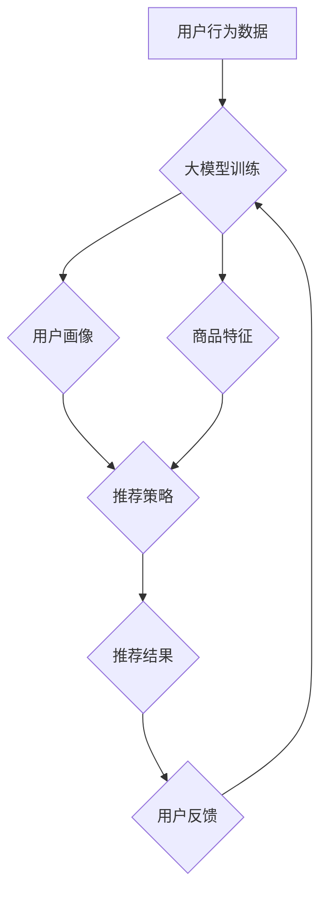

                 

## 大模型在商品推荐多样性优化中的多智能体协作学习

> 关键词：大模型、多智能体协作学习、商品推荐、多样性优化、协同过滤、强化学习

## 1. 背景介绍

在当今数据爆炸的时代，商品推荐系统已成为电商平台的核心竞争力之一。传统的协同过滤算法虽然在推荐精度方面取得了不错的成绩，但往往存在推荐结果单一、缺乏多样性的问题。这不仅会影响用户体验，还会导致用户疲劳和流失。

大模型的出现为商品推荐多样性优化带来了新的机遇。大模型具备强大的学习能力和泛化能力，能够从海量数据中学习到更丰富的用户偏好和商品特征，从而生成更精准、更具多样性的推荐结果。

多智能体协作学习则为大模型的应用提供了新的思路。通过将多个智能体协同学习，可以打破单一模型的局限性，实现更有效的推荐多样性优化。

## 2. 核心概念与联系

### 2.1  大模型

大模型是指参数规模庞大、训练数据海量的人工智能模型。近年来，随着深度学习技术的不断发展，大模型在自然语言处理、计算机视觉等领域取得了突破性进展。

大模型在商品推荐领域可以应用于以下方面：

* **用户画像构建:** 大模型可以从用户的历史行为、浏览记录、评论等数据中学习到用户的兴趣偏好、消费习惯等信息，构建更加精准的用户画像。
* **商品特征提取:** 大模型可以从商品的标题、描述、图片等多模态数据中提取商品的特征，例如商品类别、品牌、价格、属性等。
* **推荐模型训练:** 大模型可以作为推荐模型的核心组件，学习用户-商品交互关系，生成个性化推荐结果。

### 2.2  多智能体协作学习

多智能体协作学习是指多个智能体在相互交互和协作的基础上，共同学习和解决问题。

在商品推荐领域，多智能体协作学习可以采用以下几种方式：

* **联邦学习:** 将多个独立的推荐模型训练在各自的数据集上，然后将模型参数进行聚合，形成一个全局模型。
* **群体智能:** 采用模拟生物群体行为的算法，例如蚁群算法、粒子群算法等，让多个智能体协同搜索最优的推荐策略。
* **强化学习:** 将多个智能体作为代理，在推荐环境中进行交互，通过奖励机制学习最优的推荐策略。

### 2.3  商品推荐多样性优化

商品推荐多样性是指推荐结果中包含不同类型的商品，避免推荐结果过于单一。

多样性优化可以从以下几个方面进行：

* **推荐算法层面:** 采用多样性约束的推荐算法，例如基于多样性的协同过滤算法、基于聚类的推荐算法等。
* **数据层面:** 挖掘用户偏好中的多样性需求，例如用户对不同类型的商品的兴趣程度、用户对新商品的探索意愿等。
* **展示层面:** 在推荐结果展示时，采用多种展示方式，例如列表展示、卡片展示、瀑布流展示等，增强用户体验。

**Mermaid 流程图**



## 3. 核心算法原理 & 具体操作步骤

### 3.1  算法原理概述

本文将介绍一种基于多智能体协作学习的大模型商品推荐多样性优化算法。该算法将多个智能体作为推荐代理，每个智能体负责推荐特定类型的商品，通过强化学习机制，让智能体协同学习最优的推荐策略，从而实现推荐结果的多样性优化。

### 3.2  算法步骤详解

1. **智能体初始化:** 将多个智能体初始化，每个智能体负责推荐特定类型的商品，例如服装、电子产品、书籍等。
2. **环境建模:** 建立一个商品推荐环境，该环境包含用户、商品、推荐策略等要素。
3. **强化学习训练:** 每个智能体在推荐环境中进行交互，通过强化学习算法学习最优的推荐策略。
4. **策略更新:** 根据强化学习的奖励机制，更新每个智能体的推荐策略。
5. **推荐结果生成:** 根据更新后的推荐策略，每个智能体生成推荐结果。
6. **多样性评估:** 对推荐结果进行多样性评估，例如使用多样性指标计算推荐结果的覆盖率、均匀度等。
7. **反馈机制:** 将用户反馈信息反馈到环境中，用于更新智能体的推荐策略。

### 3.3  算法优缺点

**优点:**

* **多样性优化:** 通过多智能体协作学习，可以有效地提升推荐结果的多样性。
* **鲁棒性强:** 多个智能体协同学习，可以降低单个模型的风险，提高系统的鲁棒性。
* **可扩展性强:** 可以根据需要增加或减少智能体数量，方便系统扩展。

**缺点:**

* **训练复杂度高:** 多智能体协作学习的训练过程比较复杂，需要大量的计算资源和时间。
* **算法设计难度大:** 需要设计合理的智能体交互机制和奖励机制，才能保证算法的有效性。

### 3.4  算法应用领域

该算法可以应用于以下领域：

* **电商平台:** 优化商品推荐结果的多样性，提升用户体验和转化率。
* **内容推荐:** 推荐不同类型的新闻、视频、音乐等内容，满足用户多样化的需求。
* **个性化教育:** 根据学生的学习情况和兴趣，推荐个性化的学习资源。

## 4. 数学模型和公式 & 详细讲解 & 举例说明

### 4.1  数学模型构建

假设有N个用户，M个商品，K个智能体。每个智能体负责推荐特定类型的商品，例如智能体1负责推荐服装，智能体2负责推荐电子产品等。

* **用户状态:** $u_i$ 表示第i个用户的状态，例如用户的兴趣偏好、消费习惯等。
* **商品状态:** $p_j$ 表示第j个商品的状态，例如商品类别、品牌、价格等。
* **智能体策略:** $\pi_k$ 表示第k个智能体的推荐策略，例如推荐商品的概率分布。
* **奖励函数:** $R(u_i, p_j, \pi_k)$ 表示用户i对商品j的推荐结果的奖励，例如点击率、购买率等。

### 4.2  公式推导过程

强化学习的目标是最大化奖励的总和。可以使用Bellman方程来描述智能体的策略更新过程:

$$
\pi_k^{'}(p_j|u_i) = \arg \max_{\pi_k(p_j|u_i)} \sum_{u_i} \sum_{p_j} R(u_i, p_j, \pi_k) \cdot P(u_i, p_j)
$$

其中:

* $\pi_k^{'}(p_j|u_i)$ 是更新后的智能体k的推荐策略。
* $P(u_i, p_j)$ 是用户i点击商品j的概率。

### 4.3  案例分析与讲解

假设有一个电商平台，有三个智能体分别负责推荐服装、电子产品和书籍。每个智能体都使用强化学习算法学习最优的推荐策略。

在训练过程中，平台会收集用户点击和购买的反馈信息，并将其作为奖励信号反馈给智能体。通过不断的训练和更新，智能体可以学习到用户对不同类型商品的偏好，并生成更加多样化的推荐结果。

例如，如果一个用户经常购买服装和电子产品，智能体会根据用户的历史行为，推荐更多服装和电子产品类型的商品。同时，为了保证推荐结果的多样性，智能体也会推荐一些用户没有购买过的书籍类型的商品，以满足用户的探索需求。

## 5. 项目实践：代码实例和详细解释说明

### 5.1  开发环境搭建

* **操作系统:** Ubuntu 20.04
* **Python版本:** 3.8
* **深度学习框架:** TensorFlow 2.0
* **其他依赖库:** numpy, pandas, matplotlib等

### 5.2  源代码详细实现

```python
# 智能体类
class Agent:
    def __init__(self, env, action_space):
        self.env = env
        self.action_space = action_space
        self.policy = ... # 策略网络

    def act(self, state):
        action = self.policy(state)
        return action

# 环境类
class RecommenderEnv:
    def __init__(self, user_data, item_data):
        self.user_data = user_data
        self.item_data = item_data

    def reset(self):
        # 初始化环境状态
        pass

    def step(self, action):
        # 执行动作，获取奖励和下一个状态
        pass

# 主程序
if __name__ == "__main__":
    # 初始化环境和智能体
    env = RecommenderEnv(...)
    agents = [Agent(env, action_space) for _ in range(K)]

    # 训练智能体
    for episode in range(num_episodes):
        state = env.reset()
        done = False
        while not done:
            actions = [agent.act(state) for agent in agents]
            next_state, reward, done = env.step(actions)
            # 更新智能体策略
            for agent in agents:
                agent.update_policy(state, action, reward, next_state)
            state = next_state

```

### 5.3  代码解读与分析

* **智能体类:** 每个智能体都继承自Agent类，负责学习推荐策略。
* **环境类:** RecommenderEnv类模拟商品推荐环境，包含用户数据、商品数据等信息。
* **主程序:** 初始化环境和智能体，然后进行训练循环。在每个训练循环中，智能体根据当前状态选择动作，执行动作后获取奖励和下一个状态，并更新策略。

### 5.4  运行结果展示

训练完成后，可以评估智能体的推荐性能，例如使用多样性指标计算推荐结果的覆盖率、均匀度等。

## 6. 实际应用场景

### 6.1  电商平台

电商平台可以利用该算法优化商品推荐结果的多样性，例如推荐不同类型的商品、不同价位的商品、不同品牌的商品等，从而提升用户体验和转化率。

### 6.2  内容推荐

内容推荐平台可以利用该算法推荐不同类型的新闻、视频、音乐等内容，满足用户多样化的需求。例如，可以推荐用户感兴趣的新闻类型、不同风格的音乐、不同类型的视频等。

### 6.3  个性化教育

个性化教育平台可以利用该算法根据学生的学习情况和兴趣，推荐个性化的学习资源。例如，可以推荐学生感兴趣的学科、不同难度级别的学习材料、不同类型的学习活动等。

### 6.4  未来应用展望

随着大模型技术的不断发展，该算法在未来将有更广泛的应用场景。例如，可以应用于医疗诊断、金融投资、智能家居等领域。

## 7. 工具和资源推荐

### 7.1  学习资源推荐

* **书籍:**
    * 深度学习
    * 强化学习
    * 多智能体系统
* **在线课程:**
    * Coursera: 深度学习
    * Udacity: 强化学习
    * edX: 多智能体系统

### 7.2  开发工具推荐

* **深度学习框架:** TensorFlow, PyTorch
* **强化学习库:** OpenAI Gym, Stable Baselines3
* **数据处理库:** Pandas, NumPy

### 7.3  相关论文推荐

* **多智能体协作学习:**
    * Multi-Agent Reinforcement Learning: A Survey
    * Decentralized Multi-Agent Reinforcement Learning: A Survey
* **大模型在推荐系统中的应用:**
    * Transformer-based Recommendation Systems: A Survey
    * Large Language Models for Recommender Systems

## 8. 总结：未来发展趋势与挑战

### 8.1  研究成果总结

本文介绍了一种基于多智能体协作学习的大模型商品推荐多样性优化算法。该算法通过强化学习机制，让多个智能体协同学习最优的推荐策略，从而有效地提升推荐结果的多样性。

### 8.2  未来发展趋势

* **模型架构创新:** 探索更有效的智能体架构和交互机制，例如基于图神经网络的智能体、基于联邦学习的智能体等。
* **数据增强:** 开发新的数据增强技术，例如合成数据、迁移学习等，提高训练数据的质量和多样性。
* **个性化推荐:** 将用户个性化特征融入到智能体学习过程中，实现更精准的个性化推荐。

### 8.3  面临的挑战

* **训练复杂度:** 多智能体协作学习的训练过程比较复杂，需要大量的计算资源和时间。
* **算法设计难度:** 需要设计合理的智能体交互机制和奖励机制，才能保证算法的有效性。
* **数据隐私:** 在多智能体协作学习中，需要解决数据隐私问题，确保用户数据的安全和隐私。

### 8.4  研究展望

未来，我们将继续研究多智能体协作学习在大模型商品推荐中的应用，探索更有效的算法和技术，为用户提供更精准、更个性化的商品推荐服务。

## 9. 附录：常见问题与解答

### 9.1  Q1: 多智能体协作学习与传统的推荐算法相比有什么优势？

**A1:** 多智能体协作学习可以有效地提升推荐结果的多样性，并具有更强的鲁棒性和可扩展性。

### 9.2  Q2: 如何评估多智能体协作学习算法的性能？

**A2:** 可以使用多样性指标、准确率、召回率等指标来评估算法的性能。

### 9.3  Q3: 多智能体协作学习算法有哪些应用场景？

**A3:** 多智能体协作学习算法可以应用于电商平台、内容推荐平台、个性化教育平台等领域。


作者：禅与计算机程序设计艺术 / Zen and the Art of Computer Programming<end_of_turn>

