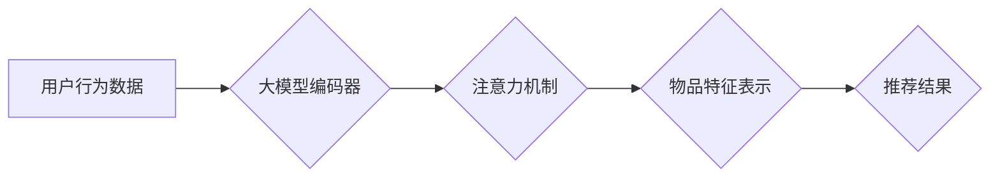

                 

## 大模型在推荐系统中的注意力机制优化

> 关键词：大模型、推荐系统、注意力机制、Transformer、BERT、Fine-tuning、个性化推荐

## 1. 背景介绍

推荐系统作为互联网时代的重要组成部分，旨在根据用户的历史行为、偏好和上下文信息，精准推荐用户感兴趣的内容。随着大数据时代的到来，推荐系统面临着海量数据处理和个性化推荐的挑战。传统基于协同过滤和内容过滤的推荐算法在处理高维稀疏数据和捕捉用户细微偏好的方面存在局限性。

近年来，深度学习技术的兴起为推荐系统带来了新的机遇。大模型，特别是基于Transformer架构的大模型，凭借其强大的语义理解和序列建模能力，在推荐系统领域展现出巨大的潜力。注意力机制作为Transformer的核心组件，能够有效地学习用户和物品之间的关系，提升推荐系统的准确性和个性化程度。

## 2. 核心概念与联系

### 2.1  推荐系统概述

推荐系统旨在预测用户对某项物品的兴趣或偏好，并根据预测结果推荐相关物品。推荐系统可以分为以下几类：

* **基于内容的推荐系统:** 根据物品的特征和用户历史行为，推荐与用户兴趣相似的物品。
* **基于协同过滤的推荐系统:** 根据用户的相似度和物品的相似度，推荐用户可能感兴趣的物品。
* **混合推荐系统:** 结合基于内容和基于协同过滤的算法，提高推荐效果。

### 2.2  大模型概述

大模型是指参数规模庞大、训练数据海量的人工智能模型。大模型通常具有以下特点：

* **参数规模巨大:** 大模型拥有数亿甚至数十亿个参数，能够学习更复杂的特征和关系。
* **训练数据丰富:** 大模型需要大量的训练数据才能有效学习，通常包含海量文本、图像、音频等数据。
* **泛化能力强:** 大模型能够在不同任务和领域中表现出色，具有较强的泛化能力。

### 2.3  注意力机制概述

注意力机制是一种模仿人类注意力机制的机器学习技术，能够帮助模型关注输入序列中最重要的部分。注意力机制通过计算每个元素的权重，将输入序列中的重要信息加权叠加，从而生成更具针对性的输出。

### 2.4  Transformer架构

Transformer是一种基于注意力机制的深度学习架构，能够有效地处理序列数据。Transformer由编码器和解码器组成，编码器用于学习输入序列的表示，解码器用于生成输出序列。Transformer的注意力机制能够捕捉序列中不同元素之间的长距离依赖关系，提升模型的性能。

**Mermaid 流程图**



## 3. 核心算法原理 & 具体操作步骤

### 3.1  算法原理概述

大模型在推荐系统中的注意力机制优化主要基于以下原理：

* **用户行为建模:** 利用大模型学习用户历史行为数据，构建用户兴趣和偏好的表示。
* **物品特征融合:** 将物品的各种特征信息融合到一起，构建物品的综合表示。
* **注意力机制学习:** 通过注意力机制学习用户和物品之间的关系，确定推荐的重点。
* **个性化推荐:** 根据用户兴趣和物品特征，生成个性化的推荐结果。

### 3.2  算法步骤详解

1. **数据预处理:** 收集用户行为数据、物品特征数据，并进行清洗、转换和编码。
2. **大模型预训练:** 利用大模型预训练模型，例如BERT，在海量文本数据上进行预训练，学习语言表示和语义理解能力。
3. **模型微调:** 将预训练模型进行微调，针对推荐任务进行训练，学习用户和物品之间的关系。
4. **注意力机制应用:** 在模型中应用注意力机制，学习用户和物品之间的重要关系，提高推荐的准确性和个性化程度。
5. **推荐结果生成:** 根据模型的输出结果，生成个性化的推荐列表。

### 3.3  算法优缺点

**优点:**

* **强大的语义理解能力:** 大模型能够学习复杂的语义关系，提升推荐的精准度。
* **个性化推荐:** 注意力机制能够学习用户和物品之间的个性化关系，生成更符合用户需求的推荐结果。
* **泛化能力强:** 预训练模型能够在不同任务和领域中表现出色，具有较强的泛化能力。

**缺点:**

* **计算资源需求高:** 大模型训练和推理需要大量的计算资源。
* **数据依赖性强:** 大模型需要海量数据进行训练，否则性能会下降。
* **可解释性差:** 大模型的内部机制复杂，难以解释其推荐结果。

### 3.4  算法应用领域

大模型在推荐系统中的注意力机制优化技术广泛应用于以下领域：

* **电商推荐:** 推荐商品、优惠券、促销活动等。
* **内容推荐:** 推荐新闻、视频、文章、音乐等。
* **社交推荐:** 推荐好友、群组、话题等。
* **个性化教育:** 推荐学习资源、课程、辅导等。

## 4. 数学模型和公式 & 详细讲解 & 举例说明

### 4.1  数学模型构建

假设我们有一个用户-物品交互矩阵 $R \in \mathbb{R}^{m \times n}$，其中 $m$ 是用户数量， $n$ 是物品数量。每个元素 $R_{ui}$ 表示用户 $u$ 对物品 $i$ 的评分或交互行为。

大模型在推荐系统中的注意力机制优化可以构建如下数学模型：

* **用户嵌入:** 将用户 $u$ 映射到一个低维向量 $u_e \in \mathbb{R}^d$，其中 $d$ 是嵌入维度。
* **物品嵌入:** 将物品 $i$ 映射到一个低维向量 $v_e \in \mathbb{R}^d$。
* **注意力机制:** 计算用户 $u$ 和物品 $i$ 之间的注意力权重 $a_{ui}$，表示用户对物品 $i$ 的关注程度。
* **推荐评分:** 计算用户 $u$ 对物品 $i$ 的推荐评分 $\hat{R}_{ui}$，根据注意力权重和用户、物品嵌入进行加权求和。

### 4.2  公式推导过程

**注意力权重计算:**

$$a_{ui} = \frac{\exp(score(u_e, v_e))}{\sum_{j=1}^{n} \exp(score(u_e, v_j))}$$

其中， $score(u_e, v_e)$ 是用户 $u$ 和物品 $i$ 之间的相似度得分，可以使用点积、余弦相似度等方式计算。

**推荐评分计算:**

$$\hat{R}_{ui} = \sum_{i=1}^{n} a_{ui} \cdot v_e$$

### 4.3  案例分析与讲解

假设我们有一个电商推荐系统，需要推荐商品给用户。

* 用户嵌入：利用大模型学习用户历史购买记录、浏览记录等数据，构建用户嵌入向量。
* 物品嵌入：利用大模型学习商品的标题、描述、类别等特征数据，构建商品嵌入向量。
* 注意力机制：利用注意力机制学习用户和商品之间的关系，例如用户对商品标题的关注程度、商品类别对用户的吸引力等。
* 推荐评分：根据注意力权重和用户、商品嵌入，计算用户对每个商品的推荐评分，并生成推荐列表。

## 5. 项目实践：代码实例和详细解释说明

### 5.1  开发环境搭建

* Python 3.7+
* TensorFlow 2.x 或 PyTorch 1.x
* CUDA 和 cuDNN (可选，用于GPU加速)

### 5.2  源代码详细实现

```python
import tensorflow as tf

# 定义用户嵌入层
user_embedding = tf.keras.layers.Embedding(input_dim=num_users, output_dim=embedding_dim)

# 定义物品嵌入层
item_embedding = tf.keras.layers.Embedding(input_dim=num_items, output_dim=embedding_dim)

# 定义注意力机制层
class AttentionLayer(tf.keras.layers.Layer):
    def __init__(self, units):
        super(AttentionLayer, self).__init__()
        self.W = tf.keras.layers.Dense(units)
        self.V = tf.keras.layers.Dense(1)

    def call(self, inputs):
        user_embedding = inputs[0]
        item_embedding = inputs[1]
        scores = self.V(tf.nn.tanh(self.W(user_embedding) + self.W(item_embedding)))
        attention_weights = tf.nn.softmax(scores, axis=-1)
        context_vector = tf.matmul(attention_weights, item_embedding)
        return context_vector

# 定义推荐模型
class RecommenderModel(tf.keras.Model):
    def __init__(self, embedding_dim, units):
        super(RecommenderModel, self).__init__()
        self.user_embedding = user_embedding
        self.item_embedding = item_embedding
        self.attention_layer = AttentionLayer(units)

    def call(self, inputs):
        user_id, item_id = inputs
        user_embedding = self.user_embedding(user_id)
        item_embedding = self.item_embedding(item_id)
        context_vector = self.attention_layer([user_embedding, item_embedding])
        return context_vector

# 训练模型
model = RecommenderModel(embedding_dim=64, units=128)
model.compile(optimizer='adam', loss='mse')
model.fit(train_data, train_labels, epochs=10)

# 生成推荐结果
user_id = 123
item_ids = tf.constant([1, 2, 3, 4, 5])
context_vector = model([user_id, item_ids])
```

### 5.3  代码解读与分析

* **用户嵌入和物品嵌入:** 使用Embedding层将用户ID和物品ID映射到低维向量，表示用户的特征和物品的特征。
* **注意力机制层:** 定义一个AttentionLayer类，实现注意力机制的计算。
* **推荐模型:** 定义一个RecommenderModel类，将用户嵌入、物品嵌入和注意力机制层组合起来，构建推荐模型。
* **模型训练:** 使用Adam优化器和均方误差损失函数训练模型。
* **推荐结果生成:** 使用训练好的模型，将用户的ID和所有物品的ID输入模型，得到每个物品的上下文向量，并根据上下文向量排序，生成推荐列表。

### 5.4  运行结果展示

运行代码后，可以得到用户对每个物品的推荐评分，并根据评分排序生成推荐列表。

## 6. 实际应用场景

### 6.1  电商推荐

大模型在电商推荐系统中可以有效地学习用户兴趣和商品特征，推荐个性化的商品。例如，淘宝、京东等电商平台都利用大模型进行商品推荐。

### 6.2  内容推荐

大模型可以学习用户阅读、观看、听取的偏好，推荐个性化的新闻、视频、文章等内容。例如，抖音、知乎等平台都利用大模型进行内容推荐。

### 6.3  社交推荐

大模型可以学习用户社交行为，推荐潜在的朋友、群组、话题等。例如，微信、QQ等社交平台都利用大模型进行社交推荐。

### 6.4  未来应用展望

大模型在推荐系统中的应用前景广阔，未来可能在以下方面得到进一步发展：

* **更精准的推荐:** 利用更强大的大模型和更复杂的注意力机制，提升推荐的精准度和个性化程度。
* **多模态推荐:** 将文本、图像、音频等多模态数据融合到推荐系统中，提供更丰富的推荐体验。
* **实时推荐:** 利用大模型的实时推理能力，实现实时个性化推荐。
* **解释性推荐:** 研究更可解释的注意力机制，帮助用户理解推荐结果背后的原因。

## 7. 工具和资源推荐

### 7.1  学习资源推荐

* **书籍:**
    * 《深度学习》 - Ian Goodfellow, Yoshua Bengio, Aaron Courville
    * 《自然语言处理》 - Dan Jurafsky, James H. Martin
* **在线课程:**
    * Coursera: Deep Learning Specialization
    * Stanford CS224N: Natural Language Processing with Deep Learning

### 7.2  开发工具推荐

* **TensorFlow:** https://www.tensorflow.org/
* **PyTorch:** https://pytorch.org/
* **Hugging Face Transformers:** https://huggingface.co/transformers/

### 7.3  相关论文推荐

* **Attention Is All You Need:** https://arxiv.org/abs/1706.03762
* **BERT: Pre-training of Deep Bidirectional Transformers for Language Understanding:** https://arxiv.org/abs/1810.04805
* **Deep Learning for Recommender Systems:** https://arxiv.org/abs/1901.06317

## 8. 总结：未来发展趋势与挑战

### 8.1  研究成果总结

大模型在推荐系统中的注意力机制优化技术取得了显著的成果，提升了推荐系统的准确性和个性化程度。

### 8.2  未来发展趋势

未来，大模型在推荐系统中的应用将朝着以下方向发展：

* **模型规模更大:** 训练更大型的模型，学习更复杂的特征和关系。
* **多模态融合:** 将文本、图像、音频等多模态数据融合到推荐系统中，提供更丰富的推荐体验。
* **个性化定制:** 更深入地学习用户的个性化偏好，提供更精准的定制化推荐。
* **可解释性增强:** 研究更可解释的注意力机制，帮助用户理解推荐结果背后的原因。

### 8.3  面临的挑战

大模型在推荐系统中的应用也面临着一些挑战：

* **计算资源需求高:** 训练和推理大型模型需要大量的计算资源。
* **数据依赖性强:** 大模型需要海量数据进行训练，否则性能会下降。
* **可解释性差:** 大模型的内部机制复杂，难以解释其推荐结果。
* **公平性与偏见:** 大模型可能学习到数据中的偏见，导致推荐结果不公平。

### 8.4  研究展望

未来，需要进一步研究大模型在推荐系统中的应用，解决上述挑战，并探索更先进的模型架构和算法，以实现更精准、个性化、可解释的推荐体验。

## 9. 附录：常见问题与解答

**Q1: 大模型的训练需要多少数据？**

A1: 大模型的训练需要海量数据，通常需要数十亿甚至数百亿个数据点。

**Q2: 如何评估大模型在推荐系统中的性能？**

A2: 可以使用各种指标来评估大模型在推荐系统中的性能，例如准确率、召回率、NDCG等。

**Q3: 如何解决大模型的可解释性问题？**

A3: 可以使用可解释性分析方法，例如注意力机制可视化、特征重要性分析等，来解释大模型的推荐结果。


作者：禅与计算机程序设计艺术 / Zen and the Art of Computer Programming<end_of_turn>

