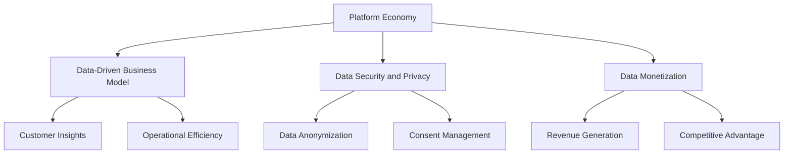
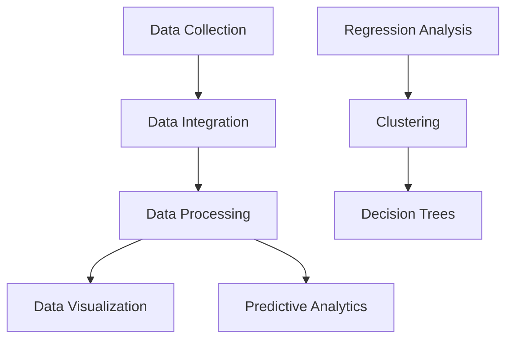

                 

### 文章标题

**数据赋能平台经济：如何实现可持续发展？**

关键词：数据赋能、平台经济、可持续发展、商业模式、数据分析、技术创新

摘要：本文探讨了数据赋能平台经济的重要性以及实现可持续发展的关键路径。通过分析数据在平台经济中的作用，探讨了数据驱动的商业模式创新、数据安全与隐私保护、以及技术创新等关键领域，提出了实现平台经济可持续发展的策略和框架。

### Background Introduction

Platform economy, as a modern business model, has been revolutionizing various industries by creating new opportunities for collaboration, efficiency, and growth. At its core, platform economy leverages digital technologies to facilitate transactions and interactions between multiple participants, such as consumers, businesses, and service providers. This ecosystem relies heavily on data as a critical asset for value creation and optimization.

The importance of data in platform economy cannot be overstated. Data serves as a foundation for understanding customer behavior, optimizing supply chains, personalizing user experiences, and driving innovation. With the advent of big data and advanced analytics, platforms can analyze massive amounts of data to gain actionable insights and make data-driven decisions. This has led to the emergence of data-driven business models that are more agile, responsive, and scalable than traditional models.

However, while data holds immense potential, it also poses significant challenges. The sustainability of platform economy hinges on the ability to harness data effectively while ensuring data security and privacy. In this article, we will explore the role of data in platform economy, examine the core concepts and connections, and discuss strategies for achieving sustainable development.

### Core Concepts and Connections

To understand the role of data in platform economy, we need to first define some key concepts and their relationships.

#### Platform Economy

A platform economy is a business model that leverages digital platforms to connect multiple participants, facilitating transactions and value creation. Platforms can be categorized into various types, such as marketplace platforms (e.g., eBay, Etsy), social media platforms (e.g., Facebook, Instagram), and sharing economy platforms (e.g., Uber, Airbnb). These platforms enable participants to access goods and services more efficiently and at a lower cost, creating new business opportunities and driving economic growth.

#### Data-Driven Business Model

A data-driven business model is one that uses data and analytics to guide decision-making and optimize operations. This model relies on the collection, analysis, and utilization of data to gain insights into customer needs, market trends, and operational efficiency. By leveraging data, businesses can personalize user experiences, improve decision-making, and create new revenue streams.

#### Data Security and Privacy

Data security and privacy are critical considerations in platform economy. As platforms collect and process large amounts of sensitive data, they must ensure that this data is protected from unauthorized access, breaches, and misuse. Data privacy regulations, such as the General Data Protection Regulation (GDPR) in the European Union, impose strict requirements on the handling of personal data, including data anonymization, consent management, and data subject access rights.

#### Data Monetization

Data monetization is the process of converting data into revenue. Platforms can monetize data by selling access to anonymized or aggregated data to third parties, offering data analytics services, or creating personalized marketing campaigns. This can help platforms generate additional revenue streams and enhance their competitive advantage.

#### Mermaid Flowchart

To illustrate the relationships between these concepts, we can use a Mermaid flowchart. Here is an example:



This flowchart shows how platform economy relies on data-driven business models, which in turn depend on data security and privacy measures, and how data monetization can generate revenue and enhance competitiveness.

### Core Algorithm Principles and Specific Operational Steps

To harness the power of data in platform economy, platforms need to implement a robust data analytics framework. Here, we will discuss the core algorithm principles and specific operational steps involved in this process.

#### Data Collection

The first step in data analytics is data collection. Platforms collect data from various sources, including user interactions, transactions, social media, and third-party data providers. This data is typically stored in data lakes or data warehouses, where it can be accessed and processed.

#### Data Integration

Once collected, the next step is to integrate the data from different sources. This involves data cleansing, data transformation, and data normalization to ensure consistency and quality. Data integration can be a complex task, especially when dealing with large and diverse datasets.

#### Data Processing

After integration, the data needs to be processed to extract valuable insights. This typically involves data filtering, aggregation, and analysis using various algorithms and techniques, such as machine learning, natural language processing, and statistical analysis.

#### Data Visualization

To make the insights from data processing accessible and actionable, data visualization techniques are used. Data visualization tools and dashboards enable stakeholders to explore the data, identify patterns, and make informed decisions.

#### Predictive Analytics

Predictive analytics is an advanced form of data analytics that uses historical data to predict future trends and outcomes. This can be used to optimize operations, forecast demand, and personalize user experiences.

### Mathematical Models and Formulas

To further understand the core algorithm principles, we can explore some mathematical models and formulas commonly used in data analytics.

#### Regression Analysis

Regression analysis is a statistical technique used to analyze the relationship between a dependent variable and one or more independent variables. It can be used to predict the value of the dependent variable based on the values of the independent variables. The formula for linear regression, a common type of regression analysis, is:

$$
y = ax + b
$$

where:

- $y$ is the dependent variable
- $x$ is the independent variable
- $a$ is the slope of the line
- $b$ is the y-intercept

#### Clustering

Clustering is a technique used to group data points with similar characteristics. One popular clustering algorithm is K-means clustering, which partitions the data into K clusters based on the minimization of the sum of squared distances between data points and their corresponding cluster centers. The formula for updating the cluster centers is:

$$
\mu_k = \frac{1}{N_k} \sum_{i=1}^{N} x_i
$$

where:

- $\mu_k$ is the cluster center for cluster k
- $N_k$ is the number of data points in cluster k
- $x_i$ is the ith data point

#### Decision Trees

Decision trees are a popular machine learning algorithm used for classification and regression tasks. They work by splitting the data into subsets based on the values of one or more features. The formula for calculating the split point is:

$$
g(x) = \arg\min_{x} \sum_{i=1}^{N} L(y_i, f(x_i))
$$

where:

- $g(x)$ is the split point
- $N$ is the number of data points
- $y_i$ is the target variable for the ith data point
- $f(x_i)$ is the predicted value based on the split point $x$

#### Mermaid Flowchart

Here is a Mermaid flowchart illustrating the data analytics process:



### Project Practice: Code Examples and Detailed Explanations

To demonstrate the practical implementation of data analytics in platform economy, we will provide a simple example using Python and a popular data visualization library, Matplotlib.

#### 1. 开发环境搭建（Setting Up Development Environment）

First, you need to install Python and Matplotlib. You can install Python from the official website (<https://www.python.org/downloads/>) and Matplotlib using pip:

```shell
pip install matplotlib
```

#### 2. 源代码详细实现（Detailed Implementation of Source Code）

Here is a sample Python code that reads a CSV file containing sales data, performs regression analysis, and visualizes the results:

```python
import pandas as pd
import numpy as np
from sklearn.linear_model import LinearRegression
import matplotlib.pyplot as plt

# 2.1 Load the dataset
data = pd.read_csv('sales_data.csv')

# 2.2 Prepare the data
X = data[['days_since_last_purchase']]
y = data['sales']

# 2.3 Fit the linear regression model
model = LinearRegression()
model.fit(X, y)

# 2.4 Make predictions
predictions = model.predict(X)

# 2.5 Visualize the results
plt.scatter(X, y, color='red', label='Actual Sales')
plt.plot(X, predictions, color='blue', label='Predicted Sales')
plt.xlabel('Days Since Last Purchase')
plt.ylabel('Sales')
plt.title('Sales Prediction')
plt.legend()
plt.show()
```

#### 3. 代码解读与分析（Code Explanation and Analysis）

In this example, we load a CSV file containing sales data, prepare the data by separating the input features and the target variable, fit a linear regression model to the data, make predictions, and visualize the results using Matplotlib.

The key steps in the code are:

- **2.1 Load the dataset**: We use the pandas library to load the CSV file containing sales data.
- **2.2 Prepare the data**: We separate the input features (days_since_last_purchase) from the target variable (sales) and store them in separate dataframes.
- **2.3 Fit the linear regression model**: We create an instance of the LinearRegression class from the scikit-learn library and fit it to the data using the `fit()` method.
- **2.4 Make predictions**: We use the `predict()` method to make predictions on the input features.
- **2.5 Visualize the results**: We use Matplotlib to plot the actual sales data (in red) and the predicted sales data (in blue). This allows us to visually inspect the performance of the linear regression model.

### Practical Application Scenarios

Platform economy has a wide range of practical application scenarios, including:

1. **E-commerce Platforms**: E-commerce platforms can use data analytics to personalize user experiences, optimize pricing strategies, and predict demand for products. This can help reduce inventory costs and increase sales.
2. **Financial Services**: Financial services companies can use data analytics to assess credit risk, detect fraudulent transactions, and develop personalized financial products.
3. **Healthcare**: Healthcare providers can use data analytics to improve patient care, optimize resource allocation, and predict disease outbreaks.
4. **Transportation and Logistics**: Transportation and logistics companies can use data analytics to optimize routes, reduce fuel consumption, and improve delivery times.
5. **Energy and Utilities**: Energy and utility companies can use data analytics to optimize energy production and consumption, reduce costs, and improve customer satisfaction.

### Tools and Resources Recommendations

To effectively implement data analytics in platform economy, here are some tools and resources that can be helpful:

1. **Books**:
   - "Data Science from Scratch" by Joel Grus
   - "Python Data Science Handbook" by Jake VanderPlas
2. **Online Courses**:
   - "Data Science Specialization" by Johns Hopkins University on Coursera
   - "Machine Learning" by Andrew Ng on Coursera
3. **Libraries and Frameworks**:
   - Pandas: Data manipulation and analysis library
   - NumPy: Scientific computing library
   - Matplotlib: Data visualization library
   - Scikit-learn: Machine learning library
4. **Websites**:
   - Kaggle: Data science competitions and community
   - DataCamp: Data science learning platform

### Summary: Future Development Trends and Challenges

The future of platform economy will be shaped by several key trends and challenges.

#### Trends

1. **Artificial Intelligence and Machine Learning**: AI and ML technologies will continue to advance, enabling platforms to analyze larger and more complex datasets, automate decision-making, and improve personalization and recommendation systems.
2. **Data Privacy and Security**: As data privacy regulations become more stringent, platforms will need to invest in advanced data security and privacy measures to comply with regulations and build trust with users.
3. **Decentralized Platforms**: Decentralized platforms, powered by blockchain technology, will gain traction, offering increased transparency, security, and user control over data.
4. **Sustainability**: Platforms will increasingly focus on sustainability, using data analytics to optimize operations, reduce carbon emissions, and promote ethical business practices.

#### Challenges

1. **Data Quality and Accessibility**: Ensuring high-quality and accessible data will remain a challenge, especially in industries with limited data availability or data silos.
2. **Ethical Considerations**: As platforms increasingly rely on data analytics, ethical considerations, such as bias, discrimination, and fairness, will become more prominent.
3. **Regulatory Compliance**: Platforms will need to navigate complex regulatory environments, particularly in data privacy and security.
4. **Scalability**: Scaling data analytics solutions to handle increasing data volumes and complexity will be a significant challenge.

In conclusion, data plays a pivotal role in platform economy, driving innovation, efficiency, and growth. To achieve sustainable development, platforms must leverage data effectively while addressing data security, privacy, and ethical considerations. By staying informed about technological advancements and regulatory changes, platforms can navigate the challenges and capitalize on the opportunities presented by data.

### Frequently Asked Questions and Answers

**Q1. What is the difference between platform economy and traditional economy?**

Platform economy is a modern business model that leverages digital platforms to connect multiple participants, facilitating transactions and value creation. In contrast, traditional economy relies on more conventional methods, such as physical stores and direct sales, to conduct business.

**Q2. How can platforms ensure data security and privacy?**

Platforms can ensure data security and privacy by implementing advanced encryption techniques, access controls, and monitoring systems. They should also comply with data privacy regulations, such as GDPR, and adopt best practices for data handling and protection.

**Q3. What are the main challenges in implementing data-driven business models?**

The main challenges in implementing data-driven business models include ensuring data quality and accessibility, managing data privacy and security concerns, and navigating complex regulatory environments.

**Q4. How can platforms leverage AI and machine learning for improved decision-making?**

Platforms can leverage AI and machine learning by implementing predictive analytics, natural language processing, and recommendation systems. These technologies can help platforms analyze large datasets, identify patterns, and make data-driven decisions.

### Extended Reading & Reference Materials

1. **Books**:
   - "Platform Revolution" by Sangeet Paul Choudary
   - "Data Economics: The Third Digital Revolution" by Richard Heeks
2. **Research Papers**:
   - "Platform Economics: A Framework for Analysis and Policy Design" by the European Commission
   - "Data Monetization in Platform Ecosystems: A Framework and Practical Guide" by the World Economic Forum
3. **Websites**:
   - "Platform Economics Lab" by the MIT Initiative on the Digital Economy
   - "Platform Policy Portal" by the World Bank

### 作者署名

**作者：禅与计算机程序设计艺术 / Zen and the Art of Computer Programming**

