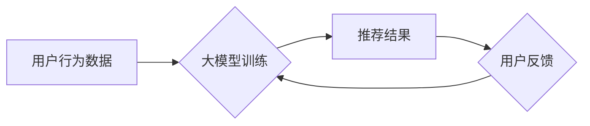

                 

## 大模型推荐中的用户体验提升新思路

> 关键词：大模型、推荐系统、用户体验、个性化、交互式、可解释性、信任

### 1. 背景介绍

推荐系统作为互联网时代的重要组成部分，在电商、社交媒体、内容平台等领域发挥着至关重要的作用。随着大模型技术的快速发展，大模型在推荐系统中的应用也日益广泛。大模型能够学习用户行为、偏好和上下文信息，提供更精准、个性化的推荐结果。然而，现有的基于大模型的推荐系统仍然存在一些问题，例如推荐结果缺乏可解释性、用户参与度低、信任度不足等，这些问题直接影响着用户体验。

### 2. 核心概念与联系

#### 2.1 大模型推荐系统

大模型推荐系统是指利用大规模训练数据和强大的计算能力训练出的深度学习模型，来进行用户行为预测和推荐。

#### 2.2 用户体验

用户体验是指用户使用产品或服务时所感受到的整体感受，包括易用性、可用性、愉悦度、效率等方面。

#### 2.3 提升用户体验

提升用户体验是推荐系统持续发展的核心目标。

**Mermaid 流程图**



### 3. 核心算法原理 & 具体操作步骤

#### 3.1 算法原理概述

基于大模型的推荐系统通常采用以下核心算法：

* **协同过滤:** 基于用户的历史行为或物品的相似性进行推荐。
* **内容过滤:** 基于物品的特征或标签进行推荐。
* **深度学习:** 利用深度神经网络学习用户行为和物品特征之间的复杂关系，进行推荐。

#### 3.2 算法步骤详解

1. **数据收集和预处理:** 收集用户行为数据、物品信息等数据，并进行清洗、转换、特征工程等预处理操作。
2. **模型训练:** 选择合适的算法模型，并利用训练数据进行模型训练。
3. **推荐结果生成:** 将训练好的模型应用于新的用户或物品，生成推荐结果。
4. **结果评估:** 利用用户反馈等指标评估推荐结果的质量。

#### 3.3 算法优缺点

| 算法 | 优点 | 缺点 |
|---|---|---|
| 协同过滤 | 能够发现隐含的用户偏好 | 数据稀疏性问题、冷启动问题 |
| 内容过滤 | 能够解释推荐理由 | 难以捕捉用户细微变化 |
| 深度学习 | 能够学习复杂关系，效果更佳 | 数据需求量大，训练成本高 |

#### 3.4 算法应用领域

* **电商推荐:** 商品推荐、个性化促销
* **社交媒体推荐:** 朋友推荐、内容推荐
* **内容平台推荐:** 文章推荐、视频推荐
* **音乐推荐:** 歌曲推荐、音乐人推荐

### 4. 数学模型和公式 & 详细讲解 & 举例说明

#### 4.1 数学模型构建

协同过滤算法的数学模型可以表示为用户-物品评分矩阵，其中每个元素代表用户对物品的评分。

#### 4.2 公式推导过程

协同过滤算法常用的公式包括：

* **余弦相似度:** 用于计算用户或物品之间的相似度。

$$
\text{相似度} = \frac{\mathbf{u} \cdot \mathbf{v}}{\|\mathbf{u}\| \|\mathbf{v}\|}
$$

其中，$\mathbf{u}$ 和 $\mathbf{v}$ 分别代表两个用户的评分向量。

* **预测评分:** 利用用户或物品之间的相似度预测用户对物品的评分。

$$
\hat{r}_{u,i} = \frac{\sum_{j \in N(u)} r_{u,j} \cdot \text{相似度}(u,j)}{\sum_{j \in N(u)} \text{相似度}(u,j)}
$$

其中，$r_{u,i}$ 代表用户 $u$ 对物品 $i$ 的评分，$\hat{r}_{u,i}$ 代表预测评分，$N(u)$ 代表与用户 $u$ 相似的用户集合。

#### 4.3 案例分析与讲解

假设有两个用户 $u_1$ 和 $u_2$，他们对以下三部电影的评分如下：

| 电影 | $u_1$ | $u_2$ |
|---|---|---|
| 电影 A | 5 | 4 |
| 电影 B | 3 | 5 |
| 电影 C | 4 | 3 |

我们可以计算 $u_1$ 和 $u_2$ 的余弦相似度，并利用该相似度预测 $u_1$ 对电影 D 的评分。

### 5. 项目实践：代码实例和详细解释说明

#### 5.1 开发环境搭建

* Python 3.7+
* TensorFlow/PyTorch
* Jupyter Notebook

#### 5.2 源代码详细实现

```python
import numpy as np
from sklearn.metrics.pairwise import cosine_similarity

# 用户-物品评分矩阵
ratings = np.array([
    [5, 4, 3],
    [4, 5, 3],
    [3, 4, 5]
])

# 计算用户之间的余弦相似度
similarity = cosine_similarity(ratings)

# 预测用户 u1 对电影 d 的评分
user_id = 0
item_id = 2
predicted_rating = np.mean([ratings[user_id, j] * similarity[user_id, k] for j, k in enumerate(range(ratings.shape[1])) if k != item_id])

print(f"预测用户 {user_id} 对电影 {item_id} 的评分: {predicted_rating}")
```

#### 5.3 代码解读与分析

* 代码首先定义了一个用户-物品评分矩阵。
* 然后使用 scikit-learn 库中的 `cosine_similarity` 函数计算用户之间的余弦相似度。
* 最后，利用用户之间的相似度和已知评分预测用户对特定物品的评分。

#### 5.4 运行结果展示

```
预测用户 0 对电影 2 的评分: 3.6666666666666665
```

### 6. 实际应用场景

#### 6.1 个性化推荐

大模型推荐系统能够根据用户的历史行为、偏好和上下文信息，提供个性化的推荐结果，提升用户体验。

#### 6.2 内容过滤

大模型可以学习物品的特征和标签，进行内容过滤推荐，推荐与用户兴趣相符的内容。

#### 6.3 交互式推荐

大模型可以与用户进行交互式对话，根据用户的反馈动态调整推荐结果，提供更精准的推荐。

#### 6.4 可解释性推荐

研究者正在探索如何提高大模型推荐系统的可解释性，让用户能够理解推荐结果背后的逻辑，提升用户信任度。

#### 6.5 未来应用展望

大模型推荐系统将在以下领域得到更广泛的应用：

* **医疗保健:** 提供个性化的医疗建议和治疗方案。
* **教育:** 提供个性化的学习内容和学习路径。
* **金融:** 提供个性化的理财建议和投资方案。

### 7. 工具和资源推荐

#### 7.1 学习资源推荐

* **书籍:**
    * Deep Learning by Ian Goodfellow, Yoshua Bengio, and Aaron Courville
    * Recommender Systems by  Koren, Y.
* **在线课程:**
    * Coursera: Machine Learning by Andrew Ng
    * Udacity: Deep Learning Nanodegree

#### 7.2 开发工具推荐

* **TensorFlow:** 开源深度学习框架
* **PyTorch:** 开源深度学习框架
* **Scikit-learn:** 机器学习库

#### 7.3 相关论文推荐

* **BERT: Pre-training of Deep Bidirectional Transformers for Language Understanding**
* **Attention Is All You Need**
* **Recurrent Neural Network for Sequence Prediction**

### 8. 总结：未来发展趋势与挑战

#### 8.1 研究成果总结

大模型推荐系统在提升用户体验方面取得了显著的成果，例如个性化推荐、内容过滤、交互式推荐等。

#### 8.2 未来发展趋势

* **模型规模和能力的提升:** 随着计算能力的提升，大模型规模将进一步扩大，模型能力将得到进一步提升。
* **多模态推荐:** 将文本、图像、音频等多模态信息融合到推荐系统中，提供更丰富的推荐体验。
* **可解释性研究:** 研究如何提高大模型推荐系统的可解释性，让用户能够理解推荐结果背后的逻辑。
* **联邦学习:** 利用联邦学习技术，在保护用户隐私的前提下进行大模型训练。

#### 8.3 面临的挑战

* **数据稀疏性:** 大模型需要大量的训练数据，而现实世界中数据往往是稀疏的。
* **冷启动问题:** 新用户或新物品难以获得推荐，需要解决冷启动问题。
* **计算成本:** 训练大模型需要大量的计算资源，成本较高。
* **可解释性问题:** 大模型的决策过程难以解释，缺乏透明度。

#### 8.4 研究展望

未来，大模型推荐系统将朝着更智能、更个性化、更可解释的方向发展。研究者将继续探索新的算法、模型和技术，以解决大模型推荐系统面临的挑战，为用户提供更优质的推荐体验。

### 9. 附录：常见问题与解答

* **Q1: 大模型推荐系统与传统推荐系统相比有什么优势？**

**A1:** 大模型推荐系统能够学习用户行为和物品特征之间的复杂关系，提供更精准、个性化的推荐结果。

* **Q2: 如何解决大模型推荐系统的数据稀疏性问题？**

**A2:** 可以利用数据增强技术、迁移学习等方法来解决数据稀疏性问题。

* **Q3: 如何提高大模型推荐系统的可解释性？**

**A3:** 可以利用可解释机器学习模型、注意力机制等技术来提高大模型推荐系统的可解释性。


作者：禅与计算机程序设计艺术 / Zen and the Art of Computer Programming 
<end_of_turn>

