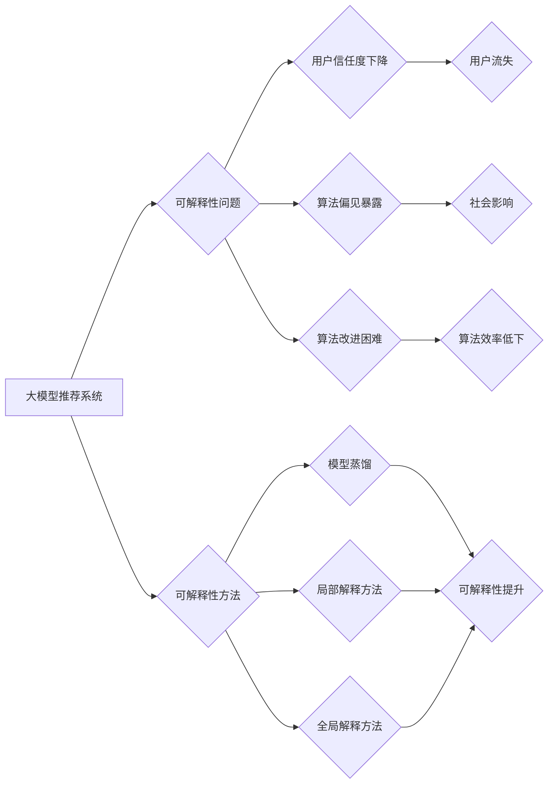

                 

## 大模型提升推荐系统可解释性的方法

> 关键词：大模型、推荐系统、可解释性、模型解释、推荐算法

## 1. 背景介绍

推荐系统作为信息过滤和个性化服务的重要组成部分，在电商、社交媒体、视频平台等领域发挥着越来越重要的作用。然而，随着模型复杂度的不断提升，大模型驱动的推荐系统往往面临着可解释性问题。用户难以理解推荐结果背后的逻辑，这导致了信任度下降、算法偏见暴露等问题。因此，提升大模型推荐系统的可解释性成为一个亟待解决的关键问题。

### 1.1 可解释性在推荐系统中的重要性

可解释性是指用户能够理解模型的决策过程和推荐结果背后的原因。在推荐系统中，可解释性具有以下重要意义：

* **提升用户信任:** 当用户能够理解推荐结果的来源和依据时，他们会更加信任推荐系统，并愿意接受推荐。
* **促进算法改进:** 通过分析用户对推荐结果的反馈和理解，我们可以更好地了解模型的局限性，并针对性地进行改进。
* **避免算法偏见:** 可解释性可以帮助我们识别和解决算法中的潜在偏见，确保推荐结果公平公正。
* **满足监管要求:** 在一些领域，例如医疗和金融，算法的可解释性是必要的监管要求。

### 1.2 大模型带来的可解释性挑战

大模型由于其复杂性和黑盒性质，带来了新的可解释性挑战：

* **模型规模庞大:** 大模型包含数亿甚至数十亿个参数，其内部运作机制难以被人类理解。
* **非线性特征交互:** 大模型学习到的特征往往是复杂的非线性交互，难以用简单的规则或逻辑解释。
* **数据依赖性:** 大模型的性能依赖于训练数据的质量和规模，数据中的偏差或噪声可能会导致模型产生不可解释的推荐结果。

## 2. 核心概念与联系

### 2.1 推荐系统与可解释性

推荐系统旨在根据用户的历史行为、偏好和上下文信息，预测用户对特定物品的兴趣或偏好。可解释性是指用户能够理解推荐结果背后的逻辑和原因。

### 2.2 大模型与推荐系统

大模型是指参数规模庞大的深度学习模型，具有强大的学习能力和泛化能力。大模型在推荐系统中被广泛应用，例如：

* **用户画像生成:** 利用大模型学习用户画像，刻画用户的兴趣、偏好和行为模式。
* **物品特征提取:** 利用大模型提取物品的特征，例如文本描述、图片内容、用户评论等。
* **推荐模型训练:** 利用大模型训练推荐模型，例如协同过滤、深度神经网络等。

### 2.3 可解释性方法

为了提升大模型推荐系统的可解释性，目前主要采用以下几种方法：

* **模型蒸馏:** 将大模型的知识迁移到小型、可解释的模型中。
* **局部解释方法:** 分析单个推荐结果背后的关键因素，例如特征重要性、注意力机制等。
* **全局解释方法:** 分析整个推荐系统的决策过程，例如决策树、规则学习等。

### 2.4 Mermaid 流程图



## 3. 核心算法原理 & 具体操作步骤

### 3.1 算法原理概述

模型蒸馏是一种将大模型的知识迁移到小型、可解释的模型中，从而提升推荐系统可解释性的方法。其核心思想是将大模型的输出作为教师模型，训练一个小型模型作为学生模型，学生模型学习教师模型的知识和决策规则。

### 3.2 算法步骤详解

1. **训练大模型:** 使用大量数据训练一个大型的推荐模型，例如Transformer或BERT。
2. **选择学生模型:** 选择一个小型、可解释的模型作为学生模型，例如线性回归或决策树。
3. **知识蒸馏:** 将大模型的输出作为教师模型，训练学生模型。
4. **优化目标函数:** 使用交叉熵损失函数或其他损失函数，优化学生模型的参数，使其尽可能地模仿教师模型的输出。
5. **评估模型性能:** 使用测试数据评估学生模型的性能，并与教师模型进行比较。

### 3.3 算法优缺点

**优点:**

* 提升可解释性: 学生模型通常比大模型更简单，更容易理解其决策过程。
* 保留性能: 通过知识蒸馏，学生模型可以保留大部分教师模型的性能。
* 降低计算成本: 学生模型的参数规模较小，训练和部署成本更低。

**缺点:**

* 性能损失: 学生模型的性能可能无法完全达到教师模型的水平。
* 知识迁移困难: 知识蒸馏需要精心设计教师模型和学生模型，才能有效地迁移知识。

### 3.4 算法应用领域

模型蒸馏在推荐系统、自然语言处理、计算机视觉等领域都有广泛的应用。

## 4. 数学模型和公式 & 详细讲解 & 举例说明

### 4.1 数学模型构建

假设教师模型的输出为 $y_t$，学生模型的输出为 $y_s$，则知识蒸馏的目标函数可以表示为：

$$
L = \alpha \cdot L_{CE} + (1-\alpha) \cdot L_{KL}
$$

其中：

* $L_{CE}$ 是交叉熵损失函数，用于衡量教师模型和学生模型的输出之间的差异。
* $L_{KL}$ 是KL散度，用于衡量教师模型和学生模型的概率分布之间的差异。
* $\alpha$ 是权重参数，用于平衡交叉熵损失和KL散度。

### 4.2 公式推导过程

交叉熵损失函数的计算公式为：

$$
L_{CE} = -\sum_{i=1}^{N} y_t^{(i)} \log(y_s^{(i)})
$$

其中：

* $N$ 是样本数量。
* $y_t^{(i)}$ 是教师模型对第 $i$ 个样本的输出。
* $y_s^{(i)}$ 是学生模型对第 $i$ 个样本的输出。

KL散度的计算公式为：

$$
L_{KL} = \sum_{i=1}^{M} p_t^{(i)} \log \frac{p_t^{(i)}}{p_s^{(i)}}
$$

其中：

* $M$ 是输出类别数量。
* $p_t^{(i)}$ 是教师模型对第 $i$ 个类别的概率分布。
* $p_s^{(i)}$ 是学生模型对第 $i$ 个类别的概率分布。

### 4.3 案例分析与讲解

假设我们训练了一个大模型用于电影推荐，并希望将其知识迁移到一个可解释的线性回归模型。

1. **训练大模型:** 使用电影评分数据训练一个Transformer模型，作为教师模型。
2. **选择学生模型:** 选择一个线性回归模型作为学生模型。
3. **知识蒸馏:** 使用交叉熵损失和KL散度作为目标函数，训练线性回归模型，使其模仿Transformer模型的输出。
4. **评估模型性能:** 使用测试数据评估线性回归模型的性能，并与Transformer模型进行比较。

通过知识蒸馏，我们可以获得一个性能较好的线性回归模型，其决策过程更容易理解。例如，我们可以分析线性回归模型的权重，了解哪些电影特征对推荐结果的影响最大。

## 5. 项目实践：代码实例和详细解释说明

### 5.1 开发环境搭建

* Python 3.7+
* PyTorch 1.7+
* TensorFlow 2.0+
* scikit-learn 0.23+

### 5.2 源代码详细实现

```python
import torch
import torch.nn as nn
import torch.optim as optim

# 定义教师模型 (例如 Transformer)
class TeacherModel(nn.Module):
    # ...

# 定义学生模型 (例如 Linear Regression)
class StudentModel(nn.Module):
    def __init__(self, input_size, output_size):
        super(StudentModel, self).__init__()
        self.linear = nn.Linear(input_size, output_size)

    def forward(self, x):
        return self.linear(x)

# 训练数据
train_data = ...

# 实例化教师模型和学生模型
teacher_model = TeacherModel()
student_model = StudentModel(input_size=..., output_size=...)

# 定义优化器和损失函数
optimizer = optim.Adam(student_model.parameters(), lr=0.001)
criterion = nn.CrossEntropyLoss()

# 训练循环
for epoch in range(num_epochs):
    for batch_idx, (data, target) in enumerate(train_data):
        # 前向传播
        teacher_output = teacher_model(data)
        student_output = student_model(data)

        # 计算损失
        loss = criterion(teacher_output, target) + 0.1 * nn.KLDivLoss()(torch.softmax(teacher_output, dim=1), torch.softmax(student_output, dim=1))

        # 反向传播
        optimizer.zero_grad()
        loss.backward()
        optimizer.step()

# 保存训练好的学生模型
torch.save(student_model.state_dict(), 'student_model.pth')
```

### 5.3 代码解读与分析

* 代码首先定义了教师模型和学生模型，并实例化了它们。
* 然后，定义了优化器和损失函数，并开始训练循环。
* 在训练循环中，首先使用教师模型对数据进行前向传播，得到教师模型的输出。
* 然后，使用学生模型对数据进行前向传播，得到学生模型的输出。
* 计算损失函数，包括交叉熵损失和KL散度。
* 使用优化器更新学生模型的参数。
* 最后，保存训练好的学生模型。

### 5.4 运行结果展示

训练完成后，我们可以使用保存的student_model.pth文件加载学生模型，并对新的数据进行预测。

## 6. 实际应用场景

### 6.1 电商推荐

在电商平台，大模型可以学习用户的商品偏好和购买行为，推荐个性化的商品。通过模型蒸馏，我们可以将大模型的知识迁移到可解释的模型中，例如线性回归模型，分析哪些商品特征对推荐结果的影响最大，从而提升用户信任度和推荐效果。

### 6.2 内容推荐

在视频平台、新闻网站等平台，大模型可以学习用户的兴趣和偏好，推荐个性化的内容。通过模型蒸馏，我们可以分析哪些内容特征对推荐结果的影响最大，例如标题、标签、作者等，从而提升内容推荐的准确性和可解释性。

### 6.3 其他应用场景

模型蒸馏还可以应用于其他领域，例如医疗诊断、金融风险评估等，提升模型的可解释性和信任度。

### 6.4 未来应用展望

随着大模型技术的不断发展，模型蒸馏将成为提升推荐系统可解释性的重要方法。未来，我们可以期待以下发展趋势：

* **更有效的知识蒸馏方法:** 研究更有效的知识蒸馏方法，例如注意力机制、对抗训练等，提升学生模型的性能和可解释性。
* **多模态知识蒸馏:** 研究将不同模态的数据（例如文本、图像、音频）融合到知识蒸馏中，提升模型的泛化能力和可解释性。
* **可解释性评估指标:** 开发更有效的可解释性评估指标，用于衡量模型的可解释性水平。

## 7. 工具和资源推荐

### 7.1 学习资源推荐

* **书籍:**
    * Deep Learning by Ian Goodfellow, Yoshua Bengio, and Aaron Courville
    * Hands-On Machine Learning with Scikit-Learn, Keras & TensorFlow by Aurélien Géron
* **课程:**
    * Deep Learning Specialization by Andrew Ng (Coursera)
    * Fast.ai Practical Deep Learning for Coders
* **博客:**
    * Towards Data Science
    * Machine Learning Mastery

### 7.2 开发工具推荐

* **深度学习框架:** PyTorch, TensorFlow
* **数据处理工具:** Pandas, NumPy
* **可视化工具:** Matplotlib, Seaborn

### 7.3 相关论文推荐

* **Model Distillation** by Geoffrey Hinton et al. (2015)
* **Teacher-Student Learning** by  Shin et al. (2017)
* **Knowledge Distillation** by  Hinton et al. (2015)

## 8. 总结：未来发展趋势与挑战

### 8.1 研究成果总结

本文介绍了大模型提升推荐系统可解释性的方法，重点介绍了模型蒸馏技术。模型蒸馏通过将大模型的知识迁移到小型、可解释的模型中，可以有效提升推荐系统的可解释性，同时保留大部分性能。

### 8.2 未来发展趋势

未来，模型蒸馏技术将朝着以下方向发展：

* **更有效的知识蒸馏方法:** 研究更有效的知识蒸馏方法，例如注意力机制、对抗训练等，提升学生模型的性能和可解释性。
* **多模态知识蒸馏:** 研究将不同模态的数据（例如文本、图像、音频）融合到知识蒸馏中，提升模型的泛化能力和可解释性。
* **可解释性评估指标:** 开发更有效的可解释性评估指标，用于衡量模型的可解释性水平。

### 8.3 面临的挑战

模型蒸馏技术也面临一些挑战：

* **知识迁移困难:** 知识蒸馏需要精心设计教师模型和学生模型，才能有效地迁移知识。
* **性能损失:** 学生模型的性能可能无法完全达到教师模型的水平。
* **可解释性度量:** 如何有效地量化模型的可解释性仍然是一个开放问题。

### 8.4 研究展望

尽管面临挑战，但模型蒸馏技术具有巨大的潜力，可以帮助我们构建更可解释、更可靠的大模型推荐系统。未来，我们将继续研究和探索新的知识蒸馏方法，以解决这些挑战，并推动大模型推荐系统的可解释性发展。

## 9. 附录：常见问题与解答

### 9.1 Q: 模型蒸馏的优势是什么？

A: 模型蒸馏的优势在于可以将大模型的知识迁移到小型、可解释的模型中，从而提升推荐系统的可解释性，同时保留大部分性能。

### 9.2 Q: 模型蒸馏的局限性是什么？

A: 模型蒸馏的局限性在于知识迁移困难，学生模型的性能可能无法完全达到教师模型的水平。

### 9.3 Q: 如何选择合适的教师模型和学生模型？

A: 教师模型的选择应该考虑其性能和复杂度，学生模型的选择应该考虑其可解释性和性能。

### 9.4 Q: 如何评估模型蒸馏的效果？

A: 可以使用交叉熵损失、KL散度等指标评估模型蒸馏的效果。

### 9.5 Q: 模型蒸馏有哪些应用场景？

A: 模型蒸馏可以应用于电商推荐、内容推荐、医疗诊断、金融风险评估等领域。


作者：禅与计算机程序设计艺术 / Zen and the Art of Computer Programming<end_of_turn>

