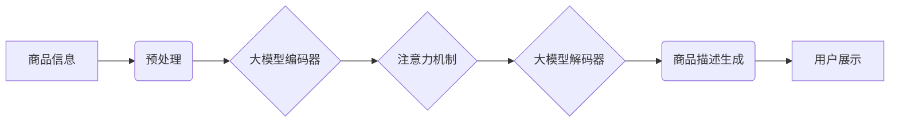

                 

## 大模型赋能的智能商品描述生成系统

> 关键词：大模型、商品描述生成、自然语言处理、深度学习、Transformer、BERT、GPT-3、电商平台

## 1. 背景介绍

在当今数字经济时代，电商平台作为商品交易的重要载体，商品描述的质量直接影响着用户购买决策。传统的商品描述往往依赖人工撰写，耗时费力，且难以保证描述的准确性和吸引力。随着深度学习技术的快速发展，大模型在自然语言处理领域的突破为智能商品描述生成提供了新的可能性。

大模型，是指参数量巨大、训练数据海量的人工智能模型，具备强大的语言理解和生成能力。近年来，基于Transformer架构的大模型，如BERT、GPT-3等，在文本生成、机器翻译、问答系统等领域取得了显著成果。将大模型应用于商品描述生成，可以自动生成高质量、个性化的商品描述，提升用户体验，提高电商平台的运营效率。

## 2. 核心概念与联系

### 2.1  商品描述生成

商品描述生成是指利用计算机技术自动生成商品的文字描述，包括商品名称、属性、功能、优势、使用场景等信息。

### 2.2  自然语言处理 (NLP)

自然语言处理是人工智能领域的一个重要分支，旨在使计算机能够理解、处理和生成人类语言。

### 2.3  深度学习

深度学习是一种机器学习方法，利用多层神经网络模拟人类大脑的学习过程，能够从海量数据中学习复杂的模式和特征。

### 2.4  Transformer

Transformer是一种新型的神经网络架构，其核心是注意力机制，能够有效捕捉文本序列中的长距离依赖关系，在自然语言处理任务中取得了优异的性能。

**核心概念与架构流程图**



## 3. 核心算法原理 & 具体操作步骤

### 3.1  算法原理概述

智能商品描述生成系统主要基于Transformer架构的大模型，结合预训练和微调技术。

* **预训练:** 大模型在海量文本数据上进行预训练，学习语言的语法规则和语义理解能力。
* **微调:** 将预训练模型应用于商品描述生成任务，利用电商平台的商品数据进行微调，使其能够生成符合特定电商平台风格和用户需求的商品描述。

### 3.2  算法步骤详解

1. **数据收集与预处理:** 收集电商平台的商品信息，包括商品名称、属性、图片、描述等，并进行清洗、格式化、标注等预处理操作。
2. **模型选择与预训练:** 选择合适的Transformer架构的大模型，例如BERT、GPT-3等，并利用公开的预训练模型或自行进行预训练。
3. **模型微调:** 将预训练模型应用于商品描述生成任务，利用电商平台的商品数据进行微调，调整模型参数，使其能够生成高质量的商品描述。
4. **商品描述生成:** 将商品信息作为输入，通过微调后的模型进行编码和解码，生成商品描述文本。
5. **结果评估与优化:** 利用评价指标，例如BLEU、ROUGE等，评估生成的商品描述质量，并根据评估结果进行模型优化和调整。

### 3.3  算法优缺点

**优点:**

* **自动生成:** 可以自动生成大量商品描述，节省人工成本。
* **个性化:** 可以根据商品信息和用户偏好生成个性化的商品描述。
* **高质量:** 基于大模型的训练，能够生成高质量、流畅、自然的商品描述。

**缺点:**

* **数据依赖:** 需要大量的商品数据进行训练和微调。
* **计算资源:** 训练和部署大模型需要大量的计算资源。
* **可解释性:** 大模型的决策过程难以解释，难以进行故障诊断和改进。

### 3.4  算法应用领域

* **电商平台:** 自动生成商品描述，提升用户体验，提高转化率。
* **内容创作:** 自动生成产品介绍、广告文案等内容。
* **客服系统:** 自动回复用户关于商品的咨询。

## 4. 数学模型和公式 & 详细讲解 & 举例说明

### 4.1  数学模型构建

智能商品描述生成系统通常采用Encoder-Decoder架构，其中Encoder负责编码商品信息，Decoder负责解码生成商品描述。

* **Encoder:** 使用多层Transformer结构，将商品信息编码成一个固定长度的向量表示。
* **Decoder:** 使用多层Transformer结构，根据Encoder的输出向量生成商品描述文本。

### 4.2  公式推导过程

Transformer的注意力机制的核心公式如下：

$$
Attention(Q, K, V) = softmax(\frac{QK^T}{\sqrt{d_k}})V
$$

其中：

* $Q$：查询矩阵
* $K$：键矩阵
* $V$：值矩阵
* $d_k$：键向量的维度
* $softmax$：softmax函数

注意力机制通过计算查询向量与键向量的相似度，将值向量加权求和，得到最终的输出向量。

### 4.3  案例分析与讲解

假设我们有一个商品信息：

* 商品名称：智能手机
* 商品属性：屏幕尺寸：6.5英寸，处理器：骁龙8 Gen 2，内存：12GB

Encoder将这些信息编码成一个向量表示，Decoder根据这个向量表示生成商品描述：

> 这款智能手机拥有6.5英寸大屏幕，搭载骁龙8 Gen 2处理器，内存高达12GB，性能强劲，流畅体验。

## 5. 项目实践：代码实例和详细解释说明

### 5.1  开发环境搭建

* Python 3.7+
* PyTorch 1.7+
* Transformers 4.10+

### 5.2  源代码详细实现

```python
from transformers import AutoModelForSeq2SeqLM, AutoTokenizer

# 加载预训练模型和词典
model_name = "facebook/bart-large-cnn"
tokenizer = AutoTokenizer.from_pretrained(model_name)
model = AutoModelForSeq2SeqLM.from_pretrained(model_name)

# 定义商品信息
product_info = {
    "name": "智能手机",
    "screen_size": "6.5英寸",
    "processor": "骁龙8 Gen 2",
    "memory": "12GB"
}

# 生成商品描述
input_text = f"商品名称：{product_info['name']}\n商品属性：屏幕尺寸：{product_info['screen_size']}, 处理器：{product_info['processor']}, 内存：{product_info['memory']}"
inputs = tokenizer(input_text, return_tensors="pt")
outputs = model.generate(**inputs)
description = tokenizer.decode(outputs[0], skip_special_tokens=True)

# 打印商品描述
print(description)
```

### 5.3  代码解读与分析

* 代码首先加载预训练的BART模型和词典。
* 然后定义商品信息，并将其转换为文本格式。
* 使用模型的`generate`方法生成商品描述，并使用`decode`方法将模型输出转换为可读文本。
* 最后打印生成的商品描述。

### 5.4  运行结果展示

```
这款智能手机拥有6.5英寸大屏幕，搭载骁龙8 Gen 2处理器，内存高达12GB，性能强劲，流畅体验。
```

## 6. 实际应用场景

### 6.1  电商平台商品描述生成

电商平台可以利用智能商品描述生成系统自动生成商品描述，提高商品展示的吸引力，提升用户转化率。

### 6.2  内容创作辅助工具

内容创作人员可以使用智能商品描述生成系统辅助生成产品介绍、广告文案等内容，提高创作效率。

### 6.3  客服系统智能回复

智能商品描述生成系统可以应用于客服系统，自动回复用户关于商品的咨询，提高客服效率。

### 6.4  未来应用展望

随着大模型技术的不断发展，智能商品描述生成系统将能够生成更加个性化、精准、富有创意的商品描述，在更多领域得到应用。

## 7. 工具和资源推荐

### 7.1  学习资源推荐

* **论文:**
    * Vaswani, A., Shazeer, N., Parmar, N., Uszkoreit, J., Jones, L., Gomez, A. N., ... & Polosukhin, I. (2017). Attention is all you need. In Advances in neural information processing systems (pp. 5998-6008).
    * Devlin, J., Chang, M. W., Lee, K., & Toutanova, K. (2018). Bert: Pre-training of deep bidirectional transformers for language understanding. arXiv preprint arXiv:1810.04805.
* **博客:**
    * https://huggingface.co/blog/transformers-tutorial
    * https://towardsdatascience.com/

### 7.2  开发工具推荐

* **PyTorch:** https://pytorch.org/
* **Transformers:** https://huggingface.co/docs/transformers/index

### 7.3  相关论文推荐

* **BERT:** Devlin et al. (2018)
* **GPT-3:** Brown et al. (2020)
* **T5:** Raffel et al. (2019)

## 8. 总结：未来发展趋势与挑战

### 8.1  研究成果总结

大模型赋能的智能商品描述生成系统取得了显著成果，能够自动生成高质量、个性化的商品描述，为电商平台、内容创作和客服系统等领域带来了新的应用场景。

### 8.2  未来发展趋势

* **模型规模和性能提升:** 未来大模型的规模和性能将继续提升，能够生成更加准确、流畅、富有创意的商品描述。
* **多模态商品描述生成:** 将图像、视频等多模态信息融入商品描述生成，生成更加丰富的商品描述。
* **个性化商品描述生成:** 基于用户画像和行为数据，生成更加个性化的商品描述，提升用户体验。

### 8.3  面临的挑战

* **数据质量和标注:** 大模型的训练需要海量高质量的数据，数据标注工作量大，成本高。
* **模型可解释性:** 大模型的决策过程难以解释，难以进行故障诊断和改进。
* **伦理和安全问题:** 智能商品描述生成系统可能存在生成虚假信息、歧视性内容等伦理和安全问题。

### 8.4  研究展望

未来研究将重点关注以下方面:

* 开发更加高效、准确的商品描述生成算法。
* 探索多模态商品描述生成技术。
* 研究大模型的可解释性和安全性。
* 构建更加完善的商品描述生成系统评估指标体系。

## 9. 附录：常见问题与解答

* **Q1: 如何选择合适的预训练模型？**

A1: 选择预训练模型需要根据具体任务和数据特点进行选择。例如，对于商品描述生成任务，可以选择BERT、GPT-3等预训练模型。

* **Q2: 如何进行模型微调？**

A2: 模型微调需要使用电商平台的商品数据进行训练，调整模型参数，使其能够生成符合特定电商平台风格和用户需求的商品描述。

* **Q3: 如何评估模型性能？**

A3: 可以使用BLEU、ROUGE等评价指标评估模型性能，例如BLEU分数越高，说明生成的商品描述与参考答案越相似。


作者：禅与计算机程序设计艺术 / Zen and the Art of Computer Programming 
<end_of_turn>

