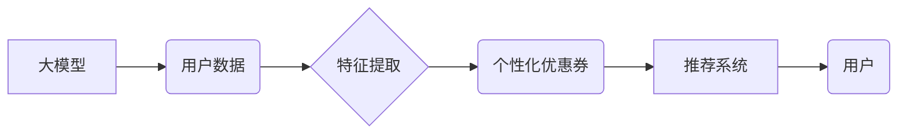

                 

## 大模型驱动的电商个性化优惠券分发策略

> 关键词：大模型、电商、个性化优惠券、推荐系统、机器学习、自然语言处理、深度学习

## 1. 背景介绍

在当今数据爆炸的时代，电商平台面临着激烈的竞争压力。为了提升用户粘性、促进交易转化，个性化营销策略成为电商平台的核心竞争力之一。优惠券作为一种常见的促销手段，在电商平台的营销体系中扮演着至关重要的角色。然而，传统的优惠券分发策略往往缺乏针对性，导致优惠券使用率低、营销效果不佳。

大模型的出现为电商个性化优惠券分发策略带来了新的机遇。大模型具备强大的学习能力和泛化能力，能够从海量用户数据中挖掘出隐藏的个性化需求，并精准地推荐合适的优惠券。

## 2. 核心概念与联系

### 2.1  大模型

大模型是指参数规模庞大、训练数据海量的人工智能模型。近年来，随着深度学习技术的不断发展，大模型在自然语言处理、计算机视觉、语音识别等领域取得了突破性的进展。

### 2.2  个性化优惠券

个性化优惠券是指根据用户的特征、行为、偏好等信息，定制化的优惠券。个性化优惠券能够更精准地满足用户的需求，提高优惠券的吸引力和使用率。

### 2.3  推荐系统

推荐系统是根据用户的历史行为、兴趣偏好等信息，推荐用户可能感兴趣的内容或商品的系统。在电商平台中，推荐系统广泛应用于商品推荐、优惠券推荐等场景。

**核心概念与联系流程图**



## 3. 核心算法原理 & 具体操作步骤

### 3.1  算法原理概述

大模型驱动的电商个性化优惠券分发策略主要基于以下核心算法：

* **用户画像构建:** 利用大模型对用户的历史行为、浏览记录、购买记录等数据进行分析，构建用户的个性化画像。
* **优惠券分类与匹配:** 对优惠券进行分类和标签化，并根据用户的画像特征进行匹配，推荐最符合用户需求的优惠券。
* **推荐排序与展示:** 利用大模型对推荐结果进行排序，并根据用户的个性化偏好进行展示，提高用户点击率和转化率。

### 3.2  算法步骤详解

1. **数据收集与预处理:** 收集用户行为数据、优惠券信息等数据，并进行清洗、转换、格式化等预处理操作。
2. **用户画像构建:** 利用大模型对用户数据进行分析，提取用户的兴趣爱好、消费习惯、购买偏好等特征，构建用户的个性化画像。
3. **优惠券分类与匹配:** 对优惠券进行分类和标签化，例如根据优惠券类型、折扣力度、适用范围等进行分类。根据用户的画像特征，匹配最符合用户需求的优惠券。
4. **推荐排序与展示:** 利用大模型对推荐结果进行排序，并根据用户的个性化偏好进行展示，例如根据用户的浏览历史、购买记录等信息，推荐更相关的优惠券。

### 3.3  算法优缺点

**优点:**

* **个性化程度高:** 能够根据用户的个性化需求，推荐最合适的优惠券。
* **精准度高:** 利用大模型的学习能力，能够更精准地预测用户的优惠券需求。
* **效率高:** 大模型的并行计算能力，能够快速处理海量数据，提高推荐效率。

**缺点:**

* **数据依赖性强:** 需要海量用户数据进行训练，才能保证模型的准确性。
* **计算资源消耗大:** 大模型的训练和推理需要大量的计算资源。
* **模型解释性差:** 大模型的决策过程较为复杂，难以解释模型的推荐结果。

### 3.4  算法应用领域

大模型驱动的电商个性化优惠券分发策略可以应用于以下场景:

* **电商平台优惠券推荐:** 为用户推荐个性化的优惠券，提高优惠券使用率和转化率。
* **会员营销:** 为会员用户提供个性化的优惠券和促销活动，提升会员粘性。
* **精准营销:** 根据用户的画像特征，精准地推送优惠券广告，提高广告效果。

## 4. 数学模型和公式 & 详细讲解 & 举例说明

### 4.1  数学模型构建

我们可以使用协同过滤算法构建用户-优惠券推荐模型。协同过滤算法基于用户的历史行为数据，预测用户对未交互过的优惠券的兴趣。

**用户-优惠券评分矩阵:**

假设我们有 $m$ 个用户和 $n$ 个优惠券，我们可以构建一个 $m \times n$ 的用户-优惠券评分矩阵 $R$，其中 $R_{ui}$ 表示用户 $u$ 对优惠券 $i$ 的评分。

**评分预测:**

我们可以使用矩阵分解算法来预测用户对优惠券的评分。矩阵分解将用户-优惠券评分矩阵分解成两个低维矩阵 $U$ 和 $V$，其中 $U$ 是用户特征矩阵，$V$ 是优惠券特征矩阵。

$$R \approx U V^T$$

其中，$U$ 是 $m \times k$ 的矩阵，$V$ 是 $n \times k$ 的矩阵，$k$ 是隐特征维度。

### 4.2  公式推导过程

矩阵分解的目标是找到最优的 $U$ 和 $V$，使得预测评分与实际评分之间的误差最小。我们可以使用均方误差作为损失函数：

$$Loss = \frac{1}{2} \sum_{u=1}^{m} \sum_{i=1}^{n} (R_{ui} - \hat{R}_{ui})^2$$

其中，$\hat{R}_{ui}$ 是预测的评分。

可以使用梯度下降算法来优化 $U$ 和 $V$，最小化损失函数。

### 4.3  案例分析与讲解

假设我们有一个电商平台，有 1000 个用户和 1000 个优惠券。我们可以使用矩阵分解算法构建用户-优惠券推荐模型。

通过训练模型，我们可以得到用户特征矩阵 $U$ 和优惠券特征矩阵 $V$。

当一个用户浏览一个优惠券时，我们可以使用 $U$ 和 $V$ 来预测用户对该优惠券的评分。如果预测评分较高，则表明用户对该优惠券有较高的兴趣，可以将该优惠券推荐给用户。

## 5. 项目实践：代码实例和详细解释说明

### 5.1  开发环境搭建

* Python 3.6+
* TensorFlow/PyTorch
* Jupyter Notebook

### 5.2  源代码详细实现

```python
import tensorflow as tf

# 定义用户-优惠券评分矩阵
R = tf.random.normal((1000, 1000))

# 定义用户特征矩阵和优惠券特征矩阵
U = tf.Variable(tf.random.normal((1000, 10)))
V = tf.Variable(tf.random.normal((1000, 10)))

# 定义损失函数
def loss_function(R, U, V):
    return tf.reduce_mean(tf.square(R - tf.matmul(U, V, transpose_b=True)))

# 定义优化器
optimizer = tf.keras.optimizers.Adam()

# 训练模型
for epoch in range(100):
    with tf.GradientTape() as tape:
        loss = loss_function(R, U, V)
    gradients = tape.gradient(loss, [U, V])
    optimizer.apply_gradients(zip(gradients, [U, V]))

# 预测评分
predictions = tf.matmul(U, V, transpose_b=True)
```

### 5.3  代码解读与分析

* 我们首先定义了用户-优惠券评分矩阵 $R$，用户特征矩阵 $U$ 和优惠券特征矩阵 $V$。
* 然后，我们定义了损失函数，用于衡量预测评分与实际评分之间的误差。
* 我们使用 Adam 优化器来优化模型参数，最小化损失函数。
* 最后，我们使用训练好的模型来预测用户对优惠券的评分。

### 5.4  运行结果展示

训练完成后，我们可以使用预测评分来推荐优惠券给用户。

## 6. 实际应用场景

### 6.1  电商平台优惠券推荐

大模型驱动的个性化优惠券推荐系统可以帮助电商平台提高优惠券使用率和转化率。例如，可以根据用户的浏览历史、购买记录等信息，推荐最符合用户需求的优惠券。

### 6.2  会员营销

电商平台可以利用大模型构建会员画像，并根据会员的个性化需求，提供个性化的优惠券和促销活动。

### 6.3  精准营销

大模型可以帮助电商平台进行精准营销，例如根据用户的画像特征，精准地推送优惠券广告，提高广告效果。

### 6.4  未来应用展望

随着大模型技术的不断发展，大模型驱动的电商个性化优惠券分发策略将有更广泛的应用场景，例如：

* **跨平台个性化推荐:** 将用户数据整合到多个平台，实现跨平台的个性化优惠券推荐。
* **多模态个性化推荐:** 利用文本、图像、视频等多模态数据，构建更全面的用户画像，实现更精准的个性化推荐。
* **动态个性化推荐:** 根据用户的实时行为和环境变化，动态调整优惠券推荐策略，提高推荐效果。

## 7. 工具和资源推荐

### 7.1  学习资源推荐

* **书籍:**
    * 深度学习
    * 自然语言处理
* **在线课程:**
    * Coursera
    * edX
    * fast.ai

### 7.2  开发工具推荐

* **TensorFlow:** 开源深度学习框架
* **PyTorch:** 开源深度学习框架
* **Jupyter Notebook:** 交互式编程环境

### 7.3  相关论文推荐

* **BERT: Pre-training of Deep Bidirectional Transformers for Language Understanding**
* **Attention Is All You Need**
* **Recurrent Neural Networks for Sequence Learning**

## 8. 总结：未来发展趋势与挑战

### 8.1  研究成果总结

大模型驱动的电商个性化优惠券分发策略取得了显著的成果，能够提高优惠券使用率和转化率，提升用户体验。

### 8.2  未来发展趋势

未来，大模型驱动的电商个性化优惠券分发策略将朝着以下方向发展:

* **模型规模和能力的提升:** 大模型的规模和能力将不断提升，能够处理更复杂的用户数据，提供更精准的个性化推荐。
* **多模态融合:** 将文本、图像、视频等多模态数据融合，构建更全面的用户画像，实现更精准的个性化推荐。
* **动态个性化推荐:** 根据用户的实时行为和环境变化，动态调整优惠券推荐策略，提高推荐效果。

### 8.3  面临的挑战

大模型驱动的电商个性化优惠券分发策略也面临着一些挑战:

* **数据隐私和安全:** 大模型需要海量用户数据进行训练，如何保护用户数据隐私和安全是一个重要的挑战。
* **模型解释性和可解释性:** 大模型的决策过程较为复杂，难以解释模型的推荐结果，如何提高模型的解释性和可解释性是一个重要的研究方向。
* **计算资源消耗:** 大模型的训练和推理需要大量的计算资源，如何降低计算资源消耗是一个重要的技术挑战。

### 8.4  研究展望

未来，我们将继续研究大模型驱动的电商个性化优惠券分发策略，探索更有效的算法和模型，并解决数据隐私、模型解释性和计算资源消耗等挑战，为电商平台提供更精准、更个性化的营销服务。

## 9. 附录：常见问题与解答

**Q1: 大模型驱动的电商个性化优惠券分发策略与传统的优惠券分发策略相比有哪些优势？**

**A1:** 大模型驱动的电商个性化优惠券分发策略能够根据用户的个性化需求，推荐最合适的优惠券，提高优惠券使用率和转化率。而传统的优惠券分发策略往往缺乏针对性，导致优惠券使用率低、营销效果不佳。

**Q2: 大模型驱动的电商个性化优惠券分发策略需要哪些数据进行训练？**

**A2:** 大模型驱动的电商个性化优惠券分发策略需要用户行为数据、优惠券信息等数据进行训练。

**Q3: 如何解决大模型训练过程中数据隐私和安全问题？**

**A3:** 可以采用数据脱敏、联邦学习等技术来保护用户数据隐私和安全。


作者：禅与计算机程序设计艺术 / Zen and the Art of Computer Programming 
<end_of_turn>

