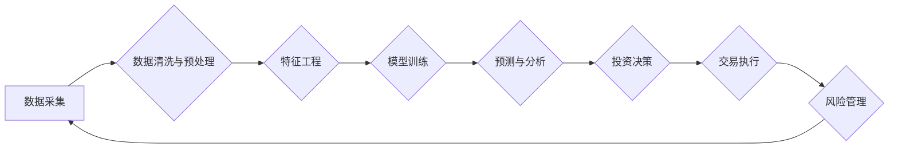

                 

## 如何利用技术能力进行房地产投资

> 关键词：房地产投资、数据分析、机器学习、预测模型、算法优化、风险管理、智能合约、区块链

## 1. 背景介绍

房地产一直是人们重要的资产配置之一，但传统的房地产投资方式往往依赖于经验和人脉，缺乏数据驱动和科学决策。随着人工智能、大数据等技术的快速发展，技术手段为房地产投资提供了全新的视角和机遇。

现代技术赋予了房地产投资新的可能性：

* **数据驱动决策:** 通过收集和分析海量房地产数据，可以更准确地评估房产价值、预测市场趋势，从而做出更明智的投资决策。
* **自动化投资:** 利用算法和机器学习模型，可以自动筛选优质投资机会，并进行智能交易，提高投资效率和收益率。
* **风险管理:** 通过数据分析和模型预测，可以识别潜在的投资风险，并采取相应的措施进行规避，降低投资损失。
* **透明化交易:** 区块链技术可以实现房地产交易的透明化和安全化，降低交易成本和风险。

## 2. 核心概念与联系

房地产投资的核心在于识别具有投资价值的房产，并进行合理的估值和交易。技术手段可以帮助我们从多个维度进行分析和决策，构建一个完整的房地产投资生态系统。

**Mermaid 流程图:**



**核心概念:**

* **数据采集:** 从各种渠道收集房地产相关数据，包括房产信息、市场价格、区域发展、政策法规等。
* **数据清洗与预处理:** 对收集到的数据进行清洗、转换和标准化，去除噪声和异常值，以便于后续分析。
* **特征工程:** 从原始数据中提取有价值的特征，例如房屋面积、楼层、朝向、周边设施等，构建模型输入。
* **模型训练:** 利用机器学习算法，训练预测模型，例如房价预测模型、投资收益率模型等。
* **预测与分析:** 利用训练好的模型，对未来市场趋势进行预测，并分析投资机会和风险。
* **投资决策:** 基于预测结果和风险评估，做出合理的投资决策，例如买入、卖出、持有等。
* **交易执行:** 通过平台或经纪人，完成房产交易。
* **风险管理:** 监控投资组合的风险，采取措施规避潜在风险，保障投资安全。

## 3. 核心算法原理 & 具体操作步骤

### 3.1  算法原理概述

房地产投资中常用的算法主要包括回归算法、分类算法和时间序列分析算法。

* **回归算法:** 用于预测连续数值，例如房价、租金等。常见的回归算法包括线性回归、逻辑回归、支持向量机回归等。
* **分类算法:** 用于分类数据，例如判断房产是否值得投资、预测房产未来增值潜力等。常见的分类算法包括决策树、随机森林、支持向量机分类等。
* **时间序列分析算法:** 用于分析时间序列数据，例如房价历史走势、市场供需变化等。常见的算法包括ARIMA模型、SARIMA模型、Prophet模型等。

### 3.2  算法步骤详解

以房价预测为例，详细说明算法步骤：

1. **数据采集:** 收集历史房价数据、房屋特征数据、区域发展数据等。
2. **数据清洗与预处理:** 去除缺失值、异常值，对数据进行标准化处理。
3. **特征工程:** 提取房屋面积、楼层、朝向、周边设施等特征，构建模型输入。
4. **模型选择:** 根据数据特点和预测目标，选择合适的回归算法，例如线性回归。
5. **模型训练:** 利用历史房价数据训练模型，学习房价与特征之间的关系。
6. **模型评估:** 利用测试数据评估模型性能，例如计算均方误差、R^2值等。
7. **模型优化:** 根据评估结果，调整模型参数，提高预测精度。
8. **预测与分析:** 利用训练好的模型，预测未来房价走势，并分析投资机会和风险。

### 3.3  算法优缺点

**优点:**

* **数据驱动:** 基于大量数据分析，决策更科学、更精准。
* **自动化:** 算法可以自动完成数据处理、模型训练等工作，提高效率。
* **可量化:** 算法可以量化投资风险和收益，帮助投资者做出更明智的决策。

**缺点:**

* **数据依赖:** 算法的准确性依赖于数据质量和数量，数据偏差会导致预测结果不准确。
* **模型复杂:** 复杂的算法模型需要专业的技术人员进行开发和维护。
* **黑盒效应:** 一些算法模型难以解释其决策逻辑，导致投资者难以理解和信任。

### 3.4  算法应用领域

* **房价预测:** 预测未来房价走势，帮助投资者判断买入、卖出时机。
* **投资收益率预测:** 预测房产投资的收益率，帮助投资者评估投资风险和回报。
* **区域发展预测:** 预测区域经济发展趋势，帮助投资者选择优质投资区域。
* **房产价值评估:** 评估房产的市场价值，帮助投资者进行合理交易。
* **风险管理:** 识别潜在的投资风险，帮助投资者规避损失。

## 4. 数学模型和公式 & 详细讲解 & 举例说明

### 4.1  数学模型构建

房地产投资的数学模型通常基于回归分析、时间序列分析和概率统计等方法。

**房价预测模型:**

一个简单的线性回归模型可以用来预测房价：

$$
P = a + bS + cL + dD
$$

其中：

* $P$：房价
* $S$：房屋面积
* $L$：楼层
* $D$：周边设施距离
* $a$、$b$、$c$、$d$：模型参数

### 4.2  公式推导过程

模型参数可以通过最小二乘法进行估计，目标是找到使模型预测值与实际房价误差最小的参数值。

### 4.3  案例分析与讲解

假设我们收集了100套房子的数据，包括房屋面积、楼层、周边设施距离和房价。我们可以利用线性回归模型训练一个房价预测模型，并使用该模型预测新房子的房价。

## 5. 项目实践：代码实例和详细解释说明

### 5.1  开发环境搭建

* Python 3.x
* Jupyter Notebook
* pandas
* scikit-learn
* matplotlib

### 5.2  源代码详细实现

```python
import pandas as pd
from sklearn.linear_model import LinearRegression
from sklearn.model_selection import train_test_split
import matplotlib.pyplot as plt

# 加载房价数据
data = pd.read_csv('house_price_data.csv')

# 选择特征和目标变量
X = data[['面积', '楼层', '设施距离']]
y = data['房价']

# 将数据分为训练集和测试集
X_train, X_test, y_train, y_test = train_test_split(X, y, test_size=0.2, random_state=42)

# 创建线性回归模型
model = LinearRegression()

# 训练模型
model.fit(X_train, y_train)

# 预测测试集房价
y_pred = model.predict(X_test)

# 评估模型性能
print('模型系数:', model.coef_)
print('模型截距:', model.intercept_)
print('R^2:', model.score(X_test, y_test))

# 可视化预测结果
plt.scatter(y_test, y_pred)
plt.xlabel('实际房价')
plt.ylabel('预测房价')
plt.title('房价预测结果')
plt.show()
```

### 5.3  代码解读与分析

* 代码首先加载房价数据，并选择特征和目标变量。
* 然后将数据分为训练集和测试集，用于训练和评估模型。
* 创建线性回归模型，并使用训练集训练模型。
* 利用训练好的模型预测测试集房价，并评估模型性能。
* 最后使用可视化工具展示预测结果。

### 5.4  运行结果展示

运行代码后，会输出模型系数、截距、R^2值等指标，以及房价预测结果的可视化图。

## 6. 实际应用场景

### 6.1  房产投资决策

* **投资机会识别:** 利用数据分析和模型预测，识别具有投资价值的房产，例如价格低廉、潜力大的房产。
* **投资风险评估:** 分析房产投资的风险因素，例如市场波动、政策变化、区域发展等，帮助投资者做出更明智的决策。
* **投资组合优化:** 根据投资目标和风险承受能力，构建合理的投资组合，分散投资风险。

### 6.2  房产估价

* **市场价值评估:** 利用数据分析和模型预测，评估房产的市场价值，帮助投资者进行合理交易。
* **税务评估:** 为税务部门提供房产价值评估数据，用于房产税收计算。
* **保险评估:** 为保险公司提供房产价值评估数据，用于房屋保险定价。

### 6.3  房产管理

* **租房市场分析:** 分析租房市场需求和价格趋势，帮助房东制定合理的租金策略。
* **物业管理优化:** 利用数据分析，识别物业管理中的问题和痛点，并提出优化方案。
* **社区服务提升:** 利用数据分析，了解居民需求，提供更精准的社区服务。

### 6.4  未来应用展望

随着人工智能、大数据等技术的不断发展，房地产投资将更加智能化、数据化和自动化。未来，我们可以期待以下应用场景：

* **智能房产交易平台:** 利用区块链技术，实现房产交易的透明化、安全化和高效化。
* **个性化房产投资顾问:** 利用人工智能技术，为投资者提供个性化的投资建议和服务。
* **虚拟现实房产体验:** 利用虚拟现实技术，为投资者提供沉浸式的房产体验，帮助他们更好地了解房产信息。

## 7. 工具和资源推荐

### 7.1  学习资源推荐

* **书籍:**
    * 《Python数据科学手册》
    * 《机器学习实战》
    * 《房价预测》
* **在线课程:**
    * Coursera: 数据科学、机器学习
    * edX: 房地产投资、数据分析
* **博客和论坛:**
    * Towards Data Science
    * Kaggle

### 7.2  开发工具推荐

* **Python:** 数据分析、机器学习
* **Jupyter Notebook:** 代码开发和可视化
* **pandas:** 数据处理和分析
* **scikit-learn:** 机器学习算法库
* **matplotlib:** 数据可视化

### 7.3  相关论文推荐

* **房价预测模型研究**
* **机器学习在房地产投资中的应用**
* **区块链技术在房地产交易中的应用**

## 8. 总结：未来发展趋势与挑战

### 8.1  研究成果总结

技术手段为房地产投资提供了全新的视角和机遇，可以帮助投资者进行更科学、更精准的决策。

### 8.2  未来发展趋势

* **人工智能技术将更加深入地应用于房地产投资领域，例如个性化投资顾问、智能房产交易平台等。**
* **大数据分析将更加细化，能够提供更精准的市场预测和投资建议。**
* **区块链技术将进一步推动房地产交易的透明化、安全化和高效化。**

### 8.3  面临的挑战

* **数据质量和可用性:** 

房地产数据往往分散、不完整、难以获取，需要进一步完善数据收集和整合机制。
* **算法模型的解释性:** 一些复杂的算法模型难以解释其决策逻辑，需要进一步研究算法的可解释性问题。
* **监管和法律框架:** 

需要完善相关法律法规，规范人工智能技术在房地产领域的应用。

### 8.4  研究展望

未来，我们将继续研究人工智能、大数据、区块链等技术的应用，推动房地产投资的智能化、数据化和自动化发展，为投资者提供更优质的服务。

## 9. 附录：常见问题与解答

**Q1: 如何获取高质量的房地产数据？**

**A1:** 可以通过以下途径获取高质量的房地产数据：

* **政府公开数据:** 许多国家和地区政府会公开发布房地产相关数据，例如房价、土地使用情况等。
* **房地产中介平台:** 房地产中介平台会收集大量的房产信息，例如房屋面积、楼层、周边设施等。
* **第三方数据供应商:** 一些第三方数据供应商专门提供房地产数据，例如 CoreLogic、Zillow 等。

**Q2: 如何选择合适的算法模型？**

**A2:** 选择合适的算法模型需要根据具体的数据特点和预测目标进行选择。

* **房价预测:** 线性回归、支持向量机回归、随机森林回归等。
* **投资收益率预测:** 决策树、随机森林、神经网络等。
* **区域发展预测:** ARIMA模型、SARIMA模型、Prophet模型等。

**Q3: 如何评估模型性能？**

**A3:** 可以使用以下指标评估模型性能：

* **R^2值:** 衡量模型拟合优度。
* **均方误差 (MSE):** 衡量模型预测值与实际值之间的误差。
* **平均绝对误差 (MAE):** 衡量模型预测值与实际值之间的绝对误差。

**Q4: 如何应对数据偏差？**

**A4:** 数据偏差会导致模型预测结果不准确，需要采取以下措施应对：

* **数据清洗:** 去除异常值、缺失值等数据偏差。
* **数据平衡:** 对数据进行平衡处理，例如过采样、欠采样等。
* **模型鲁棒性:** 选择具有鲁棒性的算法模型，能够更好地应对数据偏差。


作者：禅与计算机程序设计艺术 / Zen and the Art of Computer Programming<end_of_turn>

