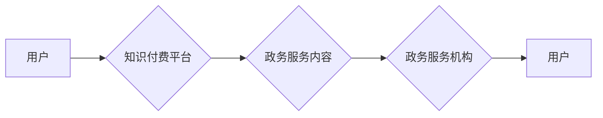

                 

## 如何利用知识付费实现智慧城市与政务服务？

> 关键词：智慧城市、政务服务、知识付费、数据驱动、人工智能、云计算、区块链、平台经济、用户体验

## 1. 背景介绍

智慧城市建设是全球范围内重要的发展趋势，旨在通过信息化、数字化、智能化手段提升城市管理水平、提高居民生活质量。政务服务作为智慧城市的重要组成部分，需要不断创新，以更加便捷、高效、透明的方式服务于市民。知识付费作为一种新兴的商业模式，以其独特的价值传递方式，为智慧城市政务服务提供了新的思路和可能性。

传统政务服务模式往往存在效率低下、信息不对称、服务体验差等问题。知识付费模式则通过提供专业知识、技能培训和咨询服务，帮助市民解决实际问题，提升自身能力，从而实现政务服务的个性化、精准化和智能化。

## 2. 核心概念与联系

**2.1 智慧城市与政务服务**

智慧城市是指利用信息技术、互联网、大数据等手段，对城市基础设施、公共服务、社会管理等进行智能化改造，提升城市整体运行效率和居民生活品质的城市形态。政务服务是政府为公民、企业和社会组织提供的公共服务，包括行政审批、信息查询、公共资源交易等。

**2.2 知识付费与智慧城市政务服务**

知识付费是指通过付费获取知识、技能、经验等价值的行为。它可以分为以下几种类型：

* **在线课程:** 提供各种主题的线上课程，涵盖专业技能、兴趣爱好、个人成长等领域。
* **付费咨询:** 提供一对一或群组咨询服务，解答用户的问题，提供专业建议。
* **知识付费平台:** 建立知识付费平台，汇聚优质内容和服务，提供付费订阅、会员体系等模式。

知识付费模式可以应用于智慧城市政务服务，通过以下方式提升服务效率和用户体验：

* **提供个性化政务服务:** 根据用户的需求和情况，提供定制化的政务服务，例如，针对不同类型的企业提供个性化的审批流程和咨询服务。
* **提升政务服务效率:** 通过在线课程和付费咨询，帮助用户了解政务流程和相关政策，减少办事时间和成本。
* **提高政务服务透明度:** 通过知识付费平台，公开透明地展示政务服务流程、政策法规等信息，增强用户信任。

**2.3 架构图**



## 3. 核心算法原理 & 具体操作步骤

**3.1 算法原理概述**

知识付费平台的运营需要基于一系列算法，例如推荐算法、支付算法、内容审核算法等。这些算法的核心目的是为了提升用户体验，提高平台的运营效率。

* **推荐算法:** 根据用户的历史行为、兴趣偏好等信息，推荐相关的政务服务内容和咨询服务。
* **支付算法:** 处理用户付费行为，确保支付安全和便捷。
* **内容审核算法:** 对平台上的内容进行审核，确保内容质量和合法性。

**3.2 算法步骤详解**

* **推荐算法:**

    1. 收集用户数据：包括用户注册信息、浏览记录、购买记录、评价等。
    2. 数据预处理：清洗数据，处理缺失值，进行特征提取。
    3. 建立推荐模型：选择合适的推荐算法，例如协同过滤、内容过滤、深度学习等。
    4. 模型训练：使用历史数据训练推荐模型。
    5. 推荐结果输出：根据用户的当前行为和兴趣，预测用户可能感兴趣的内容，并进行排序输出。

* **支付算法:**

    1. 用户发起支付请求。
    2. 平台验证用户身份和支付信息。
    3. 与第三方支付平台进行交互，完成支付流程。
    4. 记录支付信息，更新用户账户余额。

* **内容审核算法:**

    1. 对平台上的内容进行自动识别和分类。
    2. 使用规则引擎和机器学习模型进行内容审核，识别违规内容。
    3. 对违规内容进行处理，例如屏蔽、删除、警告等。

**3.3 算法优缺点**

* **推荐算法:**

    优点：可以根据用户的个性化需求提供精准的推荐，提升用户体验。
    缺点：容易陷入“信息茧房”问题，缺乏多样性。

* **支付算法:**

    优点：安全可靠，操作便捷。
    缺点：需要与第三方支付平台进行集成，存在一定的技术难度。

* **内容审核算法:**

    优点：可以有效地控制平台内容的质量和安全。
    缺点：容易出现误判，需要不断优化算法模型。

**3.4 算法应用领域**

* **推荐系统:** 在线教育、电商、新闻资讯等领域。
* **支付系统:** 互联网金融、移动支付、电商平台等领域。
* **内容审核系统:** 社交媒体、论坛、电商平台等领域。

## 4. 数学模型和公式 & 详细讲解 & 举例说明

**4.1 数学模型构建**

推荐算法通常使用协同过滤或内容过滤模型。

* **协同过滤模型:** 基于用户的行为相似性进行推荐。假设用户A和用户B都喜欢电影X，那么用户A可能也喜欢电影Y，因为用户B也喜欢电影Y。

* **内容过滤模型:** 基于内容的相似性进行推荐。假设用户喜欢动作片，那么平台会推荐其他动作片。

**4.2 公式推导过程**

协同过滤模型的推荐公式可以表示为：

$$r_{user, item} = \frac{sim(user, user') * r_{user', item}}{\sum_{user'' \in N(user)} sim(user, user'')}$$

其中：

* $r_{user, item}$ 表示用户对物品的评分。
* $sim(user, user')$ 表示用户和用户之间的相似度。
* $r_{user', item}$ 表示用户'对物品的评分。
* $N(user)$ 表示与用户相关的其他用户。

**4.3 案例分析与讲解**

假设用户A和用户B都喜欢电影X，用户B对电影Y的评分为5分。根据协同过滤模型，我们可以推断用户A可能也喜欢电影Y，并根据用户A和用户B的相似度进行评分预测。

## 5. 项目实践：代码实例和详细解释说明

**5.1 开发环境搭建**

* 操作系统：Linux/Windows/macOS
* 编程语言：Python
* 开发框架：Flask/Django
* 数据库：MySQL/PostgreSQL
* 云平台：AWS/Azure/GCP

**5.2 源代码详细实现**

```python
# Flask示例代码

from flask import Flask, request, jsonify

app = Flask(__name__)

# 模拟用户数据
users = {
    1: {'name': 'Alice', 'likes': ['电影X', '电影Y']},
    2: {'name': 'Bob', 'likes': ['电影X', '电影Z']}
}

@app.route('/recommend', methods=['POST'])
def recommend():
    user_id = request.json.get('user_id')
    if user_id:
        # 根据用户ID获取用户数据
        user = users.get(user_id)
        if user:
            # 根据用户喜欢的电影推荐其他电影
            recommendations = []
            for other_user in users.values():
                if any(movie in other_user['likes'] for movie in user['likes']):
                    recommendations.extend(other_user['likes'])
            return jsonify({'recommendations': recommendations})
        else:
            return jsonify({'error': '用户不存在'}), 404
    else:
        return jsonify({'error': '缺少用户ID'}), 400

if __name__ == '__main__':
    app.run(debug=True)
```

**5.3 代码解读与分析**

* 该代码示例使用Flask框架构建了一个简单的推荐系统。
* 用户数据存储在内存中，实际应用中需要使用数据库进行存储。
* 推荐算法基于用户喜欢的电影进行相似度计算，并推荐其他用户喜欢的电影。
* 该代码仅为示例，实际应用中需要根据具体需求进行扩展和优化。

**5.4 运行结果展示**

* 运行代码后，访问`http://127.0.0.1:5000/recommend`接口，并发送包含`user_id`的JSON请求。
* 服务器会根据用户ID返回推荐的电影列表。

## 6. 实际应用场景

**6.1 智慧城市政务服务平台**

* 提供个性化政务服务推荐，例如，根据用户的身份信息和需求，推荐相关的审批流程、政策法规等。
* 提供在线咨询服务，帮助用户了解政务流程和相关政策，解决办事难题。
* 提供付费培训课程，帮助用户提升政务服务技能，例如，如何填写申请表格、如何进行线上审批等。

**6.2 智慧社区服务平台**

* 提供社区服务信息推荐，例如，推荐附近的医疗机构、教育机构、生活服务等。
* 提供社区居民互动平台，方便居民交流信息、解决问题。
* 提供社区管理服务，例如，在线缴费、报修、投诉等。

**6.3 智慧医疗服务平台**

* 提供个性化医疗服务推荐，例如，根据用户的病史和症状，推荐相关的医院、医生、药品等。
* 提供在线咨询服务，帮助用户了解医疗知识、预约挂号等。
* 提供付费医疗培训课程，帮助用户了解健康知识、预防疾病等。

**6.4 未来应用展望**

随着人工智能、大数据、云计算等技术的不断发展，知识付费模式在智慧城市政务服务领域的应用将更加广泛和深入。未来，知识付费平台将更加智能化、个性化、便捷化，为市民提供更加优质的政务服务体验。

## 7. 工具和资源推荐

**7.1 学习资源推荐**

* **在线课程:** Coursera、edX、Udemy等平台提供丰富的知识付费课程，涵盖人工智能、大数据、云计算等领域。
* **书籍:** 《深度学习》、《机器学习》、《云计算原理》等书籍可以帮助读者深入了解相关技术。
* **博客:** 知乎、CSDN等平台上有许多技术博主分享他们的学习经验和技术 insights。

**7.2 开发工具推荐**

* **Python:** 作为一种流行的编程语言，Python在数据科学、人工智能等领域应用广泛。
* **Flask/Django:** 作为Python的Web框架，Flask和Django可以帮助开发者快速构建Web应用。
* **MySQL/PostgreSQL:** 作为关系型数据库，MySQL和PostgreSQL可以用于存储和管理数据。
* **AWS/Azure/GCP:** 作为云计算平台，AWS、Azure和GCP可以提供各种云服务，例如计算、存储、数据库等。

**7.3 相关论文推荐**

* **推荐系统:**
    * "Collaborative Filtering for Implicit Feedback Datasets"
    * "Matrix Factorization Techniques for Recommender Systems"
* **知识图谱:**
    * "A Survey on Knowledge Graph Embedding"
    * "Knowledge Graph Completion via Translational Embeddings"

## 8. 总结：未来发展趋势与挑战

**8.1 研究成果总结**

知识付费模式在智慧城市政务服务领域的应用取得了初步成果，例如，一些平台已经开始提供个性化政务服务推荐、在线咨询服务等。

**8.2 未来发展趋势**

* **更加智能化:** 利用人工智能技术，实现更精准的推荐、更智能的客服、更个性化的服务。
* **更加融合化:** 与其他智慧城市服务平台进行融合，提供更加全面的服务体验。
* **更加安全可靠:** 加强数据安全和隐私保护，确保用户信息安全。

**8.3 面临的挑战**

* **数据质量:** 知识付费平台需要大量高质量的数据进行训练和运营，数据质量直接影响推荐效果和用户体验。
* **算法模型:** 需要不断优化算法模型，提高推荐精准度和个性化程度。
* **用户信任:** 需要建立用户信任机制，确保用户数据安全和隐私保护。

**8.4 研究展望**

未来，知识付费模式在智慧城市政务服务领域的应用将更加广泛和深入，需要不断探索新的应用场景、新的技术手段和新的商业模式，为市民提供更加便捷、高效、智能的政务服务体验。


## 9. 附录：常见问题与解答

**9.1 如何保证知识付费平台的知识质量？**

* 建立严格的知识审核机制，对平台上的知识内容进行审核和评估。
* 鼓励用户参与知识评价和分享，形成良性互动机制。
* 与专业机构合作，引入优质知识资源。

**9.2 如何保护用户隐私？**

* 明确用户隐私政策，告知用户如何使用和保护他们的个人信息。
* 加强数据安全措施，防止用户数据泄露。
* 采用匿名化技术，保护用户隐私。

**9.3 如何提高用户参与度？**

* 提供多样化的知识付费内容，满足不同用户的需求。
* 建立用户社区，鼓励用户互动交流。
* 推出优惠活动和会员制度，吸引用户付费。


作者：禅与计算机程序设计艺术 / Zen and the Art of Computer Programming 
<end_of_turn>

