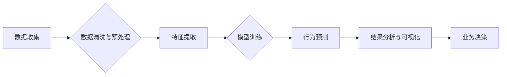

                 

## 如何进行有效的用户行为分析

> 关键词：用户行为分析，数据挖掘，机器学习，A/B测试，用户画像，网站分析，移动应用分析，转化率优化

## 1. 背景介绍

在当今数据爆炸的时代，用户行为分析已成为企业了解用户、优化产品和提升商业效益的关键手段。通过对用户在网站、移动应用等平台上的行为进行深入分析，企业可以洞察用户需求、识别潜在问题、制定精准的营销策略，最终实现业务目标。

用户行为分析涵盖了从用户访问网站、浏览页面、点击链接到购买商品、注册账号等一系列行为，这些行为数据蕴含着丰富的价值信息。通过科学地收集、存储、分析和解读这些数据，企业可以建立用户画像，了解用户偏好、习惯和痛点，从而为用户提供更个性化、更贴心的服务体验。

## 2. 核心概念与联系

用户行为分析的核心在于理解用户与产品之间的交互关系。它涉及到多个领域的概念和技术，包括数据挖掘、机器学习、统计分析、心理学等。

**用户行为分析流程图:**



**核心概念:**

* **用户行为数据:** 用户在使用产品时产生的所有数据，包括点击、浏览、停留时间、购买记录、评论反馈等。
* **用户画像:** 基于用户行为数据构建的用户特征描述，包括用户 demographics、兴趣爱好、行为模式等。
* **数据挖掘:** 从海量数据中发现隐藏的模式、趋势和规律。
* **机器学习:** 利用算法训练模型，预测用户行为和潜在需求。
* **A/B测试:** 通过比较不同版本的产品或功能，评估其对用户行为的影响。

## 3. 核心算法原理 & 具体操作步骤

### 3.1  算法原理概述

用户行为分析常用的算法包括：

* **聚类算法:** 将用户根据相似行为特征进行分组，构建用户画像。
* **关联规则挖掘:** 发现用户行为之间的关联关系，例如哪些产品经常一起购买。
* **预测模型:** 利用历史数据预测用户的未来行为，例如是否会购买某个产品。

### 3.2  算法步骤详解

**以聚类算法为例，其具体步骤如下:**

1. **数据收集:** 收集用户行为数据，例如用户浏览历史、购买记录、评论反馈等。
2. **数据预处理:** 清洗数据，处理缺失值、异常值等问题，并进行数据转换和编码。
3. **特征选择:** 选择与用户行为相关的特征，例如用户年龄、性别、购买频率、浏览时长等。
4. **聚类算法选择:** 根据数据特点和分析目标选择合适的聚类算法，例如K-means、层次聚类等。
5. **聚类模型训练:** 使用选定的聚类算法对用户数据进行聚类，得到不同的用户群体。
6. **聚类结果评估:** 使用聚类评估指标，例如Silhouette score、Dunn index等，评估聚类效果。
7. **用户画像构建:** 根据聚类结果，构建不同用户群体的画像，描述其特征和行为模式。

### 3.3  算法优缺点

**聚类算法的优缺点:**

* **优点:** 能够发现用户行为的潜在结构，构建用户画像，并根据用户群体进行个性化营销。
* **缺点:** 需要预先设定聚类数量，聚类结果可能受初始值和算法参数的影响。

### 3.4  算法应用领域

用户行为分析算法广泛应用于以下领域:

* **电商:** 用户画像构建、推荐系统、转化率优化。
* **社交媒体:** 用户兴趣分析、内容推荐、社区运营。
* **金融:** 风险评估、欺诈检测、个性化金融服务。
* **游戏:** 用户行为分析、游戏设计优化、付费转化率提升。

## 4. 数学模型和公式 & 详细讲解 & 举例说明

### 4.1  数学模型构建

用户行为分析中常用的数学模型包括：

* **贝叶斯网络:** 用于表示用户行为之间的概率关系，可以用于预测用户行为和识别潜在风险。
* **Markov链:** 用于描述用户在不同状态之间的转移概率，可以用于分析用户行为序列和预测用户未来行为。
* **回归模型:** 用于预测用户行为的连续值，例如用户购买金额或浏览时长。

### 4.2  公式推导过程

**以贝叶斯网络为例，其核心公式为：**

$$P(A|B) = \frac{P(B|A)P(A)}{P(B)}$$

其中：

* $P(A|B)$ 是在已知事件 B 发生的情况下，事件 A 发生的概率。
* $P(B|A)$ 是在已知事件 A 发生的情况下，事件 B 发生的概率。
* $P(A)$ 是事件 A 发生的概率。
* $P(B)$ 是事件 B 发生的概率。

**公式解释:**

贝叶斯公式描述了条件概率的计算方法，它表明事件 A 在已知事件 B 发生的情况下发生的概率，等于事件 B 在已知事件 A 发生的情况下发生的概率乘以事件 A 发生的概率，再除以事件 B 发生的概率。

### 4.3  案例分析与讲解

**举例说明:**

假设我们想要预测用户是否会购买某个产品，我们可以构建一个贝叶斯网络，其中节点包括用户浏览产品页面、加入购物车、点击购买按钮等事件。

通过收集用户行为数据，我们可以估计每个节点的概率分布以及节点之间的条件概率。例如，我们可以发现用户浏览产品页面后加入购物车的概率为 20%，而用户加入购物车后点击购买按钮的概率为 10%。

利用贝叶斯公式，我们可以计算出用户浏览产品页面后购买产品的概率，并根据这个概率进行预测。

## 5. 项目实践：代码实例和详细解释说明

### 5.1  开发环境搭建

用户行为分析项目可以使用 Python 语言进行开发，常用的库包括：

* **Pandas:** 用于数据处理和分析。
* **Scikit-learn:** 用于机器学习算法的实现。
* **Matplotlib:** 用于数据可视化。

### 5.2  源代码详细实现

**以下是一个简单的用户行为分析代码示例，用于聚类用户:**

```python
import pandas as pd
from sklearn.cluster import KMeans

# 加载用户行为数据
data = pd.read_csv('user_behavior.csv')

# 选择特征
features = ['age', 'gender', 'purchase_frequency', 'average_purchase_amount']
X = data[features]

# 训练聚类模型
kmeans = KMeans(n_clusters=3)
kmeans.fit(X)

# 获取聚类结果
labels = kmeans.labels_

# 将聚类结果添加到数据中
data['cluster'] = labels

# 保存结果
data.to_csv('user_behavior_clustered.csv', index=False)
```

### 5.3  代码解读与分析

**代码解读:**

1. 首先，我们使用 Pandas 库加载用户行为数据。
2. 然后，我们选择与用户行为相关的特征，例如年龄、性别、购买频率和平均购买金额。
3. 接下来，我们使用 Scikit-learn 库中的 KMeans 聚类算法训练模型，并指定聚类数量为 3。
4. 训练完成后，我们获取聚类结果，并将结果添加到数据中。
5. 最后，我们保存聚类结果到 CSV 文件中。

### 5.4  运行结果展示

运行代码后，我们将得到一个包含聚类结果的用户行为数据文件。我们可以使用 Matplotlib 库对聚类结果进行可视化，例如绘制用户群体的散点图，观察不同群体的特征差异。

## 6. 实际应用场景

用户行为分析在各个行业都有广泛的应用场景，例如：

### 6.1  电商行业

* **用户画像构建:** 通过分析用户的浏览历史、购买记录、评论反馈等数据，构建用户画像，了解用户的兴趣爱好、消费习惯和购买偏好。
* **个性化推荐:** 根据用户的兴趣爱好和购买历史，推荐个性化的商品和服务，提高用户体验和转化率。
* **转化率优化:** 分析用户在购物流程中的行为，识别转化率低的环节，并进行优化，例如改进产品页面设计、优化支付流程等。

### 6.2  社交媒体行业

* **用户兴趣分析:** 分析用户的点赞、评论、分享等行为，了解用户的兴趣爱好和关注领域。
* **内容推荐:** 根据用户的兴趣爱好和行为模式，推荐个性化的内容，例如文章、视频、图片等。
* **社区运营:** 分析用户之间的互动关系，识别活跃用户和潜在意见领袖，并进行针对性的运营策略。

### 6.3  金融行业

* **风险评估:** 分析用户的交易行为、账户活动等数据，识别潜在的风险用户，例如欺诈用户、高风险用户等。
* **欺诈检测:** 利用机器学习算法，分析用户的交易行为模式，识别异常交易行为，并进行预警和拦截。
* **个性化金融服务:** 根据用户的财务状况、风险偏好等数据，提供个性化的金融产品和服务，例如理财建议、贷款方案等。

### 6.4  未来应用展望

随着数据量的不断增长和人工智能技术的不断发展，用户行为分析将在未来发挥更加重要的作用。例如：

* **更精准的用户画像:** 利用更先进的机器学习算法，构建更精准的用户画像，包括用户的价值观、生活方式、心理特征等。
* **更个性化的产品和服务:** 基于用户行为分析，提供更个性化的产品和服务，例如定制化商品、个性化推荐、智能客服等。
* **更有效的营销策略:** 利用用户行为分析，制定更有效的营销策略，例如精准广告投放、个性化促销活动等。

## 7. 工具和资源推荐

### 7.1  学习资源推荐

* **书籍:**
    * 《数据挖掘：概念与技术》
    * 《机器学习》
    * 《用户行为分析》
* **在线课程:**
    * Coursera: 数据挖掘、机器学习、用户行为分析
    * edX: 数据科学、人工智能

### 7.2  开发工具推荐

* **Python:** 数据分析、机器学习
* **R:** 数据可视化、统计分析
* **Tableau:** 数据可视化
* **Power BI:** 数据可视化

### 7.3  相关论文推荐

* **User Behavior Analysis: A Survey**
* **A Survey on User Behavior Modeling and Prediction**
* **Deep Learning for User Behavior Prediction**

## 8. 总结：未来发展趋势与挑战

### 8.1  研究成果总结

用户行为分析已经取得了显著的成果，例如：

* 构建了更精准的用户画像，
* 开发了更有效的推荐系统和营销策略，
* 提高了用户体验和商业效益。

### 8.2  未来发展趋势

未来用户行为分析的发展趋势包括：

* **更深入的用户理解:** 利用更先进的机器学习算法，深入理解用户的需求、动机和行为模式。
* **更个性化的产品和服务:** 基于用户行为分析，提供更个性化的产品和服务，例如定制化商品、个性化推荐、智能客服等。
* **更有效的跨平台分析:** 将不同平台的用户行为数据整合分析，获得更全面的用户画像和行为洞察。

### 8.3  面临的挑战

用户行为分析也面临着一些挑战，例如：

* **数据隐私保护:** 用户行为数据包含敏感信息，需要妥善保护用户隐私。
* **数据质量问题:** 用户行为数据可能存在缺失值、异常值等问题，需要进行有效的数据清洗和预处理。
* **算法解释性:** 一些机器学习算法的决策过程难以解释，需要开发更可解释的算法模型。

### 8.4  研究展望

未来，用户行为分析的研究将继续深入，探索更有效的分析方法、更精准的用户理解和更个性化的产品和服务。


## 9. 附录：常见问题与解答

**常见问题:**

* **如何选择合适的聚类算法？**

**解答:**

选择合适的聚类算法需要根据数据的特点和分析目标进行选择。例如，对于离散数据，可以使用 K-means 算法；对于层次结构数据，可以使用层次聚类算法。

* **如何评估聚类结果？**

**解答:**

可以使用聚类评估指标，例如 Silhouette score、Dunn index 等，评估聚类效果。

* **如何处理用户行为数据中的缺失值？**

**解答:**

可以采用多种方法处理缺失值，例如删除缺失值、用平均值填充缺失值、使用机器学习算法进行预测填充等。


作者：禅与计算机程序设计艺术 / Zen and the Art of Computer Programming 
<end_of_turn>

