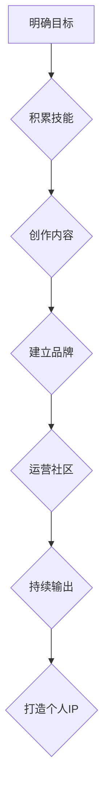

                 

## 技术演讲：从分享到个人IP打造

> 关键词：个人IP、技术分享、内容创作、品牌建设、社区运营

### 1. 背景介绍

在当今科技飞速发展的时代，技术人才的竞争日益激烈。仅仅拥有扎实的技术技能已经不足以立于不败之地，如何打造个人品牌，提升自身影响力，成为行业领袖，成为了技术人员共同追求的目标。个人IP（Intellectual Property，知识产权）的崛起，为技术人员提供了新的发展路径。

个人IP是指个人在特定领域积累的知识、技能、经验、影响力和声誉的综合体。它代表着个人独特的价值和竞争力，能够帮助个人获得更多机会、资源和认可。

### 2. 核心概念与联系

**2.1 个人IP的构成要素**

个人IP的构建是一个多维度的过程，需要综合考虑以下几个要素：

* **专业技能:** 这是个人IP的基础，需要不断学习和提升，保持技术领先。
* **内容创作:** 通过博客、文章、视频、音频等形式，分享自己的技术经验和见解，建立个人知识体系。
* **品牌建设:** 塑造独特的个人品牌形象，形成鲜明的个人风格和认知。
* **社区运营:** 积极参与技术社区，与同行交流学习，建立人脉关系，扩大影响力。

**2.2 个人IP的价值体现**

个人IP的价值体现在以下几个方面：

* **提升个人价值:** 个人IP能够提升个人在行业内的知名度和影响力，增强个人竞争力。
* **拓展职业发展:** 个人IP能够为个人打开更多职业发展机会，例如成为技术顾问、讲师、创业者等。
* **创造经济价值:** 个人IP能够被商业化，例如通过技术咨询、课程培训、书籍出版等方式获得收益。

**2.3 个人IP的构建流程**

个人IP的构建是一个循序渐进的过程，需要根据自身情况制定合理的策略。

### 3. 核心算法原理 & 具体操作步骤

**3.1 算法原理概述**

个人IP的构建可以看作是一个算法，其核心原理是：

* **输入:** 个人技能、知识、经验等资源
* **处理:** 内容创作、品牌建设、社区运营等操作
* **输出:** 个人品牌影响力、职业发展机会、经济价值等成果

**3.2 算法步骤详解**

1. **明确目标:** 首先要明确自己想要打造什么样的个人IP，目标领域是什么，想要达成的效果是什么。
2. **积累技能:** 持续学习和提升专业技能，保持技术领先，为内容创作和品牌建设打下坚实基础。
3. **创作内容:** 通过博客、文章、视频、音频等形式，分享自己的技术经验和见解，建立个人知识体系，吸引目标受众。
4. **建立品牌:** 塑造独特的个人品牌形象，形成鲜明的个人风格和认知，让个人IP更容易被记住和识别。
5. **运营社区:** 积极参与技术社区，与同行交流学习，建立人脉关系，扩大个人IP的影响力。
6. **持续输出:** 个人IP的构建是一个持续的过程，需要不断输出高质量的内容，保持活跃度，才能保持影响力。

**3.3 算法优缺点**

* **优点:** 能够提升个人价值、拓展职业发展、创造经济价值。
* **缺点:** 需要投入大量时间和精力，需要不断学习和提升，竞争激烈。

**3.4 算法应用领域**

个人IP的构建适用于所有技术领域，例如软件开发、数据科学、人工智能、云计算等。

### 4. 数学模型和公式 & 详细讲解 & 举例说明

**4.1 数学模型构建**

个人IP的构建可以抽象为一个数学模型，其中：

* **影响力 (I):** 个人IP的知名度和影响力，可以用一个数值来表示。
* **内容质量 (C):** 内容的深度、原创性和价值，可以用一个数值来表示。
* **品牌认知度 (B):** 个人品牌形象的清晰度和辨识度，可以用一个数值来表示。
* **社区活跃度 (A):** 个人在社区中的参与度和贡献度，可以用一个数值来表示。

**4.2 公式推导过程**

个人IP的影响力可以看作是以上四个因素的综合作用，可以用以下公式来表示：

$$I = f(C, B, A)$$

其中，f()是一个非线性函数，表示各个因素之间的相互影响关系。

**4.3 案例分析与讲解**

例如，一位技术博客作者，其内容质量较高 (C=8)，品牌认知度中等 (B=5)，社区活跃度较高 (A=7)。根据公式，我们可以推断出其个人IP的影响力 (I) 较高。

### 5. 项目实践：代码实例和详细解释说明

**5.1 开发环境搭建**

个人IP的构建需要选择合适的平台和工具，例如博客平台、社交媒体平台、视频网站等。

**5.2 源代码详细实现**

个人IP的构建是一个持续的过程，需要不断创作和输出内容。

**5.3 代码解读与分析**

**5.4 运行结果展示**

通过持续输出高质量的内容，建立个人品牌形象，参与社区运营，个人IP的影响力会逐渐提升。

### 6. 实际应用场景

**6.1 技术分享平台**

个人IP可以帮助技术人员在技术分享平台上建立个人品牌，吸引更多读者和关注者。

**6.2 职业发展平台**

个人IP可以帮助技术人员在职业发展平台上提升个人竞争力，获得更多职业机会。

**6.3 商业合作平台**

个人IP可以帮助技术人员在商业合作平台上获得更多合作机会，实现商业价值。

**6.4 未来应用展望**

随着互联网和人工智能技术的不断发展，个人IP的应用场景将会更加广泛，例如虚拟现实、增强现实、元宇宙等领域。

### 7. 工具和资源推荐

**7.1 学习资源推荐**

* **书籍:** 《技术写作》、《个人品牌营销》、《内容营销》等
* **网站:**  Hacker News、Stack Overflow、Medium等
* **课程:**  Coursera、Udemy等平台上的个人品牌和内容营销课程

**7.2 开发工具推荐**

* **博客平台:**  WordPress、Medium、Ghost等
* **社交媒体平台:**  Twitter、LinkedIn、GitHub等
* **视频网站:**  YouTube、Bilibili等

**7.3 相关论文推荐**

* **个人品牌研究:**  "The Impact of Personal Branding on Career Success"
* **内容营销研究:**  "Content Marketing: A Strategic Approach"

### 8. 总结：未来发展趋势与挑战

**8.1 研究成果总结**

个人IP的构建是一个不断演进的过程，需要不断学习和实践。

**8.2 未来发展趋势**

* **个性化定制:** 个人IP将更加个性化，满足不同用户的需求。
* **跨平台融合:** 个人IP将跨越平台边界，形成更加完整的生态系统。
* **人工智能赋能:** 人工智能将帮助个人IP的构建和运营更加高效。

**8.3 面临的挑战**

* **内容质量竞争:** 内容质量越来越重要，需要不断提升创作水平。
* **信息过载:** 信息爆炸时代，如何脱颖而出，吸引用户关注是一个挑战。
* **隐私安全:** 个人信息安全问题需要得到重视。

**8.4 研究展望**

未来，个人IP的研究将更加深入，探索其在不同领域的应用，以及如何更好地利用人工智能技术，提升个人IP的价值。

### 9. 附录：常见问题与解答

**9.1 如何打造个人IP？**

打造个人IP需要明确目标，积累技能，创作内容，建立品牌，运营社区，持续输出。

**9.2 个人IP的价值体现在哪里？**

个人IP的价值体现在提升个人价值、拓展职业发展、创造经济价值等方面。

**9.3 个人IP的构建需要投入多少时间和精力？**

个人IP的构建是一个持续的过程，需要投入大量时间和精力，具体时间和精力取决于个人目标和投入程度。

作者：禅与计算机程序设计艺术 / Zen and the Art of Computer Programming 
<end_of_turn>

