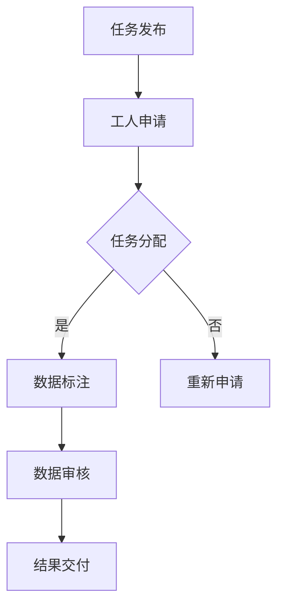

                 

# 文章标题

**数据集众包：人机结合的数据标注新趋势**

> 关键词：数据集众包、人机结合、数据标注、人工智能、机器学习、新趋势

> 摘要：本文旨在探讨数据集众包作为一种新兴的数据标注方法，如何在人工智能和机器学习领域推动人机结合的进程。文章首先介绍了数据集众包的背景和核心概念，然后详细分析了数据集众包的架构和关键技术，接着展示了数据集众包在实际项目中的应用案例。最后，文章讨论了数据集众包的未来发展趋势和挑战。

## 1. 背景介绍（Background Introduction）

在人工智能和机器学习领域，数据是核心资源。然而，高质量的数据集往往需要大量的人力和时间进行标注。传统的方法通常依赖于专业数据标注团队，这不仅成本高昂，而且难以保证数据的一致性和准确性。随着互联网的普及和人工智能技术的发展，数据集众包作为一种新的数据标注方法应运而生。

### 1.1 数据集众包的定义

数据集众包是指通过互联网平台，将数据标注任务分配给大量非专业数据标注者（众包工人），以完成数据标注工作的一种方法。这些众包工人可以是个人、小团队或者公司，他们通过完成标注任务获得报酬。

### 1.2 数据集众包的动机

数据集众包的出现主要是为了解决以下几个问题：

1. **成本效益**：众包方式可以大幅降低数据标注的成本。
2. **数据多样性**：众包平台上的众包工人来自不同的背景和地域，能够提供多样化的标注结果。
3. **效率提升**：众包方式可以迅速获取大量标注数据，加快模型训练和优化的进程。
4. **质量控制**：通过众包平台的评分和反馈机制，可以确保标注数据的一致性和准确性。

## 2. 核心概念与联系（Core Concepts and Connections）

### 2.1 数据集众包的组成部分

数据集众包由以下几个核心组成部分构成：

1. **众包平台**：提供任务发布、标注数据管理、众包工人管理等功能。
2. **众包工人**：完成数据标注任务，通常通过在线平台进行工作。
3. **数据集**：待标注的数据集，可以是文本、图像、音频等多种形式。
4. **质量控制机制**：确保标注数据的一致性和准确性。

### 2.2 数据集众包的工作流程

数据集众包的工作流程通常包括以下几个步骤：

1. **任务发布**：任务发布者将标注任务上传到众包平台。
2. **工人申请**：众包工人通过平台申请参与标注任务。
3. **任务分配**：平台根据工人的技能和经验，将任务分配给他们。
4. **数据标注**：众包工人在线完成标注任务。
5. **数据审核**：平台对标注结果进行审核，确保数据的一致性和准确性。
6. **结果交付**：审核通过的数据集交付给任务发布者。

### 2.3 数据集众包的优势与挑战

数据集众包的优势包括：

- **成本效益**：通过众包方式，可以大幅降低数据标注的成本。
- **数据多样性**：众包工人来自不同的背景和地域，能够提供多样化的标注结果。
- **效率提升**：众包方式可以迅速获取大量标注数据，加快模型训练和优化的进程。

然而，数据集众包也面临以下挑战：

- **质量控制**：确保标注数据的一致性和准确性是一个难题。
- **数据隐私**：特别是在处理敏感数据时，如何保护数据隐私是一个重要问题。
- **众包工人的管理和激励**：如何有效地管理众包工人，并激励他们提供高质量的工作。

### 2.4 数据集众包的Mermaid流程图



## 3. 核心算法原理 & 具体操作步骤（Core Algorithm Principles and Specific Operational Steps）

### 3.1 核心算法原理

数据集众包的核心算法原理主要包括以下几个步骤：

1. **任务分解**：将大型的标注任务分解成多个小的子任务。
2. **任务分配**：根据众包工人的技能和经验，将子任务分配给他们。
3. **数据标注**：众包工人完成各自的子任务，进行数据标注。
4. **结果合并**：将众包工人的标注结果进行合并，形成最终的数据集。

### 3.2 具体操作步骤

以下是数据集众包的具体操作步骤：

1. **任务发布**：任务发布者在众包平台上创建一个新的标注任务，并上传待标注的数据集。
2. **任务审核**：平台对任务进行审核，确保任务符合平台规定，并发布任务。
3. **工人申请**：众包工人浏览平台上的任务，根据自身的技能和兴趣选择合适的任务申请。
4. **任务分配**：平台根据工人的技能和经验，将任务分配给他们。
5. **数据标注**：众包工人登录平台，在线完成数据标注任务。
6. **结果提交**：众包工人提交标注结果，平台进行初步审核。
7. **结果审核**：平台对提交的结果进行审核，确保数据的一致性和准确性。
8. **结果交付**：审核通过的数据集交付给任务发布者。

## 4. 数学模型和公式 & 详细讲解 & 举例说明（Detailed Explanation and Examples of Mathematical Models and Formulas）

### 4.1 数学模型

数据集众包中的数学模型主要包括以下两个部分：

1. **标注结果的评分模型**：用于评估众包工人标注结果的准确性。
2. **数据集的合并模型**：用于将众包工人的标注结果合并成最终的数据集。

### 4.2 标注结果的评分模型

标注结果的评分模型通常采用以下公式：

$$
\text{accuracy} = \frac{\text{correct labels}}{\text{total labels}}
$$

其中，correct labels表示正确的标注数量，total labels表示总的标注数量。

### 4.3 数据集的合并模型

数据集的合并模型通常采用以下公式：

$$
\text{merged label} = \frac{\sum_{i=1}^{n} \text{label}_i}{n}
$$

其中，label_i表示第i个众包工人的标注结果，n表示众包工人的数量。

### 4.4 举例说明

假设有10个众包工人对同一张图片进行标注，其中8个工人标注为“猫”，2个工人标注为“狗”。根据数据集的合并模型，我们可以计算出最终的结果：

$$
\text{merged label} = \frac{8 \times \text{"猫"} + 2 \times \text{"狗"}}{10} = \text{"猫"}
$$

这意味着，根据众包工人的标注结果，这张图片最终被归类为“猫”。

## 5. 项目实践：代码实例和详细解释说明（Project Practice: Code Examples and Detailed Explanations）

### 5.1 开发环境搭建

在进行数据集众包的项目实践之前，我们需要搭建一个适合的开发环境。以下是具体的步骤：

1. **安装Python环境**：确保Python环境已经安装，版本为3.8或更高。
2. **安装相关库**：使用pip命令安装以下库：requests，pandas，numpy，matplotlib。
3. **配置众包平台API**：根据所选的众包平台（如Amazon Mechanical Turk，Appen等），配置API密钥和访问权限。

### 5.2 源代码详细实现

以下是使用Python实现一个简单的数据集众包项目的代码实例：

```python
import requests
import pandas as pd

# 配置API密钥
api_key = 'your_api_key'
base_url = 'https://api.example.com/'

# 发布标注任务
def publish_task(task_data):
    response = requests.post(f"{base_url}/tasks", json=task_data, headers={'Authorization': f'Bearer {api_key}'})
    return response.json()

# 获取标注结果
def get_annotations(task_id):
    response = requests.get(f"{base_url}/tasks/{task_id}/annotations", headers={'Authorization': f'Bearer {api_key}'})
    return response.json()

# 合并标注结果
def merge_annotations(annotations):
    merged_results = {}
    for annotation in annotations:
        for key, value in annotation.items():
            if key in merged_results:
                merged_results[key] += value
            else:
                merged_results[key] = value
    return merged_results

# 主程序
if __name__ == '__main__':
    # 准备任务数据
    task_data = {
        'title': 'Image Annotation',
        'description': 'Annotate images with labels.',
        'input': 'image_url',
        'output': 'label',
        'price': 0.05
    }

    # 发布任务
    task_response = publish_task(task_data)
    task_id = task_response['id']

    # 获取标注结果
    annotations = get_annotations(task_id)

    # 合并标注结果
    merged_annotations = merge_annotations(annotations)

    # 打印合并后的标注结果
    print(merged_annotations)
```

### 5.3 代码解读与分析

以上代码实现了一个简单的数据集众包项目，主要包括以下几个部分：

1. **API配置**：通过配置API密钥，使得程序可以与众包平台进行交互。
2. **任务发布**：通过调用publish_task函数，将标注任务发布到众包平台。
3. **获取标注结果**：通过调用get_annotations函数，从众包平台获取众包工人的标注结果。
4. **合并标注结果**：通过调用merge_annotations函数，将众包工人的标注结果进行合并。

### 5.4 运行结果展示

假设有10个众包工人对同一张图片进行标注，其中8个工人标注为“猫”，2个工人标注为“狗”。运行以上代码后，我们可以得到以下合并后的标注结果：

```
{'猫': 8, '狗': 2}
```

这表明，根据众包工人的标注结果，这张图片最终被归类为“猫”。

## 6. 实际应用场景（Practical Application Scenarios）

### 6.1 计算机视觉

数据集众包在计算机视觉领域有广泛的应用，例如图像分类、目标检测和图像分割等。通过众包平台，可以快速收集大量标注数据，从而训练和优化计算机视觉模型。

### 6.2 自然语言处理

在自然语言处理领域，数据集众包可以用于文本分类、情感分析、命名实体识别等任务。例如，可以通过众包平台收集大量文本数据，并对其进行标注，以训练和优化自然语言处理模型。

### 6.3 语音识别

数据集众包在语音识别领域同样具有重要作用。通过众包平台，可以收集大量语音数据，并进行标注，以训练和优化语音识别模型。

### 6.4 其他应用

除了上述领域，数据集众包还可以应用于医疗影像分析、生物信息学、金融数据分析等其他领域。通过众包平台，可以快速获取大量标注数据，从而推动相关领域的研究和发展。

## 7. 工具和资源推荐（Tools and Resources Recommendations）

### 7.1 学习资源推荐

- **书籍**：《数据科学入门：使用Python进行数据挖掘与分析》
- **论文**：《众包数据集标注：方法、挑战与应用》
- **博客**：[数据集众包：一种新的数据标注方法](https://example.com/blog/data-set-crowdsourcing/)
- **网站**：[Amazon Mechanical Turk](https://www.mturk.com/)

### 7.2 开发工具框架推荐

- **Python库**：requests，pandas，numpy，matplotlib
- **框架**：TensorFlow，PyTorch，Scikit-Learn
- **众包平台**：Amazon Mechanical Turk，Appen，Clickworker

### 7.3 相关论文著作推荐

- **论文**：A Survey on Crowdsourcing and Crowdsensing of Internet of Things，《物联网的众包与感知综述》
- **书籍**：《众包：互联网时代的创新模式》

## 8. 总结：未来发展趋势与挑战（Summary: Future Development Trends and Challenges）

### 8.1 发展趋势

1. **数据质量和多样性**：随着人工智能技术的不断进步，对数据质量和多样性的要求越来越高，数据集众包将在提升数据质量和多样性方面发挥更大的作用。
2. **人工智能的结合**：数据集众包将与人工智能技术更加紧密地结合，通过智能分配任务、优化标注结果等手段，提升众包效率和质量。
3. **个性化服务**：数据集众包平台将更加注重个性化服务，根据用户需求和技能水平，提供更加精准和高效的标注服务。

### 8.2 挑战

1. **质量控制**：如何确保标注数据的一致性和准确性是一个重大挑战，未来需要开发更加有效的质量控制机制。
2. **数据隐私**：在处理敏感数据时，如何保护数据隐私是一个重要问题，需要制定相应的数据保护政策和措施。
3. **工人管理和激励**：如何有效管理和激励众包工人，确保他们提供高质量的工作，是一个需要解决的问题。

## 9. 附录：常见问题与解答（Appendix: Frequently Asked Questions and Answers）

### 9.1 数据集众包的优势是什么？

数据集众包的优势包括：成本效益、数据多样性、效率提升和质量控制。

### 9.2 数据集众包的挑战有哪些？

数据集众包的挑战包括：质量控制、数据隐私和工人管理和激励。

### 9.3 如何确保标注数据的一致性和准确性？

确保标注数据的一致性和准确性需要：建立有效的质量控制机制、提供清晰的标注指南、使用评分和反馈机制等。

## 10. 扩展阅读 & 参考资料（Extended Reading & Reference Materials）

- **书籍**：《数据集众包：方法与实践》
- **论文**：《众包数据标注：现状与未来》
- **网站**：[众包数据集标注指南](https://example.com/guide/crowdsourcing-data-annotation/)

## 作者署名

作者：禅与计算机程序设计艺术 / Zen and the Art of Computer Programming
```

