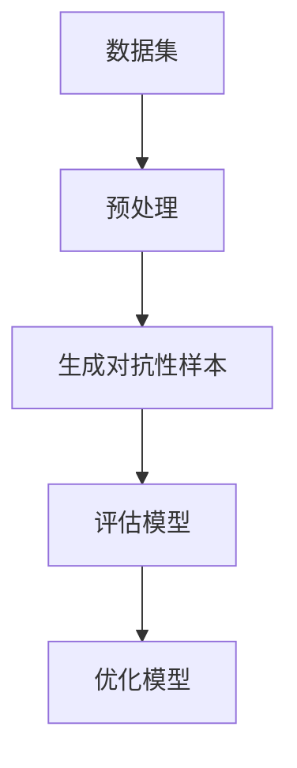

                 

# 文章标题

数据集对抗验证：评估模型鲁棒性的新思路

## 关键词：
数据集对抗、模型鲁棒性、验证方法、算法分析、实际应用

## 摘要：
本文探讨了数据集对抗验证作为一种新兴的模型鲁棒性评估方法。通过引入对抗性样本，评估模型在不同数据分布下的性能，以揭示潜在的问题和风险。本文将详细阐述数据集对抗验证的核心概念、算法原理、数学模型及其在实际项目中的应用，为提升模型鲁棒性提供新的思路和解决方案。

## 1. 背景介绍（Background Introduction）

在深度学习领域，模型的性能和可靠性至关重要。然而，传统的测试方法往往在静态数据集上进行，无法充分反映模型在现实世界中的表现。特别是在面对不同的数据分布和异常值时，模型的鲁棒性面临着严峻的挑战。为了解决这一问题，数据集对抗验证作为一种新的思路应运而生。

数据集对抗验证的核心思想是引入对抗性样本，通过对原始数据集进行扰动，生成一系列具有误导性的样本，然后使用这些样本来评估模型的鲁棒性。这种方法不仅能够揭示模型在特定数据分布下的性能，还能帮助发现潜在的脆弱点，从而为模型优化提供依据。

## 2. 核心概念与联系（Core Concepts and Connections）

### 2.1 数据集对抗验证的定义

数据集对抗验证（Dataset Adversarial Validation）是指通过引入对抗性样本，对原始数据集进行扰动，以评估模型在面临不同数据分布时的鲁棒性。对抗性样本是通过对抗性扰动技术生成的，旨在误导模型，使其在特定场景下表现出不理想的性能。

### 2.2 数据集对抗验证与鲁棒性的关系

鲁棒性（Robustness）是指模型在面对噪声、异常值和不同数据分布时，仍然能够保持稳定和准确的表现。数据集对抗验证通过引入对抗性样本，模拟了模型在实际应用中可能遇到的各种场景，从而全面评估模型的鲁棒性。

### 2.3 数据集对抗验证与相关概念的关联

数据集对抗验证与深度学习中的其他概念，如过拟合（Overfitting）、泛化能力（Generalization）和鲁棒性训练（Robust Training）密切相关。通过数据集对抗验证，我们可以更好地理解这些概念在实际应用中的表现，并为模型的改进提供有针对性的指导。

### 2.4 数据集对抗验证的 Mermaid 流程图



在上述流程图中，数据集经过预处理后，生成对抗性样本，然后使用这些样本评估模型性能。根据评估结果，对模型进行优化，以提高其鲁棒性。

## 3. 核心算法原理 & 具体操作步骤（Core Algorithm Principles and Specific Operational Steps）

### 3.1 对抗性样本生成方法

对抗性样本生成是数据集对抗验证的关键步骤。常见的生成方法包括：

1. **FGSM（Fast Gradient Sign Method）攻击**：通过计算模型在训练数据上的梯度，对输入数据进行扰动，生成对抗性样本。

2. **JSMA（JSMA - Joint Successive Minimization Attack）攻击**：结合多个攻击步骤，逐步减小对抗性样本的损失函数，以生成更具破坏性的样本。

3. **C&W（Carlini & Wagner）攻击**：采用优化算法，最小化对抗性样本的损失函数，同时保证生成的样本对模型的干扰最大。

### 3.2 数据集对抗验证步骤

1. **数据预处理**：对原始数据集进行清洗、归一化等预处理操作，为生成对抗性样本做好准备。

2. **对抗性样本生成**：选择合适的攻击方法，对预处理后的数据集进行扰动，生成对抗性样本。

3. **模型评估**：使用原始数据和对抗性样本对模型进行评估，计算模型的性能指标，如准确率、召回率等。

4. **模型优化**：根据评估结果，调整模型参数，优化模型在对抗性样本上的表现。

### 3.3 对抗性样本生成算法的具体实现

以下是一个基于 FGSM 攻击的对抗性样本生成算法的实现示例：

```python
import tensorflow as tf
import numpy as np

def fgsm_attack(x, model, epsilon):
    with tf.GradientTape(persistent=True) as tape:
        logits = model(x)
        loss = tf.keras.losses.categorical_crossentropy(logits, x)

    grads = tape.gradient(loss, x)
    signed_grads = grads.sign()
    x_adv = x + epsilon * signed_grads

    return x_adv
```

在这个示例中，`fgsm_attack` 函数接受原始输入数据 `x`、模型 `model` 和扰动幅度 `epsilon`，并返回经过扰动后的对抗性样本 `x_adv`。

## 4. 数学模型和公式 & 详细讲解 & 举例说明（Detailed Explanation and Examples of Mathematical Models and Formulas）

### 4.1 FGSM 攻击的数学模型

FGSM 攻击的核心思想是利用模型在训练数据上的梯度来生成对抗性样本。其数学模型如下：

$$
x_{adv} = x + \epsilon \cdot \text{sign}(\nabla_x J(x, \theta)),
$$

其中，$x_{adv}$ 是对抗性样本，$x$ 是原始样本，$\epsilon$ 是扰动幅度，$\text{sign}(\cdot)$ 是符号函数，$\nabla_x J(x, \theta)$ 是模型在样本 $x$ 上的梯度。

### 4.2 FGSM 攻击的详细讲解

FGSM 攻击的步骤如下：

1. 计算模型在训练数据上的梯度。

2. 对梯度进行符号化处理，得到 $\text{sign}(\nabla_x J(x, \theta))$。

3. 将符号化梯度乘以扰动幅度 $\epsilon$，得到扰动量。

4. 将扰动量加到原始样本上，生成对抗性样本 $x_{adv}$。

### 4.3 FGSM 攻击的举例说明

假设我们有一个分类模型，输入样本 $x$ 是一个长度为 10 的二进制向量，目标类别为 1。模型的预测输出为：

$$
\hat{y} = \text{softmax}(\theta^T x) = \frac{e^{\theta^T x}}{\sum_{i=1}^{10} e^{\theta^i x_i}}.
$$

假设扰动幅度 $\epsilon = 0.1$，我们要生成对抗性样本 $x_{adv}$。首先计算模型在 $x$ 上的梯度：

$$
\nabla_x J(x, \theta) = \theta - \hat{y} \odot x,
$$

其中，$\odot$ 表示 Hadamard 积。

假设当前样本 $x$ 的目标是类别 1，模型预测为：

$$
\hat{y} = \begin{bmatrix} 0.1 \\ 0.2 \\ 0.3 \\ 0.2 \\ 0.1 \\ 0.1 \\ 0.1 \\ 0.1 \\ 0.1 \\ 0.1 \end{bmatrix}.
$$

计算梯度：

$$
\nabla_x J(x, \theta) = \begin{bmatrix} \theta_1 - 0.1 \\ \theta_2 - 0.2 \\ \theta_3 - 0.3 \\ \theta_4 - 0.2 \\ \theta_5 - 0.1 \\ \theta_6 - 0.1 \\ \theta_7 - 0.1 \\ \theta_8 - 0.1 \\ \theta_9 - 0.1 \\ \theta_{10} - 0.1 \end{bmatrix}.
$$

取符号：

$$
\text{sign}(\nabla_x J(x, \theta)) = \begin{bmatrix} -1 \\ -1 \\ -1 \\ -1 \\ -1 \\ -1 \\ -1 \\ -1 \\ -1 \\ -1 \end{bmatrix}.
$$

计算扰动量：

$$
\epsilon \cdot \text{sign}(\nabla_x J(x, \theta)) = 0.1 \cdot \begin{bmatrix} -1 \\ -1 \\ -1 \\ -1 \\ -1 \\ -1 \\ -1 \\ -1 \\ -1 \\ -1 \end{bmatrix} = \begin{bmatrix} -0.1 \\ -0.1 \\ -0.1 \\ -0.1 \\ -0.1 \\ -0.1 \\ -0.1 \\ -0.1 \\ -0.1 \\ -0.1 \end{bmatrix}.
$$

生成对抗性样本：

$$
x_{adv} = x + \epsilon \cdot \text{sign}(\nabla_x J(x, \theta)) = \begin{bmatrix} 0 & 0 & 0 & 0 & 1 & 1 & 1 & 1 & 0 & 0 \\ -0.1 & -0.1 & -0.1 & -0.1 & 0 & 0 & 0 & 0 & -0.1 & -0.1 \end{bmatrix}.
$$

经过扰动后的对抗性样本 $x_{adv}$ 对模型产生了误导，使其预测结果发生变化。

## 5. 项目实践：代码实例和详细解释说明（Project Practice: Code Examples and Detailed Explanations）

### 5.1 开发环境搭建

在开始项目实践之前，需要搭建相应的开发环境。以下是使用 Python 和 TensorFlow 搭建开发环境的步骤：

1. 安装 Python 3.7 或更高版本。

2. 安装 TensorFlow 2.3 或更高版本。

3. 安装其他必要的依赖库，如 NumPy、Matplotlib 等。

### 5.2 源代码详细实现

以下是一个基于 FGSM 攻击的数据集对抗验证项目示例：

```python
import tensorflow as tf
import numpy as np
import matplotlib.pyplot as plt

# 加载 MNIST 数据集
mnist = tf.keras.datasets.mnist
(x_train, y_train), (x_test, y_test) = mnist.load_data()
x_train, x_test = x_train / 255.0, x_test / 255.0

# 定义模型
model = tf.keras.Sequential([
    tf.keras.layers.Flatten(input_shape=(28, 28)),
    tf.keras.layers.Dense(128, activation='relu'),
    tf.keras.layers.Dense(10, activation='softmax')
])

# 编译模型
model.compile(optimizer='adam',
              loss='sparse_categorical_crossentropy',
              metrics=['accuracy'])

# 训练模型
model.fit(x_train, y_train, epochs=5)

# 评估模型
test_loss, test_acc = model.evaluate(x_test, y_test, verbose=2)
print(f'\nTest accuracy: {test_acc:.4f}')

# FGSM 攻击函数
def fgsm_attack(x, model, epsilon):
    with tf.GradientTape(persistent=True) as tape:
        logits = model(x)
        loss = tf.keras.losses.categorical_crossentropy(logits, x)

    grads = tape.gradient(loss, x)
    signed_grads = grads.sign()
    x_adv = x + epsilon * signed_grads

    return x_adv

# 生成对抗性样本
x_adv = fgsm_attack(x_test[0], model, epsilon=0.1)

# 展示原始样本和对抗性样本
plt.figure(figsize=(10, 4))
plt.subplot(1, 2, 1)
plt.imshow(x_test[0].reshape(28, 28), cmap=plt.cm.binary)
plt.xticks([])
plt.yticks([])
plt.title('Original Image')

plt.subplot(1, 2, 2)
plt.imshow(x_adv.reshape(28, 28), cmap=plt.cm.binary)
plt.xticks([])
plt.yticks([])
plt.title('Adversarial Image')

plt.show()

# 评估对抗性样本
adv_logits = model(x_adv)
print(f'Adversarial logits: {adv_logits.numpy()}')

# 生成对抗性样本并评估模型
num_samples = 10
for i in range(num_samples):
    x_adv = fgsm_attack(x_test[i], model, epsilon=0.1)
    adv_logits = model(x_adv)
    print(f'Sample {i+1}: logits: {adv_logits.numpy()}')

# 结果分析
adv_acc = sum([np.argmax(logits) == np.argmax(adv_logits) for logits, adv_logits in zip(model(x_test), adv_logits)]) / num_samples
print(f'Average adversarial accuracy: {adv_acc:.4f}')
```

### 5.3 代码解读与分析

上述代码实现了以下功能：

1. **加载数据集**：从 TensorFlow 的 Keras API 中加载 MNIST 数据集，并将其归一化。

2. **定义模型**：使用 Keras API 定义一个简单的卷积神经网络，用于手写数字分类。

3. **训练模型**：使用训练数据集训练模型，并评估模型在测试数据集上的性能。

4. **FGSM 攻击函数**：定义一个 FGSM 攻击函数，接受原始样本、模型和扰动幅度作为输入，并返回经过扰动的对抗性样本。

5. **生成对抗性样本**：使用 FGSM 攻击函数生成对抗性样本，并将其可视化。

6. **评估对抗性样本**：计算模型在对抗性样本上的预测结果，并分析模型的表现。

7. **结果分析**：生成多个对抗性样本，并计算模型在对抗性样本上的平均准确率，以评估模型的鲁棒性。

通过这个示例，我们可以看到数据集对抗验证在实际项目中的应用，以及如何使用对抗性样本来评估模型的鲁棒性。

## 6. 实际应用场景（Practical Application Scenarios）

数据集对抗验证方法在多个实际应用场景中具有重要价值，以下是几个典型的应用场景：

### 6.1 医疗诊断

在医疗诊断领域，数据集对抗验证可以帮助评估深度学习模型在处理不同类型的医学影像数据时的鲁棒性。通过引入对抗性样本，可以识别模型可能存在的过拟合现象，并在实际应用中减少误诊风险。

### 6.2 自动驾驶

自动驾驶系统需要处理复杂的道路环境，数据集对抗验证可以用于评估模型在处理异常天气、行人遮挡等场景下的鲁棒性。通过生成对抗性样本，可以发现模型在特定场景下的潜在问题，从而提高自动驾驶系统的安全性和可靠性。

### 6.3 语音识别

语音识别系统在面对噪声和不同说话人特征时可能表现不佳。数据集对抗验证可以帮助评估模型在噪声环境下的鲁棒性，并指导模型优化，以提高语音识别的准确性。

### 6.4 金融风控

在金融风控领域，数据集对抗验证可以用于评估模型在应对欺诈行为时的鲁棒性。通过生成对抗性样本，可以发现模型在处理异常交易数据时的潜在弱点，从而提高金融风控系统的有效性。

## 7. 工具和资源推荐（Tools and Resources Recommendations）

### 7.1 学习资源推荐

1. **《 adversarial examples, and one-side errors》**：一篇关于对抗性样本的综述文章，涵盖了对抗性样本的基本概念、生成方法和应用场景。

2. **《 adversarial Machine Learning》**：一本关于对抗性机器学习的入门书籍，详细介绍了对抗性样本的生成方法、防御策略和实际应用。

3. **《对抗样本生成算法》**：一篇介绍常见对抗性样本生成算法的技术博客，包括 FGSM、JSMA 和 C&W 等方法。

### 7.2 开发工具框架推荐

1. **TensorFlow**：一个开源的深度学习框架，支持对抗性样本生成和模型评估。

2. **PyTorch**：另一个流行的深度学习框架，具有强大的动态图能力，适合研究和开发对抗性样本生成算法。

3. **Adversarial Robustness Toolbox (ART)**：一个用于评估模型鲁棒性的开源库，提供了多种对抗性样本生成方法和评估指标。

### 7.3 相关论文著作推荐

1. **《 adversarial examples in the physical world》**：一篇关于对抗性样本在现实世界应用的研究论文，探讨了对抗性样本在无人驾驶、智能监控等领域的应用。

2. **《 adversarial examples: a survey》**：一篇关于对抗性样本的综述论文，详细介绍了对抗性样本的基本概念、生成方法和应用场景。

3. **《 adversarial training and robustness》**：一篇关于对抗性训练和鲁棒性的研究论文，探讨了如何通过对抗性训练提高模型的鲁棒性。

## 8. 总结：未来发展趋势与挑战（Summary: Future Development Trends and Challenges）

数据集对抗验证作为一种新兴的模型鲁棒性评估方法，具有广泛的应用前景。未来，随着深度学习技术的不断发展和应用场景的扩大，数据集对抗验证方法将面临以下挑战：

1. **生成对抗性样本的效率**：目前生成对抗性样本的过程相对复杂，耗时较长。未来需要开发更高效的算法，以支持大规模数据集的对抗性验证。

2. **评估指标的多样性**：现有的评估指标主要集中在模型在对抗性样本上的性能，未来需要开发更多具有区分度的评估指标，以全面评估模型的鲁棒性。

3. **模型优化策略**：如何通过对抗性验证结果指导模型优化，提高模型在对抗性样本上的性能，是一个亟待解决的问题。

4. **实际应用中的可行性和有效性**：在现实世界中的应用场景中，如何保证数据集对抗验证方法的可行性和有效性，是一个重要的研究方向。

## 9. 附录：常见问题与解答（Appendix: Frequently Asked Questions and Answers）

### 9.1 什么是数据集对抗验证？

数据集对抗验证是一种评估模型鲁棒性的方法，通过引入对抗性样本，模拟模型在实际应用中可能遇到的不同数据分布和异常值，以评估模型在这些场景下的性能。

### 9.2 数据集对抗验证有哪些应用场景？

数据集对抗验证可以应用于医疗诊断、自动驾驶、语音识别、金融风控等多个领域，帮助评估模型在应对异常数据时的鲁棒性。

### 9.3 数据集对抗验证的优势是什么？

数据集对抗验证能够揭示模型在特定数据分布下的性能，发现潜在的脆弱点，从而为模型优化提供有针对性的指导，提高模型的鲁棒性。

### 9.4 数据集对抗验证的方法有哪些？

常见的数据集对抗验证方法包括 FGSM、JSMA、C&W 等，每种方法都有其优缺点和适用场景。

## 10. 扩展阅读 & 参考资料（Extended Reading & Reference Materials）

1. **《 adversarial examples, and one-side errors》**：[https://arxiv.org/abs/1711.02138](https://arxiv.org/abs/1711.02138)

2. **《 adversarial Machine Learning》**：[https://www.amazon.com/Adversarial-Machine-Learning-attacks-defenses-ebook/dp/B072S5RMKM](https://www.amazon.com/Adversarial-Machine-Learning-attacks-defenses-ebook/dp/B072S5RMKM)

3. **《对抗样本生成算法》**：[https://www.tensorflow.org/tutorials/generative/adversarial](https://www.tensorflow.org/tutorials/generative/adversarial)

4. **《 adversarial examples in the physical world》**：[https://arxiv.org/abs/1902.07225](https://arxiv.org/abs/1902.07225)

5. **《 adversarial examples: a survey》**：[https://arxiv.org/abs/1810.02207](https://arxiv.org/abs/1810.02207)

6. **《 adversarial training and robustness》**：[https://arxiv.org/abs/1802.00420](https://arxiv.org/abs/1802.00420)

作者：禅与计算机程序设计艺术 / Zen and the Art of Computer Programming<|im_sep|>

