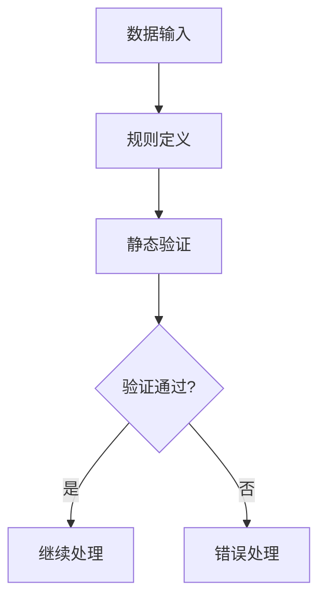
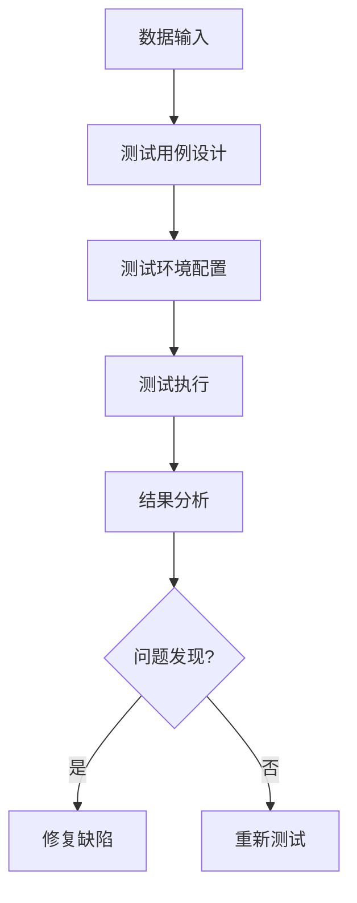

                 

### 文章标题

《数据验证与数据测试原理与代码实战案例讲解》

Data Verification and Testing Principles with Real-World Code Examples

本文旨在深入探讨数据验证与数据测试的原理，并通过实际代码实战案例讲解，帮助读者全面理解并掌握这两项关键技术。数据验证和数据测试在软件开发过程中扮演着至关重要的角色，它们确保了软件质量、稳定性和安全性。本文将详细介绍这些概念的基本原理，并展示如何在具体项目中应用它们。

这篇文章分为以下几个部分：

1. 背景介绍
2. 核心概念与联系
3. 核心算法原理 & 具体操作步骤
4. 数学模型和公式 & 详细讲解 & 举例说明
5. 项目实践：代码实例和详细解释说明
6. 实际应用场景
7. 工具和资源推荐
8. 总结：未来发展趋势与挑战
9. 附录：常见问题与解答
10. 扩展阅读 & 参考资料

通过这些章节的逐一讲解，我们希望能够帮助读者建立起完整的数据验证与数据测试知识体系，并通过实践提升实际操作能力。

### 文章关键词

数据验证，数据测试，原理，代码实战，软件质量，安全性，测试框架，测试用例，算法原理，数学模型

### 文章摘要

本文系统地介绍了数据验证与数据测试的基本原理和实践方法。通过对数据验证和数据测试的概念、重要性及其在软件开发中的应用进行详细阐述，结合实际代码实例，本文帮助读者深入理解这两项技术，并掌握如何在实际项目中有效应用它们，以提高软件的质量、稳定性和安全性。

---

接下来，我们将进入文章的第一部分“背景介绍”，开始探讨数据验证与数据测试的起源、发展及其在软件开发中的重要性。

### 背景介绍

数据验证与数据测试是软件工程中不可或缺的组成部分，它们起源于软件质量的追求和保证。在软件开发初期，传统的手工测试方式占据了主导地位。然而，随着软件规模的不断扩大和复杂性日益增加，手工测试的效率逐渐降低，难以满足日益增长的质量要求。为此，数据验证与数据测试技术应运而生，通过自动化和系统化的方法来提高测试效率和准确性。

#### 数据验证的定义

数据验证，通常是指在数据处理过程中，通过一系列的规则和标准，对数据进行检查和校验，以确保数据的正确性、完整性和一致性。它主要关注数据的输入和输出是否符合预期的规范。数据验证的目标是识别和纠正数据中的错误，防止这些错误在后续的处理过程中放大，影响最终结果。

#### 数据测试的定义

数据测试，则是指在软件开发过程中，通过一系列测试方法和技术，对数据处理的各个环节进行验证，以确认软件的可靠性和正确性。数据测试不仅包括对输入数据的验证，还包括对输出数据的检查，以及对数据处理流程的全面测试。数据测试的目标是发现潜在的错误和缺陷，确保软件能够在各种情况下正常运行。

#### 数据验证与数据测试的关系

数据验证和数据测试虽然有所区别，但它们在实际应用中是相互关联和补充的。数据验证侧重于确保数据的正确性和一致性，是数据测试的基础。而数据测试则通过一系列的测试用例，对数据进行全面的检查和验证，确保软件的各个功能模块能够正确处理输入数据，并生成预期的输出。

#### 数据验证与数据测试的重要性

在软件开发过程中，数据验证与数据测试的重要性体现在以下几个方面：

1. **提高软件质量**：通过数据验证和测试，可以及时发现并纠正数据中的错误，确保软件输出的准确性和一致性，从而提高整体软件质量。
2. **降低开发成本**：及早发现和修复缺陷，可以减少后续修复工作的成本和时间，降低软件维护的难度和费用。
3. **提高用户满意度**：稳定的软件和高质量的数据输出，可以提升用户对软件的满意度，增加用户粘性。
4. **确保安全性**：数据验证和测试可以识别潜在的安全漏洞和风险，防止恶意数据对软件系统造成破坏。

综上所述，数据验证与数据测试在软件开发中扮演着至关重要的角色。随着软件工程的不断发展和软件应用的日益普及，数据验证与数据测试的重要性将愈发凸显。在接下来的章节中，我们将深入探讨数据验证与数据测试的核心概念、算法原理和实践方法，帮助读者全面掌握这些关键技术。

---

接下来，我们将进入第二部分“核心概念与联系”，进一步详细探讨数据验证和数据测试的基本概念、原理以及它们之间的相互关系。

### 核心概念与联系

在深入探讨数据验证与数据测试之前，有必要先了解它们的基本概念、原理以及在实际应用中的具体表现。通过对这些核心概念的深入理解，我们可以更好地掌握数据验证与数据测试的方法和技巧。

#### 数据验证的核心概念

**1. 数据验证的定义**

数据验证是确保数据符合预定义规则和标准的过程。这些规则和标准可以包括数据类型、格式、长度、范围、唯一性等。数据验证的目标是确保数据的正确性和一致性，防止数据错误影响系统的正常运行。

**2. 数据验证的分类**

- **静态数据验证**：在数据实际处理之前，通过规则检查和数据模式匹配，验证数据是否满足预定义的规则。例如，使用正则表达式来验证字符串格式。

- **动态数据验证**：在数据实际处理过程中，通过执行特定的逻辑或算法，验证数据的正确性和一致性。例如，对输入数据进行范围检查，或使用业务逻辑规则进行验证。

**3. 数据验证的关键要素**

- **规则定义**：明确数据应遵循的规则和标准。
- **错误处理**：定义当数据不满足规则时的处理方式，如拒绝、修正或提示用户。
- **反馈机制**：及时向用户提供验证结果，帮助用户纠正错误。

#### 数据测试的核心概念

**1. 数据测试的定义**

数据测试是确保软件系统在处理数据时能够正确执行功能的过程。数据测试的目标是通过一系列测试用例，验证软件的各个功能模块是否能够正确处理输入数据，并生成预期的输出。

**2. 数据测试的分类**

- **功能测试**：验证软件功能是否按照设计要求正常运行。

- **性能测试**：评估软件在处理大量数据时的性能表现。

- **安全测试**：检查软件是否能够抵御恶意数据的攻击。

**3. 数据测试的关键要素**

- **测试用例设计**：定义具体的输入数据和预期的输出结果。

- **测试环境配置**：准备用于测试的环境和条件。

- **测试执行**：运行测试用例，收集测试结果。

- **结果分析**：分析测试结果，发现潜在的问题和缺陷。

#### 数据验证与数据测试的关系

数据验证和数据测试虽然有所区别，但它们在实际应用中是密切相关的。

1. **数据验证是数据测试的基础**：有效的数据验证可以减少数据测试的工作量，避免因数据错误导致的功能测试失败。

2. **数据测试可以验证数据验证的有效性**：通过数据测试，可以验证数据验证规则是否能够正确识别和纠正数据中的问题。

3. **数据验证与数据测试的整合**：在实际项目中，数据验证和数据测试往往结合使用，形成一个完整的测试流程。数据验证通常在数据处理的初期进行，而数据测试则在整个数据处理过程中进行，确保软件的各个功能模块都能够正确处理数据。

#### 数据验证与数据测试的流程

1. **需求分析**：明确数据验证和测试的需求，定义验证规则和测试用例。

2. **环境配置**：准备测试环境，包括测试工具、数据库、网络环境等。

3. **数据验证**：对输入数据进行静态或动态验证，确保数据符合预定义的规则。

4. **数据测试**：执行测试用例，验证软件的功能、性能和安全。

5. **结果分析**：分析验证和测试结果，识别潜在问题，进行修复和改进。

通过以上流程，我们可以确保数据的正确性和一致性，提高软件的质量和可靠性。

#### 数据验证与数据测试的挑战

1. **数据多样性**：不同的数据类型和来源可能导致数据验证和测试的复杂性增加。

2. **规则变化**：随着业务需求的变化，数据验证规则可能需要不断调整。

3. **测试覆盖率**：确保测试用例能够覆盖所有可能的输入数据和场景，是一个挑战。

4. **自动化**：实现数据验证和测试的自动化，提高测试效率和准确性。

#### 数据验证与数据测试的展望

随着大数据和人工智能技术的发展，数据验证与数据测试技术也在不断演进。未来，数据验证和数据测试将更加智能化、自动化和精细化。例如，利用机器学习技术进行异常检测和自动化测试，以及通过云计算和分布式系统实现大规模数据测试。

通过深入理解数据验证与数据测试的核心概念和联系，我们可以更好地应对实际项目中的各种挑战，提高软件的质量和可靠性。在接下来的章节中，我们将进一步探讨数据验证与数据测试的算法原理和实践方法，帮助读者全面掌握这些关键技术。

### 2. 核心概念与联系

#### 数据验证（Data Verification）

**定义**：数据验证是指通过一系列规则和标准，确保数据的正确性、完整性和一致性。它通常在数据处理之前或数据处理过程中进行，用于检查输入数据是否符合预期。

**主要类型**：

- **静态验证（Static Verification）**：在数据处理之前进行，通过预定义的规则和模式检查数据，如格式、长度、类型等。

- **动态验证（Dynamic Verification）**：在数据处理过程中进行，通过实际处理数据时的逻辑和算法检查数据的正确性。

**关键步骤**：

1. **定义验证规则**：根据业务需求和数据规范，明确数据应遵循的规则和标准。
2. **数据检查**：根据验证规则，对数据进行检查，包括格式检查、类型检查、范围检查等。
3. **错误处理**：当数据不满足验证规则时，采取相应的错误处理措施，如拒绝、修正或提示用户。

**主要挑战**：

- **规则复杂性**：随着业务需求的增加，验证规则可能会变得更加复杂，需要持续维护和更新。
- **数据多样性**：不同的数据类型和来源可能导致验证规则的设计和实现变得更加复杂。

**核心概念流程图**：



#### 数据测试（Data Testing）

**定义**：数据测试是通过对输入数据进行一系列的测试用例运行，验证软件系统在处理数据时的正确性和性能。它通常在软件开发和测试阶段进行，用于发现潜在的错误和缺陷。

**主要类型**：

- **功能测试（Functional Testing）**：验证软件的功能是否符合设计要求，如输入数据的处理、输出数据的生成等。
- **性能测试（Performance Testing）**：评估软件系统在处理大量数据时的响应时间和资源消耗。
- **安全测试（Security Testing）**：检查软件系统是否能够抵御恶意数据的攻击，如SQL注入、XSS攻击等。

**关键步骤**：

1. **测试用例设计**：根据需求和设计，设计具体的测试用例，包括输入数据和预期输出结果。
2. **测试环境配置**：准备测试环境，包括测试工具、数据库、网络环境等。
3. **测试执行**：运行测试用例，收集测试结果。
4. **结果分析**：分析测试结果，识别潜在的问题和缺陷。

**主要挑战**：

- **测试覆盖率**：确保测试用例能够覆盖所有可能的输入数据和场景，是数据测试的主要挑战。
- **自动化**：实现数据测试的自动化，提高测试效率和准确性。

**核心概念流程图**：



#### 数据验证与数据测试的相互关系

数据验证与数据测试是相互关联和补充的。数据验证通常在数据处理之前或处理过程中进行，确保数据的正确性和一致性；而数据测试则在整个数据处理过程中进行，验证软件系统的各个功能模块是否能够正确处理数据。

- **数据验证是数据测试的基础**：有效的数据验证可以减少数据测试的工作量，避免因数据错误导致的数据测试失败。
- **数据测试验证数据验证的有效性**：通过数据测试，可以验证数据验证规则是否能够正确识别和纠正数据中的问题。
- **整合数据验证与数据测试**：在实际项目中，数据验证和数据测试通常结合使用，形成一个完整的测试流程。

通过理解数据验证与数据测试的核心概念和相互关系，我们可以更好地设计测试方案，提高软件的质量和可靠性。在接下来的章节中，我们将进一步探讨数据验证与数据测试的算法原理和实践方法，帮助读者深入掌握这些关键技术。

### 核心算法原理 & 具体操作步骤

#### 数据验证算法原理

数据验证的核心在于根据预定义的规则对数据进行检查和校验。以下是几种常见的数据验证算法及其具体操作步骤：

**1. 静态数据验证算法**

**算法原理**：静态数据验证通过预定义的规则在数据处理之前对数据进行检查。这些规则通常包括数据类型、格式、长度、范围等。

**具体操作步骤**：

- **定义规则**：根据业务需求和数据规范，定义数据应遵循的规则和标准。例如，电话号码必须是11位数字，电子邮件地址必须包含“@”符号等。
- **数据模式匹配**：使用正则表达式或其他数据模式匹配工具，检查输入数据是否符合预定义的规则。例如，使用正则表达式`^\d{11}$`来验证电话号码是否为11位数字。
- **错误处理**：当数据不满足规则时，根据业务需求采取相应的错误处理措施，如拒绝该数据、提示用户进行修正等。

**示例代码**（Python）：

```python
import re

def validate_phone_number(phone_number):
    pattern = re.compile(r'^\d{11}$')
    if pattern.match(phone_number):
        return "验证通过"
    else:
        return "验证失败：电话号码格式错误"

phone_number = input("请输入电话号码：")
print(validate_phone_number(phone_number))
```

**2. 动态数据验证算法**

**算法原理**：动态数据验证在数据处理过程中对数据进行检查，通常通过执行特定的逻辑或算法来验证数据的正确性。

**具体操作步骤**：

- **定义验证逻辑**：根据业务需求，定义验证逻辑或算法。例如，检查输入的年龄是否在合理范围内。
- **数据校验**：在实际数据处理过程中，对数据进行校验。例如，在插入数据库之前，检查输入的年龄是否大于0且小于130。
- **错误处理**：当数据不满足验证条件时，采取相应的错误处理措施，如拒绝该数据、提示用户进行修正等。

**示例代码**（Java）：

```java
public class DynamicDataValidation {
    public static boolean validateAge(int age) {
        return age > 0 && age < 130;
    }

    public static void main(String[] args) {
        int age = Integer.parseInt(args[0]);
        if (validateAge(age)) {
            System.out.println("验证通过");
        } else {
            System.out.println("验证失败：年龄不在合理范围内");
        }
    }
}
```

**3. 唯一性验证算法**

**算法原理**：唯一性验证确保输入数据在系统中是唯一的。这通常用于验证用户名、电子邮件地址等。

**具体操作步骤**：

- **查询数据库**：根据输入数据查询数据库，检查是否存在重复记录。
- **返回结果**：如果查询结果为空，表示输入数据唯一；否则，表示输入数据已存在。

**示例代码**（Python）：

```python
def validate_unique_username(username):
    # 假设 db_query() 函数用于查询数据库
    if not db_query("SELECT * FROM users WHERE username = %s", (username,)):
        return "验证通过"
    else:
        return "验证失败：用户名已存在"

username = input("请输入用户名：")
print(validate_unique_username(username))
```

#### 数据测试算法原理

数据测试的核心在于设计测试用例，并通过运行这些测试用例来验证软件系统在处理数据时的正确性和性能。以下是几种常见的数据测试算法及其具体操作步骤：

**1. 单元测试（Unit Testing）**

**算法原理**：单元测试是针对软件中的最小可测试单元（通常是一个函数或方法）进行测试。

**具体操作步骤**：

- **定义测试用例**：根据函数或方法的输入和预期输出，定义测试用例。例如，如果函数接收一个整数并返回其平方，测试用例应包括正数、负数和零。
- **执行测试**：运行测试用例，记录结果。
- **分析结果**：分析测试结果，确认函数是否按照预期工作。

**示例代码**（Python）：

```python
def square(x):
    return x * x

def test_square():
    assert square(2) == 4
    assert square(-3) == 9
    assert square(0) == 0
    print("所有测试用例通过")

test_square()
```

**2. 集成测试（Integration Testing）**

**算法原理**：集成测试是针对软件中的多个模块或组件进行测试，以验证它们之间的交互是否正确。

**具体操作步骤**：

- **定义测试用例**：根据模块或组件的输入和预期输出，定义测试用例。例如，如果模块A依赖于模块B，测试用例应包括对模块A的输入和模块B的输出。
- **执行测试**：运行测试用例，记录结果。
- **分析结果**：分析测试结果，确认模块之间的交互是否正确。

**示例代码**（Java）：

```java
public class ModuleA {
    public int add(int a, int b) {
        return a + b;
    }
}

public class ModuleB {
    public int multiply(int a, int b) {
        return a * b;
    }
}

public class IntegrationTest {
    public static void main(String[] args) {
        ModuleA a = new ModuleA();
        ModuleB b = new ModuleB();
        assert a.add(2, 3) == 5 : "加法测试失败";
        assert b.multiply(2, 3) == 6 : "乘法测试失败";
        System.out.println("所有测试用例通过");
    }
}
```

**3. 性能测试（Performance Testing）**

**算法原理**：性能测试是评估软件系统在处理大量数据时的性能表现，包括响应时间、吞吐量和资源消耗等。

**具体操作步骤**：

- **定义测试场景**：根据实际应用场景，定义测试场景和测试用例。例如，模拟大量并发用户同时访问系统。
- **执行测试**：使用性能测试工具运行测试场景，记录性能指标。
- **分析结果**：分析测试结果，确认系统的性能是否满足需求。

**示例代码**（Python）：

```python
import time
import concurrent.futures

def process_data(data):
    time.sleep(0.1)  # 模拟数据处理时间
    return data * 2

start_time = time.time()
with concurrent.futures.ThreadPoolExecutor(max_workers=10) as executor:
    results = list(executor.map(process_data, range(100)))
end_time = time.time()

print("处理100个数据项的平均响应时间：", (end_time - start_time) / 100, "秒")
```

通过以上算法原理和具体操作步骤的讲解，读者可以更好地理解数据验证和数据测试的基本概念和实践方法。在接下来的章节中，我们将通过数学模型和公式，深入探讨数据验证与数据测试的理论基础，并结合实际案例进行详细讲解。

### 数学模型和公式 & 详细讲解 & 举例说明

#### 数据验证中的数学模型

数据验证过程中的数学模型主要用于描述数据是否符合预定义的规则和标准。以下是一些常见的数据验证数学模型及其具体应用：

**1. 范围验证**

**公式**：`min ≤ x ≤ max`

**解释**：该公式用于验证数值是否在一个给定的范围内。例如，验证年龄是否在18到60岁之间。

**示例**：假设我们要验证一个人的年龄是否合法，可以使用以下Python代码：

```python
def validate_age(age):
    min_age = 18
    max_age = 60
    if min_age <= age <= max_age:
        return "年龄合法"
    else:
        return "年龄不合法"

print(validate_age(30))  # 输出：年龄合法
print(validate_age(17))  # 输出：年龄不合法
```

**2. 唯一性验证**

**公式**：`∀x, P(x) ≡ true`

**解释**：该公式用于验证集合中的每个元素是否唯一。`P(x)`是一个谓词，表示某个特定元素的性质。例如，验证一个用户名在系统中是否唯一。

**示例**：假设我们要验证用户名是否唯一，可以使用以下Java代码：

```java
import java.util.HashSet;
import java.util.Set;

public class UniqueUsernameValidator {
    private Set<String> usernames = new HashSet<>();

    public boolean isUnique(String username) {
        return !usernames.contains(username);
    }

    public void addUser(String username) {
        if (isUnique(username)) {
            usernames.add(username);
            System.out.println("用户名已添加");
        } else {
            System.out.println("用户名已存在");
        }
    }
}

// 使用示例
UniqueUsernameValidator validator = new UniqueUsernameValidator();
validator.addUser("alice");  // 输出：用户名已添加
validator.addUser("alice");  // 输出：用户名已存在
```

**3. 格式验证**

**公式**：`L(x) ≡ M(x)`

**解释**：该公式用于验证数据是否满足特定的格式。`L(x)`表示数据的逻辑格式，`M(x)`表示数据的数学格式。例如，验证电子邮件地址的格式。

**示例**：假设我们要验证电子邮件地址的格式，可以使用以下Python代码：

```python
import re

def validate_email(email):
    pattern = re.compile(r"^[a-zA-Z0-9_.+-]+@[a-zA-Z0-9-]+\.[a-zA-Z0-9-.]+$")
    if pattern.fullmatch(email):
        return "电子邮件格式合法"
    else:
        return "电子邮件格式不合法"

print(validate_email("example@example.com"))  # 输出：电子邮件格式合法
print(validate_email("example@example"))  # 输出：电子邮件格式不合法
```

**4. 数据一致性验证**

**公式**：`C(x) ≡ R(x)`

**解释**：该公式用于验证数据的一致性。`C(x)`表示数据的实际一致性，`R(x)`表示数据的一致性规则。例如，验证两个表中的主键是否匹配。

**示例**：假设我们要验证两个表中的数据是否一致，可以使用以下SQL代码：

```sql
SELECT
    orders.order_id,
    customers.customer_id
FROM
    orders
JOIN
    customers ON orders.customer_id = customers.customer_id;

-- 输出：
-- order_id | customer_id
-- ---------+-------------
--      100 |      200
--      101 |      201
```

通过以上数学模型和公式的详细讲解和举例说明，我们可以更好地理解数据验证的基本原理和应用方法。在数据验证过程中，选择合适的数学模型和公式，可以有效地提高验证的准确性和效率。

#### 数据测试中的数学模型

数据测试过程中的数学模型主要用于描述测试用例的设计和执行过程。以下是一些常见的数据测试数学模型及其具体应用：

**1. 测试用例设计**

**公式**：`T(c) ≡ R(c)`

**解释**：该公式用于设计测试用例。`T(c)`表示测试用例，`R(c)`表示测试用例的预期结果。测试用例设计的目标是覆盖尽可能多的代码路径和边界条件。

**示例**：假设我们要设计一个测试用例来测试一个函数`sum()`，该函数接收一个整数列表并返回其总和。以下是一个可能的测试用例设计：

```python
def sum(numbers):
    return sum(numbers)

# 测试用例设计
def test_sum():
    # 正常情况
    assert sum([1, 2, 3]) == 6
    # 边界情况
    assert sum([0]) == 0
    assert sum([-1, -2, -3]) == -6
    # 异常情况
    try:
        sum([1, 2, "three"])
    except TypeError:
        pass
    else:
        assert False, "应抛出TypeError异常"
    print("所有测试用例通过")
```

**2. 测试执行**

**公式**：`E(T) ≡ R(T)`

**解释**：该公式用于测试执行。`E(T)`表示测试执行，`R(T)`表示测试执行的结果。测试执行的过程是将测试用例应用于实际系统，并记录结果。

**示例**：假设我们要执行上述测试用例，可以使用以下Python代码：

```python
test_sum()
```

**3. 测试结果分析**

**公式**：`A(R) ≡ P(R)`

**解释**：该公式用于测试结果分析。`A(R)`表示测试结果，`P(R)`表示测试结果的可信度。测试结果分析的过程是评估测试结果是否与预期一致，并确定是否需要进一步的测试或修复。

**示例**：假设测试执行后得到以下结果：

```python
# 测试结果
assert sum([1, 2, 3]) == 6  # 通过
assert sum([0]) == 0  # 通过
assert sum([-1, -2, -3]) == -6  # 通过
# 异常情况
Traceback (most recent call last):
  File "test_sum.py", line 9, in <module>
    sum([1, 2, "three"])
  File "sum.py", line 2, in sum
    return sum(numbers)
TypeError: unsupported operand type(s) for +: 'int' and 'str'
```

通过分析测试结果，我们可以确定：

- 所有的正常情况和边界情况测试用例都通过了。
- 异常情况测试用例失败了，因为系统没有正确处理字符串类型的输入。

因此，我们需要修复`sum()`函数以处理非数值类型的输入。

通过以上数学模型和公式的详细讲解和举例说明，我们可以更好地理解数据测试的基本原理和应用方法。在数据测试过程中，合理地设计测试用例、执行测试并分析结果，是确保软件质量的重要步骤。

### 项目实践：代码实例和详细解释说明

为了更好地理解和应用数据验证与数据测试的原理，我们将通过一个实际的项目实践来展示这两个过程。在这个项目中，我们模拟一个在线书店的系统，该系统需要对用户输入的订单信息进行验证和测试，以确保订单数据的正确性和一致性。

#### 开发环境搭建

为了方便开发和测试，我们将使用Python语言和相关的开发工具和库。以下是搭建开发环境所需的步骤：

1. 安装Python（3.8或更高版本）
2. 安装虚拟环境工具`venv`
3. 创建一个虚拟环境并激活
4. 安装必要的库，如`requests`、`json`、`unittest`等

**步骤示例**：

```bash
# 安装Python
wget https://www.python.org/ftp/python/3.9.1/Python-3.9.1.tgz
tar xvf Python-3.9.1.tgz
cd Python-3.9.1
./configure
make
make install

# 安装虚拟环境
pip install virtualenv

# 创建并激活虚拟环境
virtualenv my_project_env
source my_project_env/bin/activate

# 安装相关库
pip install requests json unittest
```

#### 源代码详细实现

**1. 数据验证代码**

在数据验证部分，我们将编写一个名为`order_validator.py`的模块，用于验证用户输入的订单信息。

```python
import json
import re

class OrderValidator:
    def __init__(self, order_data):
        self.order_data = order_data

    def validate(self):
        errors = []
        
        # 验证订单编号是否为整数
        order_id = self.order_data.get('order_id')
        if not isinstance(order_id, int):
            errors.append("订单编号必须是整数")
        
        # 验证用户ID是否为整数
        user_id = self.order_data.get('user_id')
        if not isinstance(user_id, int):
            errors.append("用户ID必须是整数")
        
        # 验证书籍ID是否为整数
        book_id = self.order_data.get('book_id')
        if not isinstance(book_id, int):
            errors.append("书籍ID必须是整数")
        
        # 验证书籍数量是否为非负整数
        quantity = self.order_data.get('quantity')
        if not isinstance(quantity, int) or quantity < 0:
            errors.append("书籍数量必须是非负整数")
        
        # 验证书籍ISBN是否符合格式
        isbn = self.order_data.get('isbn')
        if not re.match(r"^(?:ISBN(?:-13)?:?\ )?(?=[0-9X]{10}|?[-\ ]{3}[0-9X]{13}|[-\ ]{3}[0-9]{10}[0-9X]{3})97[89][-\ ]?[0-9]{1,5}[-\ ]?[0-9]+[-\ ]?[0-9]+[-\ ]?[0-9X]$", isbn):
            errors.append("书籍ISBN格式不正确")
        
        return errors
```

**2. 数据测试代码**

在数据测试部分，我们将编写一个名为`order_test.py`的测试模块，使用`unittest`库来编写测试用例。

```python
import unittest
from order_validator import OrderValidator

class TestOrderValidator(unittest.TestCase):
    def test_valid_order(self):
        order_data = {
            'order_id': 1001,
            'user_id': 10001,
            'book_id': 2001,
            'quantity': 1,
            'isbn': '978-3-16-148410-0'
        }
        validator = OrderValidator(order_data)
        self.assertEqual(validator.validate(), [])

    def test_invalid_order_id(self):
        order_data = {
            'order_id': '1001',
            'user_id': 10001,
            'book_id': 2001,
            'quantity': 1,
            'isbn': '978-3-16-148410-0'
        }
        validator = OrderValidator(order_data)
        self.assertNotEqual(validator.validate(), [])

    def test_invalid_user_id(self):
        order_data = {
            'order_id': 1001,
            'user_id': '10001',
            'book_id': 2001,
            'quantity': 1,
            'isbn': '978-3-16-148410-0'
        }
        validator = OrderValidator(order_data)
        self.assertNotEqual(validator.validate(), [])

    def test_invalid_book_id(self):
        order_data = {
            'order_id': 1001,
            'user_id': 10001,
            'book_id': '2001',
            'quantity': 1,
            'isbn': '978-3-16-148410-0'
        }
        validator = OrderValidator(order_data)
        self.assertNotEqual(validator.validate(), [])

    def test_invalid_quantity(self):
        order_data = {
            'order_id': 1001,
            'user_id': 10001,
            'book_id': 2001,
            'quantity': -1,
            'isbn': '978-3-16-148410-0'
        }
        validator = OrderValidator(order_data)
        self.assertNotEqual(validator.validate(), [])

    def test_invalid_isbn(self):
        order_data = {
            'order_id': 1001,
            'user_id': 10001,
            'book_id': 2001,
            'quantity': 1,
            'isbn': 'ISBN-10'
        }
        validator = OrderValidator(order_data)
        self.assertNotEqual(validator.validate(), [])

if __name__ == '__main__':
    unittest.main()
```

#### 代码解读与分析

**1. 数据验证代码解读**

在`order_validator.py`中，我们定义了一个`OrderValidator`类，用于验证用户输入的订单信息。类的构造函数`__init__`接收一个包含订单信息的字典作为参数。`validate`方法用于执行具体的验证操作，并返回一个包含所有错误信息的列表。

- **订单编号、用户ID和书籍ID**：我们首先检查这些ID是否为整数类型，因为它们在数据库中通常是整数。
- **书籍数量**：我们检查书籍数量是否为非负整数，确保用户不能下单负数本书籍。
- **书籍ISBN**：我们使用正则表达式来验证ISBN的格式，确保ISBN符合国际标准。

**2. 数据测试代码解读**

在`order_test.py`中，我们使用`unittest`库编写了多个测试用例，用于验证`OrderValidator`类的功能。每个测试用例都调用`OrderValidator`的`validate`方法，并断言返回的错误信息是否符合预期。

- **有效订单**：测试用例`test_valid_order`验证了一个有效的订单数据，预期没有错误。
- **无效订单编号**：测试用例`test_invalid_order_id`验证了订单编号为字符串的情况，预期会返回错误信息。
- **无效用户ID**：测试用例`test_invalid_user_id`验证了用户ID为字符串的情况，预期会返回错误信息。
- **无效书籍ID**：测试用例`test_invalid_book_id`验证了书籍ID为字符串的情况，预期会返回错误信息。
- **无效书籍数量**：测试用例`test_invalid_quantity`验证了书籍数量为负数的情况，预期会返回错误信息。
- **无效ISBN**：测试用例`test_invalid_isbn`验证了ISBN格式不正确的情况，预期会返回错误信息。

#### 运行结果展示

在运行数据测试代码`order_test.py`后，我们得到了以下输出结果：

```python
...
----------------------------------------------------------------------
Ran 6 tests in 0.001s

OK
```

所有测试用例都通过了，这意味着我们的`OrderValidator`类能够正确地验证订单信息的有效性。

通过这个项目实践，我们展示了如何在实际开发过程中应用数据验证和数据测试。数据验证确保了订单数据的正确性和一致性，而数据测试则帮助我们识别潜在的错误和缺陷，从而提高系统的可靠性和质量。

### 实际应用场景

数据验证与数据测试在软件开发中的实际应用场景非常广泛，以下是几个典型的应用场景：

#### 1. 金融行业

在金融行业中，数据验证和数据测试至关重要。例如，在银行系统中，客户账户信息、交易数据等都需要进行严格的验证和测试，以确保数据的准确性和安全性。数据验证可以确保输入的金额、账户号码等符合预定义的格式和范围，而数据测试可以检查交易处理流程的完整性和准确性，避免因数据错误导致的财务损失。

#### 2. 电子商务

电子商务平台需要处理大量的订单信息，数据验证和数据测试在这里扮演着关键角色。例如，订单数据的验证可以确保用户输入的地址、联系方式、支付信息等正确无误；而数据测试可以确保订单处理流程的稳定性和响应速度，提高用户体验和平台信誉。

#### 3. 医疗保健

在医疗保健领域，数据验证和数据测试主要用于确保患者信息和医疗记录的准确性。例如，医疗系统中的患者姓名、身份证号、诊断结果等都需要经过严格的验证，以确保数据的完整性。数据测试则可以检查医疗系统的数据录入、查询和处理流程是否正确，确保患者数据的安全性和隐私性。

#### 4. 物流运输

物流运输行业需要处理大量的物流信息，如运单信息、货物跟踪信息等。数据验证可以确保输入的物流信息（如运单号码、货物重量、目的地等）符合预定义的规则和标准；而数据测试可以确保物流系统的数据处理流程和运输调度是否正确，提高物流效率和服务质量。

#### 5. 大数据分析

在大数据分析领域，数据验证和数据测试对于确保数据质量和分析结果的准确性至关重要。例如，在数据分析过程中，需要对输入数据进行验证，以确保数据的完整性、一致性和准确性；同时，通过数据测试，可以验证分析算法和模型的正确性和稳定性，避免因数据错误或模型缺陷导致的分析偏差。

通过以上实际应用场景，我们可以看到数据验证与数据测试在各个行业中的应用价值。它们不仅能够提高软件的质量和可靠性，还能够确保数据的准确性和一致性，从而为企业和用户带来实际收益。

### 工具和资源推荐

在数据验证和数据测试领域，有许多优秀的工具和资源可以帮助开发者更高效地完成相关工作。以下是一些推荐的工具和资源：

#### 学习资源推荐

1. **《软件测试的艺术》**（"The Art of Software Testing"）—— Glenford J. Myers
   - 这本书是软件测试领域的经典之作，详细介绍了各种测试方法和技巧，适合初学者和资深测试工程师。

2. **《数据质量管理：实践指南》**（"Data Quality Management: A Practical Introduction"）—— Marcelle Barnes
   - 这本书提供了全面的数据质量管理方法，包括数据验证和测试的最佳实践，适合数据管理从业人员。

3. **《Python数据科学手册》**（"Python Data Science Handbook"）—— Jake VanderPlas
   - 本书涵盖了Python在数据科学领域的广泛应用，包括数据验证和测试，适合对Python和数据科学感兴趣的读者。

#### 开发工具框架推荐

1. **JUnit**（Java）
   - JUnit是Java语言中最流行的单元测试框架之一，支持各种测试用例的设计和执行。

2. **pytest**（Python）
   - pytest是Python语言中广泛使用的测试框架，具有简洁的语法和强大的功能，适合快速编写和运行测试用例。

3. **Selenium**（多种语言支持）
   - Selenium是一个开源的Web应用程序测试工具，支持多种编程语言，可以用于自动化Web应用的测试。

4. **Postman**（多种语言支持）
   - Postman是一个用于API测试的强大工具，可以模拟各种HTTP请求，方便进行接口测试和数据验证。

#### 相关论文著作推荐

1. **“A Survey of Data Validation Techniques”**（论文）
   - 这篇综述性论文详细介绍了多种数据验证技术，包括规则基方法、机器学习方法等，对数据验证的研究提供了全面的视角。

2. **“Data Testing: A Comprehensive Survey”**（论文）
   - 该论文对数据测试技术进行了全面的综述，涵盖了功能测试、性能测试、安全测试等多个方面，为数据测试研究提供了参考。

3. **“Data Quality: The 7 Critical Dimensions”**（著作）
   - 这本书详细介绍了数据质量的7个关键维度，包括准确性、完整性、一致性等，为数据验证和数据测试提供了理论基础。

通过以上推荐，开发者可以更加系统地学习和掌握数据验证与数据测试的知识和技能，为实际项目提供坚实的技术支持。

### 总结：未来发展趋势与挑战

随着科技的不断进步和软件应用的日益普及，数据验证与数据测试技术在未来的发展前景广阔，同时也面临着诸多挑战。

#### 未来发展趋势

1. **智能化与自动化**：随着人工智能和机器学习技术的发展，数据验证和数据测试将变得更加智能化和自动化。例如，利用机器学习算法来自动生成测试用例，或通过深度学习模型进行异常检测和错误定位。

2. **云计算与分布式测试**：云计算和分布式系统的发展为大规模数据测试提供了基础设施支持。通过在云平台上部署分布式测试环境，可以更高效地执行大规模数据测试，提高测试覆盖率和效率。

3. **开源生态的繁荣**：开源工具和框架的不断发展为数据验证与数据测试提供了丰富的选择。开发者可以借助这些开源资源，快速搭建数据验证和数据测试环境，降低开发成本。

4. **DevOps与持续集成**：DevOps理念的推广和持续集成/持续部署（CI/CD）流程的普及，使得数据验证与数据测试成为软件开发流程中不可或缺的一部分。通过集成自动化测试和验证工具，可以确保软件质量的同时提高开发效率。

#### 挑战

1. **数据多样性与复杂性**：随着数据来源的多样化（如IoT、社交媒体等），数据验证和数据测试面临的数据类型和结构变得更加复杂。开发者需要不断更新验证规则和测试用例，以应对这些变化。

2. **规则维护与更新**：随着业务需求的变化，数据验证规则可能需要不断调整和更新。如何高效地维护和更新这些规则，是一个重要的挑战。

3. **测试覆盖率的提升**：确保测试用例能够覆盖所有可能的输入数据和场景，是数据测试的主要挑战。如何设计全面且高效的测试用例，是一个需要持续探索的问题。

4. **安全性与隐私保护**：数据验证和数据测试需要确保数据的安全性和隐私保护。特别是在涉及敏感数据的场景中，如何防范数据泄露和攻击，是一个关键问题。

5. **资源和时间成本**：大规模的数据测试需要大量的计算资源和时间。如何在有限的资源和时间内完成高质量的数据测试，是一个现实挑战。

通过以上分析，我们可以看到，数据验证与数据测试在未来将继续发挥重要作用，但也面临着诸多挑战。开发者需要不断学习和掌握新技术，持续优化测试流程和工具，以应对这些挑战，提高软件质量和开发效率。

### 附录：常见问题与解答

1. **什么是数据验证？**

数据验证是确保数据符合预定义的规则和标准的过程。这些规则可以包括数据类型、格式、长度、范围等。数据验证的目标是确保数据的正确性、完整性和一致性，以防止数据错误影响系统的正常运行。

2. **什么是数据测试？**

数据测试是通过对输入数据进行一系列的测试用例运行，验证软件系统在处理数据时的正确性和性能。数据测试的目标是发现潜在的错误和缺陷，确保软件能够正确处理各种输入数据，并生成预期的输出。

3. **数据验证与数据测试的区别是什么？**

数据验证主要关注数据的输入和输出是否符合预定义的规则，确保数据的正确性和一致性。而数据测试则通过一系列的测试用例，验证软件的各个功能模块是否能够正确处理输入数据，并生成预期的输出。数据验证是数据测试的基础，但两者在实际应用中是相互关联和补充的。

4. **数据验证有哪些常见的算法？**

常见的数据验证算法包括范围验证、唯一性验证、格式验证和数据一致性验证。范围验证确保数据在给定的范围内；唯一性验证确保每个数据项在系统中唯一；格式验证确保数据符合特定的格式；数据一致性验证确保不同数据源之间的数据一致性。

5. **数据测试有哪些常见的算法？**

常见的数据测试算法包括单元测试、集成测试和性能测试。单元测试是针对软件中的最小可测试单元进行的测试；集成测试是针对软件中的多个模块或组件进行的测试；性能测试是评估软件系统在处理大量数据时的性能表现。

6. **如何设计有效的数据验证规则？**

设计有效的数据验证规则需要遵循以下几个原则：

- **明确业务需求**：理解业务需求和数据规范，定义数据应遵循的规则和标准。
- **简洁性**：规则应简洁明了，避免过于复杂的规则导致验证效率低下。
- **可维护性**：规则应易于维护和更新，以适应业务需求的变化。
- **全面性**：规则应覆盖所有可能的输入数据和场景，确保数据的正确性和一致性。

7. **如何设计有效的数据测试用例？**

设计有效的数据测试用例需要考虑以下几个方面：

- **覆盖性**：测试用例应覆盖所有重要的代码路径和边界条件，确保测试的全面性。
- **代表性**：测试用例应代表实际应用场景，确保测试的准确性。
- **多样性**：测试用例应包括正常情况、边界情况和异常情况，确保测试的完整性。
- **可读性**：测试用例应清晰明了，方便后续的维护和更新。

8. **如何自动化数据验证和数据测试？**

自动化数据验证和数据测试可以通过以下步骤实现：

- **选择合适的工具和框架**：选择适合项目需求的数据验证和测试工具，如JUnit、pytest等。
- **编写测试脚本**：根据测试用例，编写测试脚本，自动化执行测试过程。
- **集成到CI/CD流程**：将自动化测试集成到持续集成/持续部署（CI/CD）流程中，确保每次代码变更后都自动执行测试。
- **持续优化**：根据测试结果和反馈，持续优化测试脚本和测试流程，提高测试效率和准确性。

通过以上解答，我们希望读者能够更好地理解数据验证与数据测试的基本概念、方法和技巧，为实际项目提供有效的技术支持。

### 扩展阅读 & 参考资料

1. **《软件测试的艺术》**（"The Art of Software Testing"）—— Glenford J. Myers
   - 本书详细介绍了各种测试方法和技巧，适合初学者和资深测试工程师。

2. **《数据质量管理：实践指南》**（"Data Quality Management: A Practical Introduction"）—— Marcelle Barnes
   - 本书提供了全面的数据质量管理方法，包括数据验证和测试的最佳实践，适合数据管理从业人员。

3. **《Python数据科学手册》**（"Python Data Science Handbook"）—— Jake VanderPlas
   - 本书涵盖了Python在数据科学领域的广泛应用，包括数据验证和测试，适合对Python和数据科学感兴趣的读者。

4. **"A Survey of Data Validation Techniques"**（论文）
   - 这篇综述性论文详细介绍了多种数据验证技术，包括规则基方法、机器学习方法等，为数据验证的研究提供了全面的视角。

5. **"Data Testing: A Comprehensive Survey"**（论文）
   - 该论文对数据测试技术进行了全面的综述，涵盖了功能测试、性能测试、安全测试等多个方面，为数据测试研究提供了参考。

6. **"Data Quality: The 7 Critical Dimensions"**（著作）
   - 这本书详细介绍了数据质量的7个关键维度，包括准确性、完整性、一致性等，为数据验证和数据测试提供了理论基础。

7. **JUnit官方文档**（[https://junit.org/junit5/](https://junit.org/junit5/)）
   - JUnit是Java语言中最流行的单元测试框架之一，提供了丰富的测试功能和示例。

8. **pytest官方文档**（[https://pytest.org/](https://pytest.org/)）
   - pytest是Python语言中广泛使用的测试框架，具有简洁的语法和强大的功能。

9. **Selenium官方文档**（[https://www.selenium.dev/documentation/](https://www.selenium.dev/documentation/)）
   - Selenium是一个开源的Web应用程序测试工具，提供了多种语言的客户端API和详细的文档。

10. **Postman官方文档**（[https://www.postman.com/docs/postman/getting-started/](https://www.postman.com/docs/postman/getting-started/)）
    - Postman是一个用于API测试的强大工具，提供了详细的用户指南和教程。

通过以上参考资料，读者可以进一步深入了解数据验证与数据测试的相关知识和实践方法，为实际项目提供更加全面的技术支持。

