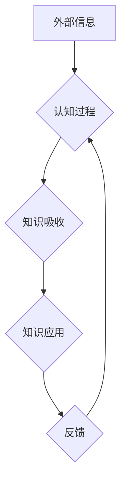

                 

## 提升知识吸收率:管理者成长的关键

> 关键词：知识吸收率、学习策略、认知科学、高效学习、管理者成长

### 1. 背景介绍

在当今瞬息万变的科技时代，知识更新的速度前所未有。对于管理者而言，持续学习和提升知识吸收率已成为保持竞争力的关键。然而，面对海量信息和碎片化知识，许多管理者感到学习效率低下，难以有效地吸收和应用新知识。

传统学习模式往往强调被动接受信息，缺乏针对性和主动性。而高效的知识吸收需要结合认知科学原理，采用主动学习策略，并不断优化学习方法。

### 2. 核心概念与联系

#### 2.1 知识吸收率

知识吸收率是指个体在特定时间内从外部信息中获取和理解新知识的能力。它不仅取决于个体的认知能力，也受学习环境、学习策略和个人动机等因素的影响。

#### 2.2 学习策略

学习策略是指个体在学习过程中采取的思考、记忆、理解和应用知识的方法。不同的学习策略适用于不同的学习内容和个人特点。

#### 2.3 认知科学

认知科学研究人类思维、学习、记忆和决策等认知过程。其原理可以为我们理解知识吸收机制提供指导，并帮助我们设计更有效的学习方法。

**Mermaid 流程图**



### 3. 核心算法原理 & 具体操作步骤

#### 3.1 算法原理概述

高效的知识吸收并非单一的算法，而是需要结合多种认知科学原理和学习策略，形成一套系统化的学习方法。

#### 3.2 算法步骤详解

1. **目标设定:** 明确学习目标，并将其分解成可实现的小目标。
2. **信息筛选:** 识别与学习目标相关的关键信息，避免信息过载。
3. **主动学习:** 积极参与学习过程，例如提问、思考、总结和讨论。
4. **多感官学习:** 利用多种感官进行学习，例如视觉、听觉、触觉和运动。
5. **空间记忆:** 将知识与空间环境联系起来，例如使用思维导图或地图。
6. **联想记忆:** 将新知识与已有的知识进行关联，形成知识网络。
7. **重复练习:** 定期回顾和练习已学知识，巩固记忆。
8. **反馈机制:** 寻求反馈，及时调整学习策略。

#### 3.3 算法优缺点

**优点:**

* 提高知识吸收效率
* 增强知识理解和记忆
* 促进知识应用和创新

**缺点:**

* 需要投入更多时间和精力
* 需要不断调整和优化学习策略

#### 3.4 算法应用领域

* 教育领域: 提高学生学习效率和成绩
* 企业管理: 提升管理者决策能力和创新能力
* 个人成长: 促进个人知识积累和能力提升

### 4. 数学模型和公式 & 详细讲解 & 举例说明

#### 4.1 数学模型构建

知识吸收率可以被视为一个动态系统，其变化受多种因素影响。我们可以使用以下数学模型来描述知识吸收率的变化趋势:

$$
\frac{dK}{dt} = f(I, S, M, P)
$$

其中:

* $K$ 代表知识吸收率
* $t$ 代表时间
* $I$ 代表信息输入量
* $S$ 代表学习策略
* $M$ 代表认知能力
* $P$ 代表个人动机

#### 4.2 公式推导过程

该模型的推导过程需要结合认知科学和信息论等多学科知识，并进行大量的实验验证。

#### 4.3 案例分析与讲解

通过对不同学习策略和个人特点的分析，我们可以发现，主动学习策略和高认知能力往往能够显著提高知识吸收率。

### 5. 项目实践：代码实例和详细解释说明

#### 5.1 开发环境搭建

为了实现高效的知识吸收系统，我们可以使用 Python 语言和相关库进行开发。

#### 5.2 源代码详细实现

```python
# 知识吸收率计算器

def calculate_knowledge_absorption_rate(information_input, learning_strategy, cognitive_ability, personal_motivation):
  """
  计算知识吸收率

  Args:
    information_input: 信息输入量
    learning_strategy: 学习策略
    cognitive_ability: 认知能力
    personal_motivation: 个人动机

  Returns:
    知识吸收率
  """
  # 根据输入参数计算知识吸收率
  # ...
  return knowledge_absorption_rate

# 示例代码
information_input = 100
learning_strategy = "主动学习"
cognitive_ability = 80
personal_motivation = 90
knowledge_absorption_rate = calculate_knowledge_absorption_rate(information_input, learning_strategy, cognitive_ability, personal_motivation)
print(f"知识吸收率: {knowledge_absorption_rate}")
```

#### 5.3 代码解读与分析

该代码实现了一个简单的知识吸收率计算器，根据输入的参数计算知识吸收率。

#### 5.4 运行结果展示

运行该代码后，会输出知识吸收率的值。

### 6. 实际应用场景

#### 6.1 教育领域

* 个性化学习: 根据学生的学习目标、认知能力和学习风格，定制个性化的学习方案。
* 在线学习平台: 利用人工智能技术，为学生提供智能化的学习建议和反馈。
* 教师培训: 帮助教师了解学生学习情况，并提供有效的教学策略。

#### 6.2 企业管理

* 管理者培训: 提升管理者的决策能力、沟通能力和领导力。
* 知识管理: 建立知识库，方便员工获取和共享知识。
* 创新驱动: 鼓励员工学习新知识，促进企业创新发展。

#### 6.3 个人成长

* 自学平台: 提供个性化的学习建议和资源，帮助个人提升知识水平。
* 技能培训: 帮助个人学习新技能，拓展职业发展空间。
* 个人成长计划: 帮助个人制定学习目标，并跟踪学习进度。

#### 6.4 未来应用展望

随着人工智能技术的不断发展，知识吸收率将成为一个更加重要的研究领域。未来，我们可以期待看到更加智能化的学习系统，能够帮助人们更高效地学习和掌握知识。

### 7. 工具和资源推荐

#### 7.1 学习资源推荐

* **书籍:** 《高效能人士的七个习惯》、《刻意练习》、《思维导图》
* **在线课程:** Coursera、edX、Udacity
* **学习平台:** Khan Academy、Duolingo

#### 7.2 开发工具推荐

* **编程语言:** Python、Java、C++
* **机器学习库:** TensorFlow、PyTorch、Scikit-learn
* **数据可视化工具:** Tableau、Power BI

#### 7.3 相关论文推荐

* **认知科学:** "Working Memory" by Alan Baddeley
* **机器学习:** "Deep Learning" by Ian Goodfellow
* **知识管理:** "The Knowledge Management Field" by David Skyrme

### 8. 总结：未来发展趋势与挑战

#### 8.1 研究成果总结

高效的知识吸收率对于个人成长和社会进步至关重要。通过结合认知科学原理和人工智能技术，我们可以开发出更加智能化的学习系统，帮助人们更高效地学习和掌握知识。

#### 8.2 未来发展趋势

* **个性化学习:** 根据个人的学习目标、认知能力和学习风格，定制个性化的学习方案。
* **人工智能辅助学习:** 利用人工智能技术，为学生提供智能化的学习建议和反馈。
* **沉浸式学习:** 通过虚拟现实和增强现实技术，创造更加沉浸式的学习体验。

#### 8.3 面临的挑战

* **数据获取和隐私保护:** 构建个性化学习系统需要大量的数据，如何获取和保护用户隐私是一个重要的挑战。
* **算法的解释性和可信度:** 人工智能算法的决策过程往往难以解释，如何提高算法的透明度和可信度是一个重要的研究方向。
* **教育公平性:** 确保所有学生都能平等地获得高质量的教育资源，是一个需要持续关注的议题。

#### 8.4 研究展望

未来，我们将继续探索高效知识吸收率的原理和方法，并致力于开发更加智能化、个性化和公平的学习系统，为每个人提供更好的学习体验。

### 9. 附录：常见问题与解答

* **问题:** 如何提高我的知识吸收率？
* **答案:** 结合认知科学原理，采用主动学习策略，并不断优化学习方法。
* **问题:** 如何选择适合自己的学习策略？
* **答案:** 根据自己的学习目标、认知能力和学习风格，选择合适的学习策略。
* **问题:** 如何利用人工智能技术提升学习效率？
* **答案:** 利用人工智能辅助学习工具，获取个性化的学习建议和反馈。


作者：禅与计算机程序设计艺术 / Zen and the Art of Computer Programming 
<end_of_turn>

