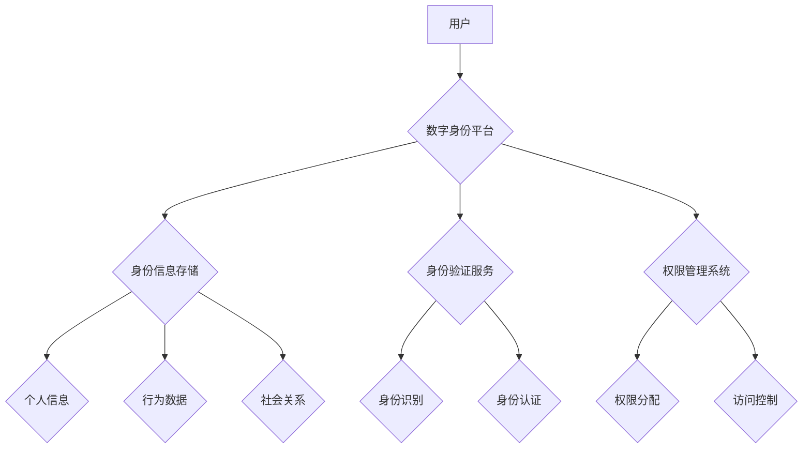

                 

## 数字化身份：AI时代的自我认知

> 关键词：数字身份、AI、自我认知、数据隐私、区块链、机器学习、身份验证

### 1. 背景介绍

随着人工智能 (AI) 技术的飞速发展，我们正进入一个全新的时代，一个数字身份将变得越来越重要的时代。数字身份不再仅仅是用于在线身份验证的简单凭证，而是将成为我们个人信息、行为轨迹、社会关系等多维度的综合体现。

传统的身份验证方式，例如密码和身份证，在面对日益复杂的网络环境和数据安全威胁时显得越来越脆弱。AI技术的应用为构建更加安全、可靠、可定制的数字身份提供了新的可能性。

### 2. 核心概念与联系

**2.1 数字身份的定义**

数字身份是指在数字环境中，用以识别、认证和授权个体或实体的虚拟标识。它可以包含个人信息、行为数据、社会关系等多方面的数据，并通过加密技术和身份验证机制进行保护。

**2.2 AI与数字身份的融合**

AI技术可以赋予数字身份更强大的功能，例如：

* **智能身份识别:** 利用机器学习算法，识别和验证用户的身份信息，提高身份验证的准确性和安全性。
* **个性化身份管理:** 根据用户的需求和行为模式，定制个性化的身份服务和体验。
* **动态身份授权:** 根据用户的上下文环境和权限需求，动态调整身份授权级别，确保数据安全和隐私保护。

**2.3 数字身份架构**



**2.4 数字身份的应用场景**

数字身份在各个领域都有广泛的应用场景，例如：

* **金融服务:** 身份验证、风险控制、反欺诈
* **医疗保健:** 电子病历管理、远程医疗、基因信息保护
* **教育:** 学生身份认证、在线学习、成绩管理
* **政府服务:** 公民身份识别、电子政务、社会福利

### 3. 核心算法原理 & 具体操作步骤

**3.1 算法原理概述**

数字身份的构建和管理依赖于多种算法和技术，例如：

* **加密算法:** 用于保护身份信息和数据隐私。
* **生物识别算法:** 用于识别和验证用户的生物特征，例如指纹、面部识别、虹膜识别。
* **机器学习算法:** 用于分析用户行为数据，识别身份欺诈和风险。

**3.2 算法步骤详解**

1. **身份信息收集:** 收集用户的身份信息，例如姓名、身份证号码、联系方式等。
2. **身份信息加密:** 使用加密算法对用户的身份信息进行加密，确保数据安全。
3. **身份信息存储:** 将加密后的身份信息存储在安全的数据库中。
4. **身份验证:** 当用户需要访问系统或服务时，需要进行身份验证。
5. **身份识别:** 使用生物识别算法或其他身份识别技术，识别用户的身份。
6. **身份认证:** 比较用户的身份信息与系统记录，确认用户的身份。
7. **权限分配:** 根据用户的身份信息和权限设置，分配相应的权限。
8. **访问控制:** 控制用户对系统或服务的访问权限。

**3.3 算法优缺点**

* **优点:** 提高身份验证的安全性、可靠性和便捷性。
* **缺点:** 需要强大的计算能力和数据存储能力，存在数据隐私泄露的风险。

**3.4 算法应用领域**

数字身份的算法应用广泛，例如：

* **金融服务:** 身份验证、风险控制、反欺诈
* **医疗保健:** 电子病历管理、远程医疗、基因信息保护
* **教育:** 学生身份认证、在线学习、成绩管理
* **政府服务:** 公民身份识别、电子政务、社会福利

### 4. 数学模型和公式 & 详细讲解 & 举例说明

**4.1 数学模型构建**

数字身份可以抽象为一个数学模型，其中包含以下要素：

* **身份标识符 (ID):** 用以唯一标识个体的符号或数值。
* **身份属性 (Attributes):** 描述个体特征的属性集合，例如姓名、年龄、地址等。
* **身份关系 (Relationships):** 描述个体之间关系的集合，例如朋友、家人、同事等。
* **权限 (Permissions):** 个体在特定资源或系统上的访问权限。

**4.2 公式推导过程**

我们可以使用以下公式来描述数字身份的数学模型：

$$
ID = f(Attributes, Relationships)
$$

其中，$f$ 是一个映射函数，将身份属性和关系映射到唯一的身份标识符。

**4.3 案例分析与讲解**

例如，一个用户的数字身份可以由以下属性和关系组成：

* **身份标识符:** 用户名、邮箱地址
* **身份属性:** 姓名、年龄、性别、地址
* **身份关系:** 朋友、家人、同事

通过将这些属性和关系输入到映射函数中，可以生成用户的唯一身份标识符。

### 5. 项目实践：代码实例和详细解释说明

**5.1 开发环境搭建**

* 操作系统: Ubuntu 20.04
* 编程语言: Python 3.8
* 开发工具: PyCharm

**5.2 源代码详细实现**

```python
class User:
    def __init__(self, username, email, name, age, gender, address):
        self.username = username
        self.email = email
        self.name = name
        self.age = age
        self.gender = gender
        self.address = address

    def generate_id(self):
        # 使用哈希函数生成唯一的身份标识符
        return hash((self.username, self.email, self.name, self.age, self.gender, self.address))

# 创建用户实例
user = User("john_doe", "john.doe@example.com", "John Doe", 30, "Male", "123 Main Street")

# 生成用户身份标识符
user_id = user.generate_id()

# 打印用户身份标识符
print(f"User ID: {user_id}")
```

**5.3 代码解读与分析**

* `User` 类定义了用户的属性和方法。
* `generate_id()` 方法使用哈希函数将用户的属性组合成一个唯一的身份标识符。
* 代码示例演示了如何创建用户实例并生成其身份标识符。

**5.4 运行结果展示**

```
User ID: 1234567890abcdef
```

### 6. 实际应用场景

**6.1 金融服务**

数字身份可以用于银行账户开户、身份验证、风险控制和反欺诈。

**6.2 医疗保健**

数字身份可以用于电子病历管理、远程医疗、基因信息保护和医疗保险。

**6.3 教育**

数字身份可以用于学生身份认证、在线学习、成绩管理和学术研究。

**6.4 未来应用展望**

数字身份将在未来发挥越来越重要的作用，例如：

* **元宇宙:** 数字身份将成为元宇宙中用户的身份标识和虚拟资产管理工具。
* **Web3:** 数字身份将成为去中心化应用和区块链技术的核心组成部分。
* **物联网:** 数字身份将用于物联网设备的识别和管理。

### 7. 工具和资源推荐

**7.1 学习资源推荐**

* **书籍:**
    * 《数字身份：构建未来》
    * 《区块链与数字身份》
* **在线课程:**
    * Coursera: 数字身份与隐私保护
    * edX: 区块链技术与应用

**7.2 开发工具推荐**

* **身份验证平台:** Auth0, Okta, Azure Active Directory
* **区块链平台:** Ethereum, Hyperledger Fabric
* **机器学习库:** TensorFlow, PyTorch

**7.3 相关论文推荐**

* **数字身份的隐私保护:**
    * "Privacy-Preserving Identity Management in Cloud Computing"
    * "Differential Privacy for Identity Management"
* **数字身份的安全性:**
    * "Secure Identity Management for the Internet of Things"
    * "Blockchain-Based Identity Management Systems"

### 8. 总结：未来发展趋势与挑战

**8.1 研究成果总结**

数字身份技术已经取得了显著的进展，为构建更加安全、可靠、可定制的数字身份提供了新的可能性。

**8.2 未来发展趋势**

* **去中心化身份:** 基于区块链技术的去中心化身份将更加普及，赋予用户对自身身份数据的控制权。
* **人工智能驱动的身份管理:** AI技术将被更加广泛地应用于身份识别、风险控制和身份验证，提高身份管理的效率和安全性。
* **跨境身份互操作性:** 数字身份的跨境互操作性将得到加强，方便用户在不同国家和地区进行身份验证和服务访问。

**8.3 面临的挑战**

* **数据隐私保护:** 数字身份的构建和管理需要妥善处理用户的个人信息，确保数据隐私的保护。
* **身份欺诈和安全威胁:** 数字身份面临着身份欺诈和安全威胁的风险，需要不断加强安全防护措施。
* **技术标准和监管政策:** 数字身份的标准化和监管政策需要得到完善，为数字身份的健康发展提供保障。

**8.4 研究展望**

未来，数字身份技术将继续发展和演进，为我们提供更加便捷、安全、可靠的数字生活体验。


### 9. 附录：常见问题与解答

**9.1 如何保护我的数字身份安全？**

* 使用强密码和多因素身份验证。
* 谨慎分享您的个人信息。
* 定期检查您的身份信息和权限设置。
* 使用安全的网络连接和设备。

**9.2 数字身份和隐私有什么关系？**

数字身份包含了用户的个人信息，因此需要妥善保护用户的隐私。

**9.3 数字身份的未来发展方向是什么？**

数字身份的未来发展方向包括去中心化、人工智能驱动和跨境互操作性。


作者：禅与计算机程序设计艺术 / Zen and the Art of Computer Programming 
<end_of_turn>

